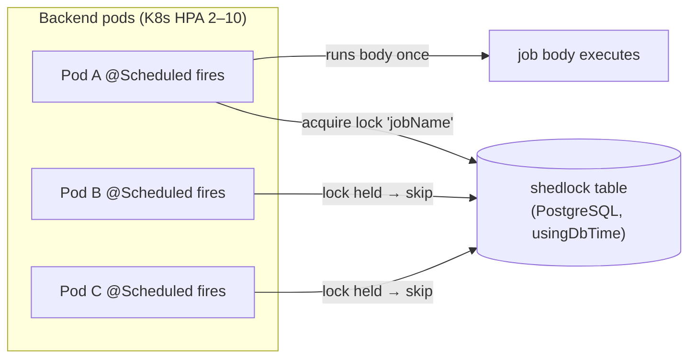

# Scheduled Jobs & Background Coordination

Evidence-based catalog of every `@Scheduled` site in the backend, the distributed-locking
that makes them multi-pod safe, and the related coordination primitives (WebSocket relay,
read-replica routing). Verified live against `backend/src/main/java/com/nulogic/` on 2026-06-16.

> **Headline (corrected this pass):** there are **25 `@Scheduled` methods across 15
> components**, of which **24 are `@SchedulerLock`-guarded** and **1 is intentionally
> per-pod**. The prior "17 scheduled jobs" figure was a `grep -rl @Scheduled` *file* count
> that also matched two doc-comment-only files (`TenantTimeProvider`, `ShedLockConfig`).

## How scheduling is wired

| Concern | Class | Behaviour |
|---------|-------|-----------|
| Enable / disable | `common/config/SchedulingConfig` | `@EnableScheduling`, gated by `@ConditionalOnProperty("app.scheduling.enabled", matchIfMissing=true)` — **on by default**; set `APP_SCHEDULING_ENABLED=false` on web pods so jobs run only on worker pods. |
| Distributed lock | `common/config/ShedLockConfig` | `@EnableSchedulerLock(defaultLockAtMostFor="PT30M")`; `JdbcTemplateLockProvider` on a shared `shedlock` table (created in migration **V91**), `usingDbTime()` so lock windows are clock-skew safe across pods. |
| Why it matters | — | In K8s every `@Scheduled` method fires on **every** pod. `@SchedulerLock(name=…)` guarantees at most one pod runs the body per lock window; `lockAtLeastFor` prevents fast re-acquire, `lockAtMostFor` caps a crashed holder. |

## Job catalog (24 distributed + 1 per-pod)

Identifier = the `@SchedulerLock(name=…)` value (unique, authoritative). Schedules read
verbatim from the `@Scheduled` annotations.

### Platform / security (`common/security/*`) — lightweight, frequent

| Lock name | Component | Schedule | Lock window | Purpose |
|-----------|-----------|----------|-------------|---------|
| `checkRedisHealth` | `RateLimitingFilter` | `fixedRate=30s` | PT15S / PT2M | Probe Redis health for the rate limiter |
| `rateLimitBucketCleanup` | `RateLimitingFilter` | `fixedRate=CLEANUP_INTERVAL_MS` | PT2M / PT10M | Purge stale Bucket4j buckets |
| `tenantCacheRefresh` | `TenantFilter` | `fixedRate=CACHE_REFRESH_INTERVAL_MS` | PT2M / PT10M | Refresh the in-filter tenant lookup cache |
| _(per-pod, no lock)_ | `TokenBlacklistService.redisHealthProbe` | `fixedDelay=30s, initialDelay=5s` | — | **Intentionally unguarded.** Each pod must probe its own Redis connectivity to flip between Redis-backed and in-memory blacklist fallback; a shared lock would leave most pods blind to recovery. |

### Attendance (`application/attendance/*`)

| Lock name | Component | Schedule (UTC) | Lock window | Purpose |
|-----------|-----------|----------------|-------------|---------|
| `autoRegularizeAttendance` | `AutoRegularizationScheduler` | `0 30 19 * * *` | PT5M / PT30M | Auto-regularize open attendance records |
| `autoApproveCompOff` | `AutoRegularizationScheduler` | `0 0 20 * * *` | PT5M / PT30M | Auto-approve eligible comp-off |
| `processPendingPunches` | `BiometricIntegrationService` | `fixedDelay=${biometric.process-interval-ms:120000}` | PT2M / PT10M | Ingest queued biometric device punches |

### Notifications & email (`application/notification/*`)

| Lock name | Component | Schedule | Lock window | Purpose |
|-----------|-----------|----------|-------------|---------|
| `sendBirthdayNotifications` | `ScheduledNotificationService` | `0 0 8 * * *` UTC | PT5M / PT30M | Birthday in-app notifications |
| `sendAnniversaryNotifications` | `ScheduledNotificationService` | `0 30 8 * * *` UTC | PT5M / PT30M | Work-anniversary notifications |
| `sendAttendanceReminders` | `ScheduledNotificationService` | `0 0 10 * * MON-FRI` UTC | PT5M / PT30M | Check-in reminders (weekdays) |
| `sendCheckoutReminders` | `ScheduledNotificationService` | `0 0 17 * * MON-FRI` UTC | PT5M / PT30M | Check-out reminders (weekdays) |
| `sendBirthdayEmails` | `EmailSchedulerService` | `0 0 9 * * *` | PT5M / PT30M | Birthday emails |
| `sendAnniversaryEmails` | `EmailSchedulerService` | `0 0 9 * * *` | PT5M / PT30M | Anniversary emails |
| `retryFailedEmails` | `EmailSchedulerService` | `0 0 * * * *` (hourly) | PT5M / PT30M | Retry transient email failures |
| `sendScheduledEmails` | `EmailSchedulerService` | `0 */15 * * * *` | PT5M / PT30M | Dispatch user-scheduled emails |

### Webhooks (`application/webhook/*`)

| Lock name | Component | Schedule | Lock window | Purpose |
|-----------|-----------|----------|-------------|---------|
| `webhookClearExpiredPreviousSecrets` | `WebhookDeliveryService` | `0 0 * * * *` (hourly) | PT5M / PT55M | Drop rotated webhook secrets past grace |
| `webhookProcessRetries` | `WebhookDeliveryService` | `fixedRate=60s` | PT2M / PT15M | Redeliver failed webhook payloads |

### Recruitment (`application/recruitment/*`)

| Lock name | Component | Schedule | Lock window | Purpose |
|-----------|-----------|----------|-------------|---------|
| `syncApplicationCounts` | `JobBoardIntegrationService` | `0 0 */6 * * *` | PT5M / PT30M | Sync application counts from job boards |
| `expireOldPostings` | `JobBoardIntegrationService` | `0 0 2 * * *` | PT5M / PT30M | Expire stale job postings |

### Contracts & documents (`application/contract`, `application/document`)

| Lock name | Component | Schedule | Lock window | Extra gate |
|-----------|-----------|----------|-------------|------------|
| `processContractLifecycle` | `ContractLifecycleScheduler` | `${app.contract.lifecycle.cron:0 30 2 * * *}` UTC | PT5M / PT30M | `app.contract.lifecycle.enabled` (default on) |
| `orphanFileCleanup` | `OrphanFileCleanupScheduler` | `0 0 2 * * SUN` UTC | PT10M / PT60M | — |

### Workflow & approvals (`application/workflow/*`)

| Lock name | Component | Schedule | Lock window | Extra gate |
|-----------|-----------|----------|-------------|------------|
| `approvalProcessEscalations` | `ApprovalEscalationJob` | `fixedRate=15m` | PT5M / PT30M | `app.approval.escalation.enabled` (default on) |
| `workflowProcessEscalations` | `WorkflowEscalationScheduler` | `0 15 * * * *` | PT5M / PT30M | `app.workflow.escalation.enabled` (default on) |

### Leave & analytics

| Lock name | Component | Schedule | Lock window | Purpose |
|-----------|-----------|----------|-------------|---------|
| `accrueMonthlyLeave` | `LeaveAccrualScheduler` | `${app.leave.accrual.cron:0 0 2 1 * *}` UTC | PT5M / PT4H | Monthly leave accrual (long window — full-tenant fan-out) |
| `executeScheduledReports` | `ScheduledReportExecutionJob` | `0 * * * * *` (every minute) | PT2M / PT2H | Run due scheduled analytics reports |

## Operational rules

- **Worker-pod isolation.** Set `APP_SCHEDULING_ENABLED=false` on web pods; `true` on a
  dedicated worker pod set so the scheduler thread pool never competes with request threads.
  ShedLock still protects against accidental double-run.
- **Tenant fan-out.** Cron jobs iterate per tenant and resolve local-time cutoffs via
  `TenantTimeService` (e.g. `webhookClearExpiredPreviousSecrets`, leave accrual). A long
  `lockAtMostFor` (PT4H for accrual, PT2H for reports) absorbs slow many-tenant runs.
- **`usingDbTime()`** means lock validity is judged by the PostgreSQL clock, so pod clock
  skew cannot cause double execution.

## Related coordination primitives (same gap, now pointer-documented)

- **WebSocket multi-pod fan-out** — `infrastructure/websocket/RedisWebSocketRelay`
  (+ `RedisWebSocketSubscriber`, `RedisWebSocketMessage`). Spring's `SimpleMessageBroker`
  is in-memory, so a user on Pod A misses messages sent from Pod B. Every send is published
  to a Redis Pub/Sub channel; all pods subscribe and forward to their local sessions via
  `SimpMessagingTemplate`. See [[Middleware]] for the STOMP/SockJS entry path.
- **Read-replica routing** — `common/config/RoutingDataSourceConfig`. Optional routing of
  `@Transactional(readOnly=true)` to a Neon replica, activated **only** when
  `SPRING_DATASOURCE_REPLICA_URL` is set to a non-empty, non-`false` value (a plain
  `@ConditionalOnProperty` is insufficient because Spring Boot 3.x treats an empty-string
  placeholder as "present"). Zero-risk no-op when unset.

## Related

- [[Services]] · [[Middleware]] · [[APIs]] — the components hosting these jobs
- [[System-Overview]] (Operational Notes) · [[Production-Support]] — run/monitor context
- [[Data-Flows]] — Kafka eventing that some jobs feed
- [[00-Home]]
