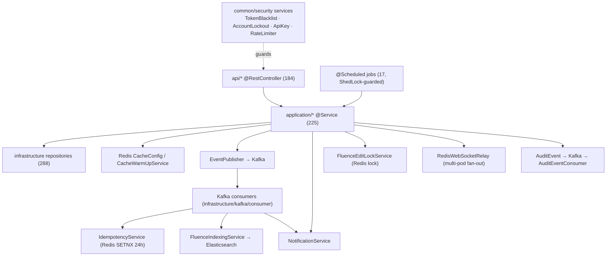

# Backend Service Catalog & Dependency Map

> Map of the **257 `@Service` beans** that sit between [[APIs]] (controllers) and the
> persistence/messaging layer. Organized by DDD layer, with the cross-cutting
> infrastructure services (Redis, Kafka, locks, rate-limit, notifications) called out
> explicitly and the **17 `@Scheduled` jobs** enumerated. See [[Middleware]] for the
> request chain and [[Data-Flows]] for end-to-end lifecycle.

## Purpose

Explain where business logic lives, which services are reusable cross-cutting
primitives versus per-domain use-case orchestrators, and how the scheduled/event-driven
background work is wired — so a reader can find or place a service correctly.

## Context

- **Layer distribution (verified from source, 2026-06-16):**
  | Layer | `@Service` count | Role |
  |-------|------------------|------|
  | `application/*` | 225 | Use-case orchestration, `@Transactional`, cache put/evict, event publishing |
  | `infrastructure/*` | 19 | Outbound adapters (Kafka idempotency, websocket, search, storage) |
  | `common/*` | 11 | Cross-cutting (feature flags, security, cache config services) |
  | `domain/*` | 1 | `domain/.../WebSocketNotificationService` (lone domain-layer service) |
  | **Total** | **257** | `grep -rl @Service backend/src/main/java` |
- **The overwhelming majority of logic is in `application/<domain>`** — one vertical
  slice per bounded context. Domain layer is almost purely `@Entity` model; services
  there are the exception, not the rule.
- Stack: Java 21, Spring Boot 3.5.14; constructor injection throughout. See
  [[C4-Component]].

## Dependencies

- **Upstream:** [[APIs]] controllers call application services.
- **Downstream:** application services depend on `infrastructure` repositories (288),
  Kafka producers, Redis caches, Elasticsearch, and the cross-cutting services below.
- **Tenancy:** all service work runs under the tenant bound by [[Middleware]]
  (`TenantContext`) and enforced by PostgreSQL RLS — see [[Data-Flows]], [[Schema]].

## Diagram

## Service Catalog

### Application services (`application/<domain>`, 225)

One service cluster per bounded context, mirroring the [[APIs]] domains. Examples:

- **Core HR:** `application/employee/*` (EmployeeService, DirectoryService, ImportService),
  `application/organization/*`, `application/leave/*`, `application/attendance/*`.
- **Payroll/finance:** `application/payroll/*`, `application/statutory/*`,
  `application/expense/*`, `application/budget/*`, `application/loan/*`.
- **Hire:** `application/recruitment/*`, `application/onboarding/*`,
  `application/esignature/*`.
- **Grow:** `application/performance/*`, `application/lms/*`, `application/survey/*`.
- **Fluence:** `application/knowledge/*` (incl. `FluenceEditLockService`,
  `FluenceIndexingService`, `FluenceSearchService`), `application/wall/*`.
- Each owns `@Transactional` boundaries, cache `@Cacheable`/`@CacheEvict`, and publishes
  domain events. Find them: `grep -rl @Service backend/src/main/java/com/nulogic/application/<domain>`.

### Cross-cutting infrastructure services (verified present)

These are the reusable platform primitives — the Redis architecture from
`.claude/CLAUDE.md`, **all confirmed in source:**

| Service | File | Purpose |
|---------|------|---------|
| `CacheConfig` | `common/config/CacheConfig.java` | 25 named caches, tiered TTLs (30s–24h), tenant-scoped keys, graceful Redis-outage fallback |
| `CacheWarmUpService` | `common/config/CacheWarmUpService.java` | Pre-loads long-lived caches per tenant |
| `TenantCacheManager` / `CacheMetricsConfig` | `common/config/` | Tenant-aware cache mgmt + Micrometer hit/miss metrics |
| `DistributedRateLimiter` | `common/config/DistributedRateLimiter.java` | Redis Lua token-bucket; Bucket4j fallback (drives `RateLimitingFilter`) |
| `TokenBlacklistService` | `common/security/TokenBlacklistService.java` | JWT revocation, Redis + in-memory fallback; `@Scheduled` cleanup |
| `AccountLockoutService` | `common/security/AccountLockoutService.java` | Failed-login lockout (5 attempts / 15min) |
| `FluenceEditLockService` | `application/knowledge/service/FluenceEditLockService.java` | 5-min TTL distributed edit locks for wiki editing |
| `IdempotencyService` | `infrastructure/kafka/IdempotencyService.java` | Kafka dedup via atomic Redis SETNX, 24h TTL |
| `RedisWebSocketRelay` | `infrastructure/websocket/RedisWebSocketRelay.java` | Pub/Sub multi-pod WebSocket fan-out |
| `RedisHealthIndicator` | `common/health/RedisHealthIndicator.java` | PING + memory + latency health |
| `ApiKeyService` | `common/security/ApiKeyService.java` | External API key issue/validate (encrypted via `CryptoConverter`) |
| `EncryptionService` | `common/security/EncryptionService.java` | Field-level encryption |
| `FeatureFlagService` | `common/service/FeatureFlagService.java` | Feature-flag evaluation behind `@RequiresFeature` |
| `NotificationEvent*` services | `application/notification/*` | In-app + email notifications |

### Event-driven services (Kafka — `infrastructure/kafka/`)

Producers publish via `producer/EventPublisher.java`; **7 consumers** process domain
events (each with a `.dlt` dead-letter topic, idempotency-guarded):

| Consumer | Topic | Purpose |
|----------|-------|---------|
| `ApprovalEventConsumer` | `nu-aura.approvals` | Approval workflow events |
| `NotificationEventConsumer` | `nu-aura.notifications` | Fan out notifications |
| `AuditEventConsumer` | `nu-aura.audit` | Persist audit trail |
| `EmployeeLifecycleConsumer` | `nu-aura.employee-lifecycle` | Joiner/mover/leaver side-effects |
| `FluenceSearchConsumer` | `nu-aura.fluence-content` | Async Elasticsearch indexing |
| `PayrollProcessingConsumer` | `nu-aura.payroll-processing` | Payroll run processing |
| `DeadLetterHandler` | `*.dlt` | Centralized DLT handling |

Tenant context crosses the produce/consume boundary via `TenantContextKafkaAspect` +
`TenantContextRecordInterceptor` so consumers run with correct RLS scope. See
[[Data-Flows]].

## Scheduled Jobs (17)

All `@Scheduled` sites are made K8s-multi-pod-safe with **ShedLock** (`@SchedulerLock`,
JDBC provider in `ShedLockConfig`) and gated by `app.scheduling.enabled` so worker pods
run jobs while API pods do not (`SchedulingConfig`). Verified via
`grep -rl @Scheduled backend/src/main/java` (17 files):

| Class | Schedule (cron/rate) | Job |
|-------|----------------------|-----|
| `AutoRegularizationScheduler` | `0 30 19 * * *`, `0 0 20 * * *` UTC | Auto-regularize attendance; auto-approve comp-off |
| `LeaveAccrualScheduler` | `0 0 2 1 * *` (monthly) | Monthly leave accrual |
| `ContractLifecycleScheduler` | `0 30 2 * * *` | Contract reminders / expiry |
| `ScheduledNotificationService` | `0 0 8`, `0 30 8`, `0 0 10 MON-FRI` | Birthday / anniversary / attendance-reminder notifications |
| `EmailSchedulerService` | `0 0 9 * * *`, hourly | Birthday/anniversary emails; retry failed emails |
| `ScheduledReportExecutionJob` | `0 * * * * *` (per-minute) | Execute due analytics reports |
| `WebhookDeliveryService` | hourly + `fixedRate 60s` | Clear expired webhook secrets; retry deliveries |
| `WorkflowEscalationScheduler` | `0 15 * * * *` (hourly) | Workflow escalations |
| `ApprovalEscalationJob` | `fixedRate 900s` | Approval escalations |
| `BiometricIntegrationService` | `fixedDelay 120s` | Process pending biometric punches |
| `JobBoardIntegrationService` | `0 0 */6 * * *`, `0 0 2 * * *` | Sync application counts; expire old postings |
| `OrphanFileCleanupScheduler` | `0 0 2 * * SUN` UTC | Weekly orphan-file storage cleanup |
| `TokenBlacklistService` | `@Scheduled` cleanup | Purge expired blacklisted tokens |
| `RateLimitingFilter` | `@Scheduled` | In-memory bucket maintenance |
| `TenantFilter` | `@Scheduled` | Tenant-cache maintenance |
| `TenantTimeProvider` | `@Scheduled` | Tenant timezone/time refresh |

> Three of the 17 `@Scheduled` sites live in security/util classes (`TokenBlacklistService`,
> `RateLimitingFilter`, `TenantFilter`, `TenantTimeProvider`) doing maintenance, not
> domain work — counted in the 17 but they are housekeeping, not business jobs.

## Related Links

- [[00-Home]] · [[System-Overview]] · [[C4-Component]] · [[C4-Container]]
- [[APIs]] — controllers that call these services · [[Middleware]] — filter chain
- [[Data-Flows]] — request + event lifecycle · [[System-Flows]]
- [[Schema]] · [[ERD]] — persistence behind repositories
- [[Roles]] · [[Permissions]] · [[RBAC-Matrix]] · [[Security-Audit]]
- [[Nu-HRMS]] · [[Nu-Hire]] · [[Nu-Grow]] · [[Nu-Fluence]] · [[Shared-Platform]] · [[Deployment]]

## Risks

- **Fat application layer:** 225 services in `application/*` — high count means
  consistency of `@Transactional` / cache-eviction discipline matters. N+1-save batches
  were recently fixed (onboarding, budget, survey, leave carry-forward, biometric).
- **ShedLock dependence:** if `app.scheduling.enabled` is wrongly set on API pods, jobs
  double-run; ShedLock is the only guard against multi-pod duplicate execution.
- **Idempotency reliance:** Kafka consumers are at-least-once; correctness depends on
  `IdempotencyService` Redis SETNX. A Redis outage degrades dedup.
- **Redis graceful degradation:** caches/locks fall through on Redis outage, but
  rate-limiting and edit-locks lose strength when Redis is down.

## Operational Notes

- **List a domain's services:** `grep -rl @Service backend/src/main/java/com/nulogic/application/<domain>`.
- **Find all scheduled jobs:** `grep -rl @Scheduled backend/src/main/java`.
- **Kafka consumers:** `grep -rl @KafkaListener backend/src/main/java`.
- **Cache names + TTLs:** `common/config/CacheConfig.java`.
- Scheduling toggled by `app.scheduling.enabled`; Elasticsearch indexing by
  `app.elasticsearch.enabled` (off by default).
