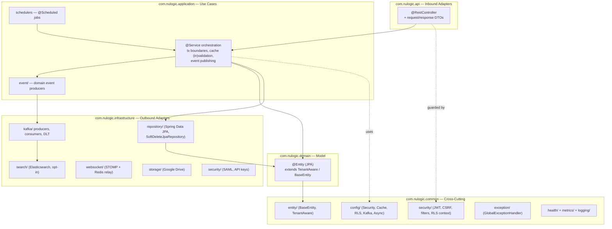
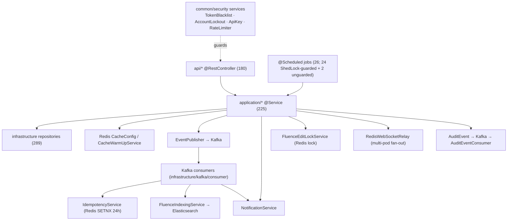
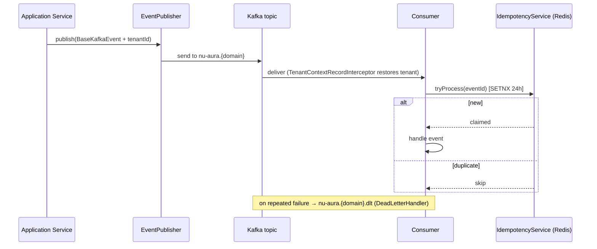

# Backend Service Catalog & Dependency Map

> Map of the backend's business + infrastructure layer: the DDD layering and
> bounded-context module catalog, the **258 `@Service` beans** that sit between [[APIs]]
> (controllers) and persistence/messaging, the cross-cutting infrastructure services
> (Redis caching, Kafka/outbox, Elasticsearch, locks, rate-limit, notifications), and the
> **26 `@Scheduled` jobs**. See [[Middleware]] for the request/security chain and
> [[Data-Flows]] for end-to-end lifecycle.

## Purpose

Explain how the backend is layered, where each bounded context lives across the layers,
where business logic sits, which services are reusable cross-cutting primitives versus
per-domain use-case orchestrators, and how the scheduled/event-driven background work is
wired — so a reader can find or place a service correctly.

## Context

- **Stack:** Spring Boot 3.x on Java 21, package root `com.nulogic`, single deployable
  modular monolith serving all four sub-apps, organized around Domain-Driven Design (DDD)
  layering. Constructor injection throughout. See [[C4-Component]].
- **Verified scale (counts from source, 2026-06-18):**
  | Metric | Count | Evidence |
  |--------|-------|----------|
  | `@RestController` classes (live) | 180 | strict `grep -rlE '^\s*@RestController\s*(\(|$)' --include='*.java'`; see [[Controller-Index]] for reconciliation |
  | `@Service` (all layers) | 258 | `grep -rl @Service src/main/java --include='*.java'` |
  | `@Entity` classes | 321 | `grep -rl @Entity src/main/java/com/nulogic --include='*.java'` |
  | `@Scheduled` methods | 26 (across 16 components) | 24 `@SchedulerLock`-guarded + 1 per-pod (`TokenBlacklistService`) + 1 outbox poller (`OutboxEventProcessor`, `@ConditionalOnProperty("app.outbox.enabled")`) |
  | Repositories | 289 | `grep -rln 'extends.*Repository' --include='*.java'` |
  | Bounded-context packages | 68 per layer | `ls src/main/java/com/nulogic/api` |

## Dependencies

- **Upstream:** [[APIs]] controllers call application services.
- **Downstream:** application services depend on `infrastructure` repositories (289),
  Kafka producers (+ transactional outbox fallback), Redis caches, Elasticsearch, and the
  cross-cutting services below.
- **Tenancy:** all service work runs under the tenant bound by [[Middleware]]
  (`TenantContext`) and enforced by PostgreSQL RLS — see [[Data-Flows]], [[Schema]].

## 1. DDD Layering

The codebase splits into five top-level packages. Each bounded context (e.g. `employee`,
`payroll`, `recruitment`) appears as a sub-package within `api`, `application`, `domain`,
and `infrastructure`, keeping vertical slices cohesive.

### Layer responsibilities

| Layer | Package | Responsibility | Depends on |
|-------|---------|----------------|------------|
| API | `com.nulogic.api.<ctx>` | `@RestController` request/response mapping, validation, OpenAPI annotations, DTOs | application |
| Application | `com.nulogic.application.<ctx>` | Use-case orchestration, `@Transactional` boundaries, cache put/evict, event publishing, schedulers | domain, infrastructure |
| Domain | `com.nulogic.domain.<ctx>` | JPA `@Entity` model; extends `TenantAware`/`BaseEntity` (`common/entity/`) | common/entity |
| Infrastructure | `com.nulogic.infrastructure.<ctx>` | Spring Data repositories, Kafka, Elasticsearch, WebSocket, Google Drive, SAML/API-key adapters | domain |
| Common | `com.nulogic.common.*` | Config, security filters, base entities, exception handling, metrics, health, export | — |

### `@Service` distribution by layer (258 total)

| Layer | `@Service` count | Role |
|-------|------------------|------|
| `application/*` | 225 | Use-case orchestration, `@Transactional`, cache put/evict, event publishing |
| `infrastructure/*` | 20 | Outbound adapters (Kafka idempotency, outbox processor, websocket, search, storage) |
| `common/*` | 12 | Cross-cutting (feature flags, security, cache config services) |
| `domain/*` | 1 | `domain/.../WebSocketNotificationService` (lone domain-layer service) |

The overwhelming majority of logic is in `application/<domain>` — one vertical slice per
bounded context. The domain layer is almost purely `@Entity` model; services there are the
exception, not the rule.

### Conventions

- **Base entities** (`common/entity/`): `BaseEntity` (UUID id + audit columns + optimistic
  `version`), `TenantAware` (adds immutable `tenantId`), and `TenantEntityListener`.
  Repositories extend `SoftDeleteJpaRepository` (`infrastructure/persistence/`).
- **API conventions** (`common/api/`): `ApiResponses`, `ApiVersion` +
  `ApiVersionInterceptor` for versioning. Errors flow through `GlobalExceptionHandler`
  (`@RestControllerAdvice`) returning `ErrorResponse` with typed domain exceptions
  (`BusinessException`, `ResourceNotFoundException`, `UnauthorizedException`,
  `FeatureDisabledException`). See [[Middleware]].

## 2. Bounded-Context / Module Catalog

Contexts span all four sub-apps. Each row exists as a vertical slice across the four
layers (`api`/`application`/`domain`/`infrastructure`).

| Domain area | Contexts (packages) | Sub-app |
|-------------|---------------------|---------|
| Core HR | `employee`, `organization`, `user`, `tenant`, `customfield`, `selfservice` | [[Nu-HRMS]] |
| Time & attendance | `attendance`, `timetracking`, `shift`, `overtime` | [[Nu-HRMS]] |
| Leave | `leave` | [[Nu-HRMS]] |
| Payroll & comp | `payroll`, `compensation`, `loan`, `payment`, `tax`, `statutory`, `budget` | [[Nu-HRMS]] |
| Benefits & wellness | `benefits`, `wellness` | [[Nu-HRMS]] / [[Nu-Grow]] |
| Assets & expense | `asset`, `expense`, `travel` | [[Nu-HRMS]] |
| Recruitment & onboarding | `recruitment`, `preboarding`, `onboarding`, `probation`, `referral`, `bgv` (domain), `exit` | [[Nu-Hire]] |
| Performance & learning | `performance`, `lms`, `training`, `survey`, `recognition`, `engagement` | [[Nu-Grow]] |
| Knowledge & content | `knowledge`, `wall` | [[Nu-Fluence]] |
| Contracts & e-sign | `contract`, `esignature`, `letter` | [[Nu-HRMS]] / [[Nu-Hire]] |
| Governance | `compliance`, `audit`, `workflow` | platform-wide |
| Analytics | `analytics`, `dashboard`, `report`, `home` | platform-wide |
| Communication | `notification`, `announcement`, `meeting`, `calendar`, `helpdesk` | platform-wide |
| Platform & admin | `admin`, `platform`, `featureflag`, `integration`, `webhook`, `monitoring`, `migration`, `dataimport` | platform-wide |
| Project / PSA | `project`, `psa`, `resourcemanagement` | [[Nu-HRMS]] |
| AI | `ai` (application/domain/infrastructure) | [[Nu-Fluence]] / [[Nu-Hire]] |
| Channels | `mobile` (api/application), `publicapi`, `document`, `export` | platform-wide |

> Full package listing verified via
> `find src/main/java/com/nulogic/{api,application,domain,infrastructure} -maxdepth 1 -type d`.

## 3. Service Dependency Map

### Application services (`application/<domain>`, 225)

One service cluster per bounded context, mirroring the [[APIs]] domains. Examples:

- **Core HR:** `application/employee/*` (EmployeeService, DirectoryService, ImportService),
  `application/organization/*`, `application/leave/*`, `application/attendance/*`.
- **Payroll/finance:** `application/payroll/*`, `application/statutory/*`,
  `application/expense/*`, `application/budget/*`, `application/loan/*`.
- **Hire:** `application/recruitment/*`, `application/onboarding/*`,
  `application/esignature/*`.
- **Grow:** `application/performance/*`, `application/lms/*`, `application/survey/*`.
- **Fluence:** `application/knowledge/*` (incl. `FluenceEditLockService`,
  `FluenceIndexingService`, `FluenceSearchService`), `application/wall/*`.
- Each owns `@Transactional` boundaries, `@Cacheable`/`@CacheEvict`, and publishes domain
  events. Find them:
  `grep -rl @Service backend/src/main/java/com/nulogic/application/<domain>`.

## 4. Cross-Cutting Infrastructure Services

These are the reusable platform primitives — the Redis architecture, all confirmed in
source:

| Service | File | Purpose |
|---------|------|---------|
| `CacheConfig` | `common/config/CacheConfig.java` | 25 named caches, tiered TTLs (30s–24h), tenant-scoped keys, graceful Redis-outage fallback |
| `CacheWarmUpService` | `common/config/CacheWarmUpService.java` | Pre-loads long-lived caches per tenant |
| `TenantCacheManager` / `CacheMetricsConfig` | `common/config/` | Tenant-aware cache mgmt + Micrometer hit/miss metrics |
| `DistributedRateLimiter` | `common/config/DistributedRateLimiter.java` | Redis Lua token-bucket; Bucket4j fallback (drives `RateLimitingFilter`) |
| `TokenBlacklistService` | `common/security/TokenBlacklistService.java` | JWT revocation, Redis + in-memory fallback; `@Scheduled` cleanup |
| `AccountLockoutService` | `common/security/AccountLockoutService.java` | Failed-login lockout (5 attempts / 15min) |
| `FluenceEditLockService` | `application/knowledge/service/FluenceEditLockService.java` | 5-min TTL distributed edit locks for wiki editing |
| `IdempotencyService` | `infrastructure/kafka/IdempotencyService.java` | Kafka dedup via atomic Redis SETNX, 24h TTL |
| `RedisWebSocketRelay` | `infrastructure/websocket/RedisWebSocketRelay.java` | Pub/Sub multi-pod WebSocket fan-out |
| `RedisHealthIndicator` | `common/health/RedisHealthIndicator.java` | PING + memory + latency health |
| `ApiKeyService` | `common/security/ApiKeyService.java` | External API key issue/validate (encrypted via `CryptoConverter`) |
| `EncryptionService` | `common/security/EncryptionService.java` | Field-level encryption |
| `FeatureFlagService` | `common/service/FeatureFlagService.java` | Feature-flag evaluation behind `@RequiresFeature` |
| `NotificationEvent*` services | `application/notification/*` | In-app + email notifications |

### Redis caching detail — `common/config/CacheConfig.java`

`@EnableCaching` `CachingConfigurer` backing onto Redis. The cache manager is
`@ConditionalOnBean(RedisConnectionFactory.class)`, so absence of Redis degrades
gracefully rather than failing startup.

- **Tenant-scoped keys:** `keyGenerator()` prefixes every key with
  `tenant:{tenantId}:{ClassName}:{method}:{params}` (falls back to `global` when no
  tenant is bound), preventing cross-tenant cache collisions.
- **Tiered TTLs** (25 named caches; representative set):

  | TTL | Caches |
  |-----|--------|
  | 24h | `leaveTypes`, `designations`, `shiftPolicies`, `holidays`, `permissions`, `roles`, `upcomingBirthdays`, `upcomingAnniversaries` |
  | 4h | `departments`, `officeLocations`, `benefitPlans`, `tenantSettings`, `tenantAttendanceConfig`, `featureFlags` |
  | 15m | `employeeBasic`, `employees`, `rolePermissions` |
  | 10m | `employeeWithDetails` |
  | 5m | `leaveBalances`, `analyticsSummary`, `dashboardMetrics` |
  | 30s | `tenantStatus` (per-request JWT-filter check), `unreadCountByUser` (bell poll) |
  | 1h / 30m | `webhooks` (1h), `activeWebhooks` (30m) |

- **Serialization:** `StringRedisSerializer` keys, `GenericJackson2JsonRedisSerializer`
  values, null values disabled.
- **Graceful degradation:** `errorHandler()` returns a `CacheErrorHandler` that logs and
  bypasses cache (GET/PUT/EVICT/CLEAR) so a Redis outage falls through to the DB instead
  of throwing 500s.

## 5. Event-Driven Services — Kafka + Transactional Outbox (`infrastructure/kafka/`)

Topics are centralized in `infrastructure/kafka/KafkaTopics.java` under the
`nu-aura.{domain}` convention, each with an auto-suffixed `.dlt` dead-letter topic.
Producers publish via `producer/EventPublisher.java`; all events extend
`events/BaseKafkaEvent.java`. **7 consumers** process domain events (idempotency-guarded).

> **Transactional Outbox (Railway fallback):** when `app.outbox.enabled=true`
> (default), application services persist `OutboxEvent` rows in the same transaction as
> domain objects (V300 migration creates the `outbox_events` table; V303 adds RLS).
> `OutboxEventProcessor` polls every 5 s and dispatches them to the appropriate Kafka
> topic (or, on Railway where Kafka is disabled, directly to the consumer handler via
> in-process dispatch). This guarantees at-least-once delivery without distributed 2PC.
> See `infrastructure/kafka/outbox/` — `OutboxEvent`, `OutboxEventRepository`,
> `OutboxEventProcessor`.

| Topic | Event (`kafka/events/`) | Consumer (`kafka/consumer/`) | Group / Purpose |
|-------|-------------------------|------------------------------|-----------------|
| `nu-aura.approvals` | `ApprovalEvent` | `ApprovalEventConsumer` | `nu-aura-approvals-service` — approval workflow events |
| `nu-aura.notifications` | `NotificationEvent` | `NotificationEventConsumer` | `nu-aura-notifications-service` — fan out notifications |
| `nu-aura.audit` | `AuditEvent` | `AuditEventConsumer` | `nu-aura-audit-service` — persist audit trail |
| `nu-aura.employee-lifecycle` | `EmployeeLifecycleEvent` | `EmployeeLifecycleConsumer` | `nu-aura-employee-lifecycle-service` — joiner/mover/leaver side-effects |
| `nu-aura.fluence-content` | `FluenceContentEvent` | `FluenceSearchConsumer` | `nu-aura-fluence-search-service` — async Elasticsearch indexing |
| `nu-aura.payroll-processing` | `PayrollProcessingEvent` | `PayrollProcessingConsumer` | `nu-aura-payroll-processing-service` — payroll run processing |
| `*.dlt` | — | `DeadLetterHandler` | `nu-aura-dlt-handler` — centralized DLT handling |

- **Idempotency:** `kafka/IdempotencyService.java` dedupes via atomic Redis SETNX (24h
  TTL); `kafka/FailedKafkaEvent.java` + `kafka/repository/` persist failures.
- **Tenant propagation:** `kafka/TenantContextKafkaAspect.java` and
  `kafka/TenantContextRecordInterceptor.java` carry tenant context across the
  produce/consume boundary so consumers run with the correct RLS scope. See [[Data-Flows]].

## 6. Elasticsearch — `common/config/ElasticsearchConfig.java`

Opt-in full-text search for [[Nu-Fluence]], guarded by
`@ConditionalOnProperty("app.elasticsearch.enabled" = true)` (off by default for backward
compatibility). Connects to `spring.elasticsearch.uris` (default `http://localhost:9200`)
with 5s connect / 60s socket timeouts. Repositories under
`infrastructure/search/repository/` (`FluenceDocumentRepository`), document model
`search/document/FluenceDocument.java`, with `FluenceIndexingService` and
`FluenceSearchService`. Indexing is driven asynchronously by `FluenceSearchConsumer` off
the `nu-aura.fluence-content` topic.

## 7. Other Cross-Cutting Config (`common/config/`)

- **Async:** `AsyncConfig` (`@EnableAsync`) + `TenantAwareTaskDecorator` and
  `ContextPropagationConfig` propagate tenant + tracing context across async boundaries.
- **WebSocket:** `infrastructure/websocket/` — STOMP (`WebSocketConfig`) with
  `RedisWebSocketRelay`/`RedisWebSocketSubscriber` for multi-pod pub/sub fan-out.
- **Storage:** `GoogleDriveConfig` + `StorageProviderConfig` (`infrastructure/storage/`)
  for file storage with a pluggable provider abstraction.
- **Observability:** `MetricsConfig`/`CacheMetricsConfig` (Micrometer/Prometheus); health
  indicators in `common/health/` (`ApplicationHealthIndicator`, `DatabaseHealthIndicator`,
  `RedisHealthIndicator`, `WebhookHealthIndicator`).
- **Docs:** `OpenApiConfig` (SpringDoc); `ProductionReadinessValidator` asserts prod
  prerequisites at boot.

## 8. Scheduled Jobs (26 across 16 components)

**26 `@Scheduled` methods** live across 16 components; **24 are `@SchedulerLock`-guarded**
(K8s multi-pod safe via `ShedLockConfig`'s JDBC provider on the `shedlock` table, V91),
**1 is intentionally per-pod** (`TokenBlacklistService.redisHealthProbe` — each pod probes
its own Redis connectivity to flip its in-memory fallback), and **1 is the transactional
outbox poller** (`OutboxEventProcessor.pollAndProcess` — no ShedLock; activated by
`@ConditionalOnProperty("app.outbox.enabled", matchIfMissing=true)`). All business/platform
jobs are gated by `app.scheduling.enabled` (`SchedulingConfig`) so worker pods run jobs
while API pods do not. The `grep -rl @Scheduled` *file* count is 18, but 2 of those files
only mention `@Scheduled` in doc comments (`TenantTimeProvider`, `ShedLockConfig`) — the
true method count is **26**.

→ **Full enumeration** (every job's schedule, `@SchedulerLock` name, and lock window) lives
in [[Scheduled-Jobs]]. Domain summary:

| Class | Schedule (cron/rate) | Job |
|-------|----------------------|-----|
| `AutoRegularizationScheduler` | `0 30 19 * * *`, `0 0 20 * * *` UTC | Auto-regularize attendance; auto-approve comp-off |
| `LeaveAccrualScheduler` | `0 0 2 1 * *` (monthly) | Monthly leave accrual |
| `ContractLifecycleScheduler` | `0 30 2 * * *` | Contract reminders / expiry |
| `ScheduledNotificationService` | `0 0 8`, `0 30 8`, `0 0 10/17 MON-FRI` | Birthday / anniversary / attendance / checkout notifications (×4) |
| `EmailSchedulerService` | `0 0 9` ×2, hourly, `0 */15` | Birthday/anniversary emails; retry; scheduled-email dispatch (×4) |
| `ScheduledReportExecutionJob` | `0 * * * * *` (per-minute) | Execute due analytics reports |
| `WebhookDeliveryService` | hourly + `fixedRate 60s` | Clear expired webhook secrets; retry deliveries (×2) |
| `WorkflowEscalationScheduler` | `0 15 * * * *` (hourly) | Workflow escalations |
| `ApprovalEscalationJob` | `fixedRate 900s` | Approval escalations |
| `BiometricIntegrationService` | `fixedDelay 120s` | Process pending biometric punches |
| `JobBoardIntegrationService` | `0 0 */6 * * *`, `0 0 2 * * *` | Sync application counts; expire old postings (×2) |
| `OrphanFileCleanupScheduler` | `0 0 2 * * SUN` UTC | Weekly orphan-file storage cleanup |
| `RateLimitingFilter` | `fixedRate 30s` + cleanup | Redis health probe; bucket cleanup (×2, ShedLock) |
| `TenantFilter` | `fixedRate` | Tenant-cache refresh (ShedLock) |
| `TokenBlacklistService` | `fixedDelay 30s` | **Per-pod** Redis-connectivity probe (no ShedLock) |
| `OutboxEventProcessor` | `fixedDelay ${app.outbox.poll-interval-ms:5000}` | **Outbox poller** — dispatch `OutboxEvent` rows to Kafka topics (no ShedLock; `@ConditionalOnProperty("app.outbox.enabled")`) |

> Housekeeping vs business: the `common/security` sites (`RateLimitingFilter`,
> `TenantFilter`, `TokenBlacklistService`) maintain local/Redis state rather than doing
> domain work. `OutboxEventProcessor` is in `infrastructure/kafka/outbox/`. `TenantTimeProvider`
> and `ShedLockConfig` only reference `@Scheduled` in comments — they host no scheduled method.

## Key File Reference

| Concern | File |
|---------|------|
| Redis cache | `common/config/CacheConfig.java` |
| Kafka topics | `infrastructure/kafka/KafkaTopics.java` |
| Kafka idempotency | `infrastructure/kafka/IdempotencyService.java` |
| Elasticsearch | `common/config/ElasticsearchConfig.java` |
| ShedLock | `common/config/ShedLockConfig.java` |
| Base entities | `common/entity/{BaseEntity,TenantAware}.java` |
| WebSocket relay | `infrastructure/websocket/RedisWebSocketRelay.java` |

## Related Links

- [[00-Home]] · [[System-Overview]] · [[C4-Component]] · [[C4-Container]]
- [[APIs]] — controllers that call these services · [[Middleware]] — filter chain, RLS,
  security config
- [[Data-Flows]] — request + event lifecycle · [[System-Flows]]
- [[Schema]] · [[ERD]] — persistence behind repositories
- [[Roles]] · [[Permissions]] · [[RBAC-Matrix]] · [[Security-Audit]]
- [[Nu-HRMS]] · [[Nu-Hire]] · [[Nu-Grow]] · [[Nu-Fluence]] · [[Shared-Platform]] · [[Deployment]]

## Risks

- **Fat application layer:** 225 services in `application/*` — consistency of
  `@Transactional` / cache-eviction discipline matters. N+1-save batches were recently
  fixed (onboarding, budget, survey, leave carry-forward, biometric).
- **ShedLock dependence:** if `app.scheduling.enabled` is wrongly set on API pods, jobs
  double-run; ShedLock is the only guard against multi-pod duplicate execution.
- **Idempotency reliance:** Kafka consumers are at-least-once; correctness depends on
  `IdempotencyService` Redis SETNX. A Redis outage degrades dedup.
- **Redis graceful degradation:** caches/locks fall through on Redis outage, but
  rate-limiting and edit-locks lose strength when Redis is down.

## Operational Notes

- **List a domain's services:** `grep -rl @Service backend/src/main/java/com/nulogic/application/<domain>`.
- **Find all scheduled jobs:** `grep -rl @Scheduled backend/src/main/java`.
- **Kafka consumers:** `grep -rl @KafkaListener backend/src/main/java`.
- **Cache names + TTLs:** `common/config/CacheConfig.java`.
- Scheduling toggled by `app.scheduling.enabled`; Elasticsearch indexing by
  `app.elasticsearch.enabled` (off by default).
