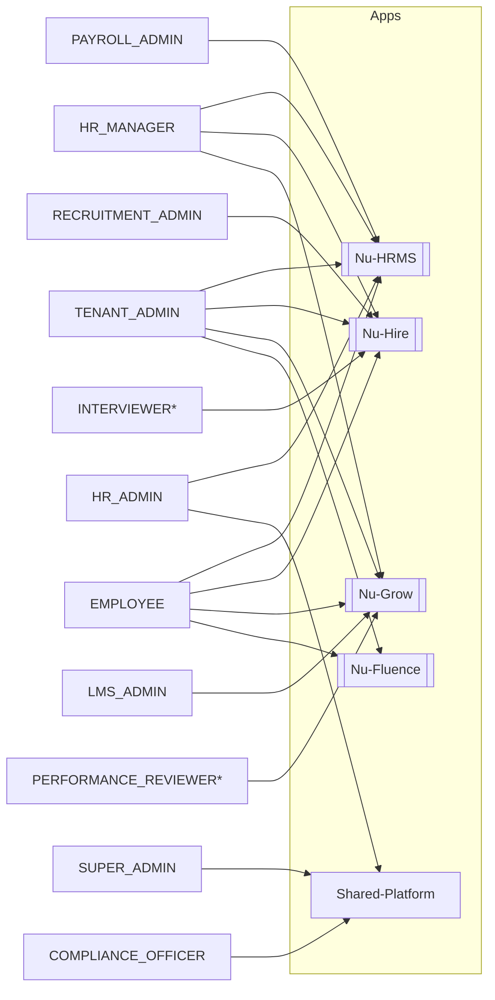

# Permission Ownership

> Part of the **05-RBAC** section. See also [[Roles]] · [[Permissions]] · [[RBAC-Matrix]] · [[00-Home]]

## Purpose

Answer "**which permissions and roles belong to which sub-app**" — the per-permission/per-role
ownership partition that [[RBAC-Matrix]] flagged as *inferred* and the
[[Documentation-Coverage-Report]] named as the remaining thin spot. NU-AURA bundles four sub-apps
([[Nu-HRMS]], [[Nu-Hire]], [[Nu-Grow]], [[Nu-Fluence]]) on one [[Shared-Platform]]; this note maps
every `Permission` family and every role onto those sub-apps, grounded in code.

This is a **logical** partition: a permission constant carries no machine-readable app tag (the lone
exception is the `Permission.java:493` comment `// Knowledge Management (NU-Fluence)`). Ownership is
therefore reconstructed from three converging code sources, not invented.

## Grounding sources

| # | Source | What it provides | Strength |
|---|--------|------------------|----------|
| 1 | `frontend/lib/config/apps.ts` → `PLATFORM_APPS[*].permissionPrefixes` | The **declared** app access-gate: the prefix(es) a user needs ≥1 of to enter each sub-app shell | Authoritative, but a *gate list*, **not** the full family catalogue |
| 2 | `common/security/RoleHierarchy.java` grant functions | Inline `// Nu-Grow:` / `// Nu-Fluence:` / `// Nu-Hire:` comments tag permission groups by sub-app | Author-tagged, partial (only `TENANT_ADMIN`'s superset block is exhaustively tagged) |
| 3 | `@RequiresPermission` usages per `api/<package>` controller (~1,709 sites across ~188 files) | Which `api` domain package enforces which `MODULE:*` family | Direct enforcement evidence; 1:1 for most families |

Where 1–3 agree, ownership is **verified**. Where only domain naming + the enforcing package decide
it (no `apps.ts` prefix, no `RoleHierarchy` comment), it is marked *(inferred)*.

## Sub-app access gate (declared, `apps.ts:40–143`)

A user reaches a sub-app's shell only if they hold ≥1 permission whose key starts with one of these
prefixes (`apps.ts` comment, `:30`). This is the **entry gate**, not the full set the app enforces.

| Sub-app | `code` | `permissionPrefixes` (verbatim) | `apps.ts` lines |
|---------|--------|----------------------------------|-----------------|
| [[Nu-HRMS]] | `HRMS` | employee, department, leave, attendance, payroll, compensation, benefit, expense, loan, travel, asset, letter, statutory, lwf, tax, helpdesk, overtime, probation, dashboard, self_service, document, calendar, announcement, workflow, org_structure, report, analytics, settings, role, permission, integration, timesheet, project, resource, email, shift | `:49–57` |
| [[Nu-Hire]] | `HIRE` | recruitment, candidate, onboarding, exit, preboarding, referral, agency | `:86–89` |
| [[Nu-Grow]] | `GROW` | review, okr, feedback_360, training, lms, recognition, survey, wellness, goal, competency, meeting | `:105–108` |
| [[Nu-Fluence]] | `FLUENCE` | knowledge | `:126–128` |

> **The HRMS gate is the catch-all.** It absorbs cross-cutting/shared prefixes (`dashboard`,
> `report`, `analytics`, `workflow`, `settings`, `role`, `permission`, `integration`, `email`) and
> is the default fallback for unmatched routes (`getAppForRoute` `apps.ts:156–167`). Those families
> are **owned by the [[Shared-Platform]]** even though they route through the HRMS shell — see the
> Shared section below. The gate list is also **non-exhaustive**: `payment`, `contract`, `budget`,
> `position`, `scorecard`, `agency`, `career`, `esignature`, `wall` (and more) are real capabilities
> with no gate prefix; their owner is set by `RoleHierarchy` tags + the enforcing package.

## Permission family → sub-app

`MODULE` = the prefix of `MODULE:ACTION` keys in `Permission.java`. "Enforced in" = the `api`
package(s) whose `@RequiresPermission` annotations reference the family. ~95 families total; grouped
by owner below.

### [[Nu-HRMS]] — Core HR (record of truth)

| Family (`MODULE:*`) | Enforced in `api/` | Grounding |
|---------------------|--------------------|-----------|
| `EMPLOYEE`, `EMPLOYMENT_CHANGE`, `DEPARTMENT` | `employee` | gate `employee`/`department` |
| `FIELD:EMPLOYEE:*` (salary/bank/tax/id) | `employee` (`FieldPermission`) | salary/bank gates, [[RBAC-Matrix]] resource matrix |
| `SELF_SERVICE` | `selfservice` | gate `self_service` |
| `ATTENDANCE`, `OFFICE_LOCATION`, `GEOFENCE` | `attendance` | gate `attendance` |
| `SHIFT` | `shift` | gate `shift` |
| `OVERTIME` | `overtime` | gate `overtime` |
| `TIME_TRACKING`, `TIMESHEET` | `timetracking`, `attendance` | gate `timesheet` |
| `PROJECT`, `ALLOCATION` | `project`, `psa`, `resourcemanagement` | gate `project`/`resource` |
| `LEAVE`, `LEAVE_TYPE`, `LEAVE_BALANCE` | `leave` | gate `leave` |
| `PAYROLL`, `GLOBAL_PAYROLL`, `CURRENCY`, `EXCHANGE_RATE` | `payroll` | gate `payroll` |
| `COMPENSATION` | `compensation` | gate `compensation` |
| `BENEFIT` | `benefits` | gate `benefit` |
| `EXPENSE`, `PAYMENT` | `expense`, `payment` | gate `expense`; `PAYMENT` *(inferred — spend, feature-flagged)* |
| `LOAN` | `loan` | gate `loan` |
| `TRAVEL` | `travel` | gate `travel` |
| `ASSET` | `asset` | gate `asset` |
| `LETTER` | `letter` | gate `letter` |
| `STATUTORY`, `TDS`, `LWF`, `TAX` | `statutory`, `tax`, `payroll` | gate `statutory`/`lwf`/`tax` |
| `HELPDESK` | `helpdesk` | gate `helpdesk` |
| `PROBATION` | `probation` | gate `probation` |
| `CONTRACT` | `contract` | *(inferred — employment contracts; `RoleHierarchy.java:210`)* |
| `DOCUMENT` | `document` | gate `document` (cross-cutting, HRMS-centric) |
| `CALENDAR` | `calendar` | gate `calendar` |
| `ANNOUNCEMENT` | `announcement` | gate `announcement` |
| `ORG_STRUCTURE`, `POSITION`, `SUCCESSION`, `TALENT_POOL` | `organization` | gate `org_structure`; succession/talent *(inferred)* |
| `BUDGET`, `HEADCOUNT` | `budget` | *(inferred — HR/finance planning)* |

### [[Nu-Hire]] — Recruitment & joining

| Family | Enforced in `api/` | Grounding |
|--------|--------------------|-----------|
| `RECRUITMENT`, `CANDIDATE` | `recruitment` | gate `recruitment`/`candidate` |
| `AGENCY` | `recruitment` | `RoleHierarchy.java:199` `// Nu-Hire: Recruitment Agencies` |
| `SCORECARD` | `recruitment` | `RoleHierarchy.java:205` `// Nu-Hire: Interview Scorecards` |
| `PREBOARDING` | `preboarding` | `RoleHierarchy.java:195` `// Nu-Hire: Pre-Boarding`; gate `preboarding` |
| `ONBOARDING` | `onboarding` | gate `onboarding` |
| `EXIT`, `OFFBOARDING` | `exit` | gate `exit`; `/offboarding` route in `HIRE.routePrefixes` (`apps.ts:92`) |
| `REFERRAL` | `referral` | gate `referral` |
| `CAREER` | `publicapi` | *(inferred — public career page; `Permission.java:476`)* |

### [[Nu-Grow]] — Performance, learning, engagement

| Family | Enforced in `api/` | Grounding |
|--------|--------------------|-----------|
| `REVIEW`, `GOAL` | `performance` | `RoleHierarchy.java:146` (Goals), `:164` (Review lifecycle); gate `review`/`goal` |
| `OKR` | `performance` | `RoleHierarchy.java:152` `// Nu-Grow: OKRs`; gate `okr` |
| `FEEDBACK_360`, `FEEDBACK` | `performance` | `RoleHierarchy.java:159` `// Nu-Grow: 360 Feedback`; gate `feedback_360` |
| `PIP`, `CALIBRATION` | `performance` | *(inferred — review sub-features)* |
| `SURVEY` | `survey`, `engagement` | `RoleHierarchy.java:139` `// Nu-Grow: Surveys`; gate `survey` |
| `MEETING` | `meeting`, `engagement` | `RoleHierarchy.java:135` `// Nu-Grow: 1-on-1 Meetings`; gate `meeting` |
| `RECOGNITION`, `BADGE`, `POINTS`, `MILESTONE` | `recognition` | gate `recognition` |
| `TRAINING` | `training` | gate `training` |
| `LMS` | `lms` | gate `lms` |
| `WELLNESS` | `wellness` | `RoleHierarchy.java:131` `// Nu-Grow: Wellness`; gate `wellness` |

### [[Nu-Fluence]] — Knowledge & internal social

| Family | Enforced in `api/` | Grounding |
|--------|--------------------|-----------|
| `KNOWLEDGE` (`WIKI_*`, `BLOG_*`, `TEMPLATE_*`, `SEARCH`, `SETTINGS_MANAGE`, `SPACE_MANAGE`) | `knowledge` | `Permission.java:493` `// Knowledge Management (NU-Fluence)`; `RoleHierarchy.java:174/181/187/192`; gate `knowledge` |
| `WALL` (`POST`/`COMMENT`/`REACT`/`PIN`/`MANAGE`) | `wall` | Fluence activity wall (`Nu-Fluence` `/fluence/wall`); also surfaced on the HRMS dashboard *(spans)* |
| `ESIGNATURE` | `esignature` | `RoleHierarchy.java:169` `// Nu-Fluence: E-Signature` — **but** [[Nu-Hire]] drives offer/contract signing (see Risks) |

### [[Shared-Platform]] — cross-cutting (owned by the platform, gated via the HRMS shell)

| Family | Enforced in `api/` | Grounding |
|--------|--------------------|-----------|
| `SYSTEM:ADMIN`, `TENANT`, `PLATFORM`, `MIGRATION` | `admin`, `platform`, `auth`, `migration` | global break-glass / tenant ops (`RoleHierarchy.java:103–113`) |
| `ROLE`, `PERMISSION`, `USER` | `user`, `platform` | RBAC administration (`RoleHierarchy.java:270–271`) |
| `AUDIT` | `audit`, `admin`, `compliance` | audit log (`RoleHierarchy.java:274`, `:729`) |
| `SETTINGS`, `CUSTOM_FIELD` | `customfield`, `platform` | tenant config (`RoleHierarchy.java:272–275`) |
| `NOTIFICATION`, `NOTIFICATIONS` | `notification` | multi-channel notifications |
| `INTEGRATION`, `WEBHOOK` | `integration`, `webhook` | connectors / DocuSign / Slack / webhooks |
| `WORKFLOW` | `workflow` | cross-app approval engine (gate sits under HRMS) |
| `COMPLIANCE`, `POLICY`, `CHECKLIST`, `ALERT` | `compliance` | governance / DSR / GDPR (`COMPLIANCE_OFFICER`, `RoleHierarchy.java:718–740`) |
| `DASHBOARD`, `ANALYTICS`, `PREDICTIVE_ANALYTICS`, `REPORT` | `dashboard`, `analytics`, `report` | cross-cutting analytics; HRMS-gated by `apps.ts` |

> Feature flags are administered under `api/featureflag` but enforce via `SYSTEM:ADMIN` +
> `@RequiresFeature` (`FeatureFlagAspect`), not a `FEATURE:*` permission family — see [[Permissions]].

## Roles → sub-app(s)

Each role's grant function (`RoleHierarchy.getDefaultPermissions`) determines the apps it touches.
"Primary" = the app(s) the role is purpose-built for; many also receive cross-app baseline grants.

| Role | Rank | Primary sub-app(s) | Notes (grant fn) |
|------|------|--------------------|------------------|
| `SUPER_ADMIN` | 100 | [[Shared-Platform]] (all, via bypass) | `:103` — cross-tenant break-glass |
| `TENANT_ADMIN` | 90 | **All four** | `:122` — superset of HR_ADMIN + explicit Grow/Fluence/Hire grants |
| `HR_ADMIN` | 85 | [[Nu-HRMS]] + RBAC/governance ([[Shared-Platform]]) | `:266` — adds ROLE/USER/SETTINGS/AUDIT + salary/bank edit |
| `HR_MANAGER` | 80 | [[Nu-HRMS]] + [[Nu-Hire]] + [[Nu-Grow]] | `:292` — HR ops, recruitment, review/training/survey/wellness |
| `PAYROLL_ADMIN` | 75 | [[Nu-HRMS]] (payroll/comp/statutory) | `:566` — incl. `FIELD:EMPLOYEE:SALARY/BANK` edit |
| `HR_EXECUTIVE` | 70 | [[Nu-HRMS]] (no financials) + light Hire/Grow views | `:397` — explicitly **no** salary/financial access |
| `RECRUITMENT_ADMIN` | 65 | [[Nu-Hire]] | `:608` — recruitment/onboarding/referrals + offer letters |
| `DEPARTMENT_MANAGER` | 60 | [[Nu-HRMS]] (dept) + [[Nu-Grow]] (reviews/PIP) | `:426` — `EMPLOYEE:VIEW_DEPARTMENT` scope |
| `PROJECT_ADMIN` | 58 | [[Nu-HRMS]] (projects/timesheets) | `:636` |
| `ASSET_MANAGER` | 56 | [[Nu-HRMS]] (assets) | `:655` |
| `EXPENSE_MANAGER` | 55 | [[Nu-HRMS]] (expense) | `:669` |
| `HELPDESK_ADMIN` | 54 | [[Nu-HRMS]] (helpdesk) | `:683` |
| `TRAVEL_ADMIN` | 53 | [[Nu-HRMS]] (travel/expense) | `:699` |
| `COMPLIANCE_OFFICER` | 52 | [[Shared-Platform]] governance + [[Nu-HRMS]] | `:718` — compliance/policy/audit/statutory |
| `LMS_ADMIN` | 51 | [[Nu-Grow]] (LMS/training) | `:743` |
| `TEAM_LEAD` | 50 | [[Nu-HRMS]] (team) + [[Nu-Grow]] (reviews) | `:461` — `EMPLOYEE:VIEW_TEAM` scope |
| `EMPLOYEE` | 40 | **All four** (self-service) | `:485` — HRMS self-service + Grow OKR/feedback/recognition/LMS + Fluence wall + Hire referrals |
| `CONTRACTOR` | 30 | [[Nu-HRMS]] (minimal) | `:552` — attendance/timesheet/expense/helpdesk |
| `INTERN` | 20 | [[Nu-HRMS]] (minimal) + [[Nu-Grow]] (learning) | `:765` |
| `REPORTING_MANAGER` *(implicit)* | — | [[Nu-HRMS]] team mgmt + [[Nu-Grow]] (review/goal) | `:781` — direct reports |
| `SKIP_LEVEL_MANAGER` *(implicit)* | — | [[Nu-HRMS]] (team views) + [[Nu-Grow]] (review view) | `:801` |
| `DEPARTMENT_HEAD` *(implicit)* | — | [[Nu-HRMS]] (dept views, budget, headcount) | `:811` |
| `MENTOR` *(implicit)* | — | [[Nu-HRMS]] (team view) + [[Nu-Grow]] (review/goal/training) | `:823` |
| `INTERVIEWER` *(implicit)* | — | [[Nu-Hire]] (candidate/recruitment) | `:833` |
| `PERFORMANCE_REVIEWER` *(implicit)* | — | [[Nu-Grow]] (review/360) | `:842` |
| `ONBOARDING_BUDDY` *(implicit)* | — | [[Nu-Hire]] (onboarding) + [[Nu-HRMS]] (team view) | `:854` |

> `*` implicit, relationship-derived. `EMPLOYEE` and `TENANT_ADMIN` are the only roles that touch
> **all four** sub-apps by default — every other role is concentrated in one or two.

## Dependencies

`frontend/lib/config/apps.ts` (gate) · `common/security/RoleHierarchy.java` (grants + app tags) ·
`Permission.java` / `FieldPermission.java` (families) · `@RequiresPermission` enforcement
([[Permissions]]) · `api/<package>` controllers ([[APIs]]) · sub-app module notes
([[Nu-HRMS]], [[Nu-Hire]], [[Nu-Grow]], [[Nu-Fluence]], [[Shared-Platform]]).

## Related Links

[[Roles]] · [[Permissions]] · [[RBAC-Matrix]] · [[Nu-HRMS]] · [[Nu-Hire]] · [[Nu-Grow]] ·
[[Nu-Fluence]] · [[Shared-Platform]] · [[APIs]] · [[Schema]] · [[Data-Flows]] · [[Security-Audit]] ·
[[00-Home]]

## Risks

- **Ownership is a partition over a flat namespace.** Permissions carry no app tag in code (except the
  `Permission.java:493` Knowledge comment). Rows marked *(inferred)* rely on domain naming + the
  enforcing package; a permission can be re-used by another app's controller without changing this note.
- **`apps.ts` gate ≠ full family set.** `permissionPrefixes` is the *entry gate* (need ≥1 to open the
  shell), not the authorization surface. Many owned families have no gate prefix (`payment`, `contract`,
  `scorecard`, `agency`, `career`, `wall`, `esignature`, `budget`, `position`, …). Do not infer "not
  in the app" from "not in `permissionPrefixes`".
- **E-Signature is genuinely cross-app.** `RoleHierarchy.java:169` tags `ESIGNATURE:*` as Nu-Fluence and
  [[RBAC-Matrix]] lists it under Fluence, yet [[Nu-Hire]] (offers/contracts) and [[Nu-HRMS]] (contracts)
  both consume it. Treat it as a shared signing capability owned by Fluence in code.
- **HRMS shell absorbs shared concerns.** `dashboard`/`report`/`analytics`/`workflow`/`settings`/
  `role`/`permission`/`integration` gate under HRMS in `apps.ts` but belong to [[Shared-Platform]];
  do not attribute platform admin to NU-HRMS the product.
- **Defaults, not live state.** Role→app reflects `RoleHierarchy` default grants. A tenant admin can
  edit `role_permissions` and pull a role into another app — audit the tenant rows for live truth
  ([[RBAC-Matrix]] Risks, [[Permissions]]).
- **Frontend-only roles** (`MANAGER`, `FINANCE_ADMIN`, `RECRUITER`, `TRAINER`) are not backend roles and
  are excluded here — see [[Roles]] Risks.

## Operational Notes

- To place a **new** permission: pick the owning sub-app, add the gate prefix to that app's
  `permissionPrefixes` in `apps.ts` (if it should open the shell), and grant it in the relevant
  `RoleHierarchy` function with a `// Nu-<App>:` comment so this map stays code-derivable. The
  `skills:nu-permission` skill scaffolds the BE+FE keys consistently ([[RBAC-Matrix]]).
- To answer "can role X use feature Y in app Z": check this note for ownership, then [[RBAC-Matrix]]
  for the role×capability cell, then the tenant's `role_permissions` if it may have diverged.
- Counts are point-in-time (2026-06-16): 19 explicit + 7 implicit roles, ~95 permission families,
  ~1,709 `@RequiresPermission` sites across ~188 files. Re-measure before quoting in a release.
