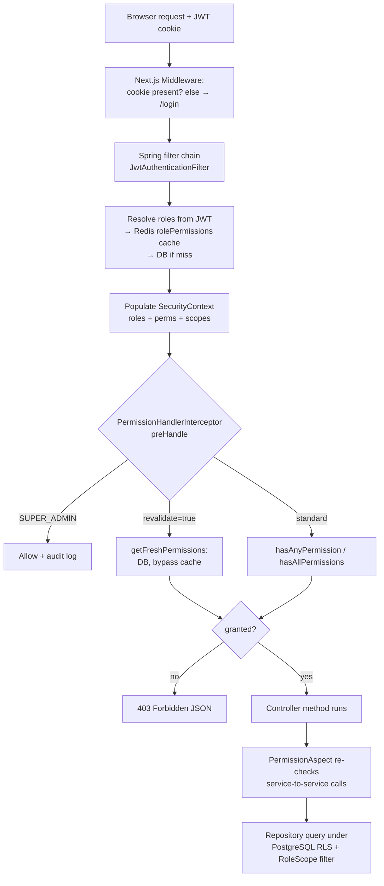

# Permissions

> Part of the **05-RBAC** section. See also [[Roles]] · [[RBAC-Matrix]] · [[Permission-Ownership]] · [[00-Home]]

## Purpose

Document how permissions are **defined**, **stored**, **cached**, and **enforced** end-to-end in
NU-AURA — from the DB row, through the Redis-cached role→permission resolution, into the
per-request `SecurityContext`, and out to the three enforcement points (HTTP pre-handler, AOP
aspect, frontend gate). Every mechanism below is cited to source.

## Context

A **permission** is a fine-grained capability string. The JWT carries [[Roles]] only;
permissions are resolved from roles at request time. The platform is multi-tenant, so all
resolution is tenant-scoped ([[Data-Flows]] §3–4). Field-level secrets (salary, bank, tax IDs)
are modeled as their own permission family (`FieldPermission`).

## Permission key naming

Permissions are `MODULE:ACTION` (uppercase, colon-separated). Multi-app codes prepend an app:
`APP:MODULE:ACTION`. Field permissions prepend `FIELD:`.

| Family | Example | Source |
|--------|---------|--------|
| Standard | `EMPLOYEE:READ`, `PAYROLL:APPROVE`, `LEAVE:REQUEST` | `Permission.java`; frontend `Permissions` const `usePermissions.ts:10` |
| App-prefixed | `HRMS:EMPLOYEE:READ` | `SecurityContext.hasPermissionInApp` `:401` |
| Field-level | `FIELD:EMPLOYEE:SALARY:VIEW`, `FIELD:EMPLOYEE:BANK:EDIT` | `FieldPermission.java:10–21` |
| DB/legacy seed | `employee.read` (dot, lowercase) | normalized at load — `SecurityContext.matchesNormalizedFormat` `:296`; FE `usePermissions.ts:638` |
| System bypass | `SYSTEM:ADMIN` | `Permission.SYSTEM_ADMIN`; `SecurityContext.isSystemAdminPermission` `:284` |

The frontend `Permissions` const (`usePermissions.ts:10–534`) is the human-readable catalogue —
~350 keys across all modules (Employee, Leave, Attendance, Payroll, Recruitment, LMS,
Performance/OKR/360, Expense, Payment, Helpdesk, Knowledge/Wiki/Blog, Agency, Scorecard, etc.).
Comments in that file document historical key-mismatch bugs that have been fixed
(e.g. `EMPLOYEE_BANK_READ` remapped to `FIELD:EMPLOYEE:BANK:VIEW` at `:25`; `LEAVE:APPLY`→
`LEAVE:REQUEST` at `:39`; `PAYMENT:PROCESS`→`PAYMENT:INITIATE` at `:216`). Keep the FE catalogue
in lock-step with the backend `Permission`/`FieldPermission` constants.

## Storage (DB)

Permissions are persisted as tenant-scoped rows. Tables (`V0__init.sql`):

| Table | Line | Role |
|-------|------|------|
| `permissions` | `:181` | catalogue of permission codes (per tenant) |
| `roles` | `:144` | role rows (`code`, `name`, `parent_role_id`, `is_system_role`) |
| `role_permissions` | `:9363` | M:N join role↔permission (`role_id`, `permission_id`, `tenant_id`) |
| `user_roles` | `:122` | assigns explicit roles to users |
| `implicit_user_roles` | `V63` | derived roles (`is_active`) per user — see [[Roles]] |
| `app_permissions` / `app_roles` / `app_role_permissions` | `:689`/`:744`/`:12723` | multi-app (`APP:…`) variants |

JPA entities: `domain/user/Role.java`, `RolePermission.java`, `ImplicitUserRole.java`.
Each role carries `parent_role_id` enabling DB-level inheritance.

## Caching (Redis)

Role→permission resolution is cached to avoid a DB hit per request.

- **Cache name:** `rolePermissions` — `CacheConfig.ROLE_PERMISSIONS` (`CacheConfig.java:50`).
- **Resolver:** `SecurityService.getCachedPermissions(roles)` (`:82`) and the richer
  `getCachedPermissionsForUser(userId, explicitRoleCodes)` (`:171`), both `@Cacheable(value=ROLE_PERMISSIONS)`.
- **Key:** `"{tenantId}::{sortedRoleCodes}"` (`rolesCacheKey` `:136`) or `"permissions:{tenantId}:{userId}"` (`userCacheKey` `:275`).
- **Tenant-safety guard (BUG-009):** caching is conditioned on `isTenantContextPresent()`
  (`:79`, `:132`). Without a tenant (Kafka consumers, `@Async`, scheduled jobs) the method
  returns an **empty** set and is **not cached** — preventing cross-tenant permission leakage.
- **Inheritance flattening:** `getCachedPermissionsForUser` loads all tenant roles once
  (PERF-M01, `:182`), then `flattenRolePermissions` (`:227`) BFS-walks `parent_role_id`
  (max depth 10, cycle-guarded) and merges explicit + implicit role permissions additively.

## Load into request context

`JwtAuthenticationFilter` (see [[Data-Flows]] §3.2) populates `SecurityContext` per request:
roles, the permission→`RoleScope` map, employee/department/team/location IDs, and reportee IDs.
The context is a set of `ThreadLocal`s (`SecurityContext.java:18–40`) cleared at end of request
(`clear()` `:571`). Permissions are stored with their max **scope** (`RoleScope`:
`ALL > LOCATION > DEPARTMENT > TEAM > SELF > CUSTOM`, `RoleScope.java`) so the data layer can
apply Keka-style row filtering in addition to the boolean capability check.

## Permission-check semantics

`SecurityContext.hasPermission()` (`:250`) is more than set membership. It also matches:

1. **System-admin bypass** — `SYSTEM:ADMIN` (or `{APP}:SYSTEM:ADMIN`) → true (`:284`).
2. **Format normalization** — dot/lowercase DB form ↔ colon/uppercase code form (`:296`).
3. **App-prefix tolerance** — bare `MODULE:ACTION` matches `{APP}:MODULE:ACTION` (`:313`).
4. **Hierarchy** (`:324`): `MODULE:MANAGE` implies every action in that module;
   `MODULE:READ` implies `MODULE:VIEW_*`; and view-scope widening
   `VIEW_ALL > VIEW_TEAM > VIEW_DEPARTMENT > VIEW_SELF` (`:347`). The frontend mirrors the
   `MODULE:MANAGE` implication in `usePermissions.ts:685`.

## Enforcement path (end-to-end)

Enforcement is **defense-in-depth** across three points. Note: the codebase uses a custom
`@RequiresPermission` annotation (**190** usages), **not** Spring's `@PreAuthorize` (only **2**).

1. **HTTP pre-handler — `PermissionHandlerInterceptor` (primary).** Runs in
   `preHandle` **before** `@Valid` argument resolution, so unauthorized callers get **403**, not
   400 (which would leak the request schema) — `PermissionHandlerInterceptor.java:24–43`. Reads
   `@RequiresPermission(value=anyOf, allOf=…, revalidate=…)`, applies SuperAdmin bypass with an
   audit log (`:77`), denies empty-annotation configs (`:88`), and marks the method "checked".
2. **AOP aspect — `PermissionAspect` (second layer).** Catches **service-to-service** calls that
   never pass through MVC (`@Around` on `@RequiresPermission`, `PermissionAspect.java:48`). Skips
   work already done by the interceptor (`wasCheckedByMvcInterceptor` `:74`). Same SuperAdmin
   bypass + empty-config CRIT-1 guard (`:95`).
3. **Revalidation mode.** `@RequiresPermission(revalidate = true)` forces a **fresh DB**
   role→permission lookup bypassing the Redis cache (`getFreshPermissions` `SecurityService.java:112`)
   — used on sensitive ops (payroll, admin, role changes) so a revoked role is honored
   immediately rather than at JWT/cache expiry.
4. **PostgreSQL RLS** is an orthogonal tenant/row guard underneath all of the above
   (see [[Data-Flows]] §4) — not a permission check, but the final isolation backstop.

### Frontend (UI gating, not a security boundary)

- `usePermissions()` hook (`usePermissions.ts:612`) exposes `hasPermission`, `hasAnyPermission`,
  `hasAllPermissions`, `hasRole`, `isAdmin`, `isHR`, `isManager`, `isReady`.
- `PermissionGate` / `AdminGate` / `HRGate` / `ManagerGate` components
  (`components/auth/PermissionGate.tsx`) conditionally render children;
  `SUPER_ADMIN`/`SYSTEM:ADMIN` bypass all gates (`:120`). `PageDeniedFallback` renders a visible
  "Access denied" for page-level gates.
- `AuthGuard` (`components/auth/AuthGuard.tsx`) protects routes; [[Middleware]] does the primary
  cookie-based 401→login redirect. **UI gating prevents display, not access — the API enforces.**

## Dependencies

`SecurityContext` · `SecurityService` · `PermissionHandlerInterceptor` · `PermissionAspect` ·
`@RequiresPermission` · `Permission` / `FieldPermission` · `RoleHierarchy` ([[Roles]]) ·
`CacheConfig` (Redis) · `roles`/`permissions`/`role_permissions` ([[Schema]]) ·
`JwtAuthenticationFilter` ([[Data-Flows]]) · frontend `usePermissions` + `PermissionGate`.

## Related Links

[[Roles]] · [[RBAC-Matrix]] · [[Permission-Ownership]] · [[Data-Flows]] · [[System-Flows]] · [[Schema]] · [[Middleware]] ·
[[APIs]] · [[Routes]] · [[Pages]] · [[Security-Audit]] · [[Shared-Platform]] · [[00-Home]]

## Risks

- **Cache staleness vs. revalidation.** Most endpoints trust the `rolePermissions` cache; a
  revoked role lingers until TTL/eviction unless the endpoint opts into `revalidate = true`.
  Sensitive mutations must use it (and most payroll/admin paths do).
- **Empty `@RequiresPermission` = deny.** Both enforcers treat a permission-less annotation as a
  config error and **deny** (`PermissionAspect.java:95`, interceptor `:88`) — fail-closed, good,
  but a real risk if someone adds the annotation without args expecting "any authenticated".
- **FE/BE key drift.** The frontend catalogue is hand-maintained; several historical mismatches
  are documented inline. A wrong key silently hides UI for everyone (incl. SuperAdmin if the key
  matches no backend permission).
- **`@PreAuthorize` is essentially unused** (2 sites). Do not assume Spring Method Security is the
  enforcement path — it is `@RequiresPermission`.

## Operational Notes

- To change what a role can do: edit `role_permissions` (or the role's `RoleHierarchy` default
  grant for new tenants) and **evict the `rolePermissions` cache**, or wait out the TTL.
- Cross-tenant safety relies on `TenantContext` being set; any code path that resolves
  permissions without it returns empty (deny) and skips caching — by design.
- Field-level data (salary/bank/tax) is gated separately via `FIELD:*` permissions even when the
  parent record is viewable — see [[RBAC-Matrix]] resource matrix.
