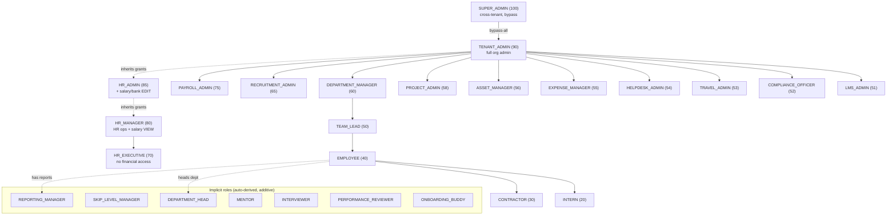

# Roles

> Part of the **05-RBAC** section. See also [[Permissions]] · [[RBAC-Matrix]] · [[Permission-Ownership]] · [[00-Home]]

## Purpose

Enumerate every **verified** role in the NU-AURA platform, its scope/intent, and the role
hierarchy used for seniority comparisons and permission inheritance. Roles are the unit the
JWT carries; permissions are derived from them (see [[Permissions]]). Accuracy here is
load-bearing — each role below is cited to its exact source line.

## Context

NU-AURA is a multi-tenant HR/work platform ([[System-Overview]]) with four sub-apps:
[[Nu-HRMS]], [[Nu-Hire]], [[Nu-Grow]], [[Nu-Fluence]], on a [[Shared-Platform]]. Roles are
**tenant-scoped rows** in the `roles` table (each tenant gets its own seeded role set), but
the canonical role *codes* and their default permission grants are defined in code:

- **Backend canonical source:** `backend/src/main/java/com/nulogic/common/security/RoleHierarchy.java`
- **Frontend mirror:** `frontend/lib/hooks/usePermissions.ts` (`Roles` const, lines 541–566)
- **Per-tenant seeding:** `application/platform/service/HrmsRoleInitializer.java`

There are **two distinct role taxonomies** in code, and they do **not** fully agree — this is
a real, documented discrepancy (see Risks).

## Dependencies

| Layer | Artifact | Role responsibility |
|-------|----------|---------------------|
| Auth context | `common/security/SecurityContext.java` | Holds `currentRoles` ThreadLocal; `isSuperAdmin()` / `isTenantAdmin()` / `isManager()` |
| Hierarchy/grants | `common/security/RoleHierarchy.java` | Canonical role codes + `getDefaultPermissions()` + `getRoleRank()` |
| Persistence | `roles` table (`V0__init.sql:144`), `user_roles` (`V0:122`), `implicit_user_roles` (`V63`) | Tenant-scoped role rows; user↔role and derived-role links |
| Frontend | `usePermissions.ts`, `lib/constants/roles.ts` | `isAdmin` bypass, `isHR`/`isManager` convenience checks |

## Verified Role List

### Explicit roles (assigned to users) — `RoleHierarchy.java:13–33`, registered in `ALL_EXPLICIT_ROLES` (`:46–51`)

| Role code | Rank (`getRoleRank` `:874`) | Scope / intent (`getRoleDescription` `:917`) |
|-----------|------|----------------------------------------------|
| `SUPER_ADMIN` | 100 | Complete system control **across all tenants** — platform break-glass; bypasses all gates |
| `TENANT_ADMIN` | 90 | Full organization administration (one tenant); superset of `HR_ADMIN` + Grow/Fluence |
| `HR_ADMIN` | 85 | Senior HR leadership; elevated perms + salary/bank **edit** access |
| `HR_MANAGER` | 80 | Complete HR operations incl. salary **view** |
| `PAYROLL_ADMIN` | 75 | Payroll & compensation management only |
| `HR_EXECUTIVE` | 70 | HR operations **without** salary/financial access |
| `RECRUITMENT_ADMIN` | 65 | Talent acquisition & onboarding |
| `DEPARTMENT_MANAGER` | 60 | Department-level employee management |
| `PROJECT_ADMIN` | 58 | Project & timesheet management |
| `ASSET_MANAGER` | 56 | IT asset tracking & allocation |
| `EXPENSE_MANAGER` | 55 | Expense approval & management |
| `HELPDESK_ADMIN` | 54 | Support ticket management |
| `TRAVEL_ADMIN` | 53 | Travel request management |
| `COMPLIANCE_OFFICER` | 52 | Compliance & policy management |
| `LMS_ADMIN` | 51 | Learning management system administration |
| `TEAM_LEAD` | 50 | Team-level management |
| `EMPLOYEE` | 40 | Regular employee self-service |
| `CONTRACTOR` | 30 | Limited contractor access |
| `INTERN` | 20 | Trainee with minimal access |

That is **19 explicit roles**. The "~9 roles" figure from project memory describes the
*core* set (`SUPER_ADMIN`, `TENANT_ADMIN`, `HR_ADMIN`, `HR_MANAGER`, `HR_EXECUTIVE`,
`DEPARTMENT_MANAGER`, `TEAM_LEAD`, `EMPLOYEE`, `CONTRACTOR`) — the remaining 10 are the
"Keka-equivalent" specialized admin roles (`RoleHierarchy.java:23` comment).

### Implicit roles (auto-derived from relationships) — `:37–43`, registered in `ALL_IMPLICIT_ROLES` (`:54–57`)

These are **not** assigned directly. They are written to `implicit_user_roles` (`V63`) when a
relationship exists and are merged into the user's permission set at load time by
`SecurityService.getCachedPermissionsForUser()` (`SecurityService.java:171`).

| Implicit role | Auto-granted when… | Source |
|---------------|--------------------|--------|
| `REPORTING_MANAGER` | employee has direct reports | `:37`, perms `:781` |
| `SKIP_LEVEL_MANAGER` | employee has indirect (skip-level) reports | `:38`, perms `:801` |
| `DEPARTMENT_HEAD` | employee heads a department | `:39`, perms `:811` |
| `MENTOR` | assigned as a mentor | `:40`, perms `:823` |
| `INTERVIEWER` | placed on an interview panel | `:41`, perms `:833` |
| `PERFORMANCE_REVIEWER` | assigned as a performance reviewer | `:42`, perms `:842` |
| `ONBOARDING_BUDDY` | assigned as an onboarding buddy | `:43`, perms `:854` |

**7 implicit roles.** Total verified roles in the canonical taxonomy: **26** (19 explicit + 7 implicit).

### The "ADMIN" alias

`RoleHierarchy.getDefaultPermissions()` (`:72`) treats the literal role code `"ADMIN"` as an
alias for `TENANT_ADMIN`. Project memory records a historical bug where `TENANT_ADMIN` users
were seeded with code `ADMIN`, producing empty permissions → 403 everywhere (fixed; see
[[Security-Audit]]). The alias remains as a safety net.

## Role Hierarchy

The hierarchy below combines **seniority rank** (`getRoleRank`) with **permission inheritance**.
Inheritance is real where one role's grant function calls another's:
`TENANT_ADMIN ⊇ HR_ADMIN ⊇ HR_MANAGER` (`RoleHierarchy.java:126`, `:267`). Specialized admins
do **not** inherit from each other — they have independent, curated grants.

> Solid arrows = seniority/org chain. Dotted "inherits grants" = actual code-level permission
> superset relationship (`HR_ADMIN ⊇ HR_MANAGER`, `TENANT_ADMIN ⊇ HR_ADMIN`). DB-level
> inheritance also exists via `roles.parent_role_id` walked by `flattenRolePermissions()`
> (`SecurityService.java:227`).

## SuperAdmin bypass

`SUPER_ADMIN` is the only true global bypass. It is honored identically at three layers:

- Backend pre-handler: `PermissionHandlerInterceptor.java:77` (`isSuperAdmin()` → allow + audit log)
- Backend AOP: `PermissionAspect.java:82`
- Frontend gate: `usePermissions.ts:674` (`isAdmin = SUPER_ADMIN role || SYSTEM:ADMIN perm`)

`TENANT_ADMIN` is intentionally **NOT** a bypass — it must rely on its explicit (large) grant
set. This is called out in `usePermissions.ts:671–673` and `SecurityContext.isTenantAdmin()`.

## Related Links

[[Permissions]] · [[RBAC-Matrix]] · [[Permission-Ownership]] · [[Data-Flows]] · [[System-Flows]] · [[Schema]] ·
[[Middleware]] · [[Security-Audit]] · [[Nu-HRMS]] · [[Nu-Hire]] · [[Nu-Grow]] ·
[[Nu-Fluence]] · [[Shared-Platform]] · [[00-Home]]

## Risks

- **Two non-agreeing role taxonomies.** The backend canonical set (`RoleHierarchy.java`) lists
  19 explicit roles. The frontend `Roles` const (`usePermissions.ts:541`) adds codes that are
  **not** backend roles: `DEPARTMENT_HEAD`, `MANAGER`, `FINANCE_ADMIN`, `RECRUITER`, `TRAINER`.
  Comments flag these: `MANAGER` is "not a real backend role" (`:551`, `:755`). Gating on these
  on the frontend silently never matches. Treat backend `RoleHierarchy` as source of truth.
- **TENANT_ADMIN seeding fragility.** The `ADMIN`→`TENANT_ADMIN` alias exists because of a prior
  empty-permission regression. Any new tenant seeding must use code `TENANT_ADMIN`.
- **Implicit roles depend on relationship freshness.** If reporting/department links are stale,
  derived roles (`REPORTING_MANAGER`, etc.) are wrong until the next recompute.

## Operational Notes

- JWT carries **roles only**; permissions are loaded from DB + Redis cache by role
  (`Data-Flows` §3.2; `SecurityService.getCachedPermissions`). Changing a role's permissions
  takes effect after the `rolePermissions` cache TTL or an explicit eviction — not on next request.
- Sensitive endpoints can force a fresh DB role→permission lookup via
  `@RequiresPermission(revalidate = true)` (see [[Permissions]]).
- Role rows are tenant-scoped: `roleRepository.findByCodeInAndTenantId(roles, tenantId)`
  (`SecurityService.java:92`). A role code means nothing without a tenant.
- Admin UIs: `frontend/app/admin/roles`, `app/admin/permissions`, `app/admin/implicit-roles`,
  `app/settings/rbac`.
