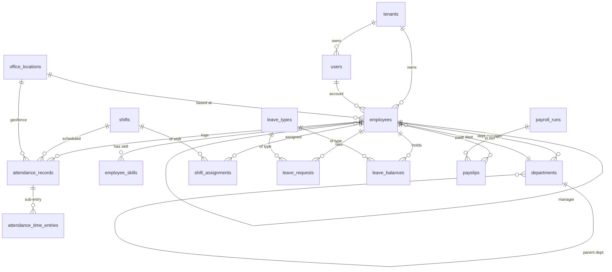

# Database Data Dictionary — Columns & Foreign Keys

> The deepest data layer in the vault: per-column detail for core business tables
> plus a **complete** foreign-key relationship map. Companion to
> [[Table-Index]] (all 330 distinct table names) and [[Schema]] (conventions, RLS,
> multi-tenancy). Where [[Schema]] documents *how* the schema is shaped and
> [[Table-Index]] *names* every table, this note documents *what is inside* the
> anchor tables and *how* every table connects to the rest.

## Purpose

Give engineers and architects a column-level reference for the tables that carry
real business state, and a deduplicated edge list of every foreign-key
relationship across the Flyway migration chain. Evidence is drawn directly from
`backend/src/main/resources/db/migration/V0__init.sql` (the ~12,742-line
baseline) and later migrations, cross-checked against the JPA entity classes
under `backend/src/main/java/com/nulogic/domain/**` for type and encryption
confirmation. This is the source-of-truth companion to [[Schema]], [[ERD]], and
[[Migrations]].

## Scope & honesty

- **Columns are deep but not exhaustive.** ~64 anchor/principal tables receive a
  full column table below — the ones that carry meaningful business columns. The
  long tail (config, join, lookup, ledger, and child tables) is **named in
  full** in [[Table-Index]] but not column-detailed here. Picking the anchors
  keeps this note legible; the FK map (below) still covers tables not
  column-detailed.
- **The FK map is complete.** Every `REFERENCES` / inline `FOREIGN KEY ...
  REFERENCES` edge across all migrations is extracted and deduplicated —
  **347 distinct child→parent edges** (command in
  [Foreign-key relationship map](#foreign-key-relationship-map)).
- **Spine columns are omitted per table.** The inherited `BaseEntity` /
  `TenantAware` spine (`id, tenant_id, created_at, updated_at, created_by,
  updated_by, version, is_deleted, deleted_at`) is documented once in [[Schema]]
  and noted as "+ BaseEntity/TenantAware spine" per table. **Caveat verified
  against V0:** the V0 baseline `CREATE TABLE` blocks ship spine columns
  `id, tenant_id, created_at, updated_at, created_by, updated_by, version,
  is_deleted` but **no physical `deleted_at` column** — `deleted_at` exists as a
  V0 header comment and is added by the entity mapping / later migrations. Spine
  deviations on individual tables are flagged inline.
- **Types are from SQL DDL.** Where a column is encrypted, the SQL type is still
  `VARCHAR`/`TEXT` — encryption is an application-layer JPA `@Convert` with
  `EncryptedStringConverter`, so ciphertext is stored in an ordinary text column.
  Encrypted columns are flagged **ENCRYPTED** in Notes.

## Encryption inventory (application-layer, verified against entities)

Every `@Convert(converter = EncryptedStringConverter.class)` field across
`com/nulogic/domain/**`. The column stays a plain `VARCHAR`/`TEXT` in DDL;
values are encrypted at write. (This list is broader than the 3-column note in
[[Schema]] — it covers all 10 entities.)

| Entity / table | Encrypted columns |
|----------------|-------------------|
| `employees` (`Employee.java`) | `bank_account_number`, `bank_ifsc_code`, `tax_id` (NOT `bank_name`) |
| `users` (`User.java`) | `mfa_secret` (column added post-V0) |
| `benefit_claims` (`BenefitClaim.java`) | `bank_account_number`, `ifsc_code` (added V188; `upi_id` NOT encrypted) |
| `benefit_dependents` (`BenefitDependent.java`) | `national_id`, `passport_number`, `phone`, `email`, `address`, `city`, `pre_existing_conditions` |
| `preboarding_candidates` (`PreboardingCandidate.java`) | `bank_account_number`, `bank_ifsc_code`, `tax_id` |
| `tax_declarations` (`TaxDeclaration.java`) | `previous_employer_pan` |
| `payment_transactions` (`PaymentTransaction.java`) | `recipient_account_number`, `recipient_ifsc` |
| `payment_configs` (`PaymentConfig.java`) | `webhook_secret` (mapped as `api_key_encrypted`/`webhook_secret`) |
| `webhooks` (`Webhook.java`) | `secret`, `previous_secret` |
| `integration_connector_configs` (`IntegrationConnectorConfigEntity.java`) | `config_json` |

**Plaintext gaps worth noting (no converter applied):** PF `uan_number` /
`pf_number`, ESI `esi_number` / `ip_number`, candidate `email` / `phone` /
`resume_url`, `contract_signatures.signer_email`. These hold PII/PHI-adjacent
identifiers but are stored unencrypted.

## Column detail by cluster

Spine columns omitted per [Scope & honesty](#scope--honesty). Migration version
of origin noted where a table is **not** in the V0 baseline.

### Tenant & access control → [[Shared-Platform]]

#### tenants
| Column | Type | Null | Key/Notes |
|--------|------|------|-----------|
| code | VARCHAR(50) | NOT NULL | UNIQUE |
| name | VARCHAR(200) | NOT NULL | |
| status | VARCHAR(20) | NOT NULL | |
| description | VARCHAR(500) | nullable | |
| contact_email | VARCHAR(100) | nullable | |
| contact_phone | VARCHAR(20) | nullable | |
| settings | TEXT | nullable | |

+ BaseEntity spine; **`tenant_id` is nullable here** (root tenant table).

#### users
| Column | Type | Null | Key/Notes |
|--------|------|------|-----------|
| email | VARCHAR(200) | NOT NULL | |
| first_name | VARCHAR(100) | NOT NULL | |
| last_name | VARCHAR(100) | nullable | |
| password_hash | VARCHAR(255) | NOT NULL | |
| status | VARCHAR(20) | NOT NULL | |
| last_login_at | TIMESTAMPTZ | nullable | |
| password_changed_at | TIMESTAMPTZ | nullable | |
| failed_login_attempts | INTEGER | nullable | |
| locked_until | TIMESTAMPTZ | nullable | |
| password_reset_token | VARCHAR(255) | nullable | |
| password_reset_token_expiry | TIMESTAMPTZ | nullable | |
| profile_picture_url | VARCHAR(500) | nullable | |

+ BaseEntity/TenantAware spine. Entity adds **`mfa_secret` (ENCRYPTED)** and
`mfa_backup_codes` (TEXT) — these columns are added by a later migration, not in
the V0 block.

#### roles
| Column | Type | Null | Key/Notes |
|--------|------|------|-----------|
| code | VARCHAR(50) | NOT NULL | |
| name | VARCHAR(100) | NOT NULL | |
| description | VARCHAR(500) | nullable | |
| is_system_role | BOOLEAN | NOT NULL | DEFAULT FALSE |

+ BaseEntity/TenantAware spine. Self-references `roles` (role hierarchy).

#### permissions
| Column | Type | Null | Key/Notes |
|--------|------|------|-----------|
| code | VARCHAR(100) | NOT NULL | UNIQUE |
| name | VARCHAR(100) | NOT NULL | |
| description | VARCHAR(500) | nullable | |
| resource | VARCHAR(50) | NOT NULL | |
| action | VARCHAR(20) | NOT NULL | |

+ BaseEntity spine; **`tenant_id` nullable** (global permission catalog — RLS
allows global rows via `V263`).

#### role_permissions
| Column | Type | Null | Key/Notes |
|--------|------|------|-----------|
| role_id | UUID | NOT NULL | FK→`roles` |
| permission_id | UUID | NOT NULL | FK→`permissions` |
| scope | VARCHAR(20) | NOT NULL | |

+ BaseEntity/TenantAware spine (this is a full entity, not a bare join table).

#### user_roles
| Column | Type | Null | Key/Notes |
|--------|------|------|-----------|
| user_id | UUID | NOT NULL | PK part, FK→`users` |
| role_id | UUID | NOT NULL | PK part, FK→`roles` |

**No spine** — pure M:N join table, composite `PRIMARY KEY(user_id, role_id)`.

### Org & staffing → [[Nu-HRMS]]

#### employees
| Column | Type | Null | Key/Notes |
|--------|------|------|-----------|
| employee_code | VARCHAR(50) | NOT NULL | UNIQUE(employee_code, tenant_id) |
| user_id | UUID | NOT NULL | FK→`users` |
| first_name | VARCHAR(100) | NOT NULL | |
| middle_name | VARCHAR(100) | nullable | |
| last_name | VARCHAR(100) | nullable | |
| personal_email | VARCHAR(200) | nullable | |
| phone_number | VARCHAR(20) | nullable | |
| emergency_contact_number | VARCHAR(20) | nullable | |
| date_of_birth | DATE | nullable | |
| gender | VARCHAR(20) | nullable | |
| address | TEXT | nullable | |
| city | VARCHAR(100) | nullable | |
| state | VARCHAR(100) | nullable | |
| postal_code | VARCHAR(20) | nullable | |
| country | VARCHAR(100) | nullable | |
| joining_date | DATE | NOT NULL | |
| confirmation_date | DATE | nullable | |
| exit_date | DATE | nullable | |
| department_id | UUID | nullable | FK→`departments` |
| office_location_id | UUID | nullable | FK→`office_locations` |
| team_id | UUID | nullable | |
| designation | VARCHAR(100) | nullable | |
| level | VARCHAR(50) | nullable | |
| job_role | VARCHAR(50) | nullable | |
| manager_id | UUID | nullable | self-FK→`employees` |
| employment_type | VARCHAR(20) | NOT NULL | |
| status | VARCHAR(20) | NOT NULL | |
| bank_account_number | VARCHAR(100) | nullable | **ENCRYPTED** |
| bank_name | VARCHAR(50) | nullable | not encrypted |
| bank_ifsc_code | VARCHAR(50) | nullable | **ENCRYPTED** |
| tax_id | VARCHAR(50) | nullable | **ENCRYPTED** |

+ BaseEntity/TenantAware spine.

#### departments
| Column | Type | Null | Key/Notes |
|--------|------|------|-----------|
| code | VARCHAR(50) | NOT NULL | UNIQUE(code, tenant_id) |
| name | VARCHAR(200) | NOT NULL | |
| description | TEXT | nullable | |
| parent_department_id | UUID | nullable | self-FK→`departments` |
| manager_id | UUID | nullable | |
| is_active | BOOLEAN | NOT NULL | DEFAULT FALSE |
| location | VARCHAR(500) | nullable | |
| cost_center | VARCHAR(20) | nullable | |
| type | VARCHAR(50) | nullable | |

+ BaseEntity/TenantAware spine. Also references `employees` (manager link).

#### organization_units
| Column | Type | Null | Key/Notes |
|--------|------|------|-----------|
| name | VARCHAR(255) | NOT NULL | |
| code | VARCHAR(255) | NOT NULL | UNIQUE |
| description | TEXT | nullable | |
| type | VARCHAR(50) | NOT NULL | |

+ BaseEntity/TenantAware spine.

#### positions
| Column | Type | Null | Key/Notes |
|--------|------|------|-----------|
| title | VARCHAR(255) | NOT NULL | |
| code | VARCHAR(255) | NOT NULL | UNIQUE |
| description | TEXT | nullable | |
| level | VARCHAR(50) | nullable | |
| job_family | VARCHAR(50) | nullable | |
| required_skills | TEXT | nullable | |
| responsibilities | TEXT | nullable | |

+ BaseEntity/TenantAware spine.

#### office_locations
| Column | Type | Null | Key/Notes |
|--------|------|------|-----------|
| location_name | VARCHAR(100) | NOT NULL | |
| location_code | VARCHAR(50) | NOT NULL | |
| address | TEXT | nullable | |
| city | VARCHAR(100) | nullable | |
| state | VARCHAR(100) | nullable | |
| country | VARCHAR(100) | nullable | |
| zip_code | VARCHAR(20) | nullable | |
| latitude | NUMERIC(10,8) | NOT NULL | |
| longitude | NUMERIC(11,8) | NOT NULL | |
| geofence_radius_meters | INTEGER | NOT NULL | |
| is_geofence_enabled | BOOLEAN | nullable | DEFAULT FALSE |
| allow_remote_checkin | BOOLEAN | nullable | DEFAULT FALSE |
| is_headquarters | BOOLEAN | nullable | DEFAULT FALSE |
| is_active | BOOLEAN | nullable | DEFAULT FALSE |
| timezone | VARCHAR(50) | nullable | |
| working_days | VARCHAR(50) | nullable | |

+ BaseEntity/TenantAware spine.

#### employee_skills
| Column | Type | Null | Key/Notes |
|--------|------|------|-----------|
| employee_id | UUID | NOT NULL | FK→`employees` |
| skill_name | VARCHAR(100) | NOT NULL | |
| category | VARCHAR(50) | nullable | |
| proficiency_level | INTEGER | NOT NULL | |
| years_of_experience | DOUBLE PRECISION | nullable | |
| last_used | TIMESTAMPTZ | nullable | |
| is_verified | BOOLEAN | nullable | DEFAULT FALSE |
| verified_by | UUID | nullable | |
| verified_at | TIMESTAMPTZ | nullable | |
| source | VARCHAR(255) | nullable | |

+ BaseEntity/TenantAware spine.

### Attendance & time → [[Nu-HRMS]]

#### attendance_records
| Column | Type | Null | Key/Notes |
|--------|------|------|-----------|
| employee_id | UUID | NOT NULL | FK→`employees` |
| shift_id | UUID | nullable | FK→`shifts` |
| attendance_date | DATE | NOT NULL | |
| check_in_time / check_out_time | TIMESTAMPTZ | nullable | |
| check_in_source / check_out_source | VARCHAR(50) | nullable | |
| check_in_location / check_out_location | TEXT | nullable | |
| check_in_ip / check_out_ip | VARCHAR(50) | nullable | |
| check_in_latitude / longitude | VARCHAR(50) | nullable | |
| check_out_latitude / longitude | VARCHAR(50) | nullable | |
| check_in_office_location_id | UUID | nullable | FK→`office_locations` |
| check_out_office_location_id | UUID | nullable | FK→`office_locations` |
| check_in_within_geofence / check_out_within_geofence | BOOLEAN | nullable | DEFAULT FALSE |
| check_in_distance_meters / check_out_distance_meters | INTEGER | nullable | |
| is_remote_checkin | BOOLEAN | nullable | DEFAULT FALSE |
| status | VARCHAR(50) | NOT NULL | |
| work_duration_minutes / break_duration_minutes / overtime_minutes | INTEGER | nullable | |
| is_late / is_early_departure / is_half_day / is_overtime | BOOLEAN | nullable | DEFAULT FALSE |
| late_by_minutes / early_departure_minutes | INTEGER | nullable | |
| notes | TEXT | nullable | |
| regularization_requested / regularization_approved | BOOLEAN | nullable | DEFAULT FALSE |
| regularization_reason | TEXT | nullable | |
| approved_by | UUID | nullable | |
| approved_at | TIMESTAMPTZ | nullable | |

+ BaseEntity/TenantAware spine.

#### attendance_time_entries
| Column | Type | Null | Key/Notes |
|--------|------|------|-----------|
| attendance_record_id | UUID | NOT NULL | FK→`attendance_records` |
| entry_type | VARCHAR(50) | NOT NULL | |
| check_in_time | TIMESTAMPTZ | NOT NULL | |
| check_out_time | TIMESTAMPTZ | nullable | |
| check_in_source / check_out_source | VARCHAR(50) | nullable | |
| check_in_location / check_out_location | TEXT | nullable | |
| check_in_ip / check_out_ip | VARCHAR(50) | nullable | |
| duration_minutes | INTEGER | nullable | |
| notes | TEXT | nullable | |
| sequence_number | INTEGER | nullable | |

+ BaseEntity/TenantAware spine.

#### shifts
| Column | Type | Null | Key/Notes |
|--------|------|------|-----------|
| shift_code | VARCHAR(50) | NOT NULL | |
| shift_name | VARCHAR(100) | NOT NULL | |
| description | TEXT | nullable | |
| start_time / end_time | VARCHAR(50) | NOT NULL | |
| grace_period_in_minutes / late_mark_after_minutes / half_day_after_minutes | INTEGER | nullable | |
| full_day_hours | NUMERIC(4,2) | nullable | |
| break_duration_minutes | INTEGER | nullable | |
| is_night_shift | BOOLEAN | nullable | DEFAULT FALSE |
| working_days | VARCHAR(50) | NOT NULL | |
| is_active | BOOLEAN | nullable | DEFAULT FALSE |
| shift_type | VARCHAR(20) | nullable | |
| color_code | VARCHAR(7) | nullable | |
| allows_overtime | BOOLEAN | nullable | DEFAULT FALSE |
| overtime_multiplier | NUMERIC(3,2) | nullable | |

+ BaseEntity/TenantAware spine.

#### shift_assignments
| Column | Type | Null | Key/Notes |
|--------|------|------|-----------|
| employee_id | UUID | NOT NULL | FK→`employees` |
| shift_id | UUID | NOT NULL | FK→`shifts` |
| assignment_date | DATE | NOT NULL | |
| effective_from | DATE | NOT NULL | |
| effective_to | DATE | nullable | |
| assignment_type | VARCHAR(20) | NOT NULL | |
| status | VARCHAR(20) | NOT NULL | |
| is_recurring | BOOLEAN | nullable | DEFAULT FALSE |
| recurrence_pattern | VARCHAR(50) | nullable | |
| assigned_by | UUID | nullable | |
| notes | TEXT | nullable | |

+ BaseEntity/TenantAware spine.

### Leave → [[Nu-HRMS]]

#### leave_requests
| Column | Type | Null | Key/Notes |
|--------|------|------|-----------|
| employee_id | UUID | NOT NULL | FK→`employees` |
| leave_type_id | UUID | NOT NULL | FK→`leave_types` |
| request_number | VARCHAR(50) | NOT NULL | |
| start_date / end_date | DATE | NOT NULL | |
| total_days | NUMERIC(5,2) | NOT NULL | |
| is_half_day | BOOLEAN | nullable | DEFAULT FALSE |
| half_day_period | VARCHAR(20) | nullable | |
| reason | TEXT | NOT NULL | |
| status | VARCHAR(50) | NOT NULL | |
| document_path | TEXT | nullable | |
| applied_on | TIMESTAMPTZ | NOT NULL | |
| approved_by | UUID | nullable | |
| approved_on | TIMESTAMPTZ | nullable | |
| rejection_reason / cancellation_reason / comments | TEXT | nullable | |
| cancelled_on | TIMESTAMPTZ | nullable | |

+ BaseEntity/TenantAware spine. `V294` adds an `EXCLUDE USING GIST` constraint
preventing overlapping approved leave per employee (see [[Schema]]).

#### leave_types
| Column | Type | Null | Key/Notes |
|--------|------|------|-----------|
| leave_code | VARCHAR(50) | NOT NULL | |
| leave_name | VARCHAR(100) | NOT NULL | |
| description | TEXT | nullable | |
| is_paid | BOOLEAN | nullable | DEFAULT FALSE |
| color_code | VARCHAR(20) | nullable | |
| annual_quota | NUMERIC(5,2) | nullable | |
| max_consecutive_days / min_days_notice / max_days_per_request | INTEGER | nullable | |
| is_carry_forward_allowed | BOOLEAN | nullable | DEFAULT FALSE |
| max_carry_forward_days | NUMERIC(5,2) | nullable | |
| is_encashable / requires_document | BOOLEAN | nullable | DEFAULT FALSE |
| applicable_after_days | INTEGER | nullable | |
| accrual_type | VARCHAR(50) | nullable | |
| accrual_rate | NUMERIC(5,2) | nullable | |
| gender_specific | VARCHAR(20) | nullable | |
| is_active | BOOLEAN | nullable | DEFAULT FALSE |

+ BaseEntity/TenantAware spine.

#### leave_balances
| Column | Type | Null | Key/Notes |
|--------|------|------|-----------|
| employee_id | UUID | NOT NULL | FK→`employees` |
| leave_type_id | UUID | NOT NULL | FK→`leave_types` |
| year | INTEGER | NOT NULL | |
| opening_balance / accrued / used / pending / available | NUMERIC(5,2) | nullable | |
| carried_forward / encashed / lapsed | NUMERIC(5,2) | nullable | |
| last_accrual_date | DATE | nullable | |

+ BaseEntity/TenantAware spine.

#### holidays
| Column | Type | Null | Key/Notes |
|--------|------|------|-----------|
| holiday_name | VARCHAR(200) | NOT NULL | |
| holiday_date | DATE | NOT NULL | |
| holiday_type | VARCHAR(50) | NOT NULL | |
| description | TEXT | nullable | |
| is_optional / is_restricted | BOOLEAN | nullable | DEFAULT FALSE |
| applicable_locations / applicable_departments | TEXT | nullable | |
| year | INTEGER | NOT NULL | |

+ BaseEntity/TenantAware spine.

### Payroll, comp & statutory → [[Nu-HRMS]]

#### payroll_runs
| Column | Type | Null | Key/Notes |
|--------|------|------|-----------|
| pay_period_month / pay_period_year | INTEGER | NOT NULL | UNIQUE(tenant_id, month, year) |
| payroll_date | DATE | NOT NULL | |
| status | VARCHAR(20) | NOT NULL | |
| total_employees | INTEGER | nullable | |
| processed_by / approved_by | UUID | nullable | |
| processed_at / approved_at | TIMESTAMPTZ | nullable | |
| remarks | TEXT | nullable | |

+ BaseEntity/TenantAware spine.

#### global_payroll_runs
| Column | Type | Null | Key/Notes |
|--------|------|------|-----------|
| run_code | VARCHAR(255) | NOT NULL | |
| description | VARCHAR(255) | nullable | |
| pay_period_start / pay_period_end | DATE | NOT NULL | |
| payment_date | DATE | nullable | |
| status | VARCHAR(50) | NOT NULL | |
| total_gross_base / total_deductions_base / total_net_base / total_employer_cost_base | NUMERIC(15,2) | nullable | |
| base_currency | VARCHAR(3) | nullable | |
| employee_count / location_count / error_count / warning_count | INTEGER | nullable | |
| processed_at / approved_at | TIMESTAMPTZ | nullable | |
| processed_by / approved_by | UUID | nullable | |
| notes | TEXT | nullable | |

+ BaseEntity/TenantAware spine.

#### employee_payroll_records
| Column | Type | Null | Key/Notes |
|--------|------|------|-----------|
| payroll_run_id | UUID | NOT NULL | FK→`global_payroll_runs` (logical) |
| employee_id | UUID | NOT NULL | |
| employee_name / employee_number | VARCHAR(255) | nullable | denormalized snapshot |
| location_id / department_id | UUID | nullable | |
| location_code / department_name | VARCHAR(255) | nullable | |
| local_currency | VARCHAR(3) | NOT NULL | |
| base_salary_local … total_employer_cost_local | NUMERIC(15,2) | nullable | local-currency amounts |
| exchange_rate | NUMERIC(18,8) | nullable | |
| rate_date | VARCHAR(50) | nullable | |
| gross_pay_base / total_deductions_base / net_pay_base / total_employer_cost_base | NUMERIC(15,2) | nullable | base-currency amounts |
| status | VARCHAR(50) | nullable | |
| error_message / notes | TEXT | nullable | |

+ BaseEntity/TenantAware spine.

#### payroll_components *(added V50)*
| Column | Type | Null | Key/Notes |
|--------|------|------|-----------|
| code | VARCHAR(50) | NOT NULL | UNIQUE(tenant_id, code) |
| name | VARCHAR(100) | NOT NULL | |
| component_type | VARCHAR(30) | NOT NULL | CHECK IN (EARNING, DEDUCTION, EMPLOYER_CONTRIBUTION) |
| formula | VARCHAR(500) | nullable | SpEL expression |
| default_value | NUMERIC(12,2) | nullable | |
| evaluation_order | INTEGER | NOT NULL | DEFAULT 0 |
| is_active / is_taxable | BOOLEAN | NOT NULL | DEFAULT TRUE |
| description | VARCHAR(500) | nullable | |

+ BaseEntity/TenantAware spine.

#### payslips
| Column | Type | Null | Key/Notes |
|--------|------|------|-----------|
| payroll_run_id | UUID | NOT NULL | FK→`payroll_runs` |
| employee_id | UUID | NOT NULL | FK→`employees` |
| pay_period_month / pay_period_year | INTEGER | NOT NULL | |
| pay_date | DATE | NOT NULL | |
| basic_salary / gross_salary / total_deductions / net_salary | NUMERIC(12,2) | NOT NULL | |
| hra / conveyance_allowance / medical_allowance / special_allowance / other_allowances | NUMERIC(12,2) | nullable | |
| provident_fund / professional_tax / income_tax / other_deductions | NUMERIC(12,2) | nullable | |
| working_days / present_days / leave_days | INTEGER | nullable | |
| pdf_file_id | UUID | nullable | |
| employee_pf / employer_pf / employee_esi / employer_esi / tds_monthly | NUMERIC(10,2) | nullable | |
| statutory_calculated_at | TIMESTAMPTZ | nullable | |

+ BaseEntity/TenantAware spine.

#### salary_structures
| Column | Type | Null | Key/Notes |
|--------|------|------|-----------|
| employee_id | UUID | NOT NULL | |
| effective_date | DATE | NOT NULL | |
| end_date | DATE | nullable | |
| basic_salary | NUMERIC(12,2) | NOT NULL | |
| hra / conveyance_allowance / medical_allowance / special_allowance / other_allowances | NUMERIC(12,2) | nullable | |
| provident_fund / professional_tax / income_tax / other_deductions | NUMERIC(12,2) | nullable | |
| is_active | BOOLEAN | NOT NULL | DEFAULT FALSE |

+ BaseEntity/TenantAware spine.

#### salary_revisions
| Column | Type | Null | Key/Notes |
|--------|------|------|-----------|
| employee_id | UUID | NOT NULL | |
| review_cycle_id | UUID | nullable | |
| revision_type | VARCHAR(50) | NOT NULL | |
| previous_salary / new_salary | NUMERIC(12,2) | NOT NULL | |
| increment_amount | NUMERIC(12,2) | nullable | |
| increment_percentage | NUMERIC(5,2) | nullable | |
| previous_designation / new_designation | VARCHAR(100) | nullable | |
| previous_level / new_level | VARCHAR(50) | nullable | |
| effective_date | DATE | NOT NULL | |
| status | VARCHAR(50) | NOT NULL | |
| justification | VARCHAR(2000) | nullable | |
| performance_rating | DOUBLE PRECISION | nullable | |
| proposed_by / reviewed_by / approved_by | UUID | nullable | |
| reviewer_comments / approver_comments / rejection_reason | VARCHAR(1000) | nullable | |
| letter_generated / payroll_processed | BOOLEAN | nullable | DEFAULT FALSE |
| letter_id | UUID | nullable | |
| currency | VARCHAR(3) | nullable | |

+ BaseEntity/TenantAware spine.

#### employee_pf_records
| Column | Type | Null | Key/Notes |
|--------|------|------|-----------|
| employee_id | UUID | NOT NULL | |
| uan_number | VARCHAR(12) | nullable | plaintext (not encrypted) |
| pf_number | VARCHAR(50) | nullable | plaintext |
| enrollment_date / exit_date | DATE | nullable | |
| vpf_percentage | NUMERIC(5,2) | nullable | |
| is_international_worker | BOOLEAN | nullable | DEFAULT FALSE |
| previous_pf_balance | NUMERIC(12,2) | nullable | |
| status | VARCHAR(20) | NOT NULL | |

+ BaseEntity/TenantAware spine.

#### employee_esi_records
| Column | Type | Null | Key/Notes |
|--------|------|------|-----------|
| employee_id | UUID | NOT NULL | |
| esi_number | VARCHAR(17) | nullable | plaintext |
| ip_number | VARCHAR(20) | nullable | plaintext |
| enrollment_date / exit_date | DATE | nullable | |
| dispensary_name | VARCHAR(200) | nullable | |
| status | VARCHAR(20) | NOT NULL | |

+ BaseEntity/TenantAware spine.

#### employee_tds_declarations
| Column | Type | Null | Key/Notes |
|--------|------|------|-----------|
| employee_id | UUID | NOT NULL | |
| financial_year | VARCHAR(10) | NOT NULL | |
| tax_regime | VARCHAR(20) | NOT NULL | |
| section_80c / section_80d / section_80g / section_24 / section_80e | NUMERIC(12,2) | nullable | |
| hra_exemption / lta_exemption / other_exemptions | NUMERIC(12,2) | nullable | |
| previous_employer_income / previous_employer_tds | NUMERIC(12,2) | nullable | |
| status | VARCHAR(20) | NOT NULL | |
| submitted_at / approved_at | TIMESTAMPTZ | nullable | |
| approved_by | UUID | nullable | |
| remarks | TEXT | nullable | |

+ BaseEntity/TenantAware spine.

#### monthly_statutory_contributions
| Column | Type | Null | Key/Notes |
|--------|------|------|-----------|
| employee_id | UUID | NOT NULL | |
| payslip_id | UUID | NOT NULL | |
| month / year | INTEGER | NOT NULL | |
| pf_employee_contribution / pf_employer_contribution / eps_contribution / vpf_contribution / pf_wage | NUMERIC(10,2) | nullable | |
| esi_employee_contribution / esi_employer_contribution / esi_wage | NUMERIC(10,2) | nullable | |
| professional_tax / tds_deducted | NUMERIC(10,2) | nullable | |
| gross_salary | NUMERIC(12,2) | nullable | |

+ BaseEntity/TenantAware spine.

### Expenses, mileage & travel → [[Nu-HRMS]]

#### expense_claims
| Column | Type | Null | Key/Notes |
|--------|------|------|-----------|
| employee_id | UUID | NOT NULL | FK→`employees` |
| claim_number | VARCHAR(50) | nullable | UNIQUE(tenant_id, claim_number) |
| claim_date | DATE | NOT NULL | |
| category | VARCHAR(50) | NOT NULL | |
| description | VARCHAR(500) | NOT NULL | |
| amount | NUMERIC(10,2) | NOT NULL | |
| currency | VARCHAR(3) | nullable | |
| status | VARCHAR(20) | NOT NULL | |
| receipt_url | VARCHAR(500) | nullable | |
| submitted_at / approved_at / rejected_at | TIMESTAMPTZ | nullable | |
| approved_by / rejected_by | UUID | nullable | |
| rejection_reason | VARCHAR(500) | nullable | |
| payment_date | DATE | nullable | |
| payment_reference | VARCHAR(100) | nullable | |
| notes | VARCHAR(1000) | nullable | |

+ BaseEntity/TenantAware spine. Also references `users` (approver).

#### expense_items *(added V88 — spine deviation)*
| Column | Type | Null | Key/Notes |
|--------|------|------|-----------|
| expense_claim_id | UUID | NOT NULL | FK→`expense_claims` |
| category_id | UUID | nullable | FK→`expense_categories` |
| legacy_category | VARCHAR(50) | nullable | |
| description | VARCHAR(500) | NOT NULL | |
| amount | NUMERIC(12,2) | NOT NULL | |
| currency | VARCHAR(3) | nullable | DEFAULT 'INR' |
| expense_date | DATE | NOT NULL | |
| receipt_storage_path | VARCHAR(1000) | nullable | |
| receipt_file_name | VARCHAR(255) | nullable | |
| merchant_name | VARCHAR(200) | nullable | |
| is_billable | BOOLEAN | NOT NULL | DEFAULT FALSE |
| project_code | VARCHAR(50) | nullable | |
| notes | VARCHAR(1000) | nullable | |

**Spine deviation:** only `id` + `created_at` / `updated_at` / `created_by` —
**no `tenant_id`, no `version`/`is_deleted`**. Tenancy is inherited transitively
via the parent `expense_claims` row.

#### expense_categories *(added V88)*
| Column | Type | Null | Key/Notes |
|--------|------|------|-----------|
| name | VARCHAR(100) | NOT NULL | UNIQUE(tenant_id, name) |
| description | VARCHAR(500) | nullable | |
| max_amount | NUMERIC(12,2) | nullable | |
| requires_receipt | BOOLEAN | NOT NULL | DEFAULT FALSE |
| is_active | BOOLEAN | NOT NULL | DEFAULT TRUE |
| parent_category_id | UUID | nullable | self-FK→`expense_categories` |
| gl_code | VARCHAR(50) | nullable | |
| icon_name | VARCHAR(50) | nullable | |
| sort_order | INTEGER | nullable | DEFAULT 0 |

+ BaseEntity/TenantAware spine (includes `deleted_at`).

#### mileage_logs *(added V100 — spine deviation)*
| Column | Type | Null | Key/Notes |
|--------|------|------|-----------|
| employee_id | UUID | NOT NULL | |
| travel_date | DATE | NOT NULL | |
| from_location / to_location | VARCHAR(500) | NOT NULL | |
| distance_km | NUMERIC(8,2) | NOT NULL | |
| purpose | VARCHAR(1000) | nullable | |
| vehicle_type | VARCHAR(30) | NOT NULL | DEFAULT 'CAR' |
| rate_per_km | NUMERIC(6,2) | nullable | |
| reimbursement_amount | NUMERIC(10,2) | nullable | |
| status | VARCHAR(20) | NOT NULL | DEFAULT 'DRAFT' |
| expense_claim_id | UUID | nullable | links to `expense_claims` |
| approved_by | UUID | nullable | |
| approved_at | TIMESTAMP | nullable | |
| rejection_reason | VARCHAR(500) | nullable | |
| notes | VARCHAR(1000) | nullable | |

+ spine, but **`created_by`/`last_modified_by` are `VARCHAR(255)`** (not UUID).

#### travel_requests
| Column | Type | Null | Key/Notes |
|--------|------|------|-----------|
| employee_id | UUID | NOT NULL | |
| request_number | VARCHAR(255) | nullable | UNIQUE |
| travel_type | VARCHAR(50) | NOT NULL | |
| purpose | TEXT | NOT NULL | |
| project_id | UUID | nullable | |
| client_name | VARCHAR(255) | nullable | |
| origin_city / destination_city | VARCHAR(255) | nullable | |
| departure_date / return_date / check_in_date / check_out_date | DATE | nullable | |
| departure_time / return_time | TIMESTAMPTZ | nullable | |
| accommodation_required / cab_required / is_international / visa_required | BOOLEAN | nullable | DEFAULT FALSE |
| hotel_preference / transport_class | VARCHAR(255) | nullable | |
| transport_mode | VARCHAR(50) | nullable | |
| estimated_cost / advance_required / advance_approved | NUMERIC(12,2) | nullable | |
| advance_disbursed_date / submitted_date / approved_date | DATE | nullable | |
| status | VARCHAR(50) | nullable | |
| approved_by | UUID | nullable | |
| rejection_reason | VARCHAR(255) | nullable | |
| special_instructions | TEXT | nullable | |

+ BaseEntity/TenantAware spine.

### Benefits, loans & wellness → [[Nu-HRMS]] / [[Nu-Grow]]

#### benefit_plans
| Column | Type | Null | Key/Notes |
|--------|------|------|-----------|
| plan_code | VARCHAR(50) | NOT NULL | |
| plan_name | VARCHAR(200) | NOT NULL | |
| description | TEXT | nullable | |
| benefit_type | VARCHAR(50) | nullable | |
| provider_id | UUID | nullable | |
| coverage_amount | NUMERIC(12,2) | nullable | |
| employee_contribution / employer_contribution | NUMERIC(10,2) | nullable | |
| effective_date / expiry_date | DATE | nullable | |
| is_active | BOOLEAN | nullable | DEFAULT FALSE |
| eligibility_criteria | TEXT | nullable | |

+ BaseEntity/TenantAware spine.

#### benefit_enrollments
| Column | Type | Null | Key/Notes |
|--------|------|------|-----------|
| benefit_plan_id | UUID | NOT NULL | FK→`benefit_plans` (logical) |
| employee_id | UUID | NOT NULL | |
| status | VARCHAR(50) | NOT NULL | |
| coverage_level | VARCHAR(50) | nullable | |

+ BaseEntity/TenantAware spine.

#### benefit_claims *(bank columns added V188)*
| Column | Type | Null | Key/Notes |
|--------|------|------|-----------|
| enrollment_id | UUID | NOT NULL | FK→`benefit_enrollments` (logical) |
| employee_id | UUID | NOT NULL | |
| claim_number | VARCHAR(255) | NOT NULL | UNIQUE |
| claim_type | VARCHAR(50) | NOT NULL | |
| status | VARCHAR(50) | NOT NULL | |
| claimed_amount | NUMERIC(19,4) | NOT NULL | |
| document_url | JSONB | nullable | |
| payment_mode | VARCHAR(50) | nullable | |
| appeal_status | VARCHAR(50) | nullable | |
| bank_account_number | VARCHAR(255) | nullable | **ENCRYPTED** (V188) |
| ifsc_code | VARCHAR(255) | nullable | **ENCRYPTED** (V188) |
| upi_id | VARCHAR(255) | nullable | plaintext (V188) |

+ BaseEntity/TenantAware spine.

#### employee_loans
| Column | Type | Null | Key/Notes |
|--------|------|------|-----------|
| employee_id | UUID | NOT NULL | |
| loan_number | VARCHAR(255) | nullable | UNIQUE(tenant_id, loan_number) |
| loan_type | VARCHAR(50) | NOT NULL | |
| principal_amount | NUMERIC(12,2) | NOT NULL | |
| interest_rate | NUMERIC(5,2) | nullable | |
| total_amount / outstanding_amount / emi_amount | NUMERIC(12,2) | nullable | plaintext |
| tenure_months | INTEGER | nullable | |
| disbursement_date / first_emi_date / last_emi_date / requested_date / approved_date | DATE | nullable | |
| status | VARCHAR(50) | nullable | |
| purpose / remarks | TEXT | nullable | |
| approved_by / guarantor_employee_id | UUID | nullable | |
| rejected_reason | VARCHAR(255) | nullable | |
| is_salary_deduction | BOOLEAN | nullable | DEFAULT FALSE |
| guarantor_name | VARCHAR(255) | nullable | |

+ BaseEntity/TenantAware spine.

#### loan_repayments
| Column | Type | Null | Key/Notes |
|--------|------|------|-----------|
| loan_id | UUID | NOT NULL | FK→`employee_loans` (logical) |
| employee_id | UUID | NOT NULL | |
| installment_number | INTEGER | nullable | |
| due_date / payment_date | DATE | nullable | |
| principal_amount / interest_amount / total_amount / paid_amount / outstanding_after_payment | NUMERIC(12,2) | nullable | |
| status | VARCHAR(50) | nullable | |
| payment_mode | VARCHAR(50) | nullable | |
| payment_reference | VARCHAR(255) | nullable | |
| payroll_run_id | UUID | nullable | |
| is_prepayment | BOOLEAN | nullable | DEFAULT FALSE |
| late_fee | NUMERIC(10,2) | nullable | |
| remarks | VARCHAR(255) | nullable | |

+ BaseEntity/TenantAware spine.

### Performance, OKR & development → [[Nu-Grow]]

#### review_cycles
| Column | Type | Null | Key/Notes |
|--------|------|------|-----------|
| cycle_name | VARCHAR(200) | NOT NULL | |
| cycle_type | VARCHAR(50) | nullable | |
| self_review_deadline / manager_review_deadline | DATE | nullable | |
| status | VARCHAR(50) | nullable | |
| description | TEXT | nullable | |
| start_date / end_date | DATE | nullable | added V108 |

+ BaseEntity/TenantAware spine.

#### performance_reviews
| Column | Type | Null | Key/Notes |
|--------|------|------|-----------|
| employee_id | UUID | NOT NULL | FK→`employees` |
| reviewer_id | UUID | NOT NULL | |
| review_cycle_id | UUID | nullable | FK→`review_cycles` |
| review_type | VARCHAR(50) | nullable | |
| review_period_start / review_period_end | DATE | nullable | |
| status | VARCHAR(50) | nullable | |
| overall_rating | NUMERIC(3,2) | nullable | |
| strengths / areas_for_improvement / achievements / goals_for_next_period | TEXT | nullable | |
| manager_comments / employee_comments / overall_comments | TEXT | nullable | |
| self_rating / manager_rating / final_rating / goal_achievement_percent | INTEGER | nullable | |
| increment_recommendation | NUMERIC(5,2) | nullable | |
| promotion_recommended | BOOLEAN | nullable | DEFAULT FALSE |
| submitted_at / completed_at | TIMESTAMPTZ | nullable | |

+ BaseEntity/TenantAware spine.

#### goals
| Column | Type | Null | Key/Notes |
|--------|------|------|-----------|
| employee_id | UUID | NOT NULL | |
| title | VARCHAR(255) | NOT NULL | |
| description | TEXT | nullable | |
| goal_type | VARCHAR(50) | nullable | |
| category | VARCHAR(100) | nullable | |
| target_value / current_value | NUMERIC(19,2) | nullable | |
| measurement_unit | VARCHAR(50) | nullable | |
| start_date / due_date | DATE | NOT NULL | |
| status | VARCHAR(50) | nullable | |
| progress_percentage / weight | INTEGER | nullable | |
| parent_goal_id | UUID | nullable | self-ref |
| approved_by | UUID | nullable | |

+ BaseEntity/TenantAware spine.

#### objectives
| Column | Type | Null | Key/Notes |
|--------|------|------|-----------|
| owner_id | UUID | NOT NULL | |
| cycle_id | UUID | nullable | |
| parent_objective_id | UUID | nullable | self-ref |
| title | VARCHAR(500) | NOT NULL | |
| description | TEXT | nullable | |
| objective_level / status / visibility | VARCHAR(20-30) | nullable | |
| start_date / end_date | DATE | NOT NULL | |
| progress_percentage | NUMERIC(5,2) | nullable | |
| weight | INTEGER | nullable | |
| is_stretch_goal | BOOLEAN | nullable | DEFAULT FALSE |
| aligned_to_company_objective / department_id / team_id / approved_by | UUID | nullable | |
| check_in_frequency | VARCHAR(20) | nullable | |
| last_check_in_date | DATE | nullable | |

+ BaseEntity/TenantAware spine.

#### key_results
| Column | Type | Null | Key/Notes |
|--------|------|------|-----------|
| objective_id | UUID | NOT NULL | FK→`objectives` |
| owner_id | UUID | NOT NULL | |
| title | VARCHAR(500) | NOT NULL | |
| description / last_updated_notes | TEXT | nullable | |
| measurement_type | VARCHAR(30) | nullable | |
| start_value / current_value | NUMERIC(19,2) | nullable | |
| target_value | NUMERIC(19,2) | NOT NULL | |
| measurement_unit | VARCHAR(50) | nullable | |
| status | VARCHAR(30) | nullable | |
| progress_percentage | NUMERIC(5,2) | nullable | |
| weight / milestone_order / confidence_level | INTEGER | nullable | |
| due_date | DATE | nullable | |
| is_milestone | BOOLEAN | nullable | DEFAULT FALSE |

+ BaseEntity/TenantAware spine.

#### feedback
| Column | Type | Null | Key/Notes |
|--------|------|------|-----------|
| recipient_id | UUID | NOT NULL | |
| giver_id | UUID | NOT NULL | |
| feedback_type | VARCHAR(50) | nullable | |
| category | VARCHAR(100) | nullable | |
| feedback_text | TEXT | NOT NULL | |
| is_anonymous / is_public | BOOLEAN | nullable | DEFAULT FALSE |
| related_review_id | UUID | nullable | |

+ BaseEntity/TenantAware spine.

#### one_on_one_meetings
| Column | Type | Null | Key/Notes |
|--------|------|------|-----------|
| manager_id / employee_id | UUID | NOT NULL | |
| title | VARCHAR(200) | NOT NULL | |
| description | TEXT | nullable | |
| meeting_date | DATE | NOT NULL | |
| start_time | VARCHAR(50) | NOT NULL | |
| end_time | VARCHAR(50) | nullable | |
| duration_minutes / employee_rating / reminder_minutes_before | INTEGER | nullable | |
| status | VARCHAR(20) | NOT NULL | |
| meeting_type | VARCHAR(30) | nullable | |
| location | VARCHAR(200) | nullable | |
| meeting_link | VARCHAR(500) | nullable | |
| is_recurring / reminder_sent | BOOLEAN | nullable | DEFAULT FALSE |
| recurrence_pattern | VARCHAR(20) | nullable | |
| recurrence_end_date | DATE | nullable | |
| parent_meeting_id / cancelled_by / rescheduled_from | UUID | nullable | |
| manager_notes / shared_notes / employee_notes / meeting_summary / employee_feedback | TEXT | nullable | |
| actual_start_time / actual_end_time / cancelled_at | TIMESTAMPTZ | nullable | |
| cancellation_reason | VARCHAR(500) | nullable | |

+ BaseEntity/TenantAware spine.

### Learning (LMS) & training → [[Nu-Grow]]

#### lms_courses
| Column | Type | Null | Key/Notes |
|--------|------|------|-----------|
| title | VARCHAR(255) | NOT NULL | |
| code | VARCHAR(100) | nullable | |
| description | TEXT | nullable | |
| short_description | VARCHAR(500) | nullable | |
| category_id / instructor_id / certificate_template_id | UUID | nullable | |
| thumbnail_url / preview_video_url | VARCHAR(500) | nullable | |
| status | VARCHAR(30) | nullable | |
| difficulty_level | VARCHAR(20) | nullable | |
| duration_hours / avg_rating | NUMERIC(5,2)/(3,2) | nullable | |
| passing_score / max_attempts / total_enrollments / total_ratings | INTEGER | nullable | |
| is_mandatory / is_self_paced / is_certificate_enabled | BOOLEAN | nullable | DEFAULT FALSE |
| enrollment_deadline / completion_deadline | DATE | nullable | |
| instructor_name | VARCHAR(200) | nullable | |
| prerequisites / skills_covered | TEXT | nullable | |
| tags | VARCHAR(500) | nullable | |

+ BaseEntity/TenantAware spine.

#### lms_course_enrollments
| Column | Type | Null | Key/Notes |
|--------|------|------|-----------|
| course_id | UUID | NOT NULL | UNIQUE(course_id, employee_id, tenant_id) |
| employee_id | UUID | NOT NULL | part of composite UNIQUE |
| status | VARCHAR(30) | nullable | |
| enrolled_at / started_at / completed_at / last_accessed_at / certificate_issued_at / due_date | TIMESTAMPTZ | nullable | |
| progress_percentage / quiz_score / rating | NUMERIC | nullable | |
| last_module_id / last_content_id / certificate_id / enrolled_by | UUID | nullable | |
| total_time_spent_minutes / quiz_attempts | INTEGER | nullable | |
| quiz_passed | BOOLEAN | nullable | DEFAULT FALSE |
| feedback | TEXT | nullable | |

+ BaseEntity/TenantAware spine.

#### training_programs
| Column | Type | Null | Key/Notes |
|--------|------|------|-----------|
| program_code | VARCHAR(50) | NOT NULL | |
| program_name | VARCHAR(200) | NOT NULL | |
| description / prerequisites / learning_objectives | TEXT | nullable | |
| category | VARCHAR(50) | nullable | |
| delivery_mode | VARCHAR(30) | nullable | |
| instructor_id | UUID | nullable | |
| duration_hours / max_participants | INTEGER | nullable | |
| start_date / end_date | DATE | nullable | |
| trainer_name / trainer_email | VARCHAR(100) | nullable | |
| location | VARCHAR(200) | nullable | |
| cost_per_participant / cost | NUMERIC(10,2) | nullable | |
| is_mandatory | BOOLEAN | nullable | DEFAULT FALSE |
| status | VARCHAR(20) | nullable | |
| materials_url / certificate_template_url | VARCHAR(500) | nullable | |

+ BaseEntity/TenantAware spine.

#### training_enrollments
| Column | Type | Null | Key/Notes |
|--------|------|------|-----------|
| program_id | UUID | NOT NULL | FK→`training_programs` |
| employee_id | UUID | NOT NULL | FK→`employees` |
| enrollment_date / completion_date | DATE | nullable | |
| status | VARCHAR(20) | nullable | |
| score_percentage / attendance_percentage / assessment_score | INTEGER | nullable | |
| feedback / notes | TEXT | nullable | |
| certificate_url | VARCHAR(500) | nullable | |
| enrolled_at / completed_at | TIMESTAMPTZ | nullable | |
| certificate_issued | BOOLEAN | nullable | DEFAULT FALSE |

+ BaseEntity/TenantAware spine.

### Surveys & sentiment → [[Nu-Grow]]

#### surveys
| Column | Type | Null | Key/Notes |
|--------|------|------|-----------|
| survey_code | VARCHAR(50) | NOT NULL | |
| title | VARCHAR(200) | NOT NULL | |
| description | TEXT | nullable | |
| survey_type / target_audience | VARCHAR(50) | nullable | |
| is_anonymous | BOOLEAN | nullable | DEFAULT FALSE |
| start_date / end_date | TIMESTAMPTZ | nullable | |
| status | VARCHAR(20) | nullable | |
| total_responses | INTEGER | nullable | |

+ BaseEntity/TenantAware spine.

#### survey_questions
| Column | Type | Null | Key/Notes |
|--------|------|------|-----------|
| survey_id | UUID | NOT NULL | FK→`surveys` |
| question_order | INTEGER | NOT NULL | |
| question_text | TEXT | NOT NULL | |
| question_type | VARCHAR(50) | NOT NULL | |
| options | TEXT | nullable | |
| is_required | BOOLEAN | NOT NULL | DEFAULT FALSE |
| engagement_category | VARCHAR(50) | nullable | |

+ BaseEntity/TenantAware spine.

#### survey_responses
| Column | Type | Null | Key/Notes |
|--------|------|------|-----------|
| survey_id | UUID | NOT NULL | FK→`surveys` |
| status | VARCHAR(50) | NOT NULL | |
| overall_sentiment | VARCHAR(50) | nullable | |

+ BaseEntity/TenantAware spine.

### Recruitment, onboarding & exit → [[Nu-Hire]]

#### job_openings
| Column | Type | Null | Key/Notes |
|--------|------|------|-----------|
| job_code | VARCHAR(50) | NOT NULL | UNIQUE |
| job_title | VARCHAR(200) | NOT NULL | |
| department_id | UUID | nullable | FK→`departments` |
| location | VARCHAR(200) | nullable | |
| employment_type | VARCHAR(50) | nullable | |
| experience_required | VARCHAR(100) | nullable | |
| min_salary / max_salary | NUMERIC(19,4) | nullable | |
| number_of_openings | INTEGER | nullable | |
| job_description / requirements / skills_required | TEXT | nullable | |
| hiring_manager_id | UUID | nullable | (also FK→`users`) |
| status | VARCHAR(30) | NOT NULL | |
| posted_date / closing_date | DATE | nullable | |
| priority | VARCHAR(20) | nullable | |
| is_active | BOOLEAN | NOT NULL | DEFAULT FALSE |

+ BaseEntity/TenantAware spine.

#### candidates
| Column | Type | Null | Key/Notes |
|--------|------|------|-----------|
| candidate_code | VARCHAR(50) | NOT NULL | UNIQUE(tenant_id, candidate_code) |
| job_opening_id | UUID | NOT NULL | FK→`job_openings` |
| first_name / last_name | VARCHAR(100) | NOT NULL | |
| email | VARCHAR(200) | NOT NULL | PII, plaintext (idx_candidate_email) |
| phone | VARCHAR(20) | nullable | PII, plaintext |
| resume_url | VARCHAR(500) | nullable | PII, plaintext |
| current_location / current_company / current_designation / offered_designation | VARCHAR(200) | nullable | |
| total_experience / current_ctc / expected_ctc / offered_ctc | NUMERIC(19,4) | nullable | |
| notice_period_days | INTEGER | nullable | |
| source | VARCHAR(100) | nullable | |
| status | VARCHAR(30) | NOT NULL | |
| current_stage | VARCHAR(50) | nullable | |
| applied_date / proposed_joining_date / offer_extended_date / offer_accepted_date / offer_declined_date | DATE | nullable | |
| notes / offer_decline_reason | TEXT | nullable | |
| assigned_recruiter_id / offer_letter_id | UUID | nullable | |

+ BaseEntity/TenantAware spine.

#### applicants
| Column | Type | Null | Key/Notes |
|--------|------|------|-----------|
| candidate_id | UUID | nullable | FK→`candidates` |
| job_opening_id | UUID | nullable | FK→`job_openings` |
| status | VARCHAR(30) | NOT NULL | |
| source | VARCHAR(30) | nullable | |
| applied_date | DATE | nullable | |
| current_stage_entered_at | TIMESTAMPTZ | nullable | |
| notes / rejection_reason | TEXT | nullable | |
| rating | INTEGER | nullable | |
| resume_file_id | UUID | nullable | file reference (no inline PII) |
| offered_salary / expected_salary | NUMERIC(15,2) | nullable | |

+ BaseEntity/TenantAware spine.

#### interviews
| Column | Type | Null | Key/Notes |
|--------|------|------|-----------|
| candidate_id | UUID | NOT NULL | FK→`candidates` |
| job_opening_id | UUID | NOT NULL | FK→`job_openings` |
| interview_round | VARCHAR(50) | nullable | |
| interview_type | VARCHAR(30) | nullable | |
| scheduled_at | TIMESTAMPTZ | nullable | |
| duration_minutes / rating | INTEGER | nullable | |
| interviewer_id | UUID | nullable | (FK→`employees`) |
| location / meeting_link | VARCHAR(500) | nullable | |
| status | VARCHAR(30) | NOT NULL | |
| result | VARCHAR(30) | nullable | |
| feedback / notes | TEXT | nullable | |

+ BaseEntity/TenantAware spine.

#### interview_scorecards *(added V116)*
| Column | Type | Null | Key/Notes |
|--------|------|------|-----------|
| interview_id | UUID | NOT NULL | FK→`interviews` |
| applicant_id | UUID | NOT NULL | FK→`applicants` |
| job_opening_id | UUID | NOT NULL | FK→`job_openings` |
| interviewer_id | UUID | NOT NULL | |
| template_id | UUID | nullable | FK→`scorecard_templates` |
| overall_rating | INTEGER | nullable | CHECK 1–5 |
| recommendation | VARCHAR(20) | nullable | CHECK IN (STRONG_YES, YES, NEUTRAL, NO, STRONG_NO) |
| overall_notes | TEXT | nullable | |
| submitted_at | TIMESTAMP | nullable | |
| status | VARCHAR(20) | NOT NULL | DEFAULT 'DRAFT'; CHECK IN (DRAFT, SUBMITTED) |

+ BaseEntity/TenantAware spine.

#### onboarding_processes
| Column | Type | Null | Key/Notes |
|--------|------|------|-----------|
| employee_id | UUID | NOT NULL | FK→`employees` |

(Anchor table for onboarding; child `onboarding_tasks`, `onboarding_documents`
reference it. Remaining columns are status/date workflow fields — see entity.)

+ BaseEntity/TenantAware spine.

### Contracts & e-signature → [[Nu-Hire]]

#### contracts *(added V16)*
| Column | Type | Null | Key/Notes |
|--------|------|------|-----------|
| title | VARCHAR(255) | NOT NULL | |
| type | contract_type (enum) | NOT NULL | DEFAULT 'OTHER' |
| status | contract_status (enum) | NOT NULL | DEFAULT 'DRAFT' |
| employee_id | UUID | nullable | FK→`employees` |
| vendor_name | VARCHAR(255) | nullable | |
| start_date | DATE | NOT NULL | CHECK start_date <= COALESCE(end_date, start_date) |
| end_date | DATE | nullable | |
| auto_renew | BOOLEAN | nullable | DEFAULT FALSE |
| renewal_period_days | INTEGER | nullable | |
| value | DECIMAL(15,2) | nullable | CHECK value IS NULL OR value >= 0 |
| currency | VARCHAR(3) | nullable | DEFAULT 'USD' |
| description | TEXT | nullable | |
| terms | JSONB | nullable | |
| document_url | VARCHAR(500) | nullable | |

**Spine deviation:** V16 spine has no `deleted_at`; `version DEFAULT 1`.

#### contract_templates *(added V16 — partial spine)*
| Column | Type | Null | Key/Notes |
|--------|------|------|-----------|
| name | VARCHAR(255) | NOT NULL | |
| type | contract_type (enum) | NOT NULL | DEFAULT 'OTHER' |
| content | JSONB | NOT NULL | |
| is_active | BOOLEAN | nullable | DEFAULT TRUE |

**Spine deviation:** only `id`, `tenant_id` (FK→`tenants`), `created_by`,
`created_at`, `updated_at` — no `updated_by`/`version`/`is_deleted`/`deleted_at`.

#### contract_signatures *(added V16 — partial spine)*
| Column | Type | Null | Key/Notes |
|--------|------|------|-----------|
| contract_id | UUID | NOT NULL | FK→`contracts` ON DELETE CASCADE |
| signer_id | UUID | nullable | |
| signer_name | VARCHAR(255) | NOT NULL | |
| signer_email | VARCHAR(255) | NOT NULL | PII, plaintext |
| signer_role | signer_role (enum) | NOT NULL | DEFAULT 'EMPLOYEE' |
| status | signature_status (enum) | NOT NULL | DEFAULT 'PENDING' |
| signed_at | TIMESTAMP | nullable | |
| signature_image_url | VARCHAR(500) | nullable | |
| ip_address | VARCHAR(45) | nullable | |

**Spine deviation:** only `id`, `created_at`, `updated_at` — **no `tenant_id`**.

### Knowledge, wiki & blog → [[Nu-Fluence]]

#### wiki_spaces *(added V15)*
| Column | Type | Null | Key/Notes |
|--------|------|------|-----------|
| name | VARCHAR(200) | NOT NULL | |
| description | TEXT | nullable | |
| slug | VARCHAR(200) | NOT NULL | UNIQUE(tenant_id, slug) |
| icon | VARCHAR(50) | nullable | |
| visibility | VARCHAR(50) | NOT NULL | CHECK IN (PUBLIC, ORGANIZATION, TEAM, PRIVATE, RESTRICTED) |
| color | VARCHAR(7) | nullable | |
| order_index | INT | nullable | DEFAULT 0 |
| is_archived | BOOLEAN | NOT NULL | DEFAULT FALSE |
| archived_at | TIMESTAMPTZ | nullable | |
| archived_by | UUID | nullable | |

+ BaseEntity/TenantAware spine; `created_by`/`updated_by` FK→`users`.

#### wiki_pages *(added V15)*
| Column | Type | Null | Key/Notes |
|--------|------|------|-----------|
| space_id | UUID | NOT NULL | FK→`wiki_spaces` ON DELETE CASCADE |
| parent_page_id | UUID | nullable | self-FK→`wiki_pages` ON DELETE SET NULL |
| title | VARCHAR(500) | NOT NULL | |
| slug | VARCHAR(500) | NOT NULL | UNIQUE(tenant_id, space_id, slug) |
| excerpt | TEXT | nullable | |
| content | JSONB | NOT NULL | |
| status | VARCHAR(50) | NOT NULL | DEFAULT 'DRAFT'; CHECK IN (DRAFT, PUBLISHED, ARCHIVED) |
| visibility | VARCHAR(50) | NOT NULL | CHECK IN (PUBLIC, ORGANIZATION, TEAM, PRIVATE, RESTRICTED) |
| view_count / like_count / comment_count | INT | NOT NULL | DEFAULT 0 |
| last_viewed_at / pinned_at / published_at | TIMESTAMPTZ | nullable | |
| last_viewed_by / pinned_by / published_by | UUID | nullable | |
| is_pinned | BOOLEAN | NOT NULL | DEFAULT FALSE |

+ BaseEntity/TenantAware spine; `created_by`/`updated_by` FK→`users`.
(A `search_vector TSVECTOR` column is commented-out as a TODO.)

#### wiki_page_versions *(added V15 — append-only)*
| Column | Type | Null | Key/Notes |
|--------|------|------|-----------|
| page_id | UUID | NOT NULL | FK→`wiki_pages` ON DELETE CASCADE |
| version_number | INT | NOT NULL | |
| title | VARCHAR(500) | NOT NULL | |
| excerpt | TEXT | nullable | |
| content | JSONB | NOT NULL | |
| change_summary | VARCHAR(500) | nullable | |

**Spine deviation (append-only):** only `id`, `tenant_id`, `created_at`,
`created_by` (FK→`users`) — no `updated_at`/`version`/`is_deleted`.

#### blog_posts *(added V15)*
| Column | Type | Null | Key/Notes |
|--------|------|------|-----------|
| category_id | UUID | nullable | FK→`blog_categories` ON DELETE SET NULL |
| title | VARCHAR(500) | NOT NULL | |
| slug | VARCHAR(500) | NOT NULL | UNIQUE(tenant_id, slug) |
| excerpt | TEXT | nullable | |
| featured_image_url | VARCHAR(500) | nullable | |
| content | JSONB | NOT NULL | |
| status | VARCHAR(50) | NOT NULL | DEFAULT 'DRAFT'; CHECK IN (DRAFT, PUBLISHED, SCHEDULED, ARCHIVED) |
| visibility | VARCHAR(50) | NOT NULL | CHECK IN (PUBLIC, ORGANIZATION, TEAM, PRIVATE, RESTRICTED) |
| view_count / like_count / comment_count | INT | NOT NULL | DEFAULT 0 |
| published_at / scheduled_for / last_viewed_at / featured_until | TIMESTAMPTZ | nullable | |
| published_by / last_viewed_by | UUID | nullable | FK→`users` |
| is_featured | BOOLEAN | NOT NULL | DEFAULT FALSE |
| read_time_minutes | INT | nullable | |

+ BaseEntity/TenantAware spine; `created_by`/`updated_by` FK→`users`.

#### blog_comments *(added V15)*
| Column | Type | Null | Key/Notes |
|--------|------|------|-----------|
| post_id | UUID | NOT NULL | FK→`blog_posts` ON DELETE CASCADE |
| parent_comment_id | UUID | nullable | self-FK→`blog_comments` ON DELETE CASCADE |
| content | TEXT | NOT NULL | |
| like_count | INT | NOT NULL | DEFAULT 0 |
| is_approved | BOOLEAN | NOT NULL | DEFAULT FALSE |
| approved_at | TIMESTAMPTZ | nullable | |
| approved_by | UUID | nullable | FK→`users` |

+ BaseEntity/TenantAware spine; `created_by` FK→`users`.

### Documents & templates → [[Nu-Fluence]]

#### documents *(added V18)*
| Column | Type | Null | Key/Notes |
|--------|------|------|-----------|
| title / file_name | VARCHAR(255) | nullable | |
| file_path | VARCHAR(500) | nullable | |
| file_size | BIGINT | nullable | |
| mime_type | VARCHAR(100) | nullable | |
| uploaded_by | UUID | nullable | (also FK→`users`) |
| metadata | JSONB | nullable | |

+ BaseEntity/TenantAware spine (no FK constraints on `created_by`/`updated_by`).

#### document_templates
| Column | Type | Null | Key/Notes |
|--------|------|------|-----------|
| template_code | VARCHAR(50) | NOT NULL | UNIQUE |
| template_name | VARCHAR(200) | NOT NULL | |
| category | VARCHAR(50) | NOT NULL | |
| description / template_content / placeholders | TEXT | nullable | |
| file_name_pattern | VARCHAR(200) | nullable | |
| is_system_template / requires_approval | BOOLEAN | nullable | DEFAULT FALSE |
| is_active | BOOLEAN | NOT NULL | DEFAULT FALSE |

+ BaseEntity/TenantAware spine.

#### generated_letters
| Column | Type | Null | Key/Notes |
|--------|------|------|-----------|
| reference_number | VARCHAR(255) | NOT NULL | UNIQUE |
| template_id | UUID | NOT NULL | |
| category | VARCHAR(50) | NOT NULL | |
| letter_title | VARCHAR(255) | NOT NULL | |
| generated_content | TEXT | NOT NULL | |
| pdf_url / approval_comments / additional_notes / custom_placeholder_values | TEXT | nullable | |
| status | VARCHAR(50) | NOT NULL | |

+ BaseEntity/TenantAware spine.

### Engagement, social & announcements → [[Nu-Grow]] / [[Nu-Fluence]]

#### announcements
| Column | Type | Null | Key/Notes |
|--------|------|------|-----------|
| title | VARCHAR(255) | NOT NULL | |
| content | TEXT | NOT NULL | |
| category | VARCHAR(30) | NOT NULL | |
| priority / status | VARCHAR(20) | NOT NULL | |
| target_audience | VARCHAR(30) | NOT NULL | |
| department_id / employee_id | JSONB | nullable | target id arrays |
| published_at / expires_at | TIMESTAMPTZ | nullable | |
| is_pinned / send_email / requires_acceptance | BOOLEAN | nullable | DEFAULT FALSE |
| attachment_url | VARCHAR(500) | nullable | |
| read_count / accepted_count | INTEGER | nullable | |
| published_by | UUID | nullable | |
| published_by_name | VARCHAR(200) | nullable | |

+ BaseEntity/TenantAware spine. `wall_post_id` added in V109.
Child tables `announcement_reads`, `announcement_target_departments`,
`announcement_target_employees` reference this.

#### social_posts
| Column | Type | Null | Key/Notes |
|--------|------|------|-----------|
| post_type | VARCHAR(50) | NOT NULL | |
| content | TEXT | nullable | |
| author_id | UUID | NOT NULL | |
| celebrated_employee_id | UUID | nullable | |
| media_urls | TEXT | nullable | |
| is_pinned | BOOLEAN | nullable | DEFAULT FALSE |
| visibility | VARCHAR(20) | nullable | |
| celebration_type | VARCHAR(50) | nullable | |
| achievement_title | VARCHAR(500) | nullable | |
| likes_count / comments_count | INTEGER | nullable | |

+ BaseEntity/TenantAware spine. (`post_comments`/`post_reactions` reference posts
by id, not via DB FK constraint.)

#### calendar_events
| Column | Type | Null | Key/Notes |
|--------|------|------|-----------|
| employee_id | UUID | NOT NULL | |
| title | VARCHAR(255) | NOT NULL | |
| description | TEXT | nullable | |
| start_time / end_time | TIMESTAMPTZ | NOT NULL | |
| all_day / is_recurring / reminder_sent | BOOLEAN | nullable | DEFAULT FALSE |
| location / meeting_link / color / notes | VARCHAR(255) | nullable | |
| event_type / status / sync_status / visibility | VARCHAR(50) | nullable | (event_type/status NOT NULL) |
| recurrence_pattern / sync_provider | VARCHAR(50) | nullable | |
| recurrence_end_date / last_synced_at | TIMESTAMPTZ | nullable | |
| parent_event_id / organizer_id | UUID | nullable | |
| external_event_id | VARCHAR(255) | nullable | |
| reminder_minutes | INTEGER | nullable | |
| attendee_ids | TEXT | nullable | |

+ BaseEntity/TenantAware spine.

### Compliance, audit & DSR → [[Shared-Platform]]

#### audit_logs
| Column | Type | Null | Key/Notes |
|--------|------|------|-----------|
| entity_type | VARCHAR(100) | NOT NULL | |
| entity_id | UUID | NOT NULL | |
| action | VARCHAR(20) | NOT NULL | |
| actor_id | UUID | NOT NULL | |
| actor_email | VARCHAR(200) | nullable | |
| old_value / new_value / changes | TEXT | nullable | |
| ip_address | VARCHAR(50) | nullable | |
| user_agent | VARCHAR(500) | nullable | |

+ BaseEntity/TenantAware spine.

#### dsr_requests *(added V153 — GDPR data-subject rights)*
| Column | Type | Null | Key/Notes |
|--------|------|------|-----------|
| requester_user_id | UUID | NOT NULL | |
| request_type | VARCHAR(32) | NOT NULL | ACCESS / ERASURE / PORTABILITY / RECTIFICATION |
| status | VARCHAR(32) | NOT NULL | DEFAULT 'PENDING' |
| reason / admin_notes | TEXT | nullable | |
| requested_at | TIMESTAMPTZ | NOT NULL | DEFAULT CURRENT_TIMESTAMP |
| completed_at | TIMESTAMPTZ | nullable | |
| handler_user_id | UUID | nullable | |

**Spine deviation:** omits `created_by`/`updated_by`.

#### compliance_policies
| Column | Type | Null | Key/Notes |
|--------|------|------|-----------|
| name | VARCHAR(255) | NOT NULL | |
| code | VARCHAR(255) | NOT NULL | UNIQUE |
| description / policy_content | TEXT | nullable | |
| category | VARCHAR(50) | NOT NULL | |
| status | VARCHAR(50) | nullable | |

+ BaseEntity/TenantAware spine.

### Projects / PSA → [[Nu-HRMS]]

#### projects
| Column | Type | Null | Key/Notes |
|--------|------|------|-----------|
| project_code | VARCHAR(50) | NOT NULL | |
| name | VARCHAR(200) | NOT NULL | |
| description | TEXT | nullable | |
| start_date | DATE | NOT NULL | |
| end_date / expected_end_date | DATE | nullable | |
| status / priority | VARCHAR(20) | NOT NULL | |
| project_manager_id | UUID | nullable | |
| client_name | VARCHAR(200) | nullable | |
| budget | NUMERIC(15,2) | nullable | |
| currency | VARCHAR(3) | nullable | |

+ BaseEntity/TenantAware spine.

#### psa_projects
| Column | Type | Null | Key/Notes |
|--------|------|------|-----------|
| project_code | VARCHAR(50) | NOT NULL | UNIQUE |
| project_name | VARCHAR(200) | NOT NULL | |
| client_id / project_manager_id | UUID | nullable | |
| start_date / end_date | DATE | nullable | |
| billing_type | VARCHAR(30) | NOT NULL | |
| billing_rate | NUMERIC(10,2) | nullable | |
| budget | NUMERIC(15,2) | nullable | |
| is_billable | BOOLEAN | NOT NULL | DEFAULT FALSE |
| status | VARCHAR(30) | NOT NULL | |
| description | TEXT | nullable | |

+ BaseEntity/TenantAware spine.

#### psa_invoices
| Column | Type | Null | Key/Notes |
|--------|------|------|-----------|
| invoice_number | VARCHAR(50) | NOT NULL | UNIQUE |
| project_id | UUID | NOT NULL | |
| client_id | UUID | NOT NULL | |
| invoice_date | DATE | NOT NULL | |
| due_date | DATE | nullable | |
| billing_period_start / billing_period_end | DATE | NOT NULL | |
| total_hours | DOUBLE PRECISION | nullable | |
| billable_amount / total_amount | NUMERIC(15,2) | NOT NULL | |
| tax_amount | NUMERIC(15,2) | nullable | |
| status | VARCHAR(30) | NOT NULL | |
| paid_at | TIMESTAMPTZ | nullable | |
| notes | TEXT | nullable | |

+ BaseEntity/TenantAware spine.

#### project_employees
| Column | Type | Null | Key/Notes |
|--------|------|------|-----------|
| project_id | UUID | NOT NULL | |
| employee_id | UUID | NOT NULL | |
| role | VARCHAR(100) | nullable | |
| allocation_percentage | INTEGER | nullable | |
| start_date | DATE | NOT NULL | |
| end_date | DATE | nullable | |
| is_active | BOOLEAN | NOT NULL | DEFAULT FALSE |

+ BaseEntity/TenantAware spine.

### Integration, notifications, payments & analytics → [[Shared-Platform]]

#### notifications
| Column | Type | Null | Key/Notes |
|--------|------|------|-----------|
| user_id | UUID | NOT NULL | |
| type | VARCHAR(50) | NOT NULL | |
| title | VARCHAR(200) | NOT NULL | |
| message | TEXT | NOT NULL | |
| related_entity_id | UUID | nullable | |
| related_entity_type | VARCHAR(100) | nullable | |
| action_url | VARCHAR(500) | nullable | |
| is_read | BOOLEAN | NOT NULL | DEFAULT FALSE |
| read_at | TIMESTAMPTZ | nullable | |
| priority | VARCHAR(20) | NOT NULL | |
| metadata | TEXT | nullable | |

+ BaseEntity/TenantAware spine.

#### notification_templates
| Column | Type | Null | Key/Notes |
|--------|------|------|-----------|
| code | VARCHAR(255) | NOT NULL | UNIQUE |
| name / category / event_type | VARCHAR(255) | NOT NULL | |
| email_subject | VARCHAR(500) | nullable | |
| email_body / slack_message / teams_message / whatsapp_body / webhook_payload | TEXT | nullable | |
| sms_body / push_body | VARCHAR(500) | nullable | |
| push_title / in_app_title | VARCHAR(200) | nullable | |
| in_app_body | VARCHAR(1000) | nullable | |
| default_priority | VARCHAR(50) | NOT NULL | |
| channel | VARCHAR(50) | nullable | |

+ BaseEntity/TenantAware spine.

#### payment_transactions *(added V17 — spine deviation)*
| Column | Type | Null | Key/Notes |
|--------|------|------|-----------|
| transaction_ref | VARCHAR(100) | NOT NULL | UNIQUE(tenant_id, transaction_ref) |
| external_ref | VARCHAR(255) | nullable | gateway ref (e.g. Razorpay payment id) |
| type | VARCHAR(50) | NOT NULL | PAYROLL / EXPENSE_REIMBURSEMENT / LOAN |
| amount | DECIMAL(15,2) | NOT NULL | |
| currency | VARCHAR(3) | NOT NULL | DEFAULT 'INR' |
| status | VARCHAR(50) | NOT NULL | DEFAULT 'INITIATED' |
| employee_id / payroll_run_id / expense_claim_id / loan_id | UUID | nullable | |
| provider | VARCHAR(50) | NOT NULL | |
| recipient_account_number | VARCHAR(255) | nullable | **ENCRYPTED** (entity converter) |
| recipient_ifsc | VARCHAR(11) | nullable | **ENCRYPTED** (entity converter) |
| recipient_name | VARCHAR(255) | nullable | |
| metadata | JSONB | nullable | |
| failed_reason | TEXT | nullable | |
| initiated_at | TIMESTAMP | NOT NULL | DEFAULT CURRENT_TIMESTAMP |
| completed_at / refunded_at | TIMESTAMP | nullable | |

**Spine deviation:** spine timestamps are `TIMESTAMP` (not TZ); `id` is
app-assigned (no `gen_random_uuid()` default); omits `version`.

#### webhooks
| Column | Type | Null | Key/Notes |
|--------|------|------|-----------|
| name | VARCHAR(100) | NOT NULL | |
| description | VARCHAR(500) | nullable | |
| url | VARCHAR(2048) | NOT NULL | |
| secret | VARCHAR(256) | nullable | **ENCRYPTED** (entity converter); also `previous_secret` |
| event_type | VARCHAR(50) | nullable | |
| status | VARCHAR(20) | NOT NULL | |
| consecutive_failures / max_retries / timeout_seconds | INTEGER | NOT NULL | |
| last_error_message | VARCHAR(1000) | nullable | |
| include_payload | BOOLEAN | NOT NULL | DEFAULT FALSE |
| custom_headers | TEXT | nullable | |

+ BaseEntity/TenantAware spine.

#### workflow_definitions
| Column | Type | Null | Key/Notes |
|--------|------|------|-----------|
| name | VARCHAR(255) | NOT NULL | |
| entity_type / workflow_type | VARCHAR(50) | NOT NULL | |
| workflow_version | INTEGER | NOT NULL | |
| is_active / is_default | BOOLEAN | NOT NULL | DEFAULT FALSE |

+ BaseEntity/TenantAware spine.

#### feature_flags
| Column | Type | Null | Key/Notes |
|--------|------|------|-----------|
| feature_key | VARCHAR(100) | NOT NULL | UNIQUE(tenant_id, feature_key) |
| feature_name | VARCHAR(200) | NOT NULL | |
| description | VARCHAR(500) | nullable | |
| enabled | BOOLEAN | NOT NULL | DEFAULT FALSE |
| percentage_rollout | INTEGER | nullable | |
| metadata | TEXT | nullable | |
| category | VARCHAR(50) | nullable | |

+ BaseEntity/TenantAware spine.

### Other / cross-cutting

#### assets
| Column | Type | Null | Key/Notes |
|--------|------|------|-----------|
| asset_code | VARCHAR(50) | NOT NULL | |
| asset_name | VARCHAR(200) | NOT NULL | |
| category | VARCHAR(50) | nullable | |
| brand / model / serial_number | VARCHAR(100) | nullable | |
| purchase_date / warranty_expiry | DATE | nullable | |
| purchase_cost / current_value | NUMERIC(10,2) | nullable | |
| status | VARCHAR(20) | nullable | |
| assigned_to | UUID | nullable | (also references `employees`/`documents`) |
| location | VARCHAR(200) | nullable | |
| notes | TEXT | nullable | |

+ BaseEntity/TenantAware spine.

#### tickets
| Column | Type | Null | Key/Notes |
|--------|------|------|-----------|
| ticket_number | VARCHAR(50) | NOT NULL | UNIQUE(tenant_id, ticket_number) |
| employee_id | UUID | NOT NULL | |
| category_id / assigned_to / sla_id | UUID | nullable | |
| subject | VARCHAR(500) | NOT NULL | |
| description / resolution_notes / satisfaction_feedback | TEXT | nullable | |
| priority | VARCHAR(20) | NOT NULL | |
| status | VARCHAR(30) | NOT NULL | |
| assigned_at / resolved_at / closed_at / due_date / first_response_due / first_response_at / resolution_due | TIMESTAMPTZ | nullable | |
| first_response_breached / resolution_breached / is_escalated | BOOLEAN | nullable | DEFAULT FALSE |
| current_escalation_level / satisfaction_rating | INTEGER | nullable | |
| tags | VARCHAR(500) | nullable | |
| attachment_urls | TEXT | nullable | |
| source | VARCHAR(30) | nullable | |

+ BaseEntity/TenantAware spine.

## Foreign-key relationship map

Complete, deduplicated edge list of every `REFERENCES` / inline `FOREIGN KEY ...
REFERENCES` across the migration chain — **347 distinct child→parent edges**.
This is exhaustive (covers tables not column-detailed above). Extracted with:

```bash
grep -rhniE 'REFERENCES [a-z_."]+' backend/src/main/resources/db/migration/
```

(parsed per `CREATE TABLE`/`ALTER TABLE` block to attribute each edge to its
child table, then deduplicated). `tenants` is the dominant parent (**220 edges**
— nearly every tenant-scoped table), followed by `users` (24), `employees` (16),
`roles`/`wiki_pages` (7 each), `job_openings`/`documents` (6 each). Nine
self-referential edges encode hierarchies: `employees`, `departments`, `roles`,
`expense_categories`, `document_categories`, `wiki_pages`, `blog_comments`,
`wiki_page_comments`, `wiki_inline_comments`.

### Org / employees cluster — example ER diagram

The densest non-`tenants` neighbourhood is the employee/org core. (Edges to
`tenants` omitted from the diagram for readability — every box also carries
`tenant_id → tenants`.)



### Tenant & access control  (23 edges)
- `app_permissions` → `tenants`
- `app_role_permissions` → `app_roles`
- `app_role_permissions` → `roles`
- `app_roles` → `tenants`
- `custom_scope_targets` → `tenants`
- `implicit_role_rules` → `roles`
- `implicit_role_rules` → `tenants`
- `implicit_user_roles` → `implicit_role_rules`
- `implicit_user_roles` → `roles`
- `implicit_user_roles` → `tenants`
- `implicit_user_roles` → `users`
- `permissions` → `tenants`
- `role_permissions` → `tenants`
- `roles` → `roles` (self-ref)
- `roles` → `tenants`
- `tenant_applications` → `tenants`
- `user_app_access` → `tenants`
- `user_app_direct_permissions` → `app_permissions`
- `user_app_direct_permissions` → `user_app_access`
- `user_app_roles` → `app_roles`
- `user_app_roles` → `user_app_access`
- `user_roles` → `roles`
- `user_roles` → `users`

### Org & staffing  (16 edges)
- `custom_field_definitions` → `tenants`
- `custom_field_values` → `tenants`
- `departments` → `departments` (self-ref)
- `departments` → `employees`
- `departments` → `tenants`
- `employee_profile_update_requests` → `tenants`
- `employee_skills` → `tenants`
- `employees` → `departments`
- `employees` → `employees` (self-ref)
- `employees` → `tenants`
- `employees` → `users`
- `employment_change_requests` → `tenants`
- `office_locations` → `tenants`
- `organization_units` → `tenants`
- `positions` → `tenants`
- `profile_update_requests` → `tenants`

### Attendance & time  (18 edges)
- `attendance_records` → `employees`
- `attendance_records` → `tenants`
- `biometric_api_keys` → `biometric_devices`
- `biometric_api_keys` → `tenants`
- `biometric_punch_logs` → `attendance_records`
- `biometric_punch_logs` → `biometric_devices`
- `comp_off_requests` → `tenants`
- `comp_time_balances` → `tenants`
- `comp_time_transactions` → `tenants`
- `overtime_policies` → `tenants`
- `overtime_rate_tiers` → `tenants`
- `overtime_records` → `tenants`
- `overtime_requests` → `tenants`
- `roster_entries` → `employees`
- `roster_entries` → `rosters`
- `roster_entries` → `shifts`
- `shift_assignments` → `tenants`
- `shifts` → `tenants`

### Leave  (10 edges)
- `holidays` → `tenants`
- `leave_balances` → `employees`
- `leave_balances` → `leave_types`
- `leave_balances` → `tenants`
- `leave_requests` → `employees`
- `leave_requests` → `leave_types`
- `leave_requests` → `tenants`
- `leave_types` → `tenants`
- `restricted_holiday_selections` → `employees`
- `restricted_holiday_selections` → `restricted_holidays`

### Payroll, comp & statutory  (19 edges)
- `compensation_review_cycles` → `tenants`
- `employee_esi_records` → `tenants`
- `employee_payroll_records` → `tenants`
- `employee_pf_records` → `tenants`
- `employee_tds_declarations` → `tenants`
- `full_and_final_settlements` → `tenants`
- `global_payroll_runs` → `tenants`
- `monthly_statutory_contributions` → `tenants`
- `payroll_adjustments` → `tenants`
- `payroll_components` → `tenants`
- `payroll_locations` → `tenants`
- `payroll_runs` → `tenants`
- `payslips` → `employees`
- `payslips` → `payroll_runs`
- `payslips` → `tenants`
- `salary_revisions` → `tenants`
- `salary_structures` → `tenants`
- `tax_declarations` → `tenants`
- `tax_proofs` → `tenants`

### Expenses, mileage & travel  (16 edges)
- `expense_advances` → `employees`
- `expense_advances` → `expense_claims`
- `expense_advances` → `tenants`
- `expense_categories` → `expense_categories` (self-ref)
- `expense_categories` → `tenants`
- `expense_claims` → `employees`
- `expense_claims` → `tenants`
- `expense_claims` → `users`
- `expense_items` → `expense_categories`
- `expense_items` → `expense_claims`
- `expense_items` → `tenants`
- `expense_policies` → `tenants`
- `mileage_logs` → `tenants`
- `mileage_policies` → `tenants`
- `travel_expenses` → `tenants`
- `travel_requests` → `tenants`

### Benefits, loans & wellness  (7 edges)
- `benefit_claim_documents` → `benefit_claims`
- `employee_loans` → `tenants`
- `loan_repayments` → `tenants`
- `wellness_challenges` → `tenants`
- `wellness_points` → `tenants`
- `wellness_points_transactions` → `tenants`
- `wellness_programs` → `tenants`

### Performance, OKR & development  (22 edges)
- `engagement_scores` → `tenants`
- `feedback` → `tenants`
- `feedback_360_cycles` → `tenants`
- `feedback_360_requests` → `tenants`
- `feedback_360_responses` → `tenants`
- `feedback_360_summaries` → `tenants`
- `goals` → `tenants`
- `okr_check_ins` → `tenants`
- `peer_recognitions` → `tenants`
- `performance_improvement_plans` → `tenants`
- `performance_reviews` → `employees`
- `performance_reviews` → `review_cycles`
- `performance_reviews` → `tenants`
- `pip_check_ins` → `performance_improvement_plans`
- `recognition_badges` → `tenants`
- `recognition_reactions` → `tenants`
- `recognitions` → `tenants`
- `review_competencies` → `tenants`
- `review_cycles` → `tenants`
- `skill_gaps` → `tenants`
- `succession_candidates` → `tenants`
- `succession_plans` → `tenants`

### Learning (LMS) & training  (12 edges)
- `lms_certificates` → `tenants`
- `lms_course_enrollments` → `tenants`
- `lms_course_modules` → `tenants`
- `lms_courses` → `tenants`
- `lms_learning_path_courses` → `lms_learning_paths`
- `lms_quiz_questions` → `tenants`
- `lms_quizzes` → `tenants`
- `training_enrollments` → `employees`
- `training_enrollments` → `tenants`
- `training_enrollments` → `training_programs`
- `training_programs` → `tenants`
- `training_skill_mappings` → `training_programs`

### Surveys & sentiment  (6 edges)
- `pulse_survey_answers` → `tenants`
- `pulse_survey_questions` → `tenants`
- `pulse_survey_responses` → `tenants`
- `pulse_surveys` → `tenants`
- `sentiment_analysis` → `tenants`
- `survey_answers` → `tenants`

### Recruitment, onboarding & exit  (40 edges)
- `agency_submissions` → `candidates`
- `agency_submissions` → `job_openings`
- `agency_submissions` → `recruitment_agencies`
- `applicants` → `candidates`
- `applicants` → `job_openings`
- `applicants` → `tenants`
- `background_verifications` → `tenants`
- `candidates` → `job_openings`
- `candidates` → `tenants`
- `employee_referrals` → `tenants`
- `exit_clearances` → `tenants`
- `exit_interviews` → `tenants`
- `exit_processes` → `tenants`
- `interview_scorecards` → `applicants`
- `interview_scorecards` → `interviews`
- `interview_scorecards` → `job_openings`
- `interview_scorecards` → `scorecard_templates`
- `interview_scorecards` → `tenants`
- `interviews` → `candidates`
- `interviews` → `employees`
- `interviews` → `job_openings`
- `interviews` → `tenants`
- `job_board_postings` → `job_openings`
- `job_openings` → `departments`
- `job_openings` → `tenants`
- `job_openings` → `users`
- `onboarding_processes` → `employees`
- `onboarding_processes` → `tenants`
- `onboarding_tasks` → `tenants`
- `preboarding_candidates` → `tenants`
- `probation_evaluations` → `tenants`
- `probation_periods` → `tenants`
- `recruitment_agencies` → `tenants`
- `resume_parsing_results` → `tenants`
- `scorecard_criteria` → `interview_scorecards`
- `scorecard_template_criteria` → `scorecard_templates`
- `scorecard_templates` → `tenants`
- `talent_pool_members` → `tenants`
- `talent_pools` → `tenants`
- `verification_checks` → `tenants`

### Contracts & e-signature  (14 edges)
- `contract_lifecycle_config` → `tenants`
- `contract_reminders` → `contracts`
- `contract_reminders` → `tenants`
- `contract_signatures` → `contracts`
- `contract_signatures` → `tenants`
- `contract_templates` → `tenants`
- `contract_versions` → `contracts`
- `contract_versions` → `tenants`
- `contracts` → `employees`
- `contracts` → `tenants`
- `docusign_envelopes` → `tenants`
- `docusign_template_mappings` → `tenants`
- `signature_approvals` → `tenants`
- `signature_requests` → `tenants`

### Knowledge, wiki & blog  (42 edges)
- `blog_categories` → `tenants`
- `blog_categories` → `users`
- `blog_comments` → `blog_comments` (self-ref)
- `blog_comments` → `blog_posts`
- `blog_comments` → `tenants`
- `blog_comments` → `users`
- `blog_likes` → `blog_posts`
- `blog_likes` → `tenants`
- `blog_likes` → `users`
- `blog_posts` → `blog_categories`
- `blog_posts` → `tenants`
- `blog_posts` → `users`
- `knowledge_attachments` → `tenants`
- `knowledge_attachments` → `users`
- `knowledge_searches` → `users`
- `knowledge_views` → `users`
- `wiki_inline_comments` → `tenants`
- `wiki_inline_comments` → `wiki_inline_comments` (self-ref)
- `wiki_inline_comments` → `wiki_pages`
- `wiki_page_approval_tasks` → `tenants`
- `wiki_page_approval_tasks` → `users`
- `wiki_page_approval_tasks` → `wiki_pages`
- `wiki_page_comments` → `tenants`
- `wiki_page_comments` → `users`
- `wiki_page_comments` → `wiki_page_comments` (self-ref)
- `wiki_page_comments` → `wiki_pages`
- `wiki_page_likes` → `tenants`
- `wiki_page_likes` → `wiki_pages`
- `wiki_page_versions` → `tenants`
- `wiki_page_versions` → `users`
- `wiki_page_versions` → `wiki_pages`
- `wiki_page_watches` → `tenants`
- `wiki_page_watches` → `users`
- `wiki_page_watches` → `wiki_pages`
- `wiki_pages` → `tenants`
- `wiki_pages` → `users`
- `wiki_pages` → `wiki_pages` (self-ref)
- `wiki_pages` → `wiki_spaces`
- `wiki_space_members` → `tenants`
- `wiki_space_members` → `wiki_spaces`
- `wiki_spaces` → `tenants`
- `wiki_spaces` → `users`

### Documents & templates  (27 edges)
- `document_access` → `documents`
- `document_access` → `tenants`
- `document_approval_tasks` → `document_approval_workflows`
- `document_approval_tasks` → `tenants`
- `document_approval_tasks` → `users`
- `document_approval_workflows` → `documents`
- `document_approval_workflows` → `tenants`
- `document_approvals` → `tenants`
- `document_categories` → `document_categories` (self-ref)
- `document_categories` → `tenants`
- `document_expiry_tracking` → `documents`
- `document_expiry_tracking` → `tenants`
- `document_requests` → `tenants`
- `document_tags` → `documents`
- `document_tags` → `tenants`
- `document_templates` → `tenants`
- `document_templates` → `users`
- `document_versions` → `documents`
- `document_versions` → `tenants`
- `documents` → `document_categories`
- `documents` → `users`
- `generated_documents` → `tenants`
- `generated_letters` → `tenants`
- `letter_templates` → `tenants`
- `template_instantiations` → `document_templates`
- `template_instantiations` → `knowledge_templates`
- `template_instantiations` → `users`

### Engagement, social & announcements  (5 edges)
- `announcement_target_departments` → `announcements`
- `announcement_target_employees` → `announcements`
- `announcements` → `tenants`
- `calendar_events` → `tenants`
- `chatbot_conversations` → `tenants`

### Compliance, audit & DSR  (8 edges)
- `audit_logs` → `tenants`
- `compliance_alerts` → `tenants`
- `compliance_audit_logs` → `tenants`
- `compliance_checklists` → `tenants`
- `compliance_policies` → `tenants`
- `password_history` → `tenants`
- `password_history` → `users`
- `policy_acknowledgments` → `tenants`

### Projects / PSA  (9 edges)
- `project_employees` → `tenants`
- `project_members` → `tenants`
- `project_time_entries` → `tenants`
- `projects` → `tenants`
- `psa_invoices` → `tenants`
- `psa_project_allocations` → `tenants`
- `psa_projects` → `tenants`
- `psa_time_entries` → `tenants`
- `psa_timesheets` → `tenants`

### Integration, notifications, payments & analytics  (45 edges)
- `ai_usage_log` → `tenants`
- `analytics_insights` → `tenants`
- `analytics_metrics` → `tenants`
- `analytics_snapshots` → `tenants`
- `api_key_scopes` → `api_keys`
- `approval_delegates` → `tenants`
- `approval_escalation_config` → `roles`
- `approval_escalation_config` → `tenants`
- `approval_escalation_config` → `users`
- `approval_escalation_config` → `workflow_definitions`
- `approval_steps` → `tenants`
- `attrition_predictions` → `tenants`
- `dashboard_widgets` → `tenants`
- `dashboards` → `tenants`
- `drive_file_mapping` → `tenants`
- `email_notifications` → `tenants`
- `exchange_rates` → `tenants`
- `feature_flags` → `tenants`
- `integration_connector_configs` → `tenants`
- `integration_event_log` → `tenants`
- `multi_channel_notifications` → `tenants`
- `notification_channel_configs` → `tenants`
- `notification_templates` → `tenants`
- `notifications` → `tenants`
- `payment_batch_transactions` → `payment_batches`
- `payment_batch_transactions` → `payment_transactions`
- `payment_batch_transactions` → `tenants`
- `payment_batches` → `tenants`
- `payment_configs` → `tenants`
- `payment_refunds` → `payment_transactions`
- `payment_refunds` → `tenants`
- `payment_transactions` → `tenants`
- `payment_webhooks` → `tenants`
- `saml_identity_providers` → `roles`
- `saml_identity_providers` → `tenants`
- `scheduled_reports` → `tenants`
- `smart_recommendations` → `tenants`
- `user_basic_notification_preferences` → `tenants`
- `user_notification_preferences` → `tenants`
- `webhook_deliveries` → `tenants`
- `webhooks` → `tenants`
- `workflow_definitions` → `tenants`
- `workflow_executions` → `tenants`
- `workflow_rules` → `tenants`
- `workforce_trends` → `tenants`

### Other / cross-cutting  (8 edges)
- `asset_maintenance_requests` → `tenants`
- `asset_recoveries` → `tenants`
- `assets` → `documents`
- `assets` → `employees`
- `assets` → `tenants`
- `step_executions` → `workflow_executions`
- `ticket_categories` → `tenants`
- `tickets` → `tenants`

### FK map notes & anomalies

- **Total: 347 distinct child→parent edges**; every parent table is also a
  created table (no edge references a table that is never created — no dangling
  parents).
- **`tenants` is the universal parent** (220 of 347 edges). This reflects the
  `tenant_id → tenants` discriminator on tenant-scoped tables, but only **220**
  of the ~204 tenant-scoped entities carry a *declared* DB-level FK to `tenants`
  — the rest rely on the application layer + RLS (see [[Schema]]). The FK is not
  the tenancy boundary; RLS is.
- **Many parent links are logical, not DB-enforced.** Several anchor tables
  (`employee_payroll_records → global_payroll_runs`, `benefit_enrollments →
  benefit_plans`, `loan_repayments → employee_loans`, `social_posts ← post_*`)
  carry the parent id as a column without a declared `REFERENCES` constraint, so
  they do **not** appear as edges above. The DB FK list is therefore a *floor* on
  real relationships, not a ceiling.
- **No orphan-parent anomaly** was found: every table named in a `REFERENCES`
  clause is created somewhere in the chain.

## Related Links

- [[Table-Index]] — every one of the 330 distinct table names, clustered
- [[Schema]] — engine, multi-tenancy, RLS, spine conventions, indexes
- [[ERD]] — core entity-relationship diagram + relationship narrative
- [[Migrations]] — Flyway migration index (`V0`–`V294`)
- [[Data-Flows]] — request lifecycle, RLS tenant-context propagation
- [[Feature-Traceability]] — feature → table/endpoint mapping
- [[00-Home]] — vault index
