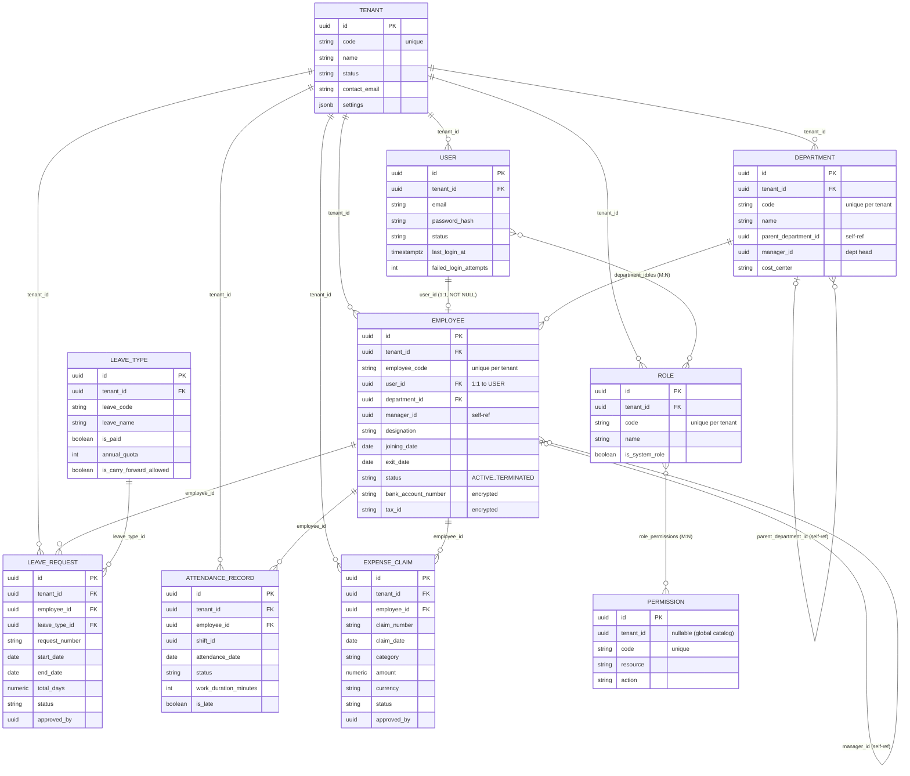

# Core Entity-Relationship Diagram (ERD)

> **Representative core ERD.** NU-AURA has **331 distinct tables** across **344**
> `CREATE TABLE` statements (Flyway `V0`–`V304`). The diagram below shows only the
> ~10 hub entities and their key relationships — it is **not** all 331 tables.
> Columns shown were sampled from real `CREATE TABLE` statements in
> `backend/src/main/resources/db/migration/V0__init.sql`; no column names were
> invented. See [[Schema]] for the full table-group breakdown and the RLS model.

## Purpose

Give a legible mental model of the NU-AURA core schema — how `tenant`,
`employee`, `user`, `role`, `permission`, `department`, `attendance`, `leave`,
and `expense` relate — so designers and implementers can reason about joins,
ownership, and tenancy without reading 293 migration files. Companion to
[[Schema]] (technology, RLS, conventions) and [[Data-Flows]] (runtime tenancy).

## Context

Every entity below is **tenant-scoped** via a `tenant_id UUID` column (except the
global `permissions` catalog and the `tenants` table itself). `employee` is the
hub of the HR domain; `user` is the auth/identity hub linked 1:1 to `employee`;
`role`/`permission` form the RBAC backbone shared across [[Nu-HRMS]],
[[Nu-Hire]], [[Nu-Grow]], and [[Nu-Fluence]] on the [[Shared-Platform]] core.

## Dependencies

- [[Schema]] — DB technology, multi-tenant RLS, indexing, migration strategy.
- [[Migrations]] — Flyway index; baseline `V0__init.sql` defines all core tables.
- [[Roles]] · [[Permissions]] · [[RBAC-Matrix]] — the authz model built on
  `roles`, `permissions`, `role_permissions`, `user_roles`.
- [[Data-Flows]] — how `tenant_id` GUC is set per request to make RLS bind.

## Diagram



### Payroll cluster

A second hub worth modelling explicitly: payroll runs and per-employee records.
Verified against `PayrollRun.java` and `EmployeePayrollRecord.java`.
`EmployeePayrollRecord` has a real `@ManyToOne` (LAZY) to `GlobalPayrollRun`
(`payroll_run_id`, NOT NULL); employee/department links are **denormalized**
(UUID + name columns) for run-time immutability. Amounts are stored in both local
and base currency with the captured `exchange_rate`.

```mermaid
erDiagram
    TENANT ||--o{ PAYROLL_RUN : "tenant_id"
    TENANT ||--o{ GLOBAL_PAYROLL_RUN : "tenant_id"
    GLOBAL_PAYROLL_RUN ||--o{ EMPLOYEE_PAYROLL_RECORD : "payroll_run_id (ManyToOne)"
    EMPLOYEE ..o{ EMPLOYEE_PAYROLL_RECORD : "employee_id (denormalized)"

    PAYROLL_RUN {
        uuid id PK
        uuid tenant_id FK
        int payPeriodMonth "unique w/ year+tenant"
        int payPeriodYear
        date payrollDate
        enum status "DRAFT->PROCESSING->PROCESSED->APPROVED->LOCKED"
    }
    EMPLOYEE_PAYROLL_RECORD {
        uuid id PK
        uuid tenant_id FK
        uuid payroll_run_id FK
        uuid employee_id
        string local_currency
        decimal gross_pay_local
        decimal net_pay_local
        decimal exchange_rate
        decimal net_pay_base
        enum status "PENDING..PAID"
    }
```

`PayrollRun` enforces a state machine in the entity (`markProcessing` →
`process` → `approve` → `lock`, with `markFailed` rollback), guarding against
duplicate submissions. See [[Schema]] for the payroll domain table cluster.

## Relationship / data-flow narrative

- **`tenant` is the root of every scope.** Each of the other eight entities
  carries `tenant_id UUID`, and PostgreSQL RLS filters by the per-request GUC
  `app.current_tenant_id` (see [[Schema]] and [[Data-Flows]]). The `tenant` table
  itself has a nullable `tenant_id`; `permission` rows can be global (nullable
  `tenant_id`) — the catalog is shared, allowed under RLS by `V263`.
- **`user` ↔ `employee` is 1:1.** `employee.user_id` is a `NOT NULL` FK to
  `user` (a real JPA `@OneToOne`). `user` is the identity/auth record (email,
  `password_hash`, lockout counters); `employee` is the HR profile (code,
  department, manager, encrypted bank/tax fields).
- **RBAC backbone (`user` → `role` → `permission`).** `user_roles` is an M:N
  join (composite PK `user_id, role_id`); `role_permissions` is an M:N join with
  a `scope` column. `permission` rows are addressed by `resource` + `action`.
  The runtime authorization model layered on top is in [[Roles]],
  [[Permissions]], and [[RBAC-Matrix]] — distinct from the DB-level tenant
  boundary enforced by RLS.
- **`department` and `employee` are self-referential.** `department.parent_department_id`
  builds the org tree; `employee.manager_id` builds the reporting line;
  `organization_unit.parent_id` builds a separate org-unit hierarchy. All are
  soft FK `UUID` columns rather than mapped associations. `employee` additionally
  carries **matrix-reporting** dotted-line managers
  (`dotted_line_manager1_id` / `dotted_line_manager2_id`, each with its own
  index) for informational secondary reporting lines.
- **`employee` is the HR hub.** Attendance, leave, and expenses all hang off
  `employee_id`. `attendance_record` is keyed `(employee_id, attendance_date)`;
  `leave_request` references both `employee_id` and `leave_type_id` and carries a
  `request_number`; `expense_claim` carries a `claim_number` (sequence allocated
  per tenant under RLS, `V269`) plus local + base `currency`/`amount`.
- **Approval columns are denormalized.** `approved_by` on `leave_request`,
  `attendance_record`, and `expense_claim` are `UUID` references to the approving
  user/employee, kept as plain columns for immutability of historical records.
- **Temporal integrity at the DB.** `V294` adds a GiST `EXCLUDE` constraint so an
  employee cannot have two overlapping approved `leave_request` ranges within a
  tenant.

## Related Links

- [[Schema]] — full schema, RLS model, domain table groups, indexes
- [[Migrations]] — Flyway migration index (`V0`–`V304`)
- [[Data-Flows]] — request lifecycle, auth flow, tenant-context → RLS binding
- [[Roles]] · [[Permissions]] · [[RBAC-Matrix]] — authorization model
- [[Services]] · [[APIs]] · [[Middleware]] — layers consuming this schema
- [[Security-Audit]] — RLS controls and historical cross-tenant findings
- [[System-Overview]] · [[C4-Container]] — system context
- [[Nu-HRMS]] · [[Nu-Hire]] · [[Nu-Grow]] · [[Nu-Fluence]] · [[Shared-Platform]]
- [[00-Home]] — vault index

## Risks

- **Representative, not exhaustive.** This ERD covers ~10 of 331 tables. Many
  relationships (payroll, benefits, recruitment, wiki, engagement) are omitted —
  consult [[Schema]] domain clusters and the relevant migration before designing
  cross-domain joins.
- **Soft FKs aren't enforced.** Several links (`manager_id`,
  `parent_department_id`, `approved_by`) are plain `UUID` columns without DB FK
  constraints; orphan references are possible and must be validated in the
  service layer ([[Services]]).
- **Tenant filtering depends on the GUC.** A row is only invisible cross-tenant
  because RLS reads `app.current_tenant_id`. If that GUC leaks across pooled
  connections (see the pooling caveat in [[Schema]] and [[Data-Flows]]), the ERD
  relationships could span tenants — a CRITICAL isolation risk.

## Operational Notes

- To verify a relationship before coding, grep the baseline:
  `grep -A40 "CREATE TABLE <name>" backend/src/main/resources/db/migration/V0__init.sql`.
  Tables added after `V0` live in their own `V<n>__*.sql` file — find them via
  [[Migrations]].
- Composite uniqueness is always tenant-scoped (e.g. `employee_code` is unique
  *per tenant*, not globally) — never assume a natural key is globally unique.
- `currency`/`amount` on `expense_claim` (and payroll records) are stored in both
  local and base currency; always read the `exchange_rate`/currency columns, do
  not assume a single currency.
