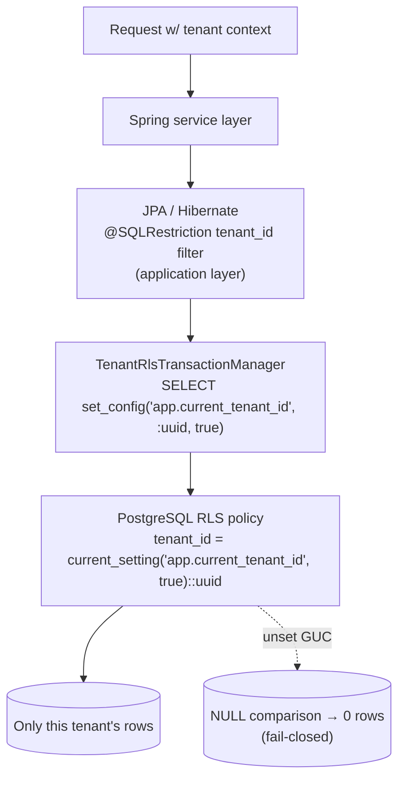

# Database Schema

> Evidence-based, current-state. Verified against
> `backend/src/main/resources/db/migration/` (Flyway `V0`–`V294`),
> [[Schema]], [[Migrations]], and
> [[Data-Flows]]. Sampled real `CREATE TABLE` statements from
> `V0__init.sql`. See [[ERD]] for the core entity-relationship diagram.

## Purpose

Describe how NU-AURA persists state: the database technology, the two-layer
multi-tenancy model (a `tenant_id` discriminator **plus** PostgreSQL Row-Level
Security), the domain table groupings, indexing conventions, and the Flyway
migration strategy. This is the source-of-truth companion to [[ERD]] and the
foundation under [[Services]], [[APIs]], and [[Data-Flows]].

## Context

NU-AURA is a single-database, multi-tenant SaaS platform serving four
sub-applications — [[Nu-HRMS]], [[Nu-Hire]], [[Nu-Grow]], and [[Nu-Fluence]] —
on a [[Shared-Platform]] core. Every tenant's data co-resides in the same
PostgreSQL schema (`public`), isolated by a `tenant_id` column and enforced at
the engine by RLS. The model is documented end-to-end in [[Data-Flows]] and
governed by the controls in [[Security-Audit]].

| Property | Value (verified) |
|----------|------------------|
| Engine | **PostgreSQL** — Neon (dev) / PostgreSQL 16 (prod) |
| Schema | single `public` schema, shared by all tenants |
| Migration tool | **Flyway**, versioned `V0__init.sql` → `V294` |
| Migration files on disk | **286** `V*.sql` files (numeric gaps from skipped/rolled-back versions) |
| Distinct tables | **330 distinct table names** across **341** `CREATE TABLE` statements (the prior "~331/343" counted one SQL-comment false positive; full list in [[Table-Index]]) |
| Baseline | `V0__init.sql` (~12,742-line baseline, "Generated from 244 JPA entities") |
| ID strategy | `UUID` PKs via `gen_random_uuid()` (`pgcrypto`) |
| Tenant discriminator | `tenant_id UUID` column on tenant-scoped tables |
| Engine isolation | PostgreSQL **Row-Level Security** + `NOBYPASSRLS` runtime role |

## Dependencies

- **Spring Data JPA / Hibernate 6.x** — entity mapping; `BaseEntity` and
  `TenantAware` superclasses inject the common audit + tenancy columns. **304
  `@Entity` classes** across 65 domain packages, **204 of them tenant-scoped**
  (extend `TenantAware`); the rest (e.g. `tenants`, lookup/join tables) extend
  `BaseEntity` directly.
- **Flyway** — applies `V0`–`V294` in order at boot; see [[Migrations]].
- **`pgcrypto`** extension — `gen_random_uuid()` (from `V0`).
- **`btree_gist`** extension — required by the leave-overlap `EXCLUDE` constraint
  (`V294`).
- **`TenantRlsTransactionManager`** — sets the per-transaction tenant GUC (see
  [[Middleware]] and [[Data-Flows]]).
- **`RlsStartupProbe`** — boot-time canary asserting fail-closed RLS.

## Diagram

### Two-layer multi-tenancy



Layer 1 (application) is a convenience filter; Layer 2 (RLS) is the
defence-in-depth boundary that holds even if a code path forgets to filter.

## Common column conventions

Every tenant-scoped table inherits the same audit + tenancy spine (verified in
`V0__init.sql`):

```text
id          UUID PRIMARY KEY DEFAULT gen_random_uuid()
tenant_id   UUID NOT NULL          -- discriminator (nullable on tenants, permissions)
created_at  TIMESTAMPTZ NOT NULL DEFAULT NOW()
updated_at  TIMESTAMPTZ NOT NULL DEFAULT NOW()
created_by  UUID
updated_by  UUID
version     BIGINT DEFAULT 0       -- optimistic locking
is_deleted  BOOLEAN NOT NULL DEFAULT FALSE  -- soft delete
```

Note: `tenants` itself carries a **nullable** `tenant_id`, and `permissions`
holds global catalog rows (nullable `tenant_id`) — RLS allows global rows via
`V263`.

### Mapped superclasses (`BaseEntity` / `TenantAware`)

These columns are not hand-written per table; they descend from two
`@MappedSuperclass` types in
`backend/src/main/java/com/nulogic/common/entity/`.

**`BaseEntity`** (`BaseEntity.java`) — identity, auditing, optimistic locking,
soft delete for **every** persistent type:

| Column | Java field | Notes |
|--------|-----------|-------|
| `id` | `UUID id` | `@GeneratedValue(strategy = UUID)`, `updatable=false` |
| `created_at` | `createdAt` | `@CreatedDate`, `updatable=false` |
| `updated_at` | `updatedAt` | `@LastModifiedDate` |
| `created_by` | `createdBy` | `@CreatedBy` (UUID), `updatable=false` |
| `updated_by` | `lastModifiedBy` | `@LastModifiedBy` (UUID) |
| `version` | `version` (Long) | `@Version` optimistic lock |
| `is_deleted` | `isDeleted` | `NOT NULL DEFAULT FALSE`; soft-delete flag |
| `deleted_at` | `deletedAt` | timestamp set by `softDelete()` |

Auditing is wired via `@EntityListeners(AuditingEntityListener.class)`.

**`TenantAware`** (`TenantAware.java`) — extends `BaseEntity` and adds the
tenancy discriminator:

```java
@Column(nullable = false, updatable = false)
private UUID tenantId;
```

`@EntityListeners(TenantEntityListener.class)` stamps `tenant_id` on insert. The
204 entities that extend `TenantAware` are the tenant-scoped tables.

**Soft delete** is enforced with Hibernate 6's `@SQLRestriction("is_deleted =
false")` (replacing the deprecated `@Where`), so every `SELECT` is silently
filtered to non-deleted rows. Verified on `Employee`, `Department`, `PayrollRun`,
`EmployeePayrollRecord`, `LeaveRequest`.

## Schema by domain

The ~65 domain packages under `com/nulogic/domain/` map to table clusters.
Representative groups (counts are table-name approximations, not exhaustive):

| Domain cluster | Representative tables | Sub-app |
|----------------|-----------------------|---------|
| **Tenant & access control** | `tenants`, `users`, `roles`, `permissions`, `role_permissions`, `user_roles` (M:N) | [[Shared-Platform]] |
| **Org & staffing** | `employees`, `departments`, `organization_units`, `positions`, `office_locations` | [[Nu-HRMS]] |
| **Attendance & time** | `attendance_records`, `attendance_time_entries`, `shift_assignments`, `rosters`, `comp_time_balances` | [[Nu-HRMS]] |
| **Leave** | `leave_requests`, `leave_types`, `leave_balances`, `restricted_holidays` | [[Nu-HRMS]] |
| **Payroll & comp** | `payroll_runs`, `global_payroll_runs`, `employee_payroll_records`, `payroll_components`, statutory (PF/ESI/TDS/LWF) | [[Nu-HRMS]] |
| **Expenses** | `expense_claims`, `expense_items`, mileage, benefit claims | [[Nu-HRMS]] |
| **Benefits & wellness** | `benefit_plans`, `benefit_enrollments`, `benefit_claims`, loans, wellness | [[Nu-HRMS]] / [[Nu-Grow]] |
| **Performance & dev** | `performance_review_cycles`, `performance_reviews`, `performance_goals`, feedback | [[Nu-Grow]] |
| **Recruitment & onboarding** | `applicants`, `candidates`, recruitment jobs, onboarding, probation | [[Nu-Hire]] |
| **Knowledge** | `wiki_spaces`, `wiki_pages`, `wiki_page_versions`, `blog_posts`, `document_templates` | [[Nu-Fluence]] |
| **Engagement** | `announcements`, `wall_posts`, recognition, surveys, pulse | [[Nu-Grow]] / [[Nu-Fluence]] |
| **Contract & legal** | `contracts`, `contract_templates`, eSign documents/recipients | [[Nu-Hire]] |
| **Compliance & audit** | `audit_logs`, statutory filing, background verification | [[Shared-Platform]] |
| **Project / PSA** | `projects`, `project_employees`, allocation requests | [[Nu-HRMS]] |
| **Integration** | `saml_identity_providers`, webhook config/events, notification templates | [[Shared-Platform]] |

## Key indexes & integrity patterns

- **Composite tenant-scoped uniqueness** — natural keys always include
  `tenant_id`: `employees(employee_code, tenant_id)` (`idx_employee_code_tenant`),
  `departments(code, tenant_id)`, `payroll_runs(tenant_id, pay_period_month,
  pay_period_year)`.
- **Tenant-prefixed hot-path indexes** — `idx_employee_tenant`,
  `idx_payroll_tenant`, `idx_payroll_status`.
- **Field-level encryption** — sensitive columns use a JPA `@Convert` with
  `EncryptedStringConverter`. On `employees`: `bank_account_number`,
  `bank_ifsc_code`, `tax_id`. **The full encryption inventory spans 10 entities**
  (employees, users `mfa_secret`, benefit_claims, benefit_dependents,
  preboarding_candidates, tax_declarations, payment_transactions, payment_configs,
  webhooks, integration_connector_configs) — and several PII columns are **plaintext**
  (PF `uan_number`/`pf_number`, ESI numbers, candidate `email`/`phone`/`resume_url`,
  `contract_signatures.signer_email`). Full inventory + gaps in [[Data-Dictionary]].
- **DB-level temporal integrity** — `V294__leave_overlap_exclusion_constraint.sql`
  uses `EXCLUDE USING GIST (tenant_id WITH =, employee_id WITH =, daterange WITH &&)`
  to prevent overlapping approved leave per employee (needs `btree_gist`).
- **Soft delete** — `is_deleted BOOLEAN` + Hibernate `@SQLRestriction` rather
  than physical deletes.

## Multi-tenant RLS model

RLS is the engine-enforced isolation boundary. Evolution (see [[Migrations]]):

| Migration | What it did |
|-----------|-------------|
| `V0__init.sql` | Baseline; some tables had RLS enabled with **no** policies (deny-by-default lockout) |
| `V24__fix_rls_policies.sql` | Fixed two defects: (A) 15 Fluence/Knowledge tables had `ENABLE ROW LEVEL SECURITY` with zero policies → locked out; (B) contract policies referenced a GUC the app never set. Both replaced with **permissive** `USING(true)` policies, deferring isolation to the app layer |
| `V36`–`V41`, `V65`, `V81`, `V90` | Per-domain RESTRICTIVE `<table>_tenant_rls` policies with a **graceful `OR NULL` fallback** (passed all rows when the GUC was unset) |
| `V177__strict_tenant_rls_policies.sql` | Dropped the leaky `OR NULL`/empty escape → strict `tenant_id = current_setting('app.current_tenant_id', true)::uuid`; unset GUC yields `NULL` → zero rows. Introduced **`nu_migration`** role (`BYPASSRLS`) so Flyway/operators run DDL across tenants; runtime role must **not** bypass RLS |
| `V254__enforce_runtime_rls_fail_closed.sql` | Reasserts **`NOBYPASSRLS`** on runtime role **`nu_app_rls`**; overlays a universal restrictive `rls_ctx_required_<hash>` policy on **every** public table with a UUID `tenant_id` (PostgreSQL ANDs all restrictive policies, so this overlays older leaky ones); applies `SECURITY INVOKER` on views. SuperAdmin bypass stays application-layer only — **no DB role exception** |
| `V255`, `V262` | Re-enforce RLS on late-added tenant tables |
| `V263` | Allow global catalog rows (nullable `tenant_id`) under RLS |
| `V269` | Allow tenant sequence allocators under RLS |

Policy expression patterns now in force:

```sql
-- Strict tenant match (V177)
USING (tenant_id = current_setting('app.current_tenant_id', true)::uuid)

-- Restrictive context-required overlay (V254): GUC must be non-empty AND match
USING (
  NULLIF(current_setting('app.current_tenant_id', true), '') IS NOT NULL
  AND tenant_id = current_setting('app.current_tenant_id', true)::uuid
)
```

The **`nu_app_rls`** runtime role is the keystone: it is `NOBYPASSRLS`, so an
unset/empty `app.current_tenant_id` GUC produces a `NULL` comparison and zero
visible rows — fail-closed by construction. The application layer is the
*primary* guard: `TenantContext` (a ThreadLocal `UUID`) is populated by
`TenantFilter` from the `X-Tenant-ID` header / JWT claim, every repository filters
by `tenant_id`, and `DataScopeService` adds per-user data-scope rules. RLS is
defence-in-depth beneath that. See [[Roles]], [[Permissions]], and
[[RBAC-Matrix]] for the *application-layer* authorization model that sits above
this DB-level tenant boundary.

## Flyway migration strategy

- **Versioning:** `V<n>__<slug>.sql`, applied in order from `V0__init.sql`
  (~12,742-line baseline) through `V294`. Numeric gaps are expected
  (skipped/rolled-back versions). The migration index lives in [[Migrations]].
- **Roles:** Flyway/DDL runs as **`nu_migration`** (`BYPASSRLS`); the runtime
  application connects as **`nu_app_rls`** (`NOBYPASSRLS`). These must remain
  separate — granting the runtime role `BYPASSRLS` would dissolve tenant
  isolation.
- **Extensions:** `pgcrypto` (`V0`), `btree_gist` (`V294`).
- **Checksum risk:** a large fraction of migrations were edited after
  introduction; treat the chain as append-only going forward.

## Key source files

| Concern | Path |
|---------|------|
| Audit/identity base | `backend/src/main/java/com/nulogic/common/entity/BaseEntity.java` |
| Tenant base | `backend/src/main/java/com/nulogic/common/entity/TenantAware.java` |
| Employee / Department | `backend/src/main/java/com/nulogic/domain/employee/{Employee,Department}.java` |
| Payroll | `backend/src/main/java/com/nulogic/domain/payroll/{PayrollRun,EmployeePayrollRecord}.java` |
| Leave | `backend/src/main/java/com/nulogic/domain/leave/LeaveRequest.java` |
| RLS startup canary | `backend/src/main/java/com/nulogic/common/security/RlsStartupProbe.java` |
| Schema baseline | `backend/src/main/resources/db/migration/V0__init.sql` |
| RLS hardening | `backend/src/main/resources/db/migration/{V24,V177,V254}__*.sql` |
| Leave overlap constraint | `backend/src/main/resources/db/migration/V294__leave_overlap_exclusion_constraint.sql` |

## Related Links

- [[ERD]] — core entity-relationship diagram + relationship narrative
- [[Table-Index]] — exhaustive list of all 330 tables, clustered by domain
- [[Migrations]] — Flyway migration index (`V0`–`V294`)
- [[Data-Flows]] — request lifecycle, auth flow, RLS tenant-context propagation
- [[Services]] · [[APIs]] · [[Middleware]] — layers that read/write this schema
- [[Roles]] · [[Permissions]] · [[RBAC-Matrix]] — application-layer authz
- [[Security-Audit]] — RLS controls and prior leak findings
- [[System-Overview]] · [[C4-Container]] — where the database sits in the stack
- [[Nu-HRMS]] · [[Nu-Hire]] · [[Nu-Grow]] · [[Nu-Fluence]] · [[Shared-Platform]]
- [[00-Home]] — vault index

## Risks

- **RLS-under-pooling caveat (CRITICAL).** Tenant context propagation has two
  modes (see [[Data-Flows]]): the preferred `TenantRlsTransactionManager` sets
  the GUC **transaction-local** (`set_config(..., true)` / `SET LOCAL`), which
  auto-reverts on commit/rollback and is safe under connection pooling. A
  secondary `getConnection()` path sets it **session-scoped**
  (`set_config(..., false)`) after a RESET. Session-scoped GUC on a pooled
  connection that is *not* reset on return risks leaking tenant context to the
  next borrower → cross-tenant read. Prior leaks (EmployeeService,
  ExpenseClaimService, MileageService) were fixed by switching to tx-local
  `true`; keep new code on the tx-local path.
- **Checksum drift** in the migration chain (many migrations edited
  post-introduction) — re-baselining requires care.
- **Single shared schema** — a missing `tenant_id` filter relies entirely on RLS
  as the backstop; never disable RLS on a tenant table.
- **`pgbouncer`/transaction-pooling mode** can break `SET` semantics — verify
  pool mode matches the tx-local GUC assumption.

## Operational Notes

- The runtime DB user **must** be `NOBYPASSRLS` (`nu_app_rls`). `RlsStartupProbe`
  opens a connection without setting `app.current_tenant_id` and asserts
  `SELECT COUNT(*) FROM employees` returns 0 — boot **fails** if a regression
  reintroduces a leaky policy.
- Run Flyway with `spring.flyway.user`/`spring.flyway.password` mapped to
  **`nu_migration`**; never reuse the runtime credentials for DDL.
- SuperAdmin cross-tenant access is **application-layer only** — there is no DB
  role exception, so SuperAdmin queries still flow through RLS with an explicit
  tenant GUC per request.
- When adding a tenant-scoped table: include `tenant_id UUID NOT NULL`, enable
  RLS, add the strict policy, and add the composite tenant-scoped unique/index.
  A follow-up `V<n>__reenforce_rls_*` migration (pattern of `V255`/`V262`) catches
  tables added without policies.
