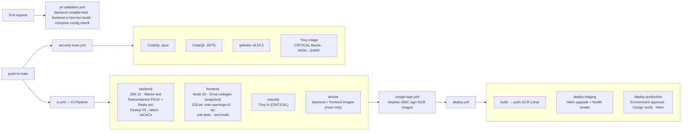

# CI-CD

> Part of the [[00-Home]] vault · DevOps section. Pairs with [[Deployment]] (what gets shipped)
> and [[Security-Audit]] (what the gates enforce).

## Purpose

Document the **GitHub Actions pipelines** that build, test, scan, sign, and deploy NU-AURA:
the six workflow files, the gates that block merge/deploy, and the supply-chain controls
(Trivy, CodeQL, gitleaks, Cosign). This is the contract every change must pass before it can
become a [[Deployment]] artifact.

## Context

- Six workflows live in `.github/workflows/`. `ci.yml` and `pr-validation.yml` trigger on
  push/PR to `main` and `develop`; `security-scan.yml` and `deploy.yml` target `main` only
  (plus weekly cron and `workflow_dispatch`).
- The **frontend build depends on Orval codegen** from a committed OpenAPI snapshot
  (`frontend/openapi-snapshot.json`), so the typed API client stays reproducible without a
  running backend — see [[APIs]].
- The **backend suite uses Testcontainers Postgres 16** and clean-applies the full Flyway
  chain (V0 → latest), plus a Redis service container. Architecture guards
  (`ArchUnit`, `RlsTenantGucScopeTest`) run inside the suite — see [[Test-Coverage]].
- Images are tagged by **git SHA**, **Cosign-signed**, and verified at admission by Kyverno;
  `:latest` is rejected cluster-side ([[Security-Audit]]).

## Dependencies

| Workflow file | `name:` | What it does |
|---------------|---------|--------------|
| `ci.yml` | **CI Pipeline** | `backend` (Maven build + test + JaCoCo, Testcontainers + Redis svc) · `frontend` (npm ci → Orval codegen → ESLint `--max-warnings=0` → `tsc` → unit tests → `next build`) · `security` (Trivy fs scan, CRITICAL) · `docker` (multi-stage backend + frontend builds, **push to `main` only**) |
| `pr-validation.yml` | **PR Validation** | `backend-validate` (compile + unit + JaCoCo) · `frontend-validate` (ci + lint + tsc + build) · `compose-validate` (`docker-compose config` check) — fast pre-merge gate |
| `security-scan.yml` | **Security Scan** | `codeql-java` + `codeql-js` (CodeQL) · `secret-scan` (gitleaks v8.24.3) · `container-scan` (Trivy CRITICAL gate + SARIF CRITICAL/HIGH) — `main` push + weekly |
| `deploy.yml` | **Deploy** | `build` (Docker build + push to GCR) · `deploy-staging` (Helm upgrade + `/actuator/health` smoke) · `deploy-production` (same, **GitHub Environment approval**); Cosign signature verified on both |
| `cosign-sign.yml` | **Cosign sign** | Keyless OIDC Cosign signing of backend + frontend GCR images; `workflow_dispatch` |
| `agent-os.yml` | **agent-os** | `test` job — Agent OS tests over `scripts/` (Node 20, mocked Claude) |

## Diagram

## Pipeline stages

1. **Validate (PR):** `pr-validation.yml` gives fast feedback — backend compile + unit,
   frontend lint/typecheck/build, and a `docker-compose config` sanity check.
2. **Build + test (main):** `ci.yml` runs the full backend suite (Testcontainers PG16,
   Flyway clean-apply, Redis service) and the frontend pipeline including Orval codegen,
   then builds both images on `main`.
3. **Security scan:** `security-scan.yml` runs CodeQL (Java + JS/TS), gitleaks, and a Trivy
   image scan — **CRITICAL fails the build**, HIGH is reported as SARIF.
4. **Sign:** `cosign-sign.yml` signs the GCR images via keyless OIDC.
5. **Deploy:** `deploy.yml` pushes SHA-tagged images, Helm-upgrades **staging**, runs a
   health smoke, then promotes to **production** behind a GitHub Environment approval gate.

## Security gates (block merge / deploy)

| Gate | Where | Behavior |
|------|-------|----------|
| Backend suite green | `ci.yml` / `pr-validation.yml` | Testcontainers PG16, Flyway V0→V304 clean-apply (293 migration files), Redis svc |
| Frontend quality | `ci.yml` / `pr-validation.yml` | ESLint `--max-warnings=0`, `tsc`, unit tests, `next build` |
| Architecture guards | inside test suite | `ArchUnit`, `RlsTenantGucScopeTest` (blocks session-scoped GUC writes) |
| Trivy (filesystem) | `ci.yml` security job | CRITICAL findings |
| Trivy (image) | `security-scan.yml` | **CRITICAL blocks** (exit 1); HIGH → SARIF |
| CodeQL | `security-scan.yml` | Java + JS/TS → Security tab |
| gitleaks | `security-scan.yml` | Any secret match fails |
| Cosign verify | `deploy.yml` + Kyverno admission | Unsigned / `:latest` images rejected |

## Orval codegen step

The frontend client is **generated, not hand-written**: `npm` runs Orval against
`frontend/openapi-snapshot.json` (a committed snapshot of the backend OpenAPI contract)
during both `ci.yml` and `frontend/Dockerfile`. This keeps the typed client reproducible in
CI and in the image build without needing a live backend, and makes API drift visible as a
codegen diff. See [[APIs]] for the endpoint surface this client wraps.

## Related Links

- [[Deployment]] — the images and environments these pipelines target.
- [[Security-Audit]] — defense-in-depth, supply chain, prod-gate the gates enforce.
- [[Production-Support]] · [[Incident-Response]] — what to do post-deploy / on failure.
- [[Test-Coverage]] · [[QA-Strategy]] — the suites the CI gate runs.
- [[APIs]] — the OpenAPI contract Orval consumes.

## Risks

| Risk | Evidence / status |
|------|-------------------|
| **`deploy.yml` long-lived `GCP_SA_KEY` (D-2)** | 3 sites; `id-token: write` present but unused. Needs a GCP WIF pool. Not blind-editable (deploy-only path; CI won't catch a bad rewrite). |
| **Trivy fs job non-blocking in `ci.yml`** | The hard CRITICAL gate is the **image** scan in `security-scan.yml`; the `ci.yml` `security` job is the lighter fs pass. |
| **Snapshot OpenAPI can drift** | Orval consumes a committed snapshot; a backend contract change that isn't re-snapshotted ships a stale client until regenerated. |
| **Some E2E `test.skip()` are conditional** | Per `DEPLOY_READINESS_REPORT.md` (T-2): ~33 conditional skips; some integration on H2 not PG16. |

## Operational Notes

- Reference doc in repo: `docs/runbooks/ci-workflows.md` is **referenced** by `docs-v2`
  but the `docs/runbooks/` directory is **not present on disk** (templated/aspirational —
  see [[Production-Support]] note).
- Release discipline: ship from a **frozen, tagged SHA** with both `ci.yml` and
  `security-scan.yml` green on that exact commit; no autonomous process committing to `main`
  during the release window (`DEPLOY_READINESS_REPORT.md` gate B1/B2).
- CI must pin **JDK 21**; local JaCoCo can crash on newer JDK forks (run with
  `-Djacoco.skip=true` if forced onto JDK 23) — recorded in project memory.
