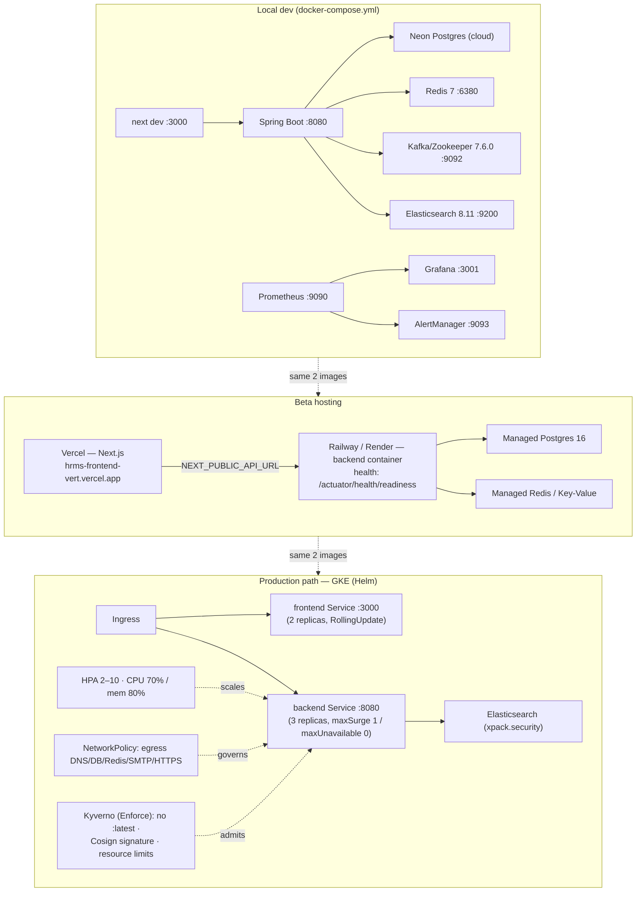

# Deployment

> Part of the [[00-Home]] knowledge vault · DevOps section.
> Companion docs: [[CI-CD]] · [[Production-Support]] · [[Incident-Response]] · [[Security-Audit]].

## Purpose

Describe **how NU-AURA is packaged and deployed** across its three runtime shapes — local
Docker Compose, beta (Vercel frontend + a hosted backend), and the GKE/Helm production
path. Two container images (backend, frontend) run in every shape; only the data plane and
hardening flags differ. Use this page to understand the deployment topology before changing
anything in `infra/` or the container builds. For the build/test pipeline that produces
these images, see [[CI-CD]].

## Context

- **Frontend:** Next.js 16 (App Router) standalone output → Vercel (beta, live at
  `hrms-frontend-vert.vercel.app`, auto-deploy on `main`) or a container in GKE.
- **Backend:** Spring Boot 3.5.14 / Java 21 fat-jar in a Temurin 21 JRE image.
- **Data plane:** PostgreSQL 16 (Neon dev / RLS-enforced prod), Redis 7, Kafka
  (Confluent 7.6.0), Elasticsearch 8.11. See [[Schema]] and [[Services]].
- **Hosting per memory:** **Railway** (backend) + **Vercel** (frontend) is the live full
  stack; a **Render** blueprint (`render.yaml`) is also committed as an alternate one-step
  backend host. The **GKE/Helm** manifests in `infra/` are the production-grade path.
- Ports are fixed by convention: **frontend 3000, backend 8080** (Grafana takes :3001).

> Evidence reconciliation: `docs-v2/architecture/infrastructure.md` §5 describes the
> frontend image as `node:20-alpine`, but the committed `frontend/Dockerfile` uses
> `node:26-alpine`. The Dockerfile on disk is authoritative; the doc text lags. Flagged so a
> reader does not trust the stale line. The backend `Dockerfile` is pinned to Temurin 21.

## Dependencies

| Area | Source of truth (in repo) |
|------|---------------------------|
| Compose data plane | `docker-compose.yml`, `docker-compose.override.yml` |
| Prod hardening (local) | `docker-compose.prod.yml` (PG16 + `nu_app_rls` init, secured ES, no exposed data ports, `RLS_PROBE_FAIL_ON_BYPASS=true`) |
| Backend image | `Dockerfile` (multi-stage Maven → Temurin 21 JRE, non-root `hrms:1001`, render socat readiness proxy) |
| Frontend image | `frontend/Dockerfile` (3-stage `node:26-alpine`, Orval codegen from `openapi-snapshot.json`, non-root `nextjs:1001`) |
| Render blueprint | `render.yaml` (Postgres 16, Key-Value Redis, backend + frontend Docker services) |
| K8s manifests | `infra/deployment/kubernetes/` |
| Helm chart | `infra/deployment/helm/hrms/` (Chart v1.0.0, appVersion 2.5.0, kubeVersion ≥ 1.27) |
| Admission policy | `infra/deployment/kyverno/` |
| GCP build/deploy | `infra/deployment/cloudbuild.yaml`, `infra/deployment/deploy.sh`, `infra/deployment/app.yaml` |
| Env contract | `infra/deployment/config/.env.example`, `infra/deployment/config/.env.production` |

## Diagram

## Environments

| Environment | Frontend | Backend | Data plane |
|-------------|----------|---------|------------|
| Local dev | `next dev` :3000 | Spring Boot :8080 | Compose: Redis 7 (:6380), Kafka/ZK 7.6.0, ES 8.11, Prometheus 2.53, Grafana 11.2 (:3001), AlertManager 0.27; **Postgres on Neon cloud** (no local PG by default) |
| Beta | Vercel (auto-deploy on `main`) | Railway/Render container, readiness `/actuator/health/readiness` | Managed Postgres 16 + Redis/Key-Value; free-tier: **no Elasticsearch** (search falls back to Postgres), 512 MB heap, `APP_SCHEDULING_ENABLED=false` |
| Production path | GKE (Helm) | GKE (Helm) | PG 16 (`nu_app_rls` NOBYPASSRLS), Redis, ES with `xpack.security` |

## Container images

| Image | Base | Notes |
|-------|------|-------|
| Backend (`Dockerfile`) | `maven:3.9-eclipse-temurin-21-alpine` → `eclipse-temurin:21-jre-alpine` | Non-root `hrms:1001`; G1GC via `JAVA_TOOL_OPTIONS`; socat readiness proxy + `SPRING_PROFILES_ACTIVE=render` for Render |
| Frontend (`frontend/Dockerfile`) | `node:26-alpine` (deps → builder → runner) | Standalone Next output; **Orval client generated from `openapi-snapshot.json` at build**; non-root `nextjs:1001`; API URL baked per environment |

## Kubernetes topology (production path)

- **Manifests** (`infra/deployment/kubernetes/`): `namespace.yaml`, backend/frontend
  `deployment.yaml` + `service.yaml`, `ingress.yaml`, `hpa.yaml`, `network-policy.yaml`,
  `configmap.yaml`, `secrets.yaml`(+`.example`), `elasticsearch-deployment.yaml`/`-service.yaml`.
- **Helm** (`infra/deployment/helm/hrms/`): `values.yaml` + `values-staging.yaml` +
  `values-prod.yaml`; templates for backend/frontend deployments, `hpa.yaml`,
  `ingress.yaml`, `networkpolicy.yaml`, `pdb.yaml` (minAvailable 1), `rollout.yaml`
  (Argo canary), `serviceaccount.yaml`.
- **Probes:** backend startup probe up to **300 s** (cold JVM); readiness 30 s initial /
  5 s period; liveness 120 s initial; graceful shutdown 60 s (`server.shutdown=graceful`).
- **Admission (Kyverno, Enforce):** `disallow-latest-tag.yaml`,
  `require-image-signature.yaml` (Cosign), `require-resource-limits.yaml`. See [[Security-Audit]].

## Environment variable inventory (names only — never values)

Sourced from `infra/deployment/config/.env.example`, `render.yaml`, and the K8s
ConfigMap/Secret. Listed by category; **no secret values are reproduced**.

| Category | Variable names |
|----------|----------------|
| App profile / flags | `SPRING_PROFILES_ACTIVE`, `APP_SCHEDULING_ENABLED`, `APP_CORS_ALLOWED_ORIGINS`, `RLS_PROBE_FAIL_ON_BYPASS`, `FRONTEND_URL`, `DEMO_CREDENTIALS_ENABLED` |
| Datasource (pooled) | `SPRING_DATASOURCE_URL`, `SPRING_DATASOURCE_USERNAME`, `SPRING_DATASOURCE_PASSWORD`, `DB_HOST`, `DB_PORT`, `DB_NAME`, `DB_USERNAME`, `DB_PASSWORD` |
| Flyway (direct endpoint) | `FLYWAY_URL`, `FLYWAY_USER`, `FLYWAY_PASSWORD` |
| Neon dev | `NEON_JDBC_URL`, `NEON_DB_USERNAME`, `NEON_DB_PASSWORD` |
| Postgres container | `POSTGRES_USER`, `POSTGRES_PASSWORD`, `POSTGRES_DB` |
| Redis | `REDIS_HOST`, `REDIS_PORT`, `REDIS_PASSWORD`, `SPRING_REDIS_PASSWORD`, `DEV_REDIS_HOST`, `DEV_REDIS_PORT` |
| Kafka | `KAFKA_BOOTSTRAP_SERVERS`, `KAFKA_TOPIC_PREFIX` |
| Elasticsearch | `ELASTIC_PASSWORD` |
| Auth / crypto | `JWT_SECRET`, `JWT_EXPIRATION`, `APP_SECURITY_ENCRYPTION_KEY` |
| Google OAuth / Drive | `GOOGLE_CLIENT_ID`, `GOOGLE_CLIENT_SECRET`, `NEXT_PUBLIC_GOOGLE_CLIENT_ID`, `GOOGLE_DRIVE_ROOT_FOLDER_ID`, `GOOGLE_DRIVE_CREDENTIALS_FILE` (`GOOGLE_DRIVE_CREDENTIALS_PATH` in render contract), `APP_STORAGE_PROVIDER` |
| Slack / webhooks | `APP_SLACK_SIGNING_SECRET` |
| Mail | `MAIL_USERNAME`, `MAIL_PASSWORD` |
| Storage (legacy MinIO) | `MINIO_ENDPOINT`, `MINIO_ACCESS_KEY`, `MINIO_SECRET_KEY`, `MINIO_BUCKET`, `MINIO_ROOT_USER`, `MINIO_ROOT_PASSWORD` |
| Observability | `PROMETHEUS_SCRAPE_TOKEN`, `GRAFANA_ADMIN_PASSWORD` |
| JVM | `JAVA_TOOL_OPTIONS` |
| AI (optional) | `OPENAI_API_KEY`, `OPENAI_BASE_URL`, `OPENAI_MODEL` |
| Frontend (`NEXT_PUBLIC_*`) | `NEXT_PUBLIC_API_URL`, `NEXT_PUBLIC_ENABLE_WEBSOCKET`, `NEXT_PUBLIC_DEMO_MODE`, `NEXT_PUBLIC_PAYMENTS_ENABLED` |

## Secrets management

- Runtime secrets come **only** from the environment — K8s Secrets, Railway/Render env, or
  Vercel env (`sync:false`). `.env.example` documents required **names**; no value is in
  the repo. `gitleaks` runs per commit and in CI as the enforcement backstop ([[CI-CD]]).
- Flyway and the application intentionally use **different DB URLs** (direct vs pooled) —
  see [[Schema]] and `docs-v2/architecture/data.md` §6.
- K8s `configmap.yaml` carries non-secret config; Helm values inject per-environment diffs.

## Related Links

- [[CI-CD]] — the pipeline that builds, scans, signs, and ships these images.
- [[Production-Support]] — operating the deployed system (health, scaling, jobs).
- [[Incident-Response]] — rollback and failure response.
- [[Security-Audit]] — Kyverno/Cosign supply chain, secrets, prod-gate.
- [[C4-Container]] · [[System-Overview]] — what the containers contain.
- [[Services]] · [[Schema]] · [[Data-Flows]] — runtime dependencies.

## Risks

| Risk | Evidence / status |
|------|-------------------|
| **Backend public host gated on creds (B3)** | `DEPLOY_READINESS_REPORT.md` — full stack proven locally; public backend URL needs cloud creds. |
| **`deploy.yml` uses long-lived `GCP_SA_KEY` (D-2)** | Despite `id-token: write`; needs a GCP WIF pool. Not blind-editable (runs only at deploy). |
| **Frontend image base drift in docs** | `frontend/Dockerfile` is `node:26-alpine`; `docs-v2` text says `node:20`. Dockerfile is authoritative. |
| **Free-tier beta loses Elasticsearch + schedulers** | Search falls back to Postgres; `APP_SCHEDULING_ENABLED=false` so accruals/emails/webhooks do not fire on beta. |

## Operational Notes

- Local bring-up: `./scripts/dev/start-dev.sh` (compose data plane + apps);
  `./scripts/dev/stop-dev.sh` to stop. Ports 3000/8080 are fixed.
- When **two environments share one database** (beta + local), enable scheduling in exactly
  one to avoid duplicate side effects — see [[Production-Support]] §scheduled jobs.
- Production deploy is **frozen-SHA discipline**: ship from a tagged, frozen commit with CI
  green; the prod gate requires `SPRING_PROFILES_ACTIVE=prod`,
  `DEMO_CREDENTIALS_ENABLED=false`, and Flyway ≥ V270 (`docs/HANDOVER-DEPLOY.md`).
