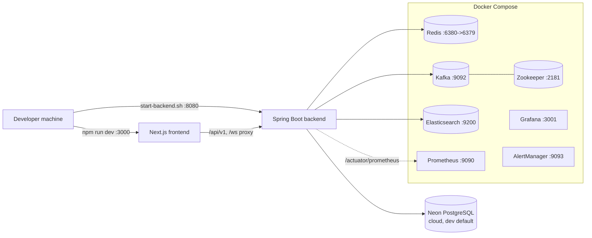

# Local-Setup

> Part of the [[00-Home]] knowledge vault · DevOps section.
> Companion docs: [[CI-CD]] (what the pipeline runs) · [[Deployment]] (what gets shipped).

## Purpose

Get a developer from a fresh clone to a running NU-AURA stack: backend on **:8080**,
frontend on **:3000**, and the infrastructure dependencies (Redis, Kafka, Elasticsearch)
in Docker.

In local dev the **backend and frontend run natively** (Maven / Node), while **only the
infra services run in Docker**. The `backend` / `frontend` Docker services exist but are
gated behind the `app` profile and are not used for normal day-to-day development.

> Evidence: `docker-compose.yml`, `backend/start-backend.sh`, `frontend/start-frontend.sh`,
> `backend/Dockerfile`, `backend/pom.xml`, `frontend/package.json`.

---

## 1. Prerequisites

| Tool             | Version                                                     | Source of truth                                                                                    |
|------------------|------------------------------------------------------------|----------------------------------------------------------------------------------------------------|
| Java (JDK)       | **21**                                                     | `backend/pom.xml` (`<java.version>21</java.version>`); `backend/Dockerfile` (`eclipse-temurin-21`) |
| Maven            | 3.x                                                       | `backend/Dockerfile` (`maven:3-eclipse-temurin-21`)                                                |
| Node.js          | 20+ (engines not pinned in `package.json`; CI uses Node 20) | `frontend/package.json`                                                                            |
| npm              | bundled with Node                                         | `frontend/package.json` scripts                                                                    |
| Docker + Compose | recent                                                    | `docker-compose.yml`                                                                               |
| PostgreSQL       | dev uses **Neon** (cloud) by default; local PG 16 optional | `docker-compose.yml` (comment: "postgres service removed — using Neon DB")                         |

Notes:

- The dev datasource defaults to **Neon cloud PostgreSQL**. The `docker-compose.yml` has
  **no local postgres service**; the backend reads `NEON_JDBC_URL` / `NEON_DB_USERNAME` /
  `NEON_DB_PASSWORD`.
- If you prefer a local Postgres 16 instead of Neon, `backend/setup-db.sh` provisions a local
  `hrms_dev` database (user `hrms_user`). You must then point `SPRING_DATASOURCE_URL` at it.
- File storage uses **Google Drive** (no MinIO). Drive credentials are optional in local dev —
  the backend falls back to a mock storage provider when absent.

---

## 2. Architecture at a glance



### Port map

| Service        | Host port | Notes                                                  | Source |
|----------------|-----------|--------------------------------------------------------|--------|
| Frontend       | 3000      | Next.js dev server; killed/reclaimed by start script   | `frontend/start-frontend.sh` |
| Backend        | 8080      | Spring Boot; start script kills any stale 8080 process | `backend/start-backend.sh`, `application.yml` (`port: ${PORT:8080}`) |
| Redis          | 6380→6379 | Mapped to 6380 to avoid clashing with a local Redis    | `docker-compose.yml` |
| Kafka (broker) | 9092      | `PLAINTEXT_HOST` listener for host access              | `docker-compose.yml` |
| Kafka (JMX)    | 9101      | —                                                      | `docker-compose.yml` |
| Zookeeper      | 2181      | Kafka coordination                                     | `docker-compose.yml` |
| Elasticsearch  | 9200      | Single-node, `xpack.security` disabled for dev         | `docker-compose.yml` |
| Prometheus     | 9090      | Scrapes backend `/actuator/prometheus`                 | `docker-compose.yml` |
| Grafana        | 3001      | 3000 is owned by the frontend dev server               | `docker-compose.yml` |
| AlertManager   | 9093      | —                                                      | `docker-compose.yml` |

---

## 3. Start the infrastructure (Docker)

From the repo root. The infra services are the **default** compose services (backend/frontend
are behind the `app` profile, so a plain `up` does not start them):

```bash
docker-compose up -d redis zookeeper kafka elasticsearch
```

To also bring up the monitoring stack:

```bash
docker-compose up -d prometheus grafana alertmanager
```

Required env (compose fails fast if unset — see `docker-compose.yml`):

- `REDIS_PASSWORD` — Redis auth (used by both the `redis` service and the backend).
- `GRAFANA_ADMIN_PASSWORD` — required only if you start `grafana` (fails closed; no `admin` default).

All services bind to `127.0.0.1` and join the `hrms_network` bridge. Each has a healthcheck;
the `backend`/`frontend` app-profile containers wait for `redis`, `kafka`, and `elasticsearch`
to be healthy before starting.

To run the **full stack in containers instead of natively** (rarely needed in dev):

```bash
docker-compose --profile app up -d
```

---

## 4. Environment variables

Copy the template and fill it in (the start scripts auto-source `../.env`):

```bash
cp .env.example .env
```

> Both `backend/start-backend.sh` and `frontend/start-frontend.sh` source the project-root
> `.env` (falling back to `backend/.env` / `frontend/.env.local`).

### Backend (required)

These have **no default** — startup aborts if missing (`backend/start-backend.sh` `:?` guards;
`docker-compose.yml` `:?` guards):

| Variable                      | Purpose                                              |
|-------------------------------|------------------------------------------------------|
| `JWT_SECRET`                  | JWT signing key (validated for entropy at startup)   |
| `SPRING_DATASOURCE_URL`       | JDBC URL (Neon or local PG)                          |
| `SPRING_DATASOURCE_USERNAME`  | DB user                                              |
| `SPRING_DATASOURCE_PASSWORD`  | DB password                                          |
| `APP_SECURITY_ENCRYPTION_KEY` | 32-byte key for field-level encryption              |

When using docker-compose for the backend, the Neon-specific aliases are required instead:
`NEON_JDBC_URL`, `NEON_DB_USERNAME`, `NEON_DB_PASSWORD`, plus `REDIS_PASSWORD`
(`docker-compose.yml` backend service).

### Backend (defaulted in `start-backend.sh` — override as needed)

| Variable                          | Default                                                             |
|-----------------------------------|--------------------------------------------------------------------|
| `SPRING_PROFILES_ACTIVE`          | `dev`                                                              |
| `SPRING_REDIS_HOST`               | `localhost`                                                        |
| `SPRING_REDIS_PORT`               | `6379` (native run) — note Docker maps host **6380**              |
| `FRONTEND_URL`                    | `http://localhost:3000`                                            |
| `COOKIE_SECURE`                   | `false` (HTTP in dev)                                              |
| `CSRF_ENABLED`                    | `false` (relaxed for local testing)                               |
| `APP_CORS_ALLOWED_ORIGINS`        | `http://localhost:3000,http://localhost:3001,http://localhost:8080` |
| `SPRING_FLYWAY_URL/USER/PASSWORD` | fall back to the datasource values (use a direct, non-pooler endpoint with a migration-owner role on Neon) |
| `OPENAI_API_KEY` / `OPENAI_BASE_URL` / `OPENAI_MODEL` | optional LLM config (defaults to a Groq endpoint) |

> Running on native port 6379 vs Docker's host port 6380: when the backend runs natively
> against the dockerized Redis, set `SPRING_REDIS_PORT=6380` in your `.env`, or run a local
> Redis on 6379.

### Frontend (`frontend/lib/config/env.ts`, Zod-validated)

| Variable                       | Required | Default / behavior                                   |
|--------------------------------|----------|------------------------------------------------------|
| `NEXT_PUBLIC_API_URL`          | yes      | dev fallback `http://localhost:8080/api/v1`; must not be loopback/placeholder when `NODE_ENV=production` |
| `NEXT_PUBLIC_GOOGLE_CLIENT_ID` | no       | enables Google OAuth; warns if unset                 |
| `NEXT_PUBLIC_ENABLE_WEBSOCKET` | no       | `true` (empty string → `true`)                       |
| `NEXT_PUBLIC_DEMO_MODE`        | no       | `false` (empty string → `false`)                     |
| `NODE_ENV`                     | no       | `development`                                         |

The WebSocket URL is derived from `NEXT_PUBLIC_API_URL` (strips `/api/v1`, swaps `http`→`ws`).

---

## 5. Run the backend (:8080)

The repo bundles three internal Maven artifacts (sources not in git). The Dockerfile installs
them; for a native build you may need them in your local `~/.m2` once (`backend/Dockerfile`,
`infra/mvn-local-deps/`):

```bash
mvn install:install-file -Dfile=infra/mvn-local-deps/nulogic-platform-1.0.0.pom \
  -DgroupId=com.nulogic -DartifactId=nulogic-platform -Dversion=1.0.0 -Dpackaging=pom
mvn install:install-file -Dfile=infra/mvn-local-deps/common-module-1.0.0.jar \
  -DpomFile=infra/mvn-local-deps/common-module-1.0.0.pom
mvn install:install-file -Dfile=infra/mvn-local-deps/pm-module-1.0.0.jar \
  -DpomFile=infra/mvn-local-deps/pm-module-1.0.0.pom
```

Then start it via the helper script (recommended — it loads `.env`, validates required vars,
frees port 8080, builds the jar if missing, and runs a crash watchdog):

```bash
cd backend
./start-backend.sh
```

What the script does (`backend/start-backend.sh`):

- Sources `../.env`, asserts `JWT_SECRET`, `SPRING_DATASOURCE_*`, `APP_SECURITY_ENCRYPTION_KEY`.
- Defaults `SPRING_PROFILES_ACTIVE=dev`, Flyway URL/user/password from the datasource.
- Kills any process on **8080**.
- Builds `target/hrms-backend-1.0.0.jar` with `mvn clean package -DskipTests` if it does not exist.
- Launches with `-Xmx1536m -Xms256m` and auto-restarts on macOS OOM (exit 137).

Flyway runs migrations on boot (`backend/src/main/resources/db/migration/`, `application.yml`
`flyway.enabled: ${FLYWAY_ENABLED:true}`). On Neon, use a direct (non-pooler) endpoint and a
migration-owner role for Flyway — the script warns if runtime and Flyway use the same role.

Health checks once up:

- `http://localhost:8080/actuator/health/liveness`
- `http://localhost:8080/actuator/health/readiness`

---

## 6. Run the frontend (:3000)

```bash
cd frontend
npm install
npm run dev          # next dev --webpack on port 3000
```

Or use the helper (loads `.env`, frees port 3000, caps Node heap to 3 GB to avoid macOS OOM
during compilation) — `frontend/start-frontend.sh`:

```bash
cd frontend
./start-frontend.sh
```

The generated API client (Orval) is gitignored. If you need to regenerate it from the OpenAPI
spec:

```bash
npm run api:generate   # orval --config ./orval.config.ts
```

---

## 7. Build and test commands

### Backend (Maven — `backend/pom.xml`, `backend/Dockerfile`)

```bash
cd backend
mvn clean compile -DskipTests        # compile only
mvn clean package -DskipTests        # build the runnable jar (Docker uses -Dmaven.test.skip=true)
mvn test                             # run tests (uses Testcontainers; needs Docker)
mvn spring-boot:run                  # dev run with devtools hot reload
```

- Integration tests use **Testcontainers** (Postgres 16 spun up per test run), so the Docker
  daemon must be reachable.
- The `test` Spring profile exists (`application-test.yml`) for CI/test runs.

### Frontend (npm — `frontend/package.json`)

```bash
cd frontend
npm run dev            # dev server (port 3000)
npm run build          # production build (next build --webpack; runs prebuild env validation)
npm run start          # serve the production build
npm run lint           # eslint . --max-warnings=0
npm run test           # vitest (watch)
npm run test:run       # vitest run (one-shot)
npm run test:coverage  # vitest run --coverage
npm run test:e2e       # playwright
```

`npm run build` runs a `prebuild` step (`scripts/validate-release-env.mjs`) that validates
release env before building.

---

## 8. Spring profiles

| Profile  | File                     | Use                                                |
|----------|--------------------------|----------------------------------------------------|
| `dev`    | `application-dev.yml`    | local development (default for `start-backend.sh`) |
| `test`   | `application-test.yml`   | automated tests / CI                               |
| `prod`   | `application-prod.yml`   | hardened production (Kubernetes)                   |
| `render` | `application-render.yml` | Render/Railway hosting (Dockerfile default)        |
| `demo`   | `application-demo.yml`   | seeded demo data                                   |

Base config lives in `application.yml`. The production Docker image defaults to
`SPRING_PROFILES_ACTIVE=render` and `RLS_PROBE_FAIL_ON_BYPASS=true` (`backend/Dockerfile`).

See [[Deployment]] for how these profiles map to hosted environments and [[CI-CD]] for the
profile used by automated tests.

---

## 9. Quick start (TL;DR)

```bash
# 0. one-time: install internal Maven artifacts (see §5)
cp .env.example .env                 # then fill in JWT_SECRET, DB, REDIS_PASSWORD, encryption key

# 1. infra
docker-compose up -d redis zookeeper kafka elasticsearch

# 2. backend (terminal A)
cd backend && ./start-backend.sh     # http://localhost:8080

# 3. frontend (terminal B)
cd frontend && npm install && npm run dev   # http://localhost:3000
```

Verify: `curl http://localhost:8080/actuator/health/liveness` returns `UP`, and the frontend
loads at `http://localhost:3000`.

---

## Related

- [[00-Home]] — vault entry point
- [[CI-CD]] — the pipeline that runs the build/test commands above
- [[Deployment]] — how local profiles map to hosted (Railway / Vercel / GKE) environments
