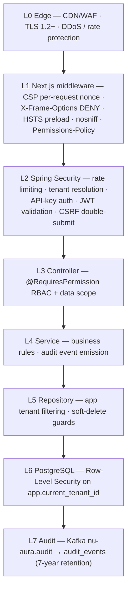

# Security-Audit

> Part of the [[00-Home]] vault · Security section. Architectural source:
> `docs-v2/architecture/security.md`. Cross-reference [[RBAC-Matrix]], [[Roles]],
> [[Permissions]], [[Middleware]], [[Data-Flows]].

## Purpose

Provide a **security assessment of NU-AURA**: the defense-in-depth layers, authentication
and authorization controls, OWASP coverage, the public-vs-sensitive endpoint split, secrets
handling, multi-tenant isolation, the known findings with remediation status, and the
residual risks plus the **deploy-gate checklist**. This is the architectural security view;
scan ownership and cadence live in `docs/security/baseline.md`.

## Context

Four crown jewels drive the design: **tenant isolation**, **PII / compensation data**,
**authentication credentials**, and **audit-trail integrity**. Controls are layered from the
edge to the database row, so a miss at one layer is caught at the next. The single most
existential asset is tenant isolation — a cross-tenant leak is always treated as SEV-1
([[Incident-Response]]).

## Dependencies

- **Backend:** Spring Security filter chain, `@RequiresPermission` RBAC, `DataScopeService`,
  `TenantContext` + `TenantRlsTransactionManager`, `TokenBlacklistService`,
  `AccountLockoutService`, Bucket4j + Redis Lua rate limiter.
- **Frontend:** Next.js middleware (CSP nonce, OWASP headers) — see [[Middleware]].
- **Database:** PostgreSQL Row-Level Security on `app.current_tenant_id`; `nu_app_rls`
  NOBYPASSRLS role in prod — see [[Schema]] and [[Data-Flows]].
- **CI gates:** `RlsTenantGucScopeTest`, CodeQL, gitleaks, Trivy, Cosign/Kyverno — see [[CI-CD]].

## Diagram

## Authentication controls

- **Mechanisms:** password (policy **12+ chars**, complexity, **history 5**, **90-day** max
  age), Google OAuth 2.0, per-tenant SAML2 SSO
  (`DynamicSamlRelyingPartyRegistrationRepository`), TOTP MFA (secret AES-encrypted at rest).
- **Tokens:** JJWT 0.12.6 HS256, env `JWT_SECRET` (quarterly rotation). JWT in an
  **httpOnly + Secure + SameSite cookie**, carries **roles only** — permissions load from DB
  via the Redis permission cache, so permission changes apply without re-login.
- **Lifecycle:** 24 h access token · 30-day rotated refresh. `TokenBlacklistService` (Redis +
  in-memory fallback) revokes on logout/rotation; `AccountLockoutService` enforces **5 fails
  / 15 min**. GDPR-anonymized accounts are rejected at both login and SSO.
- **Machine auth:** `X-API-Key` for `/api/v1/external/**`; scoped keys stored hashed.

## Authorization / RBAC enforcement

- **9 canonical roles** (SUPER_ADMIN, TENANT_ADMIN, HR_ADMIN, MANAGER, EMPLOYEE, RECRUITER,
  FINANCE, SYSTEM_ADMIN, + HR sub-roles) plus per-tenant custom roles — see [[Roles]].
- **500+ `MODULE:ACTION` permissions** enforced at controllers via `@RequiresPermission`;
  denials log actor/resource/action at WARN — see [[Permissions]] and [[RBAC-Matrix]].
- **Data scope:** ALL / LOCATION / DEPARTMENT / TEAM / SELF / CUSTOM evaluated by
  `DataScopeService` — an **empty scope returns zero rows**, never a SELF fallback.
- **SUPER_ADMIN** is the only cross-tenant principal; impersonation leaves an audit trail.
- **Drift control:** nightly RBAC drift detector + the Playwright RBAC sweep
  (`frontend/nu-rbac.config.ts`) checks every route × role in CI — see [[QA-Strategy]].

## Public vs sensitive endpoints

| Class | Examples | Control |
|-------|----------|---------|
| Public (`permitAll`) | login/auth, health/readiness, OpenAPI/Swagger, webhook receivers, career/public pages | No auth; webhooks are **HMAC signature-verified** (Slack/DocuSign bind raw signed `String`, so `@Valid` is N/A) |
| Machine | `/api/v1/external/**` | `X-API-Key` (hashed, scoped) |
| Authenticated | all product endpoints | JWT cookie + CSRF header + `@RequiresPermission` + data scope + RLS |

> `H-2` finding (`DEPLOY_READINESS_REPORT.md`): of 458 controller body-bindings, **456 carry
> `@Valid`**; the 2 without (`SlackCommandController`, `DocuSignController`) bind raw
> signature-verified webhook strings where `@Valid` does not apply. **Closed.**

## Multi-tenant isolation

1. Application: `TenantContext` ThreadLocal, propagated to async / Kafka / scheduled paths.
2. Transaction: `SET LOCAL app.current_tenant_id` per tx (`TenantRlsTransactionManager`).
3. Database: RLS policies; prod runs as `nu_app_rls` (no `BYPASSRLS`) with
   `RLS_PROBE_FAIL_ON_BYPASS=true` refusing startup on a bypass-capable role.
4. Build guard: `RlsTenantGucScopeTest` blocks session-scoped GUC writes.
5. Cache keys, rate-limit buckets, and Elasticsearch queries are all tenant-prefixed.
6. Nightly cross-tenant query detector pages on any hit.

## OWASP coverage & abuse controls

| Control | Configuration |
|---------|---------------|
| Rate limits | auth **5/min** · API **100/min** · exports **5/5 min** · wall 30/min; per-IP/user/tenant (Bucket4j + Redis Lua) |
| Account lockout | 5 failed / 15-min window |
| CSRF | double-submit cookie (`XSRF-TOKEN` readable + `X-XSRF-TOKEN` header) |
| XSS | DOMPurify client-side · CSP nonce · no raw `dangerouslySetInnerHTML` |
| SQL injection | JPA parameter binding; native queries reviewed + soft-delete guarded |
| Upload safety | Apache Tika content-type verification; OCR parsing isolated |
| Bulk import | `CellValueSanitizer` neutralizes spreadsheet formula injection |
| SSRF / redirects | outbound integrations use allowlisted endpoints |
| Export exfiltration | alert on exports > 1k rows |
| Crypto | BCrypt-12 · HS256 JWT · AES-256-GCM PII fields (KMS-wrapped per-tenant DEK) · HMAC-SHA256 webhooks · SHA-256 export stamps · TLS 1.2+ |

## Secrets handling

- Runtime secrets come from environment only (K8s Secrets / Railway/Render env / Vercel
  `sync:false`); none in the repo. **Names** are documented in `.env.example` — see
  [[Deployment]] env inventory.
- **gitleaks** runs per commit and in CI as the enforcement backstop ([[CI-CD]]).
- Flyway and the app use different DB URLs (direct vs pooled) by design.

## Known findings & remediation status

| Finding | Status | Evidence |
|---------|--------|----------|
| **Cross-tenant IDORs** (statutory contribution, wall reactions/comments, wall replies) | ✅ Fixed | Project memory IDOR sweep 2026-06-15; pattern scan confirms other areas clean |
| **RLS leak under pooled connections** (session-scoped `set_config(...,false)`) | ✅ Fixed | **Commit `0ea63f6e`** switched to tx-local `true`; added `RlsTenantGucScopeTest` build-guard; lone allowlisted `false` path RESETs on checkout |
| **`Welcome@123` demo seed creds** | ✅ Mitigated | Neutralized by **V270** (suspend + hash-lock) when `DEMO_CREDENTIALS_ENABLED=false`; prod gate enforces it |
| **Spring Boot 3.4.x CVEs** | ✅ Closed | `pom.xml` → **3.5.14**; container CVEs remediated |
| **Dockerfile JDK/Node drift** | ✅ Closed | Backend pinned Temurin 21; Dependabot bumps to 25/26 correctly fail PR-validation |
| virus-scan fail-open / `__Host-` cookie / 17 missing `@Valid` | ✅ Closed (prod) | `application-prod.yml`; H-2 remediated (456/458) |

## Residual risks & deploy-gate checklist

**Residual risks** (`DEPLOY_READINESS_REPORT.md`):

- **B3** — backend not publicly hosted; live cross-role E2E + NOBYPASSRLS-live RLS proof
  pending creds (proven locally, not on a public host).
- **D-2** — `deploy.yml` long-lived `GCP_SA_KEY`; migrate to GCP WIF.
- **T-3** — NOBYPASSRLS live RLS test is CI-only (static `RlsTenantGucScopeTest` guard present).
- Audit records survive GDPR erasure (legal-hold carve-out); PII inside event descriptions
  is the documented residual under legal review.

**Production deploy gate — all must hold before go-live:**

- [ ] `SPRING_PROFILES_ACTIVE=prod`
- [ ] **`DEMO_CREDENTIALS_ENABLED=false`**
- [ ] Flyway at **V270 or later** (neutralizes `Welcome@123` seeds)
- [ ] App connects as **`nu_app_rls`** (NOBYPASSRLS) with `RLS_PROBE_FAIL_ON_BYPASS=true`
- [ ] CI green on the exact frozen SHA — both `ci.yml` and `security-scan.yml`
- [ ] Trivy CRITICAL gate green · 0 CRITICAL vulns · images Cosign-signed
- [ ] Prod hardening: `virusscan.fail-open=false`, `__Host-` cookie prefix on
- [ ] Post-deploy health verification before traffic ramp

> Checklist source: `docs/HANDOVER-DEPLOY.md` + `docs-v2/operations.md` §2.

## Related Links

- [[RBAC-Matrix]] · [[Roles]] · [[Permissions]] — authorization model.
- [[Middleware]] — CSP nonce + OWASP headers at the edge.
- [[Data-Flows]] · [[Schema]] — auth flow + RLS tenancy mechanics.
- [[CI-CD]] — gitleaks / CodeQL / Trivy / Cosign gates.
- [[Deployment]] — secrets injection + Kyverno admission.
- [[Incident-Response]] — tenant-leak SEV-1 response.

## Risks

See **Residual risks & deploy-gate checklist** above — B3, D-2, T-3, and the GDPR
legal-hold PII carve-out are the open items; all code-level findings are closed or mitigated.

## Operational Notes

- Compliance posture: GDPR DSR (Art. 15/17/20) compliant with 30-day SLA tooling; Indian
  DPDP compliant; **SOC 2 Type II in progress**; ISO 27001 on roadmap.
- Vulnerability cadence: Critical patched ≤24 h, High ≤7 d, Medium ≤30 d, Low quarterly;
  pinned CVE patches recorded in `pom.xml` (Tomcat 10.1.55, Netty 4.1.133, PG driver
  42.7.11, BouncyCastle 1.84, commons-io 2.18.0, lz4 1.8.1).
- Audit: every write on regulated entities → `nu-aura.audit` (10 partitions) → 7-year store;
  auth-audit 1 year; app logs 90 days.
