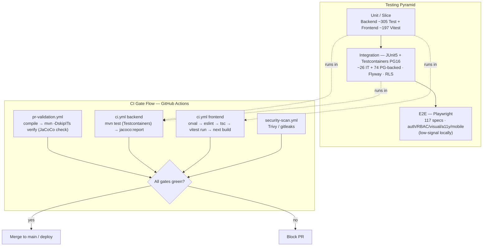

# QA Strategy

## Purpose

Describe how NU-AURA verifies correctness across the stack: the testing pyramid, the
backend strategy ([[Nu-HRMS]] core, JUnit 5 + Testcontainers + the RLS build-guard), the
frontend strategy (Vitest unit + Playwright e2e), test data and fixtures, [[CI-CD]]
integration, coverage targets, and the machine-specific caveats that shape *where* signal
actually comes from. The measured inventory lives in [[Test-Coverage]]; this note is the
*strategy*, that note is the *snapshot*.

## Context

NU-AURA is a multi-tenant bundle platform ([[System-Overview]]) spanning four sub-apps
([[Nu-HRMS]], [[Nu-Hire]], [[Nu-Grow]], [[Nu-Fluence]]) over a Spring Boot 3.5.14 / Java 21
backend and a Next.js 16 / React 19 frontend. The highest-risk property is **tenant
isolation** — enforced at the DB via PostgreSQL Row-Level Security ([[Security-Audit]],
[[RBAC-Matrix]]) — so the test strategy weights tenant-scope and RBAC-boundary verification
heavily, and pins integration tests to **real PostgreSQL 16 via Testcontainers** rather than
H2 so RLS, GUCs, and Flyway migrations behave as in production.

Two realities shape the strategy and are stated up front:

- **Coverage targets are aspirational, not met.** The org standard is **80%** line
  coverage. Backend JaCoCo line coverage is **~0.19** per the cached report cited in
  `backend/pom.xml` (target `0.80` is the backlog goal T3-15, floor raised as coverage
  rises). Frontend Vitest thresholds are configured at **60%** (`frontend/vitest.config.ts`),
  not 80%. Treat 80% as the destination, not the current state.
- **Playwright is low-signal on the primary dev machine** (per `MEMORY.md`): `next dev`
  cold-compile of a fresh route takes 30–60s, which is why `playwright.config.ts` bumps the
  per-test timeout to 120s. The trustworthy signal on this machine is the **backend suite +
  browser-driven manual QA against the :8080 backend**, not local Playwright.

## Dependencies

| Layer | Tooling | Evidence |
|-------|---------|----------|
| Backend unit/slice/integration | JUnit 5 (Jupiter), Spring Boot Test, AssertJ, Mockito | 316 files reference `org.junit.jupiter` |
| Backend integration DB | **Testcontainers** PostgreSQL 16, `AbstractPostgresIntegrationTest` | 74 tests extend the abstract base; `@DynamicPropertySource` wiring |
| RLS regression guard | `RlsTenantGucScopeTest` (static source scan), `RlsStartupProbeTest` | `backend/src/test/java/com/nulogic/architecture/` |
| Frontend unit/component | **Vitest 3** + `@vitejs/plugin-react`, jsdom, Testing Library | `frontend/vitest.config.ts`, `vitest.setup.ts` |
| Frontend coverage | `@vitest/coverage-v8` | `frontend/package.json` devDeps |
| Frontend e2e/visual/a11y | **Playwright** (Chromium + Firefox), screenshots, traces, video | `frontend/playwright*.config.ts` |
| CI orchestration | GitHub Actions | `.github/workflows/{ci,pr-validation}.yml` |
| Coverage report | JaCoCo (backend), v8 text/json/html (frontend) | `backend/pom.xml`, `vitest.config.ts` |

Profiles: the `test` Spring profile (`application-test.yml`) drives CI/test runs; a Redis
service container at `localhost:6379` matches `application-test` defaults.

## Diagram

## Backend Strategy

- **Frameworks:** JUnit 5 + Spring Boot Test, Mockito for collaborators, AssertJ for
  assertions. Controller slices live under `backend/src/test/java/com/nulogic/api/**`
  mirroring the production package tree (`api/employee/controller`, `api/expense/controller`,
  `api/auth/controller`, …).
- **Integration on real Postgres:** integration tests extend
  `AbstractPostgresIntegrationTest` (74 subclasses) which spins a **PostgreSQL 16
  Testcontainer** per session and wires datasource props via `@DynamicPropertySource`. This
  exercises **Flyway migrations**, **RLS policies**, and GUC-scoped tenant context exactly as
  prod does. See [[Middleware]] and [[Services]] for the components under test.
- **RLS build-guard:** `RlsTenantGucScopeTest` is a *static source scanner* that fails the
  build if any service sets `set_config('app.current_tenant_id', ?, false)` (session-scoped,
  leaks across pooled connections) instead of the transaction-local `true`. It is the
  regression fence for the 2026-06-07 cross-tenant leak (EmployeeService / ExpenseClaimService
  / MileageService) — see [[Security-Audit]]. `RlsStartupProbeTest` complements it at boot.
- **Tenant + RBAC suites:** dedicated tenant-isolation and RBAC-boundary suites verify the
  9-role model ([[RBAC-Matrix]]); the green-flag audit confirmed **zero unguarded mutating
  endpoints** across 183 `@RestController` files (1,750 `@RequiresPermission` annotations).

## Frontend Strategy

- **Vitest unit/component:** jsdom environment, globals on, `vitest.setup.ts` preloaded;
  includes `**/*.test.{ts,tsx}` and `**/*.spec.{ts,tsx}`, excludes `e2e/`, `node_modules/`,
  `.next/`. Component tests sit beside source (`components/ui/Button.test.tsx`), store/util
  tests under `lib/` ([[Components]]), and cross-cutting flow tests under
  `frontend/__tests__/integration/` (approval, compensation, employee, payroll, leave,
  notification, auth flows).
- **Playwright e2e:** `testDir: ./e2e`, Chromium + Firefox, shared auth state
  (`auth.setup.ts`), screenshot-on-failure, video + trace, and **visual regression**
  (`*.spec.ts-snapshots/`, `toHaveScreenshot` maxDiffPixels 500). Subfolders cover
  `accessibility/`, `edge-cases/`, `mobile/`, and `pages/`. Variants:
  `playwright.live.config.ts` and `playwright.production.config.ts` target deployed
  environments ([[Deployment]]). See [[Pages]] for routes exercised.

## Test Data / Fixtures

- **Seeded demo roles:** six role credentials are seeded/documented for QA (the `demo`
  profile, `application-demo.yml`). Note the **FINANCE_ADMIN gap (QA-2)** — no FINANCE_ADMIN
  user is seeded, so the payroll permission boundary is unverified.
- **Frontend fixtures:** `frontend/e2e/fixtures/` and `frontend/e2e/utils/` provide shared
  auth state, page objects, and helpers; `frontend/e2e/generated/` holds generated specs.
- **API typing:** Vitest/tsc/build consume an **Orval-generated client** regenerated from a
  committed `openapi-snapshot.json` (refreshed via backend `OpenApiSpecExportIT`) — keeping
  frontend contract tests in sync with [[APIs]].

## Related Links

[[00-Home]] · [[Test-Coverage]] · [[CI-CD]] · [[Deployment]] · [[System-Overview]] ·
[[APIs]] · [[Services]] · [[Middleware]] · [[Components]] · [[Pages]] · [[Security-Audit]] ·
[[RBAC-Matrix]] · [[Production-Support]] · [[Nu-HRMS]] · [[Nu-Hire]] · [[Nu-Grow]] ·
[[Nu-Fluence]]

## Risks

- **Coverage well below the 80% standard.** Backend JaCoCo ~0.19 line coverage; frontend
  Vitest gated at 60%. The 80% target is a backlog goal, not a met bar. Breadth (many test
  files) ≠ depth (lines exercised).
- **Local Playwright is low-signal** (cold-compile timeouts); CI is the e2e proof of record.
  ~10 e2e specs contain `test.skip`/`fixme`, and the readiness report notes ~33 conditional
  `test.skip()` historically.
- **Testcontainers needs Docker.** Backend `mvn test`/`verify` fails locally when the Docker
  daemon (colima socket) is misconfigured — a dangling `/var/run/docker.sock` is the known
  gotcha (`MEMORY.md`); CI provides the authoritative run.
- **RLS NOBYPASSRLS-live test is CI-only / static.** `RlsTenantGucScopeTest` is a source
  scan; a live NOBYPASSRLS run still needs the `nu_app_rls` role ([[Security-Audit]],
  [DEPLOY_READINESS_REPORT](../../DEPLOY_READINESS_REPORT.md)).
- **Unguarded permission boundaries:** FINANCE_ADMIN (QA-2) seeding gap leaves a payroll
  permission boundary untested.

## Operational Notes

- **Backend:** `mvn test` (Testcontainers; needs Docker) · `mvn -DskipITs verify` (PR gate,
  runs JaCoCo check) · `mvn jacoco:report -pl .` (coverage HTML).
- **Frontend:** `npm run test:run` (one-shot Vitest) · `npm run test:coverage` ·
  `npm run test:e2e` (Playwright) · `npm run test:e2e:production` (deployed target).
- **Ports are fixed:** frontend 3000, backend 8080 (`MEMORY.md`). Manual browser QA against
  :8080 is the high-signal path on the primary dev machine.
- **CI gates** (`ci.yml`): backend `mvn test` → `jacoco:report` (artifact upload); frontend
  `orval → eslint → tsc --noEmit → vitest run → next build` (both tsc and build raised to a
  4GB Node heap for app scale). `pr-validation.yml` runs `mvn -DskipITs verify` so the JaCoCo
  `check` goal gates PRs while keeping ITs out of the fast path.
