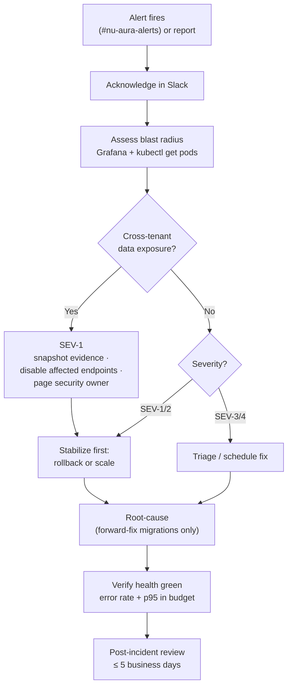

# Incident-Response

> Part of the [[00-Home]] vault · Runbooks section. Standing playbook source:
> `docs-v2/operations.md` §5. Pairs with [[Production-Support]] and [[Security-Audit]].

## Purpose

The **incident-response playbook** for NU-AURA: severity levels, the triage flow, rollback
procedure, the cross-tenant-leak (SEV-1) response, secret rotation, on-call escalation, and
post-incident review. For routine health/monitoring, see [[Production-Support]].

> **Evidence note:** the procedural depth below is **derived from `docs-v2/operations.md` and
> the infra/security evidence** and is **templated** where the repo lacks a formal runbook —
> `docs-v2/operations.md` indexes `docs/runbooks/incident-response.md`, `rollback.md`, and
> `disaster-recovery.md`, but the `docs/runbooks/` directory is **not present on disk** in
> this checkout. Facts (gates, RLS model, alert names, RPO/RTO) are evidence-backed; specific
> step-by-step commands should be confirmed against the restored runbooks before use.

## Context

- Alert ingress is **Slack `#nu-aura-alerts`** via AlertManager.
- The existential asset is **tenant isolation** — any suspected cross-tenant exposure is
  SEV-1 regardless of blast radius ([[Security-Audit]]).
- Database changes are **forward-fix only** — Flyway migrations are never reverted in place;
  rollback acts on the **application/Helm** layer.
- Frozen-SHA release discipline means a known-good prior revision always exists to roll to.

## Dependencies

| Concern | Source |
|---------|--------|
| Alerts / dashboards | AlertManager → Slack; Grafana :3001 ([[Production-Support]]) |
| Rollback surface | Helm revisions / `kubectl`; `infra/deployment/helm/hrms/` |
| Tenant-leak controls | RLS `nu_app_rls`, `RlsTenantGucScopeTest`, nightly cross-tenant detector ([[Security-Audit]]) |
| Secret rotation | env-injected secrets; quarterly key-rotation cadence |
| Deploy gate | `docs/HANDOVER-DEPLOY.md`, `docs-v2/operations.md` §2 |

## Severity levels

| Sev | Definition | Examples | Response |
|-----|------------|----------|----------|
| **SEV-1** | Existential / data exposure | Cross-tenant data leak; auth bypass; total outage (`ApplicationDown`) | Page security owner; snapshot evidence; disable affected endpoints |
| **SEV-2** | Major degradation | `HighErrorRate`, `HighAPILatency` p95>2s, `DatabaseConnectionPoolLow`, payroll delayed | Stabilize (rollback/scale) then root-cause |
| **SEV-3** | Partial / single-feature | One module failing, Kafka DLT backlog, webhook delivery failures | Triage in business hours |
| **SEV-4** | Low impact | `LowActiveUsers`, `HighRateLimitExceeded` info alerts | Track / review |

## Diagram

## Standing playbook (from `docs-v2/operations.md` §5)

1. **Acknowledge** in Slack; assess blast radius via Grafana + `kubectl get pods`.
2. If **cross-tenant data exposure** is suspected: treat as **SEV-1**, snapshot evidence,
   disable affected endpoints, page the security owner — tenant isolation is existential.
3. **Stabilize** (rollback or scale) **before** root-causing; forward-fix migrations only.
4. **Post-incident:** timeline + root cause + follow-ups within **5 business days**.

## Rollback procedure

- **Decision tree + execution:** `docs/runbooks/rollback.md`* — Helm revision rollback
  (`helm rollback <release> <revision>` / `kubectl rollout undo`).
- Roll back to the last **frozen, CI-green SHA** (tags like `rc-2026-06-08-frozen` exist).
- **Database:** never revert a Flyway migration in place — forward-fix with a new migration.
  Verify Flyway stays **≥ V299** so demo-credential neutralization (V270 + V299 re-apply
  for Railway) is not undone.
- Post-rollback: confirm `/actuator/health/readiness` `UP`, error rate and p95 back inside
  alert thresholds for the soak window, then ramp traffic.

## RLS / tenant-leak response (SEV-1)

1. Declare SEV-1; snapshot evidence (logs, affected `tenant_id`s, query traces) before changing state.
2. Disable the affected endpoint(s); page the security owner.
3. Verify the RLS posture: app must run as **`nu_app_rls`** (NOBYPASSRLS) with
   `RLS_PROBE_FAIL_ON_BYPASS=true`. A bypass-capable role in prod is itself the incident.
4. Check the nightly **cross-tenant query detector** and `RlsTenantGucScopeTest` history for
   the regression window.
5. Contain → forward-fix → add/confirm a guard test so the leak class cannot recur
   (this is how IDOR sweep + commit `0ea63f6e` were closed — see [[Security-Audit]]).

## Secret rotation

- Secrets are **env-injected** (K8s Secrets / Railway/Render / Vercel) — rotate at source,
  redeploy; nothing lives in the repo. `gitleaks` is the leak backstop ([[CI-CD]]).
- **Quarterly** rotation for `JWT_SECRET`, field-encryption DEKs, and webhook HMAC secrets
  (`docs/runbooks/key-rotation.md`*).
- On suspected exposure: rotate immediately, invalidate sessions via `TokenBlacklistService`,
  and sweep the codebase for similar exposure (per global security response protocol).

## On-call escalation

1. **On-call engineer** acknowledges in `#nu-aura-alerts`.
2. **Security owner** paged on any SEV-1 / suspected tenant exposure / auth bypass.
3. **DB/platform owner** for `DatabaseConnectionPoolLow`, migration, or GKE-level issues.
4. Business owner looped in for DR-class events (single-region GKE, no multi-region yet).

## Post-incident

- Within **5 business days**: timeline, root cause, and tracked follow-ups (postmortem
  conventions in `docs/runbooks/`*).
- Convert every novel failure into a **guard** (test, alert, or admission policy) so the
  class is caught next time — the project's closure pattern for IDOR, RLS-leak, and CVEs.

## Related Links

- [[Production-Support]] — health checks, alerts, scaling, scheduled jobs.
- [[Ruflo-Autopilot-Hazard]] — process risk: autonomous autopilot commits to main; blocks frozen-SHA release gating.
- [[Security-Audit]] — RLS model, deploy gate, known-finding closures.
- [[Deployment]] — Helm rollback surface, env/secret injection.
- [[CI-CD]] — frozen-SHA gate, gitleaks, security scans.
- [[Data-Flows]] · [[Schema]] — tenancy mechanics for leak triage.

## Risks

| Risk | Note |
|------|------|
| Formal runbooks absent | `docs/runbooks/` not on disk; confirm exact commands before executing a real rollback. |
| Single-region GKE | No multi-region/DR; a region loss is RTO 4 h, not instant failover. |
| NOBYPASSRLS only CI-proven | Live RLS isolation is CI-guarded (`RlsTenantGucScopeTest`), not yet proven on a public host. |
| Forward-fix-only DB | No in-place migration revert — a bad migration needs a new corrective one, increasing MTTR for data-shape bugs. |

## Operational Notes

- Recovery targets: **RPO 1 h** (hourly WAL + 30-min Redis snapshots), **RTO 4 h**; DR drill
  quarterly (first Wednesday). Redis is rebuildable — prioritize Postgres + Drive in DR.
- The `ApplicationDown` critical alert (`up{job="hrms-backend"}==0` for 1 m) is the primary
  outage trigger; `PayrollProcessingDelayed` is the key business-job alert.
