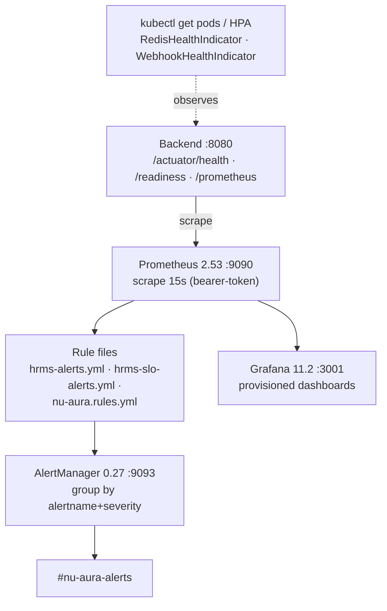

# Production-Support

> Part of the [[00-Home]] vault · Runbooks section. Operational map:
> `docs-v2/operations.md`. Pairs with [[Incident-Response]] and [[Deployment]].

## Purpose

The day-to-day **operations runbook** for a running NU-AURA stack: how to verify health,
where to watch metrics and alerts, which scheduled jobs matter, how to scale, and the
backup/restore and routine-task references. For failures and rollback, jump to
[[Incident-Response]].

## Context

- **Ports (fixed):** frontend **3000**, backend **8080**, Prometheus 9090, Grafana 3001,
  AlertManager 9093, Redis 6380, Kafka 9092, Elasticsearch 9200.
- **Entry points:** beta frontend `https://hrms-frontend-vert.vercel.app`; local backend
  Swagger at `http://localhost:8080/swagger-ui.html`.
- Local bring-up: `./scripts/dev/start-dev.sh` / `./scripts/dev/stop-dev.sh`.
- Deployment shapes and env inventory are in [[Deployment]]; security controls in
  [[Security-Audit]].

## Dependencies

| Concern | Source of truth |
|---------|-----------------|
| Health indicators | Actuator + `ApplicationHealthIndicator`, `DatabaseHealthIndicator`, `RedisHealthIndicator`, `WebhookHealthIndicator` |
| Metrics/alerts | `infra/monitoring/prometheus/`, `infra/monitoring/alertmanager/alertmanager.yml`, `infra/monitoring/grafana/` |
| Compose monitoring stack | `infra/monitoring/docker-compose.yml` |
| Scaling | `infra/deployment/helm/hrms/` (HPA, PDB), K8s `hpa.yaml` |
| Recovery objectives | `docs-v2/operations.md` §3 |

## Diagram

## Health checks

| Check | Endpoint / indicator | Healthy signal |
|-------|----------------------|----------------|
| Liveness | `/actuator/health/liveness` | `UP` |
| Readiness | `/actuator/health/readiness` | `UP` (Render + K8s gate on this) |
| Aggregate | `/actuator/health` | `{"status":"UP", database:UP, redis:UP}` |
| Redis | `RedisHealthIndicator` | PING ok + memory + latency within bounds |
| Database | `DatabaseHealthIndicator` / built-in `db` | connection valid |
| Disk | built-in `diskSpace` | > 1 GB free |
| Webhooks | `WebhookHealthIndicator` | delivery path healthy |
| Metrics | `/actuator/prometheus` | scrapeable (bearer `PROMETHEUS_SCRAPE_TOKEN`) |

K8s startup probe tolerates a **300 s** cold JVM; graceful shutdown is 60 s.

## Monitoring (Prometheus / Grafana / AlertManager)

- **Pipeline:** backend `/actuator/prometheus` → Prometheus (15 s scrape, bearer-token) →
  rule files → AlertManager (group by `alertname`+`severity`, wait 30 s, interval 5 m,
  repeat 12 h) → Slack `#nu-aura-alerts`. Grafana provisioned read-only on :3001
  (anonymous + signup disabled; `GRAFANA_ADMIN_PASSWORD` fail-closed, no default).
- **Dashboards:** `hrms-overview.json`, `hrms-api-metrics.json`, `hrms-business-metrics.json`,
  `hrms-webhooks.json`, `nu-aura-api.json`.
- **Domain metrics to watch:** `api_errors_total`, `auth_login_total{status}`,
  `rate_limit_exceeded_total`, `active_users`, `payroll_processed_total`, plus HikariCP,
  JVM, Kafka consumer, and cache metrics.

| Alert | Condition | Severity |
|-------|-----------|----------|
| ApplicationDown | `up{job="hrms-backend"} == 0` for 1 m | critical |
| HighErrorRate | error rate > 5% over 5 m | warning |
| HighAPILatency | p95 > 2 s over 5 m | warning |
| DatabaseConnectionPoolLow | Hikari active/max > 0.8 for 5 m | warning |
| HighMemoryUsage | JVM heap > 85% for 5 m | warning |
| HighFailedLoginRate | failed logins > 0.1/s over 5 m | warning |
| HighRateLimitExceeded | rejections > 0.5/s over 5 m | info |
| LowActiveUsers | `active_users < 5` for 10 m | info |
| PayrollProcessingDelayed | no payroll in 24 h window (2 h hold) | warning |

## Scheduled jobs to watch

- **25 `@Scheduled` jobs**, all **ShedLock-guarded**; global kill switch
  **`APP_SCHEDULING_ENABLED`**. Domains: attendance/biometric, contracts, email,
  notifications, recruitment, workflows, reports, webhooks, rate limiting, leave accrual,
  tenant operations.
- **Multi-env hazard:** when beta + local share one database, enable scheduling in **exactly
  one** environment, or you get duplicate emails/accruals/webhooks.
- **First diagnostic for "job didn't run":** payroll, accrual, and biometric jobs log lock
  acquisition — absence of those log lines is the tell.

## Common operational tasks

| Task | Cadence | Reference (in `docs/runbooks/`*) |
|------|---------|----------------------------------|
| Key rotation (JWT, field-encryption DEKs, webhook HMAC) | Quarterly | `key-rotation.md` |
| Backup verification | With DR drill | `backup-restore.md` |
| Kafka DLT triage | On alert / weekly | `kafka-dead-letter.md` |
| Tenant onboarding / suspension / purge | On demand | `tenant-lifecycle.md` |
| Production data correction | On demand, audited | `data-correction.md`, `payroll-correction.md` |
| Migration chain integrity | Per release | `2026-06-04-t1-migration-chain-integrity.md` |
| Security scan triage | Per cadence | `docs/security/baseline.md` |

> *Reconciliation: `docs-v2/operations.md` indexes these runbooks under `docs/runbooks/`,
> but that directory is **not present on disk** in this checkout. Treat the per-task
> references as the intended runbook map; the procedural detail is templated/aspirational
> until those files are restored. The evidence-backed operational facts above are from
> `docs-v2/` and `infra/`.

## Scaling

- **HPA:** backend 2–10 replicas, target CPU 70% / memory 80%; frontend 2 replicas.
- **Rolling updates:** backend `maxSurge 1 / maxUnavailable 0`; **PodDisruptionBudget**
  `minAvailable 1`. Argo `rollout.yaml` supports canary on the prod path.
- **Beta caveat:** free-tier hosts run **512 MB heap** with `APP_SCHEDULING_ENABLED=false`
  and **no Elasticsearch** (search falls back to Postgres) — see [[Deployment]].

## Backup / restore notes

| Objective | Value | Mechanism |
|-----------|-------|-----------|
| Availability | 99.9% | HPA, PDB, zero-unavailable rolling updates |
| RPO | 1 h | Hourly WAL shipping; Redis snapshots every 30 min |
| RTO | 4 h | DR runbook |
| DR validation | Quarterly drill (first Wednesday) | `dr-drill-checklist.md`* |

Redis is **rebuildable state** (caches, buckets, locks) — the platform degrades gracefully
without it and recovers via cache warm-up, so DR prioritizes **Postgres and Drive content**.
Database rollbacks are **forward-fix only** — Flyway migrations are never reverted in place.

## Related Links

- [[Incident-Response]] — severity, triage, rollback, tenant-leak response.
- [[Deployment]] — environments, env vars, scaling topology.
- [[Security-Audit]] — auth, RLS, deploy gate.
- [[CI-CD]] — what produced the running build.
- [[Services]] · [[Schema]] · [[Data-Flows]] — runtime internals.

## Risks

| Risk | Note |
|------|------|
| `docs/runbooks/` absent | Per-task procedural detail is referenced but not on disk; map only. |
| Shared-DB scheduling | Duplicate side effects if scheduling enabled in >1 env on one database. |
| Single-region GKE (DR) | No multi-region/DR yet (`DEPLOY_READINESS_REPORT.md` DR item, business call). |
| Scrape-token auth | Metrics are never anonymous; a missing/rotated `PROMETHEUS_SCRAPE_TOKEN` silently drops scraping. |

## Operational Notes

- Grafana binds :3001 because :3000 is the frontend; the in-product monitoring module
  surfaces operational metrics to SUPER_ADMIN users.
- Logs are JSON (Logstash Logback Encoder 7.4) with `PiiMaskingLogstashEncoder` masking
  email/phone/PAN/Aadhaar; app log retention 90 days. Tracing is W3C-propagated with
  optional OTLP (10% sampling, off unless an endpoint is configured).
