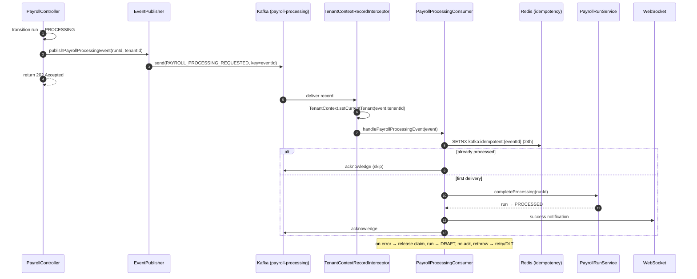
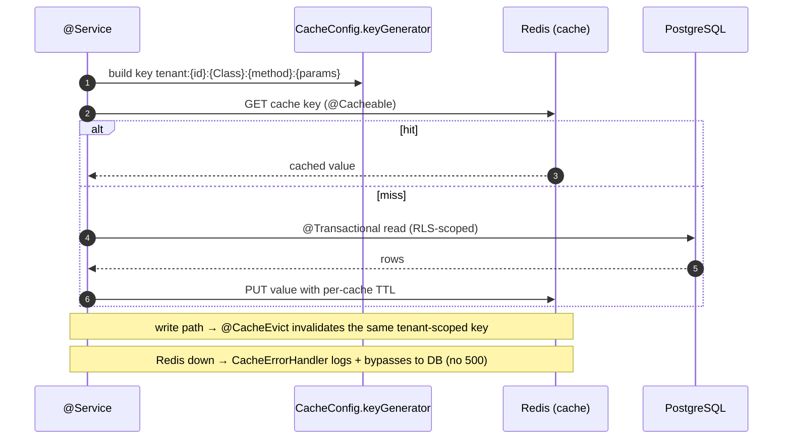
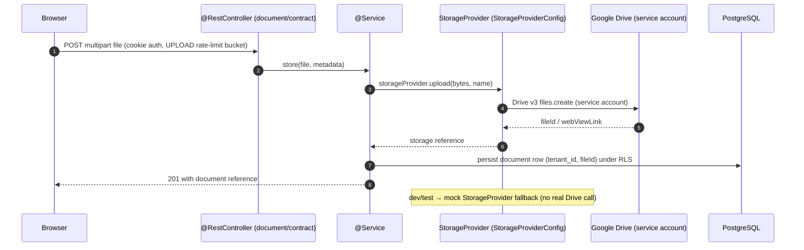

# Data Flows

> Key technical data paths through NU-AURA, each grounded in source files cited
> in `docs/architecture/data-flow.md` and `docs/patterns/README.md`.
> See [[System-Overview]] · [[Data-Flows]] partners [[System-Flows]] (business flows)
> and [[Module-Relationships]] (static dependency map).

## Purpose

Document the request- and message-level data flows that matter most to correctness
and security: the authenticated request lifecycle, login/auth, an event-driven Kafka
flow, a Redis cache read/write, and a file upload to Google Drive. These are the
plumbing flows that every [[Services]] and [[APIs]] change rides on top of.

## Context

NU-AURA is single-origin: the browser talks only to Next.js, which proxies `/api/v1/*`
and `/ws/*` to Spring Boot (`frontend/next.config.js`). Auth is JWT-in-httpOnly-cookie
([[ADR-005]]); tenancy is enforced by RLS ([[ADR-002]]); Redis is the coordination
substrate ([[ADR-003]]). The flows below show how those decisions compose at runtime.

## Diagram

### 1. Authenticated API request lifecycle (browser → Postgres with RLS)

```mermaid
sequenceDiagram
    autonumber
    participant B as Browser (Axios)
    participant N as Next.js proxy
    participant RL as RateLimitingFilter
    participant TF as TenantFilter
    participant JF as JwtAuthenticationFilter
    participant CF as CsrfDoubleSubmitFilter
    participant C as @RestController
    participant S as @Service (@Transactional)
    participant TM as TenantRlsTransactionManager
    participant PG as PostgreSQL (RLS)

    B->>N: GET /api/v1/employees (httpOnly cookie + X-CSRF-TOKEN)
    N->>RL: rewrite → BACKEND_ORIGIN /api/v1/employees
    RL->>TF: within rate budget
    TF->>JF: cookie present → X-Tenant-ID ignored (JWT authoritative)
    JF->>JF: validateToken; getTenantIdFromToken
    JF->>JF: tenant ACTIVE? (TenantStatusCache, 30s Redis)
    JF->>JF: TenantContext.setCurrentTenant; hydrate authorities
    JF->>CF: SecurityContext populated
    CF->>C: CSRF ok (or skipped for safe method)
    C->>S: call service method
    S->>TM: @Transactional begin
    TM->>PG: SELECT set_config('app.current_tenant_id', :uuid, true)
    S->>PG: SELECT ... FROM employees
    PG-->>S: rows filtered by RLS policy
    S-->>C: result
    TM->>PG: commit → RESET app.current_tenant_id
    C-->>B: 200 JSON (via Next.js)
    Note over JF: finally → SecurityContext.clear() + TenantContext.clear()
```

Evidence: filter order `SecurityConfig.java` 263–270; tenant-header drop
`TenantFilter.java` 107–126; `SET LOCAL` `TenantRlsTransactionManager.java` 76, 79–91;
ThreadLocal clear `JwtAuthenticationFilter.java` 270–276.

### 2. Login / auth (cookie issuance + silent refresh)

```mermaid
sequenceDiagram
    autonumber
    participant B as Browser (Axios)
    participant AC as AuthController
    participant AS as AuthService
    participant TP as JwtTokenProvider
    participant BL as TokenBlacklistService (Redis)

    B->>AC: POST /login {credentials}  (or POST /google {idToken})
    AC->>AS: authService.login(request)
    AS-->>AC: AuthResponse (access + refresh tokens, roles claim)
    AC-->>B: Set-Cookie __Host-hrms-access (HttpOnly, Secure, SameSite=Lax); body cleared

    Note over B,AC: ...access token expires...
    B->>AC: GET /api/v1/... → 401
    B->>AC: POST /auth/refresh (refresh cookie, mutex-guarded)
    AC->>AS: authService.refresh(refreshToken)
    AS->>TP: mint new pair
    AS->>BL: revoke old refresh token (rotation)
    AC-->>B: Set-Cookie rotated tokens
    B->>AC: retry original request → 200
```

Evidence: `AuthController.java` `/login` 105–122, `/google` 122–127, `/refresh`
207–233; body-strip + cookie hardening `CookieConfig.java` 13, 85–90; refresh mutex
`frontend/lib/api/client.ts` 116–128; revocation `TokenBlacklistService.java`.

### 3. Event-driven async flow (Kafka, idempotent payroll)



Evidence: `EventPublisher.java` 258–278, 328–350; `TenantContextRecordInterceptor.java`
32–56; `PayrollProcessingConsumer.java` 76–105; `IdempotencyService.java` (SETNX +
release).

### 4. Cache read/write (cache-aside, tenant-scoped)



Evidence: `CacheConfig.java` `keyGenerator` (tenant prefix), tiered TTL table,
`errorHandler()` graceful degrade; `docs/patterns/README.md` §1.

### 5. File upload to Google Drive



Evidence: `GoogleDriveConfig` + `StorageProviderConfig` (`infrastructure/storage/`),
`StorageProvider` abstraction with mock fallback (`docs/architecture/README.md` §3);
UPLOAD rate-limit bucket (`docs/patterns/README.md` §4). `OrphanFileCleanupScheduler`
reaps unreferenced files.

## Related Links

- [[System-Overview]] · [[C4-Container]] · [[C4-Component]] · [[Middleware]]
- [[System-Flows]] (business-level flows) · [[Module-Relationships]] · [[Services]] · [[APIs]] · [[Schema]]
- [[ADR-002]] (RLS) · [[ADR-003]] (Redis) · [[ADR-004]] (generated client) · [[ADR-005]] (cookie auth) · [[Architecture-Decisions]]
- [[Roles]] · [[Permissions]] · [[Security-Audit]]
- Source of truth: `docs/architecture/data-flow.md`, `docs/patterns/README.md`

## Risks

- **ThreadLocal leakage** would cross-contaminate tenants; mitigated by the `finally`
  clear in `JwtAuthenticationFilter` and connection RESET on pool return — any new
  thread-spawning path must propagate context (`TenantAwareTaskDecorator`).
- **Cache-aside staleness** — a write that forgets `@CacheEvict` serves stale data
  until TTL; tenant-scoped keys prevent cross-tenant bleed but not intra-tenant
  staleness.
- **At-least-once delivery** — Kafka can redeliver; correctness depends on
  `IdempotencyService` SETNX and the `release()` on the failure path, else retries are
  silently swallowed for 24h.
- **Degradable storage/search** — Google Drive and Elasticsearch outages must surface
  as graceful degradation, not request failures.

## Operational Notes

- The bearer-header auth fallback is **off by default in prod**
  (`app.security.allow-bearer-header`); production auth is cookie-only ([[ADR-005]]).
- Tenant header `X-Tenant-ID` is only honoured for unauthenticated public endpoints;
  once a cookie is present the JWT claim wins ([[ADR-002]]).
- Rate-limit buckets differ by scope: AUTH fails closed, API/EXPORT/UPLOAD/WALL/WEBHOOK
  per `RateLimitType` (`docs/patterns/README.md` §4) — relevant when debugging 429s in
  [[Production-Support]].
