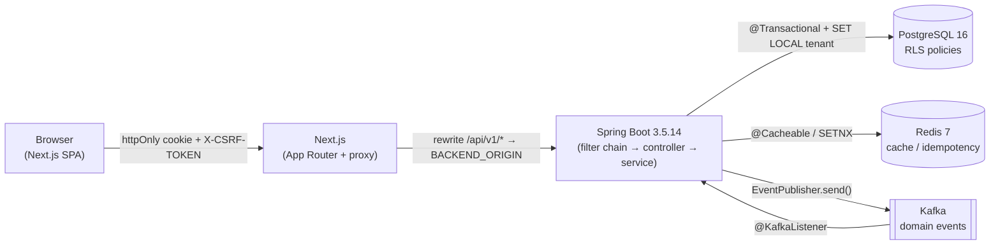
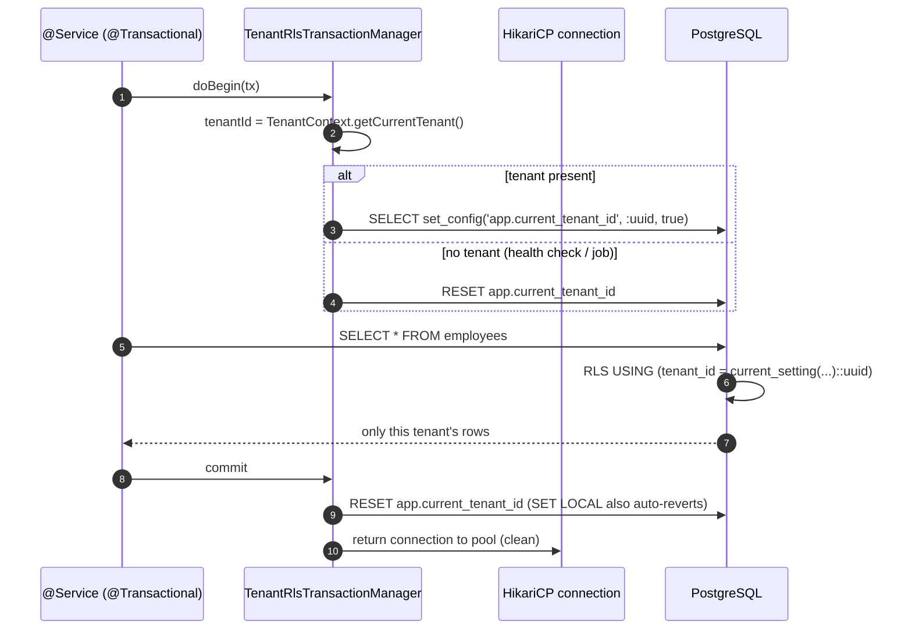
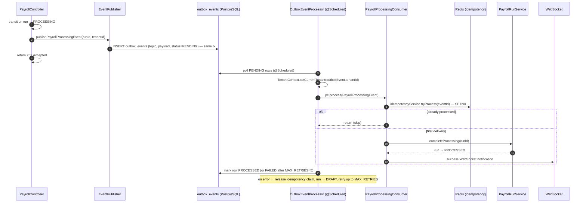
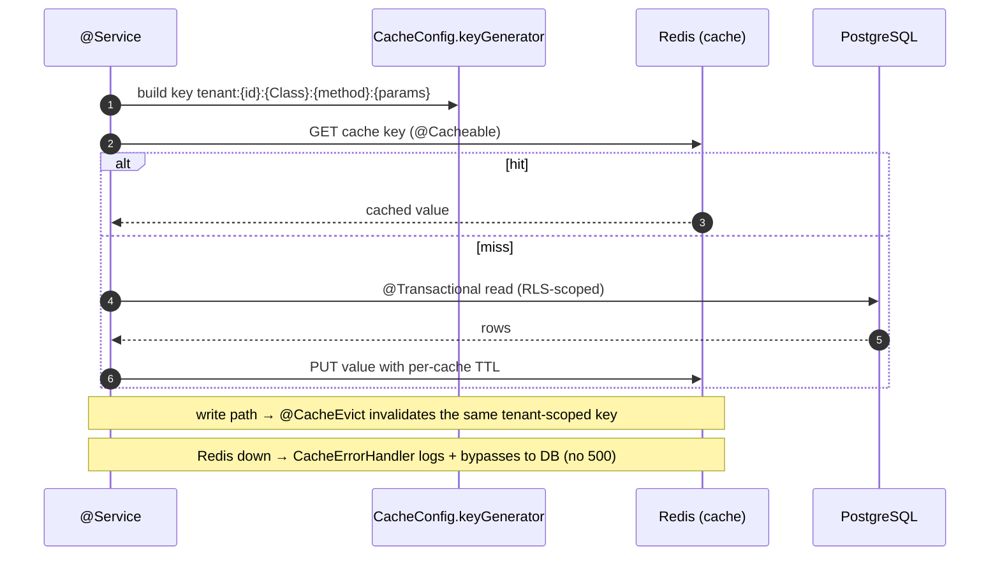
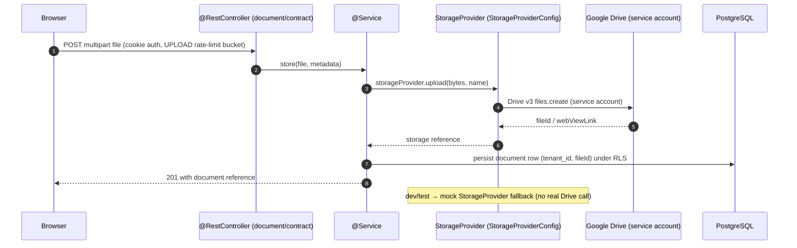

# Data Flows

> Key technical data paths through NU-AURA, each grounded in source files cited
> inline. See [[System-Overview]] · [[Data-Flows]] partners [[System-Flows]]
> (business flows) and [[Module-Relationships]] (static dependency map).

## Purpose

Document the request- and message-level data flows that matter most to correctness
and security: the authenticated request lifecycle, login/auth, multi-tenant RLS
isolation, an event-driven Kafka flow, a Redis cache read/write, and a file upload
to Google Drive. These are the plumbing flows that every [[Services]] and [[APIs]]
change rides on top of.

Every claim below is grounded in source files cited inline. Frontend never holds
the JWT itself: tokens live only in httpOnly cookies ([[ADR-005]]); tenancy is
enforced by RLS ([[ADR-002]]); Redis is the coordination substrate ([[ADR-003]]).

## Context

NU-AURA is single-origin: the browser talks only to Next.js, which proxies `/api/v1/*`
and `/ws/*` to Spring Boot. The Next.js layer is a thin proxy — it rewrites
`/api/v1/*` and `/ws/*` to the backend origin (`frontend/next.config.js`,
`rewrites()` at lines 158–170). The flows below show how those decisions compose at
runtime.

## Diagram

### 0. High-level topology



### 1. Authenticated API request lifecycle (browser → Postgres with RLS)

The Axios singleton (`frontend/lib/api/client.ts`) sends every request with
`withCredentials: true` (line 69) so the httpOnly auth cookie rides along; a
request interceptor injects the `X-Tenant-ID` header from localStorage when present
(lines 75–80). `SecurityConfig` (`backend/.../common/config/SecurityConfig.java`,
lines 263–270) registers the custom filters in order — `RateLimitingFilter` →
`TenantFilter` → `ApiKeyAuthenticationFilter` → `JwtAuthenticationFilter`, then
`CsrfDoubleSubmitFilter` after `UsernamePasswordAuthenticationFilter`.

```mermaid
sequenceDiagram
    autonumber
    participant B as Browser (Axios)
    participant N as Next.js proxy
    participant RL as RateLimitingFilter
    participant TF as TenantFilter
    participant JF as JwtAuthenticationFilter
    participant CF as CsrfDoubleSubmitFilter
    participant C as @RestController
    participant S as @Service (@Transactional)
    participant TM as TenantRlsTransactionManager
    participant PG as PostgreSQL (RLS)

    B->>N: GET /api/v1/employees (httpOnly cookie + X-CSRF-TOKEN)
    N->>RL: rewrite → BACKEND_ORIGIN /api/v1/employees
    RL->>TF: within rate budget
    TF->>JF: cookie present → X-Tenant-ID ignored (JWT authoritative)
    JF->>JF: validateToken; getTenantIdFromToken
    JF->>JF: tenant ACTIVE? (TenantStatusCache, 30s Redis)
    JF->>JF: TenantContext.setCurrentTenant; hydrate authorities
    JF->>CF: SecurityContext populated
    CF->>C: CSRF ok (or skipped for safe method)
    C->>S: call service method
    S->>TM: @Transactional begin
    TM->>PG: SELECT set_config('app.current_tenant_id', :uuid, true)
    S->>PG: SELECT ... FROM employees
    PG-->>S: rows filtered by RLS policy
    S-->>C: result
    TM->>PG: commit → RESET app.current_tenant_id
    C-->>B: 200 JSON (via Next.js)
    Note over JF: finally → SecurityContext.clear() + TenantContext.clear()
```

`TenantFilter` deliberately ignores `X-Tenant-ID` once an access-token cookie is
present — the JWT claim is authoritative and the header is logged-and-dropped to
prevent tenant spoofing (`TenantFilter.java`, lines 107–126). After the chain
completes, `JwtAuthenticationFilter` clears both `SecurityContext` and
`TenantContext` in a `finally` block (lines 270–276), guaranteeing no ThreadLocal
leakage onto a reused request thread.

Evidence: filter order `SecurityConfig.java` 263–270; tenant-header drop
`TenantFilter.java` 107–126; `SET LOCAL` `TenantRlsTransactionManager.java` 76, 79–91;
ThreadLocal clear `JwtAuthenticationFilter.java` 270–276.

### 2. Login / auth (cookie issuance + silent refresh)

`AuthController` exposes `POST /login` (lines 105–122). On success it sets secure
httpOnly cookies and **strips the tokens from the response body** so they live only
in the cookie jar (lines 112–116); `POST /google`, `POST /mfa-login`, and
`POST /refresh` follow the same set-cookie-then-clear-body pattern.

```mermaid
sequenceDiagram
    autonumber
    participant B as Browser (Axios)
    participant AC as AuthController
    participant AS as AuthService
    participant TP as JwtTokenProvider
    participant BL as TokenBlacklistService (Redis)

    B->>AC: POST /login {credentials}  (or POST /google {idToken})
    AC->>AS: authService.login(request)
    AS-->>AC: AuthResponse (access + refresh tokens, roles claim)
    AC-->>B: Set-Cookie __Host-hrms-access (HttpOnly, Secure, SameSite=Lax); body cleared

    Note over B,AC: ...access token expires...
    B->>AC: GET /api/v1/... → 401
    B->>AC: POST /auth/refresh (refresh cookie, mutex-guarded)
    AC->>AS: authService.refresh(refreshToken)
    AS->>TP: mint new pair
    AS->>BL: revoke old refresh token (rotation)
    AC-->>B: Set-Cookie rotated tokens
    B->>AC: retry original request → 200
```

**Cookie hardening** is centralized in `CookieConfig`: `HttpOnly` blocks JS access
(XSS defense; line 13); `Secure` + `SameSite=Lax` on auth tokens (lines 16–20); the
`__Host-` name-prefix variant `__Host-hrms-access` / `__Host-hrms-refresh`
(lines 85–90) is accepted by the browser only with `Secure`, `Path=/`, and no
`Domain` — preventing a sibling subdomain from planting the cookie. Legacy names
`access_token` / `refresh_token` (lines 66–71) are accepted during the `__Host-`
rollover window; the hardened name wins when both are present.

**Token extraction.** `JwtAuthenticationFilter.getJwtFromRequest` reads the cookie
first, scanning for the hardened `__Host-hrms-access` name (which wins) then the
legacy `access_token` (lines 333–354). The `Authorization: Bearer` header fallback
is **off by default in prod** and gated behind `app.security.allow-bearer-header`
(lines 54–55, 311–318). On a validated token the filter reads `username`/`tenantId`
claims (lines 85–86), rejects with `403` if the tenant is not `ACTIVE` (30s
`TenantStatusCache` to avoid a PG round-trip; lines 94–110), and hydrates
authorities — preferring JWT-embedded roles, else loading DB-cached permissions by
role (BUG-012: permissions were moved out of the JWT to keep the cookie under 4096
bytes; lines 131–172).

**Silent refresh.** The Axios response interceptor catches `401`, and a shared
`refreshPromise` mutex (P0-SESSION-FIX) serializes concurrent refreshes through
`POST /auth/refresh` (`frontend/lib/api/client.ts`, lines 116–128). On the backend,
`/refresh` mints new tokens **before** revoking the old refresh token (rotation;
`AuthController.java`, lines 229–233).

Evidence: `AuthController.java` `/login` 105–122, `/google` 122–127, `/refresh`
207–233; body-strip + cookie hardening `CookieConfig.java` 13, 16–20, 66–71, 85–90;
token extraction `JwtAuthenticationFilter.java` 54–55, 311–318, 333–354; refresh
mutex `frontend/lib/api/client.ts` 116–128; revocation `TokenBlacklistService.java`.

### 3. Multi-tenant isolation via RLS

NU-AURA is shared-database / shared-schema: every tenant-aware table carries
`tenant_id UUID NOT NULL`. Isolation is enforced in two layers — application
ThreadLocal context plus PostgreSQL RLS as defense-in-depth. The PostgreSQL session
variable `app.current_tenant_id` is what RLS policies read
(`current_setting('app.current_tenant_id', true)::uuid`), set on two paths:

- **JPA transactions** — `TenantRlsTransactionManager` overrides `doBegin()` to run
  `SELECT set_config('app.current_tenant_id', ?, true)` after the transaction starts
  (lines 76, 79–91). The third arg `true` makes it **transaction-local**
  (`SET LOCAL`), auto-reverting on commit/rollback; with no tenant in context it
  explicitly RESETs to prevent stale inheritance (lines 84–88).
  `doCleanupAfterCompletion` RESETs again before the connection returns to the pool
  (lines 105–109).
- **Non-JPA / autocommit paths** — `TenantAwareDataSourceConfig` is a
  `BeanPostProcessor` that wraps the HikariCP `DataSource` (lines 84–93). On every
  `getConnection()` it RESETs, then sets `app.current_tenant_id` session-scoped
  (`set_config(..., false)`) when a tenant is present (lines 145–154); the returned
  connection is proxied so `close()` RESETs before pool return (lines 162–194).

Both use a **bind parameter** for the tenant UUID rather than string concatenation
(CRIT-002), preventing SQL injection into the `set_config` call.



**Fail-closed enforcement.** The RLS model evolved from permissive allow-all
fallbacks to strict fail-closed semantics. By migration
`V254__enforce_runtime_rls_fail_closed.sql`: the runtime DB role is `NOBYPASSRLS` —
even an unset/empty `app.current_tenant_id` rejects all rows; Flyway DDL runs under a
separate `BYPASSRLS` migration role; and a startup canary (`RlsStartupProbe`) opens a
connection without tenant context and asserts `SELECT COUNT(*) FROM employees`
returns 0, failing boot if the policy regresses. Because PostgreSQL superusers bypass
RLS, the connection-pool user must be a non-superuser (or tables must use
`FORCE ROW LEVEL SECURITY`) — see the warning in `TenantRlsTransactionManager.java`
(lines 55–65).

Evidence: `TenantRlsTransactionManager.java` 55–65, 76, 79–91, 105–109;
`TenantAwareDataSourceConfig.java` 84–93, 145–154, 162–194;
`V254__enforce_runtime_rls_fail_closed.sql`; `RlsStartupProbe`.

### 4. Event-driven async flow (transactional outbox → consumers, idempotent payroll)

Heavy or fan-out work is dispatched asynchronously — the canonical example is async
payroll processing: the HTTP request returns `202 Accepted` immediately and the
per-employee computation runs in a consumer. `EventPublisher` is the single typed
event gateway; each method builds a `BaseKafkaEvent` subtype with a fresh `eventId`
(UUID) for idempotency, the `tenantId` for downstream context propagation, and a
tenant-zoned `timestamp` from `TenantTimeService.now(tenantId)`.

**Transactional outbox pattern (current architecture).** `EventPublisher.sendEvent()`
does **not** send to a Kafka broker directly. It writes the event as a row in
`outbox_events` (PostgreSQL) within the same business transaction — guaranteeing
durability without a Kafka dependency at runtime. `OutboxEventProcessor` (an
`@Scheduled` poller with its own `@EnableScheduling`, conditional on
`app.outbox.enabled=true`, default true) reads pending rows and calls the relevant
consumer's `process()` method directly as a Java invocation. This architecture means
the system works on Railway (no Kafka) and on GKE/K8s with Kafka (where the
`@KafkaListener` path on each consumer also handles real broker delivery).



`OutboxEventProcessor` sets `TenantContext` before each dispatch and clears it in a
`finally` block — replacing the `TenantContextRecordInterceptor` role for the outbox
path. `TenantContextRecordInterceptor` still applies when a real Kafka broker is active
and the `@KafkaListener` method `handlePayrollProcessingEvent` runs.
`PayrollProcessingConsumer.process()` (line 51) is the shared entry point called by
both paths; it holds the idempotency claim via `idempotencyService.tryProcess(eventId)`
(line 61); on failure it releases the claim and rolls back to `DRAFT` so retries can
re-enter (lines 73–74). The private `sendEvent` helper in `EventPublisher` (lines
218–244) writes to `outbox_events` and surfaces exceptions to the caller's
`CompletableFuture` rather than swallowing them.

Evidence: `EventPublisher.java` (244 lines, `sendEvent` private helper at lines 218–244,
outbox insert at 228–236); `OutboxEventProcessor.java` (poll at line 88,
`processOneEvent` at 95, `TenantContext.setCurrentTenant` at 98, consumer dispatch
at 135–146, `TenantContext.clear` at 119); `PayrollProcessingConsumer.java`
(`process()` at line 51, idempotency at 61, release at 73, rollback at 74);
`TenantContextRecordInterceptor.java` (real-Kafka path, lines 32–56);
`IdempotencyService.java` (SETNX + release).

### 5. Cache read/write (cache-aside, tenant-scoped)



Evidence: `CacheConfig.java` `keyGenerator` (tenant prefix), tiered TTL table,
`errorHandler()` graceful degrade; [[Code-Patterns]] §1.

### 6. File upload to Google Drive



Evidence: `GoogleDriveConfig` + `StorageProviderConfig` (`infrastructure/storage/`),
`StorageProvider` abstraction with mock fallback ([[System-Overview]] §3);
UPLOAD rate-limit bucket ([[Code-Patterns]] §4). `OrphanFileCleanupScheduler`
reaps unreferenced files.

## Cross-Cutting Guarantees

| Concern | Mechanism | Evidence |
|---------|-----------|----------|
| Token never in JS | httpOnly cookie, body cleared after auth | `AuthController.java` 112–116; `CookieConfig.java` 13 |
| Cookie can't be planted cross-subdomain | `__Host-` prefix (Secure, Path=/, no Domain) | `CookieConfig.java` 85–90 |
| Tenant header can't spoof tenant | JWT claim wins when cookie present | `TenantFilter.java` 107–126 |
| Suspended tenant blocked | ACTIVE check before context set | `JwtAuthenticationFilter.java` 94–110 |
| No tenant leak across requests | ThreadLocal clear + connection RESET on close | `JwtAuthenticationFilter.java` 270–276; `TenantAwareDataSourceConfig.java` 162–194 |
| DB-level isolation | RLS `set_config('app.current_tenant_id', ?, true)` | `TenantRlsTransactionManager.java` 76, 79–91 |
| Fail-closed RLS | `NOBYPASSRLS` runtime role + startup canary | `V254__enforce_runtime_rls_fail_closed.sql`; `RlsStartupProbe` |
| Event dedup | Redis SETNX, 24h TTL | `PayrollProcessingConsumer.java` 76–81 |
| Event tenant propagation | OutboxEventProcessor sets context per dispatch (outbox path); TenantContextRecordInterceptor sets context per Kafka record (broker path) | `OutboxEventProcessor.java` 96–119; `TenantContextRecordInterceptor.java` 32–46 |
| Event publish failures surfaced | outbox INSERT exception propagates to CompletableFuture via `CompletableFuture.failedFuture()` | `EventPublisher.java` private `sendEvent` 218–244 |

## Key Files

- `frontend/lib/api/client.ts` — Axios singleton, tenant header, 401 refresh mutex
- `frontend/next.config.js` — `/api/v1/*` and `/ws/*` proxy rewrites
- `backend/.../common/config/SecurityConfig.java` — filter chain ordering
- `backend/.../common/security/TenantFilter.java` — tenant header handling
- `backend/.../common/security/JwtAuthenticationFilter.java` — JWT validation, auth context
- `backend/.../api/auth/controller/AuthController.java` — login / refresh / logout endpoints
- `backend/.../common/config/CookieConfig.java` — cookie hardening
- `backend/.../common/config/TenantRlsTransactionManager.java` — `SET LOCAL` tenant per tx
- `backend/.../common/config/TenantAwareDataSourceConfig.java` — non-JPA connection tenant set
- `backend/.../infrastructure/kafka/producer/EventPublisher.java` — typed event gateway; always writes to outbox_events table
- `backend/.../infrastructure/kafka/outbox/OutboxEventProcessor.java` — polls outbox_events, sets TenantContext, dispatches to consumer process() methods
- `backend/.../infrastructure/kafka/TenantContextRecordInterceptor.java` — consumer tenant propagation on real Kafka broker path
- `backend/.../infrastructure/kafka/consumer/PayrollProcessingConsumer.java` — idempotent async consumer (called by OutboxEventProcessor or @KafkaListener)

## Related Links

- [[System-Overview]] · [[C4-Container]] · [[C4-Component]] · [[Middleware]]
- [[System-Flows]] (business-level flows) · [[Module-Relationships]] · [[Services]] · [[APIs]] · [[Schema]]
- [[ADR-002]] (RLS) · [[ADR-003]] (Redis) · [[ADR-004]] (generated client) · [[ADR-005]] (cookie auth) · [[Architecture-Decisions]]
- [[Roles]] · [[Permissions]] · [[Security-Audit]]

## Risks

- **ThreadLocal leakage** would cross-contaminate tenants; mitigated by the `finally`
  clear in `JwtAuthenticationFilter` and connection RESET on pool return — any new
  thread-spawning path must propagate context (`TenantAwareTaskDecorator`).
- **Cache-aside staleness** — a write that forgets `@CacheEvict` serves stale data
  until TTL; tenant-scoped keys prevent cross-tenant bleed but not intra-tenant
  staleness.
- **At-least-once delivery** — `OutboxEventProcessor` retries up to `MAX_RETRIES=5`
  on failure; correctness depends on `IdempotencyService` SETNX and the `release()` on
  the failure path, else retries are silently swallowed for 24 h. When a real Kafka
  broker is active, Kafka can also redeliver; both paths share the same idempotency
  guard in `process()`.
- **RLS superuser bypass** — the pool user must be `NOBYPASSRLS`; a superuser
  connection silently reads all tenants. The `RlsStartupProbe` canary guards against
  policy regression at boot.
- **Degradable storage/search** — Google Drive and Elasticsearch outages must surface
  as graceful degradation, not request failures.

## Operational Notes

- The bearer-header auth fallback is **off by default in prod**
  (`app.security.allow-bearer-header`); production auth is cookie-only ([[ADR-005]]).
- Tenant header `X-Tenant-ID` is only honoured for unauthenticated public endpoints;
  once a cookie is present the JWT claim wins ([[ADR-002]]).
- Rate-limit buckets differ by scope: AUTH fails closed, API/EXPORT/UPLOAD/WALL/WEBHOOK
  per `RateLimitType` ([[Code-Patterns]] §4) — relevant when debugging 429s in
  [[Production-Support]].
