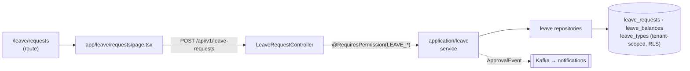

# Feature Traceability Matrix

> The **end-to-end map**: for each user-facing feature, the full vertical slice from
> URL route → frontend page → backend controller → service layer → persisted tables →
> the permission that gates it. This is the join table that ties the frontend
> ([[Route-Map-Full]], [[Routes]], [[Pages]]), the backend ([[Controller-Index]],
> [[APIs]], [[Services]]), the data layer ([[Table-Index]], [[Schema]], [[ERD]]), and
> the access model ([[Permissions]], [[RBAC-Matrix]]) into one traceable chain.
> See [[System-Flows]] for the cross-module business journeys and [[Data-Flows]] for the
> technical request plumbing each row runs through.

## Purpose

Let a change author answer, for any feature, *"if I touch this, what else is in the
slice?"* — without re-reading the whole codebase. Each row names the route a user hits,
the page that renders it, the controller that serves the API, the owning service
context, the core tables written, and the gating permission. It is the practical
"mapped to the right place" view that complements the conceptual maps in
[[Module-Relationships]] and [[System-Flows]].

## How to read this

```text
URL route ──renders──▶ page.tsx ──calls /api/v1──▶ @RestController
        │                                              │ delegates to
        │                                              ▼
   AuthGuard + RBAC                              application/<ctx> service
   (route gating)                                      │ persists via repository
        │                                              ▼
   @RequiresPermission ◀──same permission model──▶ PostgreSQL tables (tenant-scoped, RLS)
```

- **Route / page** are verified live against `frontend/app/` ([[Route-Map-Full]]).
- **Controller / base path** are verified against `@RestController` source
  ([[Controller-Index]], [[APIs]]).
- **Service context** points at the bounded context in `application/<ctx>` — the exact
  service classes are catalogued in [[Services]].
- **Tables** name the core cluster; the complete per-cluster table list is in
  [[Table-Index]], the narrative in [[Schema]].
- **Permission** is the `@RequiresPermission(...)` family enforced by the aspect
  ([[Permissions]]); frontend gating uses the matching module prefix ([[RBAC-Matrix]]).
- Where a service class or exact table is **inferred from naming** rather than read
  line-by-line, treat [[Services]] / [[Table-Index]] as the authority.

## Diagram — one vertical slice (Leave request)



---

## NU-HRMS — Core HR ([[Nu-HRMS]])

### People & org

| Feature | Route(s) | Controller | Service ctx | Core tables | Permission |
|---|---|---|---|---|---|
| Employee directory & CRUD | `/employees`, `/employees/new`, `/employees/[id]`, `/employees/[id]/edit` | `EmployeeController`, `EmployeeDirectoryController` | `employee` | `employees` | `EMPLOYEE_*` |
| Employee documents / skills | `/employees/[id]`, `/me/skills` | `EmployeeDocumentController`, `EmployeeSkillController` | `employee` | `employee_documents`, employee-skill tables | `EMPLOYEE_*` |
| Talent profile / change requests | `/employees/[id]` | `TalentProfileController`, `EmploymentChangeRequestController` | `employee` | talent-profile, employment-change tables | `EMPLOYEE_*` |
| Self-service portal | `/me/*` (8 pages) | `SelfServiceController` | `selfservice` | `employees` (own row) | authenticated |
| Org chart / units / positions | `/admin/*`, `/team-directory` | `OrganizationController`, `DepartmentController`, `OfficeLocationController` | `organization` | `organization_units`, `departments`, `positions`, `office_locations` | `ORGANIZATION_*` |
| Succession / talent pools | `/admin/*` | `OrganizationController` (`/succession-plans`, `/talent-pools`) | `organization` | succession-plan, talent-pool tables | `ORGANIZATION_*` |
| Custom fields | `/admin/custom-fields` | `CustomFieldController` | `customfield` | custom-field tables | admin |

### Time, attendance & leave

| Feature | Route(s) | Controller | Service ctx | Core tables | Permission |
|---|---|---|---|---|---|
| Attendance check-in/out & regularization | `/attendance`, `/attendance/approvals` | `AttendanceController`, `MobileAttendanceController` | `attendance` | `attendance_records`, `attendance_time_entries` | `ATTENDANCE_*` |
| Biometric device punch (public) | `/biometric-devices` | `BiometricDeviceController` (`POST /punch` public, device API-key) | `attendance` | biometric/device + `attendance_records` | device API-key |
| Shifts & roster / swaps | `/shifts` (5) | `ShiftManagementController`, `ShiftSwapController` | `shift` | `shift_assignments`, `rosters` | `SHIFT_*` |
| Overtime / comp-off | `/overtime`, attendance | `OvertimeManagementController`, `CompOffController` | `overtime`, `attendance` | overtime, `comp_time_balances` | `OVERTIME_*` |
| Time tracking | `/time-tracking` (4) | `TimeTrackingController` | `timetracking` | time-entry tables | `TIMETRACKING_*` |
| Holidays | `/holidays`, `/restricted-holidays`, `/admin/holidays` | `HolidayController`, `RestrictedHolidayController` | `attendance`/`leave` | `restricted_holidays`, holiday tables | configurable |
| Leave apply / approve / balances | `/leave/requests`, `/leave/approvals`, `/leave/balances` (8) | `LeaveRequestController`, `LeaveBalanceController`, `LeaveTypeController` | `leave` | `leave_requests`, `leave_balances`, `leave_types` | `LEAVE_*` |

### Payroll, finance & assets

| Feature | Route(s) | Controller | Service ctx | Core tables | Permission |
|---|---|---|---|---|---|
| Payroll runs / processing | `/payroll/runs/[id]`, `/payroll/process` (10) | `PayrollController`, `GlobalPayrollController` | `payroll` | `payroll_runs`, `global_payroll_runs`, `employee_payroll_records`, `payroll_components` | `PAYROLL_*` |
| Statutory (PF/ESI/TDS/PT/LWF) | `/statutory` (2), `/lwf` | `ProvidentFundController`, `ESIController`, `TDSController`, `ProfessionalTaxController`, `LWFController`, `StatutoryContributionController`, `StatutoryFilingController` | `statutory`, `payroll` | statutory contribution/filing tables | `PAYROLL_*` / statutory perms |
| Compensation / bonus | `/compensation` | `CompensationController`, `BonusController` | `compensation`, `payroll` | comp / bonus tables | `COMPENSATION_*` |
| Tax declarations | `/tax` (2) | `TaxDeclarationController` | `tax` | tax-declaration tables | `TAX_*` |
| Budget planning | `/admin/budget` | `BudgetPlanningController` | `budget` | budget tables | admin |
| Expense claims & policy | `/expenses`, `/expenses/[id]` (6) | `ExpenseClaimController`, `ExpenseItemController`, `ExpenseCategoryController`, `ExpensePolicyController`, `ExpenseAdvanceController`, `ExpenseReportController`, `OcrReceiptController` | `expense` | `expense_claims`, `expense_items` + policy/category | `EXPENSE_*` |
| Mileage | expenses | `MileageController`, `MileagePolicyController` | `expense` | mileage tables | `EXPENSE_*` |
| Travel & travel expense | `/travel/[id]` (4) | `TravelController`, `TravelExpenseController` | `travel` | travel tables | `TRAVEL_*` |
| Loans | `/loans/[id]` (3) | `LoanController` | `loan` | loan + repayment tables | `LOAN_*` |
| Payments (+ public webhooks) | `/payments` (2) | `PaymentController`, `PaymentConfigController`, `PaymentWebhookController` (public, signature) | `payment` | payment tables | `PAYMENT_*` / webhook signature |
| Benefits | `/benefits` | `BenefitManagementController`, `BenefitEnhancedController` | `benefits` | `benefit_plans`, `benefit_enrollments`, `benefit_claims` | `BENEFIT_*` |
| Assets | `/me/assets`, asset admin | `AssetManagementController` | `asset` | asset issue/recovery tables | `ASSET_*` |

### Projects, PSA, contracts, docs

| Feature | Route(s) | Controller | Service ctx | Core tables | Permission |
|---|---|---|---|---|---|
| Projects & timesheets | `/projects/[id]` (8) | `ProjectController`, `ProjectTimesheetController` | `project` | `projects`, `project_employees`, timesheet tables | `PROJECT_*` |
| Resource management | `/resources` (6), `/allocations` (2) | `ResourceController`, `ResourceManagementController`, `ResourceConflictController`, `ResourcePoolController` | `resourcemanagement` | allocation/resource tables | `RESOURCE_*` |
| PSA (projects/timesheets/invoices) | `/projects`, PSA pages | `PSAProjectController`, `PSATimesheetController`, `PSAInvoiceController` | `psa` | PSA project/invoice tables | `PSA_*` |
| Contracts & templates | `/contracts/[id]`, `/contracts/new` (4) | `ContractController`, `ContractTemplateController` | `contract` | `contracts`, `contract_templates` | `CONTRACT_*` |
| HR letters | `/letters` (2) | `LetterController` | `letter` | letter tables | `LETTER_*` |
| Documents | `/documents`, `/nu-drive` | `FileUploadController`, `EmployeeDocumentController` | `document` | document tables + Google Drive | `DOCUMENT_*` |

---

## NU-Hire — Recruitment & onboarding ([[Nu-Hire]])

| Feature | Route(s) | Controller | Service ctx | Core tables | Permission |
|---|---|---|---|---|---|
| Jobs & pipeline | `/recruitment/jobs`, `/recruitment/[jobId]/kanban` (14) | `RecruitmentController` | `recruitment` | recruitment job/pipeline tables | `RECRUITMENT_*` |
| Applicants / candidates | `/recruitment/candidates/[id]` | `ApplicantController` | `recruitment` | `applicants`, `candidates` | `CANDIDATE_*` |
| Agencies | `/recruitment/agencies/[id]` | `AgencyController` | `recruitment` | agency tables | `AGENCY_*` |
| AI screening / job boards | `/recruitment/*` | `AIRecruitmentController`, `JobBoardController` | `recruitment` | AI/job-board tables | `RECRUITMENT_*` |
| Interview scorecards | `/recruitment/scorecards` | `ScorecardController` | `recruitment` | scorecard tables | `RECRUITMENT_*` |
| Employee referrals | `/referrals` | `ReferralController` | `referral` | referral tables | `REFERRAL_*` |
| Public careers / offers | `/careers`, `/offer-portal` (public) | `PublicCareerController`, `PublicOfferController` | `recruitment` | job/offer tables | public (token) |
| Preboarding | `/preboarding/portal/[token]` (public) | `PreboardingController` | `preboarding` | preboarding tables | public token / `PREBOARDING_*` |
| Onboarding | `/onboarding/[id]`, `/onboarding/templates/[id]` (6) | `OnboardingManagementController` | `onboarding` | onboarding task/template tables | `ONBOARDING_*` |
| Probation | onboarding | `ProbationController` | `probation` | probation case tables | `PROBATION_*` |
| Exit / offboarding / FnF | `/offboarding/[id]`, `/offboarding/[id]/exit-interview`, `/offboarding/[id]/fnf` (6), `/exit-interview/[token]` (public) | `ExitManagementController`, `FnFController`, `OffboardingController` | `exit` | exit / settlement tables | `EXIT_*` / public token |
| E-signature (+ DocuSign) | `/sign/[token]` (public) | `ESignatureController`, `DocuSignController` (webhook public) | `esignature` | eSign document/recipient tables + Drive | public token / HMAC |

---

## NU-Grow — Performance, learning, engagement ([[Nu-Grow]])

| Feature | Route(s) | Controller | Service ctx | Core tables | Permission |
|---|---|---|---|---|---|
| Reviews & cycles | `/performance/cycles/[id]/calibration`, `/performance/cycles/[id]/nine-box` (16) | `PerformanceReviewController`, `ReviewCycleController`, `PerformanceRevolutionController` | `performance` | `performance_review_cycles`, `performance_reviews` | `REVIEW_*` |
| PIP | `/performance/*` | `PIPController` | `performance` | PIP tables | `REVIEW_*` |
| Goals & OKRs | `/goals`, `/okr` | `GoalController`, `OkrController` | `okr` | `performance_goals`, okr tables | `OKR_*` |
| Feedback / 360 | `/feedback360` | `FeedbackController`, `Feedback360Controller` | `feedback_360` | feedback tables | `FEEDBACK_360_*` |
| LMS (courses/quizzes/certs) | `/learning/courses/[id]`, `/learning/courses/[id]/play`, `/learning/courses/[id]/quiz/[quizId]` (7) | `LmsController`, `QuizController`, `CourseEnrollmentController` | `lms` | course/quiz/enrollment/cert tables | `LMS_*` |
| Training | `/training/catalog/[id]` (4) | `TrainingManagementController` | `training` | training tables | `TRAINING_*` |
| Surveys & pulse | `/surveys/[id]/respond`, `/surveys/[id]/analytics` (5) | `SurveyManagementController`, `SurveyAnalyticsController`, `PulseSurveyController` | `survey` | survey/pulse tables | `SURVEY_*` |
| Recognition | `/recognition` | `RecognitionController` | `recognition` | recognition/award tables | `RECOGNITION_*` |
| Wellness | `/wellness` (2) | `WellnessController` | `wellness` | wellness tables | `WELLNESS_*` |

---

## NU-Fluence — Knowledge & collaboration ([[Nu-Fluence]])

| Feature | Route(s) | Controller | Service ctx | Core tables | Permission |
|---|---|---|---|---|---|
| Wiki pages & spaces | `/fluence/wiki`, `/fluence/wiki/[slug]`, `/fluence/wiki/[slug]/edit` | `WikiPageController`, `WikiSpaceController`, `WikiInlineCommentController` | `knowledge` | `wiki_spaces`, `wiki_pages`, `wiki_page_versions` | `KNOWLEDGE_*` |
| Edit locks | `/fluence/wiki/[slug]/edit` | `FluenceEditLockController` | `knowledge` | (Redis lock, 5m TTL) | authenticated |
| Blogs | `/fluence/blogs`, `/fluence/blogs/[slug]`, `/fluence/blogs/[slug]/edit` | `BlogPostController`, `BlogCategoryController` | `knowledge` | `blog_posts`, blog categories | `KNOWLEDGE_*` |
| Templates | `/fluence/templates`, `/fluence/templates/[id]` | `TemplateController` | `knowledge` | `document_templates` | `KNOWLEDGE_*` |
| Search & AI chat | `/fluence/search` | `KnowledgeSearchController`, `FluenceSearchController`, `FluenceChatController` | `knowledge` | indexed in Elasticsearch | authenticated |
| Comments / activity / attachments | `/fluence/*` | `FluenceCommentController`, `FluenceActivityController`, `FluenceAttachmentController`, `ContentEngagementController`, `ContentViewController` | `knowledge` | comment/activity/view tables | authenticated |
| Social wall | `/fluence/wall` | `WallController` | `wall` | `wall_posts`, reactions/comments/replies | `WALL_*` (WALL rate bucket) |
| LinkedIn posts | (admin) | `LinkedinPostController` | `knowledge` | linkedin-post tables | `KNOWLEDGE_*` |

---

## Shared platform ([[Shared-Platform]])

| Feature | Route(s) | Controller | Service ctx | Core tables | Permission |
|---|---|---|---|---|---|
| Login / OAuth / MFA / refresh | `/auth/login`, `/auth/signup`, `/auth/forgot-password` (public) | `AuthController`, `MfaController`, `SamlConfigController` | `auth` | `users`, MFA/SAML tables | public / authenticated |
| Users / roles / permissions | `/admin/users`, `/admin/roles`, `/admin/permissions` | `UserController`, `RoleController`, `PermissionController`, `ImplicitRoleRuleController` | `user` | `users`, `roles`, `permissions`, `role_permissions`, `user_roles` | admin |
| Tenants | `/admin/*` (`/register` public) | `TenantController` | `platform` | `tenants` | admin / public register |
| Notifications (multi-channel) | `/notifications`, `/inbox` | `NotificationController`, `MultiChannelNotificationController`, `SmsNotificationController`, `NotificationPreferencesController` | `notification` | notification + preference tables | authenticated |
| Announcements | `/announcements` | `AnnouncementController` | `announcement` | `announcements` | `ANNOUNCEMENT_*` |
| Meetings / 1:1 / calendar | `/calendar/[id]` (3), `/one-on-one` | `MeetingController`, `OneOnOneMeetingController`, `CalendarController` | `meeting`, `calendar` | meeting/calendar tables | authenticated |
| Helpdesk | `/helpdesk/tickets/[id]` (5) | `HelpdeskController`, `HelpdeskSLAController` | `helpdesk` | helpdesk ticket/SLA tables | `HELPDESK_*` |
| Workflow & approvals | `/workflows/[id]` (2), `/approvals/inbox` (2) | `WorkflowController`, `ApprovalsController`, `ApprovalEscalationController` | `workflow` | workflow/approval/escalation tables | `WORKFLOW_*` |
| Analytics & dashboards | `/analytics/org-health`, `/dashboards` (3), `/executive`, `/predictive-analytics` | `AnalyticsController`, `AdvancedAnalyticsController`, `OrganizationHealthController`, `PredictiveAnalyticsController`, `DashboardController`, `HomeController` | `analytics`, `dashboard`, `home` | read-mostly across domains | `ANALYTICS_*` |
| Reports & export | `/reports` (9), `/import-export` | `ReportController`, `CustomReportController`, `ScheduledReportController`, `ExportController` | `report`, `export` | report config tables (EXPORT rate bucket) | `REPORT_*` |
| Compliance / audit / DSR | `/compliance`, `/security` | `ComplianceController`, `AuditLogController`, `DsrController`, `DsrAdminFulfillmentController` | `compliance`, `audit` | `audit_logs`, DSR tables | admin / self-DSR |
| Integrations (Slack/DocuSign/webhooks) | `/integrations` (2) | `IntegrationController`, `IntegrationConnectorController`, `SlackCommandController`, `WebhookController`, `WebhookRotationController` | `integration` | integration/webhook config + event tables | admin / signing-secret |
| Feature flags | `/admin/*` | `FeatureFlagController` | `featureflag` | feature-flag tables | admin |
| Data import / migration / KEKA | `/import-export` | `DataMigrationController`, `KekaImportController`, `EncryptionBackfillController` | `migration`, `dataimport` | staging/migration tables | admin |
| System admin / Kafka / monitoring | `/admin/*` | `SystemAdminController`, `SystemAuditLogController`, `KafkaAdminController`, `MonitoringController`, `PlatformController` | `admin`, `platform` | system/audit tables | `SUPER_ADMIN` |
| Mobile surface | (mobile app) | `MobileDashboardController`, `MobileApprovalController`, `MobileLeaveController`, `MobileAttendanceController`, `MobileNotificationController`, `MobileSyncController` | per-context | mirrors core tables | authenticated |

---

## Coverage & honesty

- **Route ↔ controller ↔ permission** columns are grounded in the verified catalogs
  ([[Route-Map-Full]], [[Controller-Index]], [[APIs]], [[Permissions]]).
- **Service context** is the `application/<ctx>` package; resolve to concrete service
  classes via [[Services]] (the per-context service catalog).
- **Core tables** name the cluster's anchor tables; the **complete** distinct-table set
  per cluster is in [[Table-Index]], with conventions and RLS in [[Schema]].
- Some permission families (e.g. statutory sub-permissions) and exact table names are
  **inferred from naming**; the linked catalog notes are authoritative where they
  differ. This matrix is intentionally at the *feature* altitude — one row can span
  several endpoints, pages, and tables.

## Related Links

- **Frontend:** [[Route-Map-Full]] · [[Routes]] · [[Pages]] · [[Components]]
- **Backend:** [[Controller-Index]] · [[APIs]] · [[Services]] · [[Middleware]] · [[Scheduled-Jobs]]
- **Data:** [[Table-Index]] · [[Schema]] · [[ERD]] · [[Migrations]]
- **Access:** [[Roles]] · [[Permissions]] · [[RBAC-Matrix]]
- **Flows:** [[System-Flows]] · [[Data-Flows]] · [[Module-Relationships]]
- **Modules:** [[Nu-HRMS]] · [[Nu-Hire]] · [[Nu-Grow]] · [[Nu-Fluence]] · [[Shared-Platform]]
- [[System-Overview]] · [[00-Home]]

## Risks

- **Altitude vs precision.** Rows are at feature altitude; a single row can hide several
  endpoints/tables. For exhaustive leaf detail, follow the row's links to
  [[Controller-Index]] / [[Route-Map-Full]] / [[Table-Index]].
- **Inferred service/table names** can drift from source; the catalog notes are the
  re-verifiable authority (each carries its own `grep`/`find` recipe).
- **Permission-prefix drift.** Frontend module prefixes vs backend `@RequiresPermission`
  families can diverge (documented in [[RBAC-Matrix]] discrepancy #3) — verify both ends
  before relying on a permission column for gating.

## Operational Notes

- To re-verify a row's controller→route binding:
  `grep -rl '"/api/v1/<path>"' backend/src/main/java/com/nulogic/api` and match the
  consuming `page.tsx` via the generated query hook ([[Routes]] operational notes).
- Every slice runs through the same security/tenancy chain ([[Data-Flows]] §1–4); no row
  can cross tenants ([[ADR-002]]).
