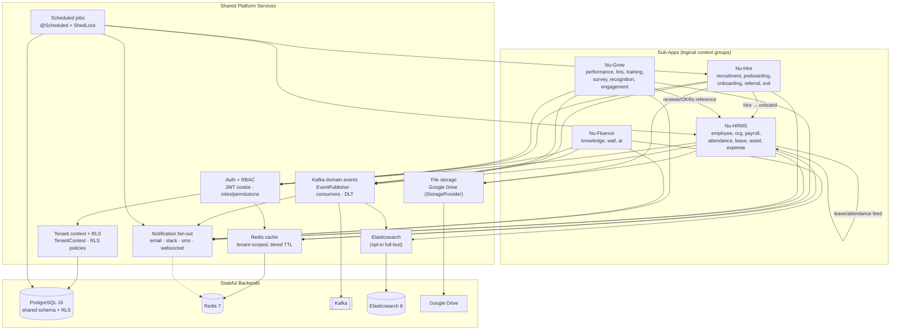

# Module Relationships

> How the four sub-apps and the shared platform depend on each other and on
> platform services. Grounded in `docs/architecture/backend.md` (bounded-context
> catalog), `docs/architecture/frontend.md` (sub-app route/permission mapping),
> and `docs/patterns/README.md`.
> See [[System-Overview]] · [[C4-Container]] · [[C4-Component]] · [[Data-Flows]] · [[System-Flows]].

## Purpose

Give a single dependency map of NU-AURA's modules: the four sub-apps
([[Nu-HRMS]], [[Nu-Hire]], [[Nu-Grow]], [[Nu-Fluence]]) plus the [[Shared-Platform]]
substrate (auth/RBAC, notifications, Kafka events, file storage, search, scheduling).
It explains every edge so a reader knows what depends on what before changing a module.

## Context

NU-AURA is a **modular monolith** ([[ADR-001]]): one Spring Boot deployable, ~67
bounded contexts per DDD layer, four logical sub-apps served by the same JVM and the
same Next.js App Router frontend. Sub-apps are **logical groupings of contexts**, not
separate services — `frontend/lib/config/apps.ts` maps pathname/permission prefixes to
`AppCode = 'HRMS' | 'HIRE' | 'GROW' | 'FLUENCE'`, and the backend groups contexts per
sub-app in `docs/architecture/backend.md` §2.

All four sub-apps depend on the same shared-platform spine: every request passes the
security filter chain (auth + tenancy, [[ADR-002]], [[ADR-005]]), every read may hit
the tenant-scoped Redis cache ([[ADR-003]]), and write paths fan out via Kafka.

## Diagram

## Edge Narrative

Every edge below is grounded in the cited source.

### Sub-app → Shared Platform (universal spine)

- **All sub-apps → Auth + RBAC → Tenant/RLS.** Every controller is guarded by the
  same Spring Security filter chain; `JwtAuthenticationFilter` sets the security
  context and re-asserts `TenantContext`, then `TenantRlsTransactionManager` pushes
  the tenant into the DB session ([[ADR-002]], [[ADR-005]]).
  Evidence: `docs/architecture/data-flow.md` §2–4.
- **All sub-apps → Redis cache.** Reads use `@Cacheable` with tenant-scoped keys;
  auth itself caches `PERMISSIONS`/`ROLE_PERMISSIONS` ([[ADR-003]]).
  Evidence: `docs/patterns/README.md` §1; `CacheConfig.java`.
- **All sub-apps → Kafka.** Write paths publish domain events through the single
  `EventPublisher`; consumers run with restored tenant context.
  Evidence: `docs/architecture/backend.md` §3.2; `infrastructure/kafka/`.
- **All sub-apps → Notification fan-out.** Approval, lifecycle, and content events
  drive `MultiChannelNotificationService` (email / Slack / SMS / WebSocket).
  Evidence: `application/notification/service/` (`MultiChannelNotificationService`,
  `EmailNotificationService`, `SlackNotificationService`, `WebSocketNotificationService`).

### Sub-app → Sub-app (cross-module business edges)

- **[[Nu-Hire]] → [[Nu-HRMS]] (hire → onboard → employee).** Recruitment closes a
  candidate; onboarding/preboarding contexts hand off into the `employee` context,
  creating the employee record that the rest of HRMS operates on.
  Evidence: backend `recruitment`/`onboarding`/`preboarding`/`employee` contexts
  (`docs/architecture/backend.md` §2); see [[System-Flows]].
- **[[Nu-Grow]] → [[Nu-HRMS]].** Performance reviews, OKRs, and 360 feedback are keyed
  to employees and org structure owned by HRMS (`employee`, `organization`).
  Evidence: `docs/architecture/frontend.md` §2 (GROW permission prefixes reference
  employee/org); backend `performance`/`employee` contexts.
- **HRMS-internal (leave/attendance → payroll).** Leave and attendance contexts feed
  payroll/compensation within HRMS; the async payroll run is event-driven.
  Evidence: `docs/architecture/data-flow.md` §5 (payroll-processing topic).

### Sub-app → specialized services

- **[[Nu-Fluence]] → Elasticsearch.** Wiki/blog content indexing is driven
  asynchronously by `FluenceSearchConsumer` off `nu-aura.fluence-content`; ES is
  opt-in and degrades gracefully when disabled.
  Evidence: `docs/architecture/backend.md` §3.3.
- **[[Nu-HRMS]] / [[Nu-Hire]] → Google Drive.** Contracts, receipts, and employee
  documents go to Drive behind a `StorageProvider` abstraction (mock fallback in dev).
  Evidence: `docs/architecture/README.md` §3; `infrastructure/storage/`.
- **Scheduled jobs → HRMS / Hire / Notifications.** `@Scheduled` workers
  (attendance regularization, leave accrual, contract lifecycle, email/notification
  digests, webhook retry) mutate sub-app data; ShedLock makes them multi-pod-safe.
  Evidence: `docs/architecture/backend.md` §3.6; `docs/patterns/README.md` §6b.

### Platform → stateful backends

- **Tenant/RLS → PostgreSQL** (shared schema, RLS policies, [[ADR-002]]).
- **Cache / locks / dedup → Redis** ([[ADR-003]]).
- **Events → Kafka**; **search → Elasticsearch**; **files → Google Drive**.

## Related Links

- [[System-Overview]] · [[C4-Context]] · [[C4-Container]] · [[C4-Component]]
- [[Nu-HRMS]] · [[Nu-Hire]] · [[Nu-Grow]] · [[Nu-Fluence]] · [[Shared-Platform]]
- [[Data-Flows]] · [[System-Flows]] · [[Services]] · [[APIs]] · [[Schema]]
- [[ADR-001]] · [[ADR-002]] · [[ADR-003]] · [[ADR-004]] · [[ADR-005]] · [[Architecture-Decisions]]
- Source of truth: `docs/architecture/backend.md` §2, `docs/architecture/frontend.md` §2

## Risks

- **Hidden cross-context coupling.** Because all contexts share one schema and process,
  a change in `employee`/`organization` can ripple into Hire, Grow, and HRMS payroll
  with no compile-time boundary ([[ADR-001]] negative consequence).
- **Shared-spine blast radius.** Auth, tenancy, cache, and notification are single
  points every sub-app depends on; a regression there affects all four sub-apps.
- **Sub-app boundaries are convention.** Sub-app membership is a pathname/permission
  mapping (`apps.ts`), not enforced isolation — drift between the FE mapping and BE
  context grouping is possible.

## Operational Notes

- Sub-app gating on the frontend is RBAC-derived: `useActiveApp().hasAppAccess(code)`
  matches a user's permission module prefixes against `permissionPrefixes`
  (`frontend/lib/config/apps.ts`). See [[RBAC-Matrix]].
- Scheduled-job pods run with `app.scheduling.enabled=true`; API pods do not — so
  cross-module schedule effects originate only on worker pods ([[Deployment]]).
- Elasticsearch and Google Drive are **degradable** dependencies; Postgres, Redis, and
  Kafka are core. Plan changes accordingly ([[Incident-Response]], [[Production-Support]]).
