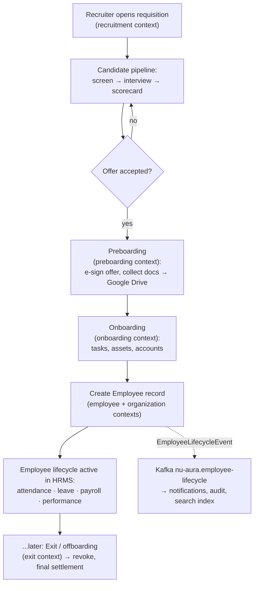
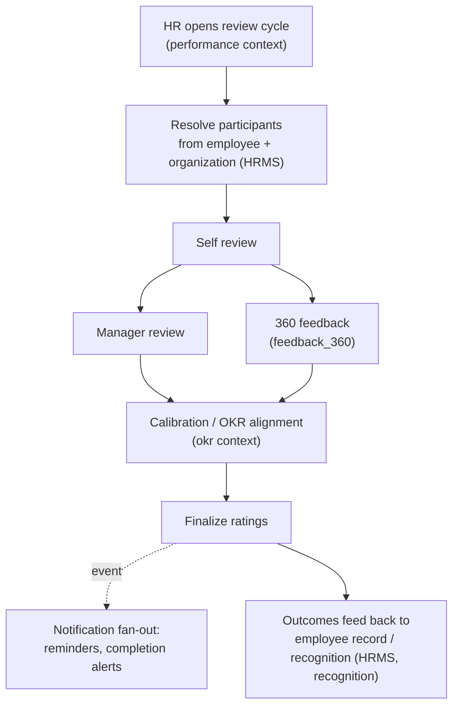
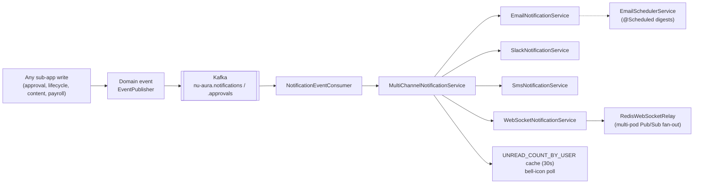

# System Flows

> End-to-end business flows that span multiple modules. These sit one level above
> [[Data-Flows]] (technical plumbing) and trace how work moves across the four
> sub-apps and the shared platform. Grounded in the bounded-context catalog
> ([[Services]] §2), the request lifecycle
> ([[Data-Flows]]), and notification services
> (`application/notification/service/`).
> See [[System-Overview]] · [[Module-Relationships]] · [[Data-Flows]].

## Purpose

Show the cross-module journeys a user actually experiences: hire → onboard →
employee lifecycle; leave request → approval → payroll/attendance; the performance
review cycle; and notification fan-out. Each flow names the contexts and platform
services it crosses so a change author understands the full blast radius.

## Context

Because NU-AURA is a modular monolith ([[ADR-001]]), these business flows cross
context boundaries **in-process** — there are no service-to-service calls, but there
are clear context hand-offs and event-driven side effects. Every step runs inside the
authenticated, tenant-scoped request lifecycle ([[Data-Flows]] §1) or an async Kafka
consumer ([[Data-Flows]] §3). Notifications and audit are emitted as domain events and
fanned out asynchronously.

## Diagram

### Flow A — Hire → Onboard → Employee lifecycle ([[Nu-Hire]] → [[Nu-HRMS]])



Cross-module edge: this is the primary [[Nu-Hire]] → [[Nu-HRMS]] hand-off
([[Module-Relationships]]). Evidence: `recruitment`, `preboarding`, `onboarding`,
`employee`, `organization`, `exit` contexts ([[Services]] §2);
`EmployeeLifecycleEvent` / `EmployeeLifecycleConsumer` (§3.2); e-sign via `esignature`
context; document storage via Google Drive ([[Data-Flows]] §5).

### Flow B — Leave request → approval → attendance/payroll ([[Nu-HRMS]] internal)

```mermaid
sequenceDiagram
    autonumber
    participant E as Employee (me portal)
    participant LS as LeaveService (leave context)
    participant WF as Workflow/approval (workflow context)
    participant MGR as Approver
    participant K as Kafka (approvals)
    participant NS as Notification fan-out
    participant ATT as Attendance/Payroll (attendance, payroll)

    E->>LS: POST leave request (cookie auth, RLS-scoped)
    LS->>LS: validate balance (LEAVE_BALANCES cache, 5m)
    LS->>WF: open approval workflow
    WF->>K: ApprovalEvent (pending)
    K->>NS: notify approver (email + websocket bell)
    MGR->>WF: approve / reject
    WF->>K: ApprovalEvent (decided)
    K->>NS: notify employee of decision
    alt approved
        WF->>ATT: reflect leave in attendance; feed payroll deductions/accrual
        Note over ATT: LeaveAccrualScheduler (@Scheduled + ShedLock) accrues balances
    end
```

Cross-module edges: leave → workflow → attendance/payroll, all within HRMS; approval
events fan out to notifications. Evidence: `leave`, `workflow`, `attendance`,
`payroll` contexts; `ApprovalEvent`/`ApprovalEventConsumer` and `LeaveAccrualScheduler`
([[Services]] §3.2, §3.6); `LEAVE_BALANCES` 5m cache
([[Code-Patterns]] §1); escalation via `ApprovalEscalationJob` /
`WorkflowEscalationScheduler`.

### Flow C — Performance review cycle ([[Nu-Grow]] → [[Nu-HRMS]])



Cross-module edge: [[Nu-Grow]] reads employee/org from [[Nu-HRMS]] and writes outcomes
back ([[Module-Relationships]]). Evidence: `performance`, `okr`, `survey` (used for
360), `recognition`, `engagement` contexts ([[Services]] §2);
frontend GROW permission prefixes reference `review`, `okr`, `feedback_360`
([[Routes]] §2).

### Flow D — Notification fan-out (platform-wide)



Cross-module edge: every sub-app feeds the same notification spine
([[Module-Relationships]]). Evidence: `MultiChannelNotificationService`,
`EmailNotificationService`, `SlackNotificationService`, `SmsNotificationService`,
`WebSocketNotificationService`, `EmailSchedulerService`, `ScheduledNotificationService`
(`application/notification/service/`); `NotificationEvent`/`NotificationEventConsumer`
and `RedisWebSocketRelay` ([[Services]] §3.2, §3.7);
`UNREAD_COUNT_BY_USER` 30s cache ([[Code-Patterns]] §1).

## Related Links

- [[System-Overview]] · [[C4-Context]] · [[C4-Container]] · [[C4-Component]]
- [[Nu-HRMS]] · [[Nu-Hire]] · [[Nu-Grow]] · [[Nu-Fluence]] · [[Shared-Platform]]
- [[Module-Relationships]] · [[Feature-Traceability]] · [[Data-Flows]] · [[Services]] · [[APIs]] · [[Pages]] · [[Routes]]
- [[Roles]] · [[Permissions]] · [[RBAC-Matrix]]
- [[ADR-001]] · [[ADR-002]] · [[ADR-003]] · [[ADR-005]] · [[Architecture-Decisions]]
- Source of truth: [[Services]] §2–3, [[Data-Flows]]

## Risks

- **Context hand-off gaps.** The hire → employee hand-off (Flow A) spans Hire and HRMS
  contexts; a missed lifecycle event leaves search/notifications/audit out of sync
  (mitigated by `IdempotencyService` + DLT, [[Data-Flows]] §3).
- **Approval escalation correctness.** Flow B relies on scheduled escalation jobs;
  ShedLock must hold or a job double-fires across pods ([[ADR-003]] note on
  ShedLock-on-Postgres).
- **Notification fan-out is multi-channel.** A partial-channel failure (Slack/SMS down)
  must degrade per channel without dropping the in-app/WebSocket path.
- **Cross-app permission drift.** Grow reading HRMS employee/org data depends on the
  RBAC prefix mapping staying aligned with backend contexts ([[RBAC-Matrix]]).

## Operational Notes

- All four flows execute under the authenticated, tenant-scoped lifecycle
  ([[Data-Flows]] §1); none can read another tenant's data even when crossing contexts
  ([[ADR-002]]).
- Async steps (lifecycle, approval, notification, payroll) run on Kafka consumers with
  tenant context restored per record; heavy/fan-out work returns `202` and completes
  asynchronously ([[Data-Flows]] §3).
- Scheduled portions (leave accrual, escalation, email digests, orphan-file cleanup)
  run only on worker pods (`app.scheduling.enabled=true`) under ShedLock
  ([[Deployment]]); see [[Production-Support]] and [[Incident-Response]] for failure
  handling.
