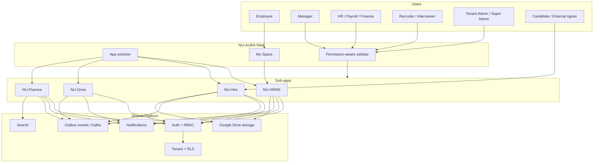
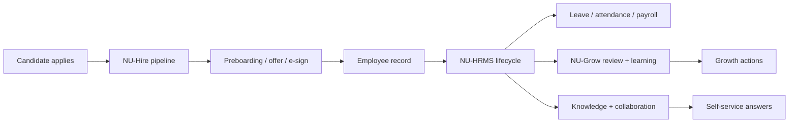

# Application Map

## Purpose

NU-AURA is a multi-tenant HR and people platform delivered as one product shell with four
sub-apps: NU-HRMS, NU-Hire, NU-Grow, and NU-Fluence. This note maps the product at a level a
new stakeholder can understand, then links into the deeper engineering maps for exact routes,
controllers, endpoints, tables, and permissions.

## Current Snapshot

| Area | Current state | Evidence |
|---|---|---|
| Product shape | One Next.js frontend and one Spring Boot modular monolith | [[System-Overview]], `frontend/`, `backend/` |
| App definitions | Four available apps: HRMS, HIRE, GROW, FLUENCE | `frontend/lib/config/apps.ts` |
| Navigation model | App switcher plus app-specific sidebar sections | `frontend/lib/config/apps.ts`, `frontend/components/layout/menuSections.tsx` |
| Security model | AuthGuard, httpOnly JWT cookie, RBAC permissions, tenant RLS | `frontend/app/providers.tsx`, `SecurityConfig.java`, [[Security-Audit]] |
| Code graph | 58,943 nodes / 142,248 edges built from commit `da01fd4c` | [[Graphify-Code-Graph]] |
| Live count sweep | 290 pages, 184 raw `@RestController` files, V316 highest migration | local commands run 2026-06-25 |

## Business App Map

| App | Primary users | What it owns | Entry route | Source note |
|---|---|---|---|---|
| NU-HRMS | Employees, managers, HR, payroll, finance | Employee master, attendance, leave, payroll, expenses, assets, helpdesk, org | `/me/dashboard` | [[Nu-HRMS]] |
| NU-Hire | Recruiters, agencies, interviewers, candidates, onboarding owners | Jobs, applicants, interviews, scorecards, public careers, preboarding, onboarding, exits | `/recruitment` | [[Nu-Hire]] |
| NU-Grow | Employees, managers, HRBP, L&D, leadership | Reviews, OKRs, 360 feedback, LMS, training, recognition, surveys, wellness | `/performance` | [[Nu-Grow]] |
| NU-Fluence | All employees, content owners, admins | Wiki, blogs, templates, drive, wall, search, AI chat | `/fluence/wiki` | [[Nu-Fluence]] |
| Shared Platform | Admins, security, integrations, SRE | Auth, RBAC, tenancy, notifications, integrations, feature flags, audit, files | shared | [[Shared-Platform]] |

## Product Graph

## User Journey Map

## Source Navigation

| Need | Start here |
|---|---|
| Route to page inventory | [[Route-Map-Full]] |
| Route to controller/service/table/permission chain | [[Feature-Traceability]] |
| Backend controller catalog | [[Controller-Index]], [[Endpoint-Index]] |
| Role and permission behavior | [[Roles]], [[Permissions]], [[RBAC-Matrix]] |
| Database and migrations | [[Schema]], [[Table-Index]], [[Migrations]] |
| Runtime request flow | [[Data-Flows]] |
| Code graph lookup | [[Graphify-Code-Graph]] |

## Open Product Questions

- Which modules are in the next commercial pilot scope versus demo-only scope?
- Which roles and default permissions should be included in the first tenant template?
- Which public surfaces need final legal copy: careers, offer portal, privacy, terms, e-sign?
- Which integrations are launch-critical: Slack, DocuSign, Google Drive, payroll export, biometric?

## Related

- [[Product-Delivery-Index]]
- [[Product-Requirements-Document]]
- [[Product-Architecture]]
- [[User-Manual]]
- [[Graphify-Code-Graph]]
