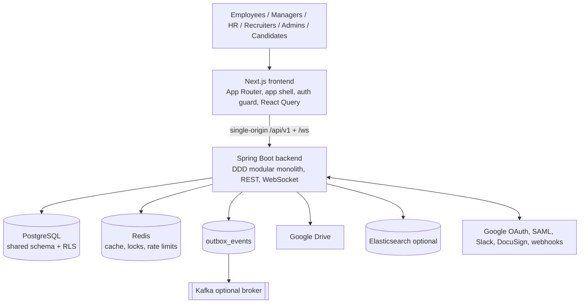
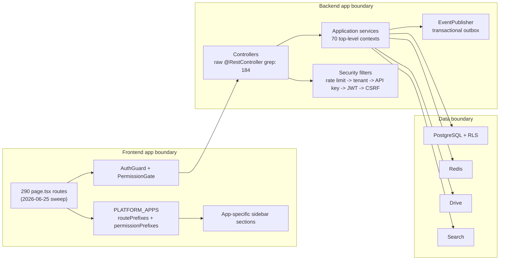
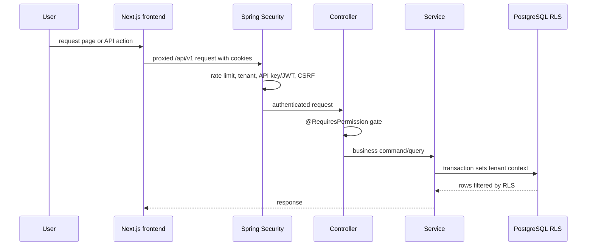

# Product Architecture

## Purpose

This is the stakeholder architecture view for NU-AURA. It explains how the product hangs
together without re-listing every endpoint, table, or component. For implementation detail,
follow the linked C4, data-flow, route, API, and schema notes.

## Architecture Position

NU-AURA is intentionally a modular monolith today:

- One Next.js 16 App Router frontend.
- One Java 21 / Spring Boot 3.5.14 backend.
- One shared PostgreSQL schema with tenant isolation enforced by Row-Level Security.
- Redis, outbox/Kafka, Google Drive, search, notifications, and integrations as shared
  platform services.
- Four logical sub-apps determined by route and permission mapping, not separate deployables.

## Context Diagram

## Container Responsibilities

| Container | Responsibility | Key evidence |
|---|---|---|
| Frontend | App shell, route rendering, permission-aware navigation, React Query data access | `frontend/app`, `frontend/lib/config/apps.ts`, `frontend/app/providers.tsx` |
| Backend API | Controllers, services, RBAC, tenancy, business workflows | `backend/src/main/java/com/nulogic/api`, `application`, `common/security` |
| PostgreSQL | System of record, Flyway migrations, RLS tenant isolation | `backend/src/main/resources/db/migration`, [[Schema]] |
| Redis | Cache, token blacklist, locks, rate limiting, WebSocket relay | [[Code-Patterns]], [[Shared-Platform]] |
| Outbox/Kafka | Durable async event flow for audit, notification, payroll, search | `EventPublisher.java`, [[Data-Flows]] |
| Google Drive | Document, receipt, contract, and attachment storage through abstraction | [[Shared-Platform]] |
| Elasticsearch | Optional full-text read model, especially for Fluence | [[Nu-Fluence]] |

## Application Boundary Diagram

## Security And Tenant Flow

## App Switch And RBAC Model

The frontend resolves the active sub-app from pathname through `getAppForRoute()`.
`useActiveApp()` then checks whether the user has a permission module matching the target
app's `permissionPrefixes`; Super Admin bypasses the app gate. Sidebar sections are mapped by
`APP_SIDEBAR_SECTIONS`.

This creates a product model where:

- All users keep My Space/self-service access.
- Administrative and specialist areas appear only when permissions allow them.
- Public/token flows are handled separately for candidates, preboarding, offers, e-sign,
  webhooks, health, and selected auth paths.

## Design Constraints

- Keep feature code inside existing domain contexts and patterns.
- Do not introduce new Axios clients; use the existing frontend client/services.
- Use React Hook Form + Zod for forms and React Query for data fetching.
- Preserve `@RequiresPermission`, Super Admin bypass, and tenant-scoped data access.
- New database changes require the next Flyway migration and must preserve RLS policy discipline.
- New async side effects should follow the outbox/event pattern unless a local pattern says otherwise.

## Architecture Risks

| Risk | Why it matters | Control |
|---|---|---|
| Shared platform blast radius | Auth, tenancy, cache, and notifications affect every sub-app | Treat WBS-1 as a release gate |
| Route and permission drift | Frontend route/app mapping can diverge from backend permission families | Use [[Feature-Traceability]] and RBAC sweeps |
| RLS regression | A tenant leak is existential for HR/payroll data | Keep RLS tests and startup probes mandatory |
| Operational doc gap | Some runbooks are templated rather than environment-proven | Close WBS-8 before production claims |
| Product breadth | Too many modules for one pilot can hide defects | Select pilot scope explicitly in PRD/WBS |

## Related

- [[C4-Context]]
- [[C4-Container]]
- [[C4-Component]]
- [[Data-Flows]]
- [[Module-Relationships]]
- [[Application-Map]]
- [[Graphify-Code-Graph]]
