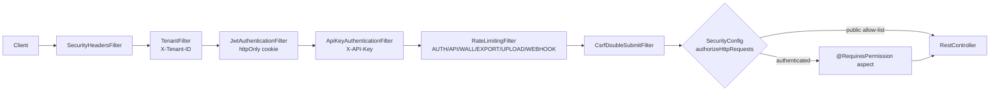

# REST API Reference

NU-AURA's backend exposes a versioned REST API under the `/api/v1` prefix, served by
~150 Spring `@RestController` classes in
`backend/src/main/java/com/nulogic/api`, organized by domain package
(`auth`, `attendance`, `expense`, `payroll`, `knowledge`, …).

This document catalogs the endpoint surface grouped by module. For each group it lists
the base path and notable operations, with authentication and rate-limit notes where the
code makes them explicit.

> Evidence basis: every base path comes from the `@RequestMapping` on the controller
> class; auth rules from
> `backend/src/main/java/com/nulogic/common/config/SecurityConfig.java`; rate limits from
> `RateLimitingFilter` and `DistributedRateLimiter`.

---

## 1. Conventions

### Versioning & prefix

- All business endpoints are mounted under `/api/v1/...`.
- A few infra endpoints sit outside that prefix: `MonitoringController` → `/api/monitoring`,
  `WebhookController` → `/api/webhooks`, `RootProbeController` → `/` (GET/HEAD liveness).

### Authentication

NU-AURA is stateless and cookie-based. The request filter chain (see
`SecurityConfig`) is, in order: security headers → tenant resolution
(`X-Tenant-ID`) → JWT (`JwtAuthenticationFilter`, httpOnly cookie) → API key
(`ApiKeyAuthenticationFilter`, `X-API-Key`) → rate limiting → CSRF double-submit.

`SecurityConfig.authorizeHttpRequests` is **default-deny**: `anyRequest().authenticated()`.
Only the explicitly allow-listed paths below are public.

| Public / unauthenticated path | Mechanism |
|---|---|
| `/`, `/error` | liveness / error |
| `/api/v1/auth/login`, `/google`, `/refresh`, `/forgot-password`, `/reset-password`, `/mfa-login` | pre-auth (allow-list, not wildcard) |
| `/api/v1/tenants/register` | tenant self-signup |
| `/api/v1/external/**` | API-key auth (`X-API-Key`), not JWT |
| `/api/v1/public/careers/**`, `/api/v1/public/offers/**` | token-based candidate access |
| `/api/v1/esignature/external/**` | token-based signing |
| `/api/v1/exit/interview/public/**` | token-based exit interview |
| `/api/v1/preboarding/portal/**` | token-based new-hire portal |
| `/api/v1/biometric/punch`, `/punch/batch` | device API-key |
| `/api/v1/integrations/docusign/webhook` | HMAC-verified webhook |
| `/api/v1/payments/webhooks/**` | provider-signature-verified webhook |
| `/api/v1/integrations/slack/commands`, `/interactions`, `/events` | Slack signing-secret |
| `/ws/**`, `/saml2/**`, `/login/saml2/**`, `/logout/saml2/**` | STOMP / SAML internal |
| `/actuator/health`, `/actuator/health/**` | public health probes |
| `/actuator/prometheus` | dedicated scrape bearer token |
| `/actuator/**`, `/swagger-ui/**`, `/v3/api-docs/**` | role `SUPER_ADMIN` only |

Everything else requires an authenticated session.

### Authorization (RBAC)

Fine-grained access is enforced at the method level via the custom
`@RequiresPermission(Permission.XXX)` annotation (aspect-driven), e.g.
`EmployeeController.create` carries `@RequiresPermission(Permission.EMPLOYEE_CREATE)`.
`SUPER_ADMIN` bypasses the permission aspect. Some sensitive reads use
`revalidate = true` to re-check permissions against the DB rather than the cached set.
A handful of endpoints also use Spring's `@PreAuthorize("isAuthenticated()")` (e.g.
`MfaController`).

### Rate limiting

`RateLimitingFilter` classifies each request URI into a bucket type and applies
Redis-backed (distributed) limits with an in-memory fallback. URI classification
(`determineRateLimitType`) and the canonical limits (`DistributedRateLimiter.RateLimitType`):

| Bucket | Matched URIs | Limit |
|---|---|---|
| `AUTH` | `/api/v1/auth*` | **5 / min** (fails **closed** if Redis down — brute-force guard) |
| `EXPORT` | URIs containing `/export`, `/report`, `/download` | **5 / 5 min** |
| `WALL` | `/api/v1/wall*`, `/api/v1/social*` | **30 / min** |
| `UPLOAD` | URIs containing `/upload`, `/import` | **20 / min** |
| `WEBHOOK` | `/api/v1/webhook*` | **50 / min** |
| `API` (default) | everything else | **100 / min** |

A separate per-tenant-per-resource budget defaults to **1000 req/min**
(`DEFAULT_TENANT_CAPACITY`, tunable via `app.ratelimit.tenant.<resource>.capacity`).
`/` and `/actuator/**` are skipped entirely.

---

## 2. Authentication & Identity

### Auth — `AuthController` (`/api/v1/auth`)

| Method | Path | Auth |
|---|---|---|
| POST | `/login` | public |
| POST | `/google` | public (Google OAuth) |
| POST | `/mfa-login` | public (2nd factor) |
| POST | `/refresh` | public (httpOnly refresh cookie) |
| GET | `/me` | authenticated |
| POST | `/logout` | authenticated |
| POST | `/change-password` | authenticated |
| POST | `/forgot-password`, `/reset-password` | public |

All `/api/v1/auth*` paths are in the `AUTH` rate bucket (5/min, fail-closed).

### MFA — `MfaController` (`/api/v1/auth/mfa`)

`GET /setup`, `POST /verify`, `DELETE /disable`, `GET /status` — all `@PreAuthorize("isAuthenticated()")`.

### SAML SSO — `SamlConfigController` (`/api/v1/auth/saml`)

`GET/POST/PUT/DELETE /config`, `GET /metadata`, `POST /test`, `GET /providers` — per-tenant IdP config. Runtime SAML flows live at `/saml2/**` (handled internally by Spring Security).

### Users / Roles / Permissions

| Controller | Base path | Notable endpoints |
|---|---|---|
| `UserController` | `/api/v1/users` | user CRUD, role assignment |
| `RoleController` | `/api/v1/roles` | role CRUD |
| `PermissionController` | `/api/v1/permissions` | permission catalog |
| `ImplicitRoleRuleController` | `/api/v1/implicit-role-rules` | rule-based role grants |
| `NotificationPreferencesController` | `/api/v1/notification-preferences` | per-user prefs |
| `TenantController` | `/api/v1/tenants` | tenant mgmt; `/register` is public |

---

## 3. Core HR — People & Org

### Employees

| Controller | Base path | Notes |
|---|---|---|
| `EmployeeController` | `/api/v1/employees` | CRUD; `@RequiresPermission(EMPLOYEE_*)` per method |
| `EmployeeDirectoryController` | `/api/v1/employees/directory` | searchable directory |
| `EmployeeDocumentController` | `/api/v1/employees` | document sub-resources |
| `EmployeeSkillController` | `/api/v1/employees` | employee skills |
| `EmployeeImportController` | `/api/v1/employees/import` | bulk import (UPLOAD bucket) |
| `TalentProfileController` | `/api/v1/employees/{id}/talent-profile` | talent profile |
| `EmploymentChangeRequestController` | `/api/v1/employment-change-requests` | change requests / approvals |
| `SelfServiceController` | `/api/v1/self-service` | employee self-service |

### Organization structure

`OrganizationController` (`/api/v1/organization`):

| Method | Path | Purpose |
|---|---|---|
| GET | `/chart` | org chart |
| POST/GET | `/units`, `/units/{id}`, `/units/{id}/children` | org units |
| POST/GET | `/positions`, `/positions/critical`, `/positions/vacancies` | positions |
| POST/GET | `/succession-plans`, `/succession-plans/active`, `/.../high-risk` | succession |
| POST/GET/DELETE | `/succession-plans/{planId}/candidates`, `/.../ready-now` | succession candidates |
| POST/GET/DELETE | `/talent-pools`, `/talent-pools/{poolId}/members/{employeeId}` | talent pools |
| GET | `/analytics`, `/analytics/nine-box` | org analytics |

Other org controllers: `DepartmentController` (`/api/v1/departments`),
`OfficeLocationController` (`/api/v1/office-locations`),
`CustomFieldController` (`/api/v1/custom-fields`).

---

## 4. Attendance & Time

| Controller | Base path | Notable endpoints |
|---|---|---|
| `AttendanceController` | `/api/v1/attendance` | `POST /check-in`, `/check-out`, `/multi-check-in`, `/bulk-check-in`; `GET /today`, `/my-attendance`, `/employee/{id}/range`, `/pending-regularizations`; `POST /{id}/request-regularization`, `/approve-regularization`, `/reject-regularization`; `POST /import` (UPLOAD bucket) |
| `BiometricDeviceController` | `/api/v1/biometric` | device CRUD; `POST /punch`, `/punch/batch` are **public** (device API-key) |
| `MobileAttendanceController` | `/api/v1/mobile/attendance` | mobile check-in/out |
| `CompOffController` | `/api/v1/comp-off` | comp-off requests |
| `ShiftManagementController` | `/api/v1/shifts` | shift/roster mgmt |
| `ShiftSwapController` | `/api/v1/shift-swaps` | swap requests |
| `OvertimeManagementController` | `/api/v1/overtime` | overtime |
| `TimeTrackingController` | `/api/v1/time-tracking` | time entries |
| `HolidayController` | `/api/v1/holidays` | holiday calendar |
| `RestrictedHolidayController` | `/api/v1/restricted-holidays` | optional/restricted holidays |

---

## 5. Leave

| Controller | Base path | Purpose |
|---|---|---|
| `LeaveRequestController` | `/api/v1/leave-requests` | apply / approve / cancel leave |
| `LeaveBalanceController` | `/api/v1/leave-balances` | balances & accrual |
| `LeaveTypeController` | `/api/v1/leave-types` | leave type config |
| `MobileLeaveController` | `/api/v1/mobile/leave` | mobile leave |

---

## 6. Payroll, Compensation & Statutory

| Controller | Base path | Purpose |
|---|---|---|
| `PayrollController` | `/api/v1/payroll` | payroll runs |
| `GlobalPayrollController` | `/api/v1/global-payroll` | multi-region payroll |
| `PayrollStatutoryController` | `/api/v1/payroll/statutory` | statutory deductions |
| `StatutoryFilingController` | `/api/v1/payroll/statutory-filings` | filings |
| `BonusController` | `/api/v1/payroll/bonus` | bonuses |
| `CompensationController` | `/api/v1/compensation` | comp review |
| `LWFController` | `/api/v1/payroll/lwf` | Labour Welfare Fund |
| `ProvidentFundController` | `/api/v1/statutory/pf` | PF |
| `ESIController` | `/api/v1/statutory/esi` | ESI |
| `ProfessionalTaxController` | `/api/v1/statutory/pt` | professional tax |
| `TDSController` | `/api/v1/statutory/tds` | TDS |
| `StatutoryContributionController` | `/api/v1/statutory/contributions` | contributions |
| `TaxDeclarationController` | `/api/v1/tax-declarations` | employee tax declarations |
| `BudgetPlanningController` | `/api/v1/budget` | budget planning |

---

## 7. Expense & Travel

| Controller | Base path | Purpose |
|---|---|---|
| `ExpenseClaimController` | `/api/v1/expenses` | `POST /` create, `/{id}/submit`, `/approve`, `/reject`, `/pay`, `/reimburse`, `/cancel`; `GET /pending-approvals`, `/summary`, `/validate-policy` |
| `ExpenseItemController` | `/api/v1/expenses/claims/{claimId}/items` | line items |
| `ExpenseCategoryController` | `/api/v1/expenses/categories` | categories |
| `ExpensePolicyController` | `/api/v1/expenses/policies` | policies |
| `ExpenseAdvanceController` | `/api/v1/expenses/advances` | cash advances |
| `ExpenseReportController` | `/api/v1/expenses/reports` | reports (EXPORT bucket) |
| `MileageController` | `/api/v1/expenses/mileage` | mileage logs |
| `MileagePolicyController` | `/api/v1/expenses/mileage/policies` | mileage policy |
| `OcrReceiptController` | `/api/v1/expenses/receipts` | OCR receipt scan |
| `TravelController` | `/api/v1/travel` | travel requests |
| `TravelExpenseController` | `/api/v1/travel/expenses` | travel expenses |

---

## 8. Recruitment & Onboarding (NU-Hire)

| Controller | Base path | Purpose |
|---|---|---|
| `RecruitmentController` | `/api/v1/recruitment` | jobs / pipeline |
| `ApplicantController` | `/api/v1/recruitment/applicants` | candidate tracking |
| `AgencyController` | `/api/v1/recruitment/agencies` | staffing agencies |
| `AIRecruitmentController` | `/api/v1/recruitment/ai` | AI screening / match |
| `JobBoardController` | `/api/v1/recruitment/job-boards` | board integrations |
| `ScorecardController` | `/api/v1/recruitment/scorecards` | interview scorecards |
| `ReferralController` | `/api/v1/referrals` | employee referrals |
| `PublicCareerController` | `/api/v1/public/careers` | **public** job listings |
| `PublicOfferController` | `/api/v1/public/offers` | **public** offer portal (token) |
| `PreboardingController` | `/api/v1/preboarding` | preboarding; `/portal/**` is public |
| `OnboardingManagementController` | `/api/v1/onboarding` | onboarding tasks |
| `ProbationController` | `/api/v1/probation` | probation cases |

---

## 9. Performance & Growth (NU-Grow)

| Controller | Base path | Purpose |
|---|---|---|
| `PerformanceReviewController` | `/api/v1/reviews` | reviews |
| `ReviewCycleController` | `/api/v1/review-cycles` | review cycles |
| `PerformanceRevolutionController` | `/api/v1/performance/revolution` | continuous performance |
| `PIPController` | `/api/v1/performance/pip` | improvement plans |
| `GoalController` | `/api/v1/goals` | goals |
| `OkrController` | `/api/v1/okr` | OKRs |
| `FeedbackController` | `/api/v1/feedback` | feedback |
| `Feedback360Controller` | `/api/v1/feedback360` | 360 feedback |
| `LmsController` | `/api/v1/lms` | courses, quizzes, progress, certificates, skill-gaps |
| `QuizController` | `/api/v1/lms/quizzes` | quiz authoring |
| `CourseEnrollmentController` | `/api/v1/lms` | enrollments |
| `TrainingManagementController` | `/api/v1/training` | training |
| `WellnessController` | `/api/v1/wellness` | wellness |
| `SurveyManagementController` | `/api/v1/survey-management` | surveys |
| `SurveyAnalyticsController` | `/api/v1/survey-analytics` | survey analytics |
| `PulseSurveyController` | `/api/v1/surveys` | pulse surveys |
| `RecognitionController` | `/api/v1/recognition` | recognition / awards |

`LmsController` highlights: `GET /catalog`, `/courses/published`, `/dashboard`,
`/my-certificates`, `/certificates/verify/{certificateNumber}`,
`/employees/{employeeId}/skill-gaps`; `POST /courses`, `/courses/{id}/publish`,
`/quizzes/{quizId}/questions`.

---

## 10. Knowledge & Content (NU-Fluence)

| Controller | Base path | Purpose |
|---|---|---|
| `WikiPageController` | `/api/v1/knowledge/wiki/pages` | wiki pages |
| `WikiSpaceController` | `/api/v1/knowledge/wiki/spaces` | wiki spaces |
| `WikiInlineCommentController` | `/api/v1/knowledge/wiki/...` | inline comments (method-level paths) |
| `BlogPostController` | `/api/v1/knowledge/blogs` | blogs |
| `BlogCategoryController` | `/api/v1/knowledge/blogs/categories` | blog categories |
| `TemplateController` | `/api/v1/knowledge/templates` | content templates |
| `KnowledgeSearchController` | `/api/v1/knowledge/search` | knowledge search |
| `FluenceSearchController` | `/api/v1/fluence/search` | Fluence search |
| `FluenceChatController` | `/api/v1/fluence/chat` | AI chat |
| `FluenceCommentController` | `/api/v1/fluence/comments` | comments |
| `FluenceActivityController` | `/api/v1/fluence/activities` | activity feed |
| `FluenceAttachmentController` | `/api/v1/fluence/attachments` | attachments |
| `FluenceEditLockController` | `/api/v1/fluence/edit-lock` | distributed edit locks |
| `ContentEngagementController` | `/api/v1/fluence/engagement` | engagement |
| `ContentViewController` | `/api/v1/views` | content view tracking |
| `LinkedinPostController` | `/api/v1/linkedin-posts` | LinkedIn posts |

### Wall — `WallController` (`/api/v1/wall`)

`POST/GET /posts`, `GET /posts/type/{type}`, `GET/PUT/DELETE /posts/{postId}`,
`PATCH /posts/{postId}/pin`, `POST/DELETE /posts/{postId}/reactions`,
`POST/GET /posts/{postId}/comments`, `GET /comments/{commentId}/replies`,
`POST/DELETE /posts/{postId}/vote`, `GET /praise/employee/{employeeId}`.
All `/api/v1/wall*` requests use the **WALL** rate bucket (30/min).

---

## 11. Contracts, Letters & E-Signature

| Controller | Base path | Notable endpoints |
|---|---|---|
| `ContractController` | `/api/v1/contracts` | CRUD; `PATCH /{id}/mark-active`, `/terminate`, `/renew`; `POST /{id}/send-for-signing`, `/record-signature`; `GET /expiring`, `/expired`, `/{id}/versions` |
| `ContractTemplateController` | `/api/v1/contracts/templates` | contract templates |
| `ESignatureController` | `/api/v1/esignature` | signing; `/external/**` is **public** (token) |
| `DocuSignController` | `/api/v1/integrations/docusign` | DocuSign; `/webhook` is public (HMAC) |
| `LetterController` | `/api/v1/letters` | HR letters |

---

## 12. Exit & Offboarding

| Controller | Base path | Purpose |
|---|---|---|
| `ExitManagementController` | `/api/v1/exit` | exit process; `/interview/public/**` is public |
| `FnFController` | `/api/v1/exit` | full-and-final settlement |
| `OffboardingController` | `/api/v1/offboarding` | offboarding tasks |

---

## 13. Finance — Loans, Payments, Benefits

| Controller | Base path | Notable endpoints |
|---|---|---|
| `LoanController` | `/api/v1/loans` | `POST /` apply; `/{id}/approve`, `/reject`, `/disburse`, `/activate`, `/repayment`, `/cancel`; `GET /my`, `/pending`, `/active` |
| `PaymentController` | `/api/v1/payments` | payments |
| `PaymentConfigController` | `/api/v1/payments/config` | payment config |
| `PaymentWebhookController` | `/api/v1/payments/webhooks` | **public** provider webhooks (signature-verified) |
| `BenefitManagementController` | `/api/v1/benefits` | benefit plans / enrollment |
| `BenefitEnhancedController` | `/api/v1/benefits-enhanced` | enhanced benefits |
| `AssetManagementController` | `/api/v1/assets` | asset issue / recovery |

---

## 14. Projects, PSA & Resource Management

| Controller | Base path | Purpose |
|---|---|---|
| `ProjectController` | `/api/v1/projects` | projects |
| `ProjectTimesheetController` | `/api/v1/project-timesheets` | project timesheets |
| `ResourceController` | `/api/v1/resources` | resource staffing |
| `ResourceManagementController` | `/api/v1/resource-management` | resource mgmt |
| `ResourceConflictController` | `/api/v1/resource-management/conflicts` | allocation conflicts |
| `ResourcePoolController` | `/api/v1/resource-pools` | pools |
| `PSAProjectController` | `/api/v1/psa/projects` | professional-services projects |
| `PSATimesheetController` | `/api/v1/psa/timesheets` | PSA timesheets |
| `PSAInvoiceController` | `/api/v1/psa/invoices` | PSA invoices |

---

## 15. Engagement & Communication

| Controller | Base path | Purpose |
|---|---|---|
| `AnnouncementController` | `/api/v1/announcements` | announcements |
| `NotificationController` | `/api/v1/notifications` | in-app notifications |
| `MultiChannelNotificationController` | `/api/v1/notifications` | multi-channel delivery |
| `SmsNotificationController` | `/api/v1/notifications/sms` | SMS |
| `MeetingController` | `/api/v1/one-on-one` | 1:1 meetings |
| `OneOnOneMeetingController` | `/api/v1/meetings` | meetings |
| `CalendarController` | `/api/v1/calendar` | calendar |
| `HelpdeskController` | `/api/v1/helpdesk` | helpdesk tickets |
| `HelpdeskSLAController` | `/api/v1/helpdesk/sla` | SLA config |

---

## 16. Workflow & Approvals

| Controller | Base path | Purpose |
|---|---|---|
| `WorkflowController` | `/api/v1/workflow` | workflow definitions |
| `ApprovalsController` | `/api/v1/approvals` | approval inbox |
| `ApprovalEscalationController` | `/api/v1/escalation` | escalation rules |

---

## 17. Analytics, Reporting & Dashboards

| Controller | Base path | Purpose |
|---|---|---|
| `AnalyticsController` | `/api/v1/analytics` | core analytics |
| `AdvancedAnalyticsController` | `/api/v1/analytics/advanced` | advanced analytics |
| `OrganizationHealthController` | `/api/v1/analytics/org-health` | org health |
| `PredictiveAnalyticsController` | `/api/v1/predictive-analytics` | predictions |
| `DashboardController` | `/api/v1/dashboard` | dashboard |
| `DashboardsController` | `/api/v1/dashboards` | dashboards |
| `HomeController` | `/api/v1/home` | home summary |
| `ReportController` | `/api/v1/reports` | reports (EXPORT bucket) |
| `CustomReportController` | `/api/v1/reports/custom` | custom reports |
| `ScheduledReportController` | `/api/v1/scheduled-reports` | scheduled reports |
| `ExportController` | `/api/v1/export` | exports (EXPORT bucket) |

---

## 18. Compliance, Audit & Data Subject Rights

| Controller | Base path | Purpose |
|---|---|---|
| `ComplianceController` | `/api/v1/compliance` | compliance |
| `AuditLogController` | `/api/v1/audit`, `/api/v1/audit-logs` | audit log queries (dual mapping) |
| `DsrController` | `/api/v1/me/dsr` | self-service data subject requests |
| `DsrAdminFulfillmentController` | `/api/v1/admin/dsr` | DSR fulfillment (admin) |

---

## 19. Integrations & External APIs

| Controller | Base path | Notes |
|---|---|---|
| `IntegrationController` | `/api/v1/integrations` | integration registry |
| `IntegrationConnectorController` | `/api/v1/integrations` | connectors |
| `SlackCommandController` | `/api/v1/integrations/slack` | `/commands`, `/interactions`, `/events` are **public** (signing-secret) |
| `WebhookController` | `/api/webhooks` | webhook delivery (note: outside `/api/v1`) |
| `WebhookRotationController` | `/api/v1/admin/webhooks` | secret rotation |
| `KekaImportController` | `/api/v1/keka-import` | KEKA migration import |
| `DataMigrationController` | `/api/v1/migration` | data migration |
| `FileUploadController` | `/api/v1/files` | file upload (UPLOAD bucket) |

External partner integrations authenticate via `X-API-Key` under `/api/v1/external/**`
(allow-listed to the `ApiKeyAuthenticationFilter`, not the JWT path).

---

## 20. Platform & Admin

| Controller | Base path | Auth |
|---|---|---|
| `PlatformController` | `/api/v1/platform` | authenticated |
| `RootProbeController` | `/` | public liveness (GET/HEAD) |
| `MonitoringController` | `/api/monitoring` | authenticated (outside `/api/v1`) |
| `AdminController` | `/api/v1/admin` | admin |
| `SystemAdminController` | `/api/v1/admin/system` | admin |
| `SystemAuditLogController` | `/api/v1/admin/system/audit-logs` | admin |
| `KafkaAdminController` | `/api/v1/admin/kafka` | admin |
| `EncryptionBackfillController` | `/api/v1/admin/encryption-backfill` | admin |
| `FeatureFlagController` | `/api/v1/admin/feature-flags` | admin |

`/actuator/**`, Swagger UI, and `/v3/api-docs/**` require role `SUPER_ADMIN`
(except `/actuator/health*`, which is public, and `/actuator/prometheus`, which uses a
scrape bearer token).

---

## 21. Mobile API

A dedicated mobile surface mirrors core flows under `/api/v1/mobile/*`:

| Controller | Base path |
|---|---|
| `MobileDashboardController` | `/api/v1/mobile/dashboard` |
| `MobileApprovalController` | `/api/v1/mobile/approvals` |
| `MobileLeaveController` | `/api/v1/mobile/leave` |
| `MobileAttendanceController` | `/api/v1/mobile/attendance` |
| `MobileNotificationController` | `/api/v1/mobile/notifications` |
| `MobileSyncController` | `/api/v1/mobile/sync` |

---

## 22. Request flow summary

---

## Source references

- Controllers: `backend/src/main/java/com/nulogic/api/**/*Controller.java`
- Security & public allow-list: `backend/src/main/java/com/nulogic/common/config/SecurityConfig.java`
- Rate limiting: `RateLimitingFilter` and `DistributedRateLimiter` (`backend/src/main/java/com/nulogic/common/config/`)
- Permission enforcement: `@RequiresPermission` (e.g. `backend/src/main/java/com/nulogic/api/employee/EmployeeController.java`)
