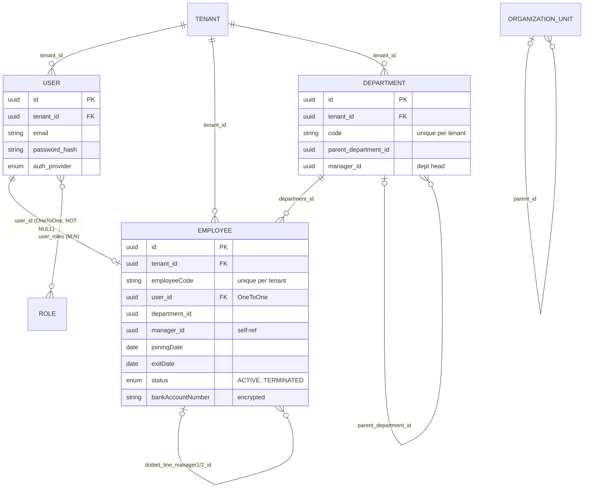

# Database Reference

NU-AURA runs on **PostgreSQL** (Neon for dev, PostgreSQL 16 for prod) with a
**shared-database / shared-schema** multi-tenancy model. Schema is owned and
versioned by **Flyway** (`backend/src/main/resources/db/migration/`, `V0`–`V294`,
283 files). JPA entities live under `backend/src/main/java/com/nulogic/domain/`
(304 `@Entity` classes across 65 domain packages; 204 of them are tenant-scoped).

> Evidence basis: counts and structures below were read directly from the entity
> classes and migration files cited inline. The `V0__init.sql` header states the
> baseline was "Generated from 244 JPA entities"; the domain tree has since grown
> to 304 entities via later migrations.

---

## 1. Base entity model

Every persistent type descends from one of two mapped superclasses in
`backend/src/main/java/com/nulogic/common/entity/`.

### `BaseEntity` (`BaseEntity.java`)

`@MappedSuperclass` providing identity, auditing, optimistic locking, and soft
delete to all entities:

| Column        | Java field       | Notes                                              |
|---------------|------------------|----------------------------------------------------|
| `id`          | `UUID id`        | `@GeneratedValue(strategy = UUID)`, `updatable=false` |
| `created_at`  | `createdAt`      | `@CreatedDate`, `updatable=false`                  |
| `updated_at`  | `updatedAt`      | `@LastModifiedDate`                                |
| `created_by`  | `createdBy`      | `@CreatedBy` (UUID), `updatable=false`             |
| `updated_by`  | `lastModifiedBy` | `@LastModifiedBy` (UUID)                           |
| `version`     | `version` (Long) | `@Version` optimistic lock                         |
| `is_deleted`  | `isDeleted`      | `NOT NULL DEFAULT FALSE`; soft-delete flag         |
| `deleted_at`  | `deletedAt`      | timestamp set by `softDelete()`                    |

Auditing is wired via `@EntityListeners(AuditingEntityListener.class)`.

### `TenantAware` (`TenantAware.java`)

Extends `BaseEntity`, adds the multi-tenancy discriminator:

```java
@Column(nullable = false, updatable = false)
private UUID tenantId;
```

`@EntityListeners(TenantEntityListener.class)` stamps `tenant_id` on insert.
The 204 entities that extend `TenantAware` are the tenant-scoped tables; the
remainder (e.g. `tenants` itself, certain join/lookup tables) extend `BaseEntity`
directly. Note `tenants` carries a nullable `tenant_id` column in `V0__init.sql`
because it inherits the audit layout but is the tenancy root.

### Soft delete

Tenant entities are annotated `@SQLRestriction("is_deleted = false")` (Hibernate
6 idiom — replaces the deprecated `@Where`). Every `SELECT` Hibernate issues is
silently filtered to non-deleted rows. Verified on `Employee`, `Department`,
`PayrollRun`, `EmployeePayrollRecord`, `LeaveRequest`.

---

## 2. Multi-tenancy and Row-Level Security (RLS)

Isolation is **two-layered**:

1. **Application layer (primary guard).** `TenantContext` (ThreadLocal `UUID`)
   is populated by `TenantFilter` from the `X-Tenant-ID` header / JWT claim.
   Every repository filters by `tenant_id`, and `DataScopeService` adds
   per-user data-scope rules. This is the authoritative enforcement path
   (see `V24__fix_rls_policies.sql` architecture note).
2. **PostgreSQL RLS (defence-in-depth).** Policies keyed on the session GUC
   `app.current_tenant_id`, which `TenantRlsTransactionManager` /
   `TenantAwareDataSourceConfig` set per transaction / per connection.

```mermaid
flowchart LR
  REQ[HTTP request] --> TF[TenantFilter<br/>sets TenantContext ThreadLocal]
  TF --> TX[TenantRlsTransactionManager<br/>SET LOCAL app.current_tenant_id]
  TX --> REPO[JPA repo<br/>WHERE tenant_id = ?]
  REPO --> RLS[PostgreSQL RLS policy<br/>tenant_id = current_setting&#40;...&#41;]
  RLS --> DB[(rows for this tenant only)]
```



### RLS policy evolution (fail-open → fail-closed)

The model hardened over several migrations. Key checkpoints, read from the
migration headers:

| Migration | Change |
|-----------|--------|
| `V0__init.sql` | Baseline; some tables had RLS enabled with **no** policies |
| `V24__fix_rls_policies.sql` | Fixed two defects: (A) 15 Fluence/Knowledge tables had `ENABLE ROW LEVEL SECURITY` with zero policies → deny-by-default lockout; (B) Contract policies referenced a GUC the app never set. Both replaced with **permissive** `USING(true)` policies, deferring isolation to the app layer |
| `V36–V41, V65, V81` | Created RESTRICTIVE `<table>_tenant_rls` policies with a **graceful `OR NULL` fallback** (passed all rows when the GUC was unset) |
| `V177__strict_tenant_rls_policies.sql` | Dropped the `OR NULL`/empty escape → strict `tenant_id = current_setting('app.current_tenant_id', true)::uuid`; unset GUC yields `NULL` → zero rows. Introduced the **`nu_migration`** role (`BYPASSRLS`) so Flyway/operators can run DDL across tenants; runtime role must **not** have `BYPASSRLS` |
| `V254__enforce_runtime_rls_fail_closed.sql` | Reasserts **`NOBYPASSRLS`** on runtime role `nu_app_rls`; adds a universal restrictive `rls_ctx_required_<hash>` policy to **every** public table with a UUID `tenant_id` (PostgreSQL ANDs all restrictive policies, so this overlays older leaky ones). SuperAdmin bypass stays application-layer only — no DB role exception |

Policy expression patterns now in force:

```sql
-- Strict tenant match (V177)
USING (tenant_id = current_setting('app.current_tenant_id', true)::uuid)

-- Restrictive context-required overlay (V254): GUC must be non-empty AND match
USING (
  NULLIF(current_setting('app.current_tenant_id', true), '') IS NOT NULL
  AND tenant_id = current_setting('app.current_tenant_id', true)::uuid
)
```

### Startup canary

`backend/.../common/security/RlsStartupProbe.java` opens a connection
**without** setting `app.current_tenant_id` and asserts
`SELECT COUNT(*) FROM employees` returns `0`. Boot fails if a policy regression
reintroduces a cross-tenant leak (referenced in `V177` and `V254` headers).

---

## 3. Schema by domain

The 65 domain packages under `com/nulogic/domain/` map to table groups. Major
clusters (grounded in entity files + cited migrations):

| Domain cluster | Representative tables | Source |
|----------------|-----------------------|--------|
| **Tenant & access control** | `tenants`, `users`, `roles`, `permissions`, `user_roles` (M:N join) | `V0__init.sql`; `User.java`, `Role.java` |
| **Org & staffing** | `employees`, `departments`, `organization_units`, `positions`, `office_locations`, talent pool / succession | `Employee.java`, `Department.java`, `OrganizationUnit.java` |
| **Attendance & time** | `attendance_records`, `shift_assignments`, `rosters`, `comp_time_balances` | shift/timetracking migrations (e.g. `V89`, `V104`) |
| **Leave** | `leave_requests`, `leave_balances`, `leave_types`, `restricted_holidays` | `LeaveRequest.java`; `V85`, `V294` |
| **Payroll & comp** | `payroll_runs`, `global_payroll_runs`, `employee_payroll_records`, `salary_structures`, `payroll_components`, statutory (PF/ESI/TDS/LWF) | `PayrollRun.java`, `EmployeePayrollRecord.java`; `V82`, `V87`, `V101` |
| **Benefits & wellness** | `benefit_plans`, `benefit_enrollments`, `benefit_claims`, loans | benefits migrations |
| **Performance & dev** | `performance_review_cycles`, `performance_reviews`, `performance_goals`, feedback | `V95`, `V108` |
| **Recruitment & onboarding** | `applicants`, `recruitment_jobs`, `job_applications`, preboarding/onboarding, probation | `V6`, `V7` |
| **Knowledge (NU-Fluence)** | `wiki_spaces`, `wiki_pages`, `wiki_page_versions`, `blog_posts`, `document_templates` | `V15`, `V24` |
| **Engagement** | `announcements`, `wall_posts`, `recognition_*`, surveys | `V94`, `V98`, `V109` |
| **Contract & legal** | `contracts`, `contract_templates`, eSign documents/recipients | `V16` |
| **Compliance & audit** | `audit_logs`, statutory filing, background verification | `V14`, `V87` |
| **Project / PSA** | `projects`, `project_employees`, allocation requests | `V4` |
| **Integration** | `saml_identity_providers`, webhook config/events, notification templates | `V84` |

Common conventions across groups:

- **Composite tenant-scoped uniqueness** — natural keys include `tenant_id`,
  e.g. `employees(employeeCode, tenantId)` unique
  (`idx_employee_code_tenant`), `departments(code, tenantId)` unique,
  `payroll_runs(tenantId, payPeriodMonth, payPeriodYear)` unique.
- **Tenant-prefixed indexes** on hot query paths
  (`idx_employee_tenant`, `idx_payroll_tenant`, `idx_payroll_status`).
- **Field-level encryption** — sensitive columns use a JPA `@Convert` with
  `EncryptedStringConverter`. On `Employee`: `bankAccountNumber`,
  `bankIfscCode`, `taxId`.

---

## 4. Core cluster ER diagrams

### Employee / Org cluster

Verified against `Employee.java`, `Department.java`, `OrganizationUnit.java`,
`User.java`, `Role.java`. `Employee` holds soft FK columns (`UUID`) to
department/manager rather than mapped associations, except a real `@OneToOne`
to `User`.



### Payroll cluster

Verified against `PayrollRun.java` and `EmployeePayrollRecord.java`.
`EmployeePayrollRecord` has a real `@ManyToOne` to `GlobalPayrollRun`
(`payroll_run_id`, NOT NULL); employee/department links are denormalized UUID +
name columns for run-time immutability. Amounts are stored in both local and
base currency with the `exchange_rate` used.

```mermaid
erDiagram
    TENANT ||--o{ PAYROLL_RUN : "tenant_id"
    TENANT ||--o{ GLOBAL_PAYROLL_RUN : "tenant_id"
    GLOBAL_PAYROLL_RUN ||--o{ EMPLOYEE_PAYROLL_RECORD : "payroll_run_id (ManyToOne)"
    EMPLOYEE ..o{ EMPLOYEE_PAYROLL_RECORD : "employee_id (denormalized)"

    PAYROLL_RUN {
        uuid id PK
        uuid tenant_id FK
        int payPeriodMonth "unique w/ year+tenant"
        int payPeriodYear
        date payrollDate
        enum status "DRAFT->PROCESSING->PROCESSED->APPROVED->LOCKED"
    }
    EMPLOYEE_PAYROLL_RECORD {
        uuid id PK
        uuid tenant_id FK
        uuid payroll_run_id FK
        uuid employee_id
        string local_currency
        decimal gross_pay_local
        decimal net_pay_local
        decimal exchange_rate
        decimal net_pay_base
        enum status "PENDING..PAID"
    }
```

`PayrollRun` enforces a state machine in the entity (`markProcessing` → `process`
→ `approve` → `lock`, with `markFailed` rollback), guarding against duplicate
submissions.

---

## 5. Notable relationship & integrity patterns

| Pattern | Where | Detail |
|---------|-------|--------|
| Self-referential hierarchy | `employees.manager_id`, `departments.parent_department_id`, `organization_units.parent_id` | Org/reporting trees via nullable UUID FK columns |
| Matrix reporting | `employees.dotted_line_manager1_id` / `2_id` | Informational dotted-line managers (own indexes) |
| Soft FK by UUID | most `*_id` columns | Many associations are plain `UUID` columns, not JPA-mapped relations — keeps aggregates decoupled and tenant-scoped |
| Mapped associations | `Employee→User` (`@OneToOne`), `EmployeePayrollRecord→GlobalPayrollRun` (`@ManyToOne LAZY`), `User↔Role` (`@ManyToMany` via `user_roles`) | The few hard FK relationships in the model |
| Tenant-scoped unique | `employees(employeeCode,tenantId)`, `departments(code,tenantId)`, `payroll_runs(tenantId,month,year)` | All natural-key uniqueness includes `tenant_id` |
| DB-level temporal integrity | `V294__leave_overlap_exclusion_constraint.sql` | PostgreSQL `EXCLUDE USING GIST (tenant_id WITH =, employee_id WITH =, daterange WITH &&)` prevents overlapping approved leave per employee; requires `btree_gist` extension |
| Optimistic locking | `version` on every entity (`@Version`) | Concurrent-update protection |

---

## 6. Migration & operations notes

- **Versioning:** `V<n>__<slug>.sql`, applied in order from `V0__init.sql`
  (12,742-line baseline) to `V294`. Numeric gaps exist for skipped/rolled-back
  versions.
- **Extensions:** `pgcrypto` (`gen_random_uuid()`, `V0`); `btree_gist`
  (`V294`).
- **Roles:** Flyway/DDL runs as `nu_migration` (`BYPASSRLS`); the runtime
  application role `nu_app_rls` is `NOBYPASSRLS` so RLS always applies to
  application traffic.
- **RLS verification gate:** `RlsStartupProbe` is a boot-time canary; CI must
  prove fail-closed isolation against a `NOBYPASSRLS` role.

---

### Key source files

| Concern | Path |
|---------|------|
| Audit/identity base | `backend/src/main/java/com/nulogic/common/entity/BaseEntity.java` |
| Tenant base | `backend/src/main/java/com/nulogic/common/entity/TenantAware.java` |
| Employee / Department | `backend/src/main/java/com/nulogic/domain/employee/{Employee,Department}.java` |
| Payroll | `backend/src/main/java/com/nulogic/domain/payroll/{PayrollRun,EmployeePayrollRecord}.java` |
| Leave | `backend/src/main/java/com/nulogic/domain/leave/LeaveRequest.java` |
| RLS startup canary | `backend/src/main/java/com/nulogic/common/security/RlsStartupProbe.java` |
| Schema baseline | `backend/src/main/resources/db/migration/V0__init.sql` |
| RLS hardening | `backend/src/main/resources/db/migration/{V24,V177,V254}__*.sql` |
| Leave overlap constraint | `backend/src/main/resources/db/migration/V294__leave_overlap_exclusion_constraint.sql` |
