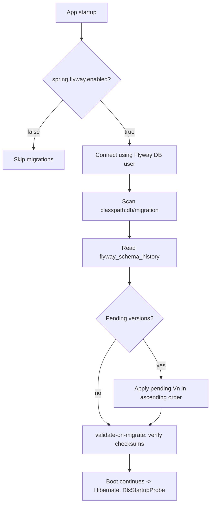

# Database Migrations — Flyway Reference

NU-AURA uses [Flyway](https://flywaydb.org/) for versioned, forward-only PostgreSQL
schema management. All migrations live as plain `.sql` files in a single directory and are
applied automatically on application startup.

**Source of truth:** `backend/src/main/resources/db/migration/`

---

## At a Glance

| Aspect | Value |
|---|---|
| Migration tool | Flyway (Spring Boot auto-configured) |
| Migration location | `backend/src/main/resources/db/migration/` |
| Default schema | `public` |
| Migration type | Versioned only (no repeatable `R__` migrations) |
| File count | 283 migration files |
| Version range | **V0** (`V0__init.sql`) → **V294** (`V294__leave_overlap_exclusion_constraint.sql`) |
| Baseline | `V0__init.sql` — full schema generated from 244 JPA entities |
| Numeric gaps | V0→V2, V26→V30, V272→V277, V277→V282 (skipped/reserved numbers) |

> Verified against directory listing and `application.yml` / `application-prod.yml` on
> 2026-06-16.

---

## Versioning Scheme

Migrations follow Flyway's standard versioned-migration convention:

```
V<version>__<description>.sql
```

| Part | Rule | Example |
|---|---|---|
| `V` prefix | Capital `V` marks a versioned migration | `V177` |
| `<version>` | Monotonically increasing integer | `0`, `2`, `177`, `294` |
| `__` | Double underscore separates version from description | — |
| `<description>` | Lowercase `snake_case` slug describing intent | `strict_tenant_rls_policies` |
| `.sql` | Plain SQL (no Java/callback migrations) | — |

Evidence of the scheme across the range:

- `V0__init.sql` — baseline
- `V24__fix_rls_policies.sql`
- `V177__strict_tenant_rls_policies.sql`
- `V254__enforce_runtime_rls_fail_closed.sql`
- `V294__leave_overlap_exclusion_constraint.sql`

### Numbering Notes

- Numbers are **not contiguous** — there are deliberate gaps (V0→V2, V26→V30,
  V272→V277, V277→V282). Flyway does not require gapless numbering; it applies
  whatever versioned files exist, in ascending order.
- The baseline file is named `V0__init.sql`, though its in-file header comment refers to
  it as "V1: Complete baseline schema" — the filename version (`V0`) is what Flyway uses.
- There are **no repeatable migrations** (`R__*.sql`); every change is a discrete,
  ordered version.

---

## Naming Conventions (by intent)

The description slug encodes the migration's purpose. Recurring prefixes/patterns:

| Slug pattern | Meaning | Example |
|---|---|---|
| `create_*` / `*_schema` / `*_tables` | New table(s) / domain schema | `V100__create_mileage_tables.sql` |
| `add_*_column(s)` / `align_*_columns` | Column additions / entity-column alignment | `V219__align_organization_unit_entity_columns.sql` |
| `*_index` / `*_indexes` | Index creation / performance tuning | `V172__hot_path_indexes.sql` |
| `seed_*` / `*_seed_data` | Reference / demo data seeding | `V171__seed_data.sql` |
| `fix_*` | Defect remediation (schema or data) | `V90__fix_rls_policies_and_schema_corrections.sql` |
| `*_rls*` | Row-Level Security policy work | `V177__strict_tenant_rls_policies.sql` |
| `grant_*` / `*_permissions` | RBAC permission / role grants | `V289__grant_tenant_admin_full_permissions.sql` |
| `tenant_fks_batch_N_*` | Multi-tenant foreign-key hardening (batched) | `V157__tenant_fks_batch_1_core_hr.sql` |
| `*_unique_constraint` / `*_constraint` | Integrity constraints | `V294__leave_overlap_exclusion_constraint.sql` |
| `encrypt_*` | Field-level PII encryption | `V147__encrypt_pii_columns.sql` |

The large `V181`–`V251` and `V257`–`V261` band is dominated by `align_*_entity_columns`
migrations — a systematic sweep reconciling JPA entity definitions with the physical
schema.

---

## How Migrations Are Applied

Flyway runs at application startup (Spring Boot integration). Behavior differs between the
default profile and production.



### Configuration — default (`application.yml`)

```yaml
spring:
  flyway:
    enabled: ${FLYWAY_ENABLED:true}
    locations: classpath:db/migration
    default-schema: public
    baseline-on-migrate: true
    baseline-version: 18
    out-of-order: true
    validate-on-migrate: true
    repair-on-migrate: false   # reverted after V113/V115 checksums repaired
    clean-disabled: true
    mixed: true
    placeholders:
      demoCredentialsEnabled: ${DEMO_CREDENTIALS_ENABLED:false}
    postgresql:
      transactional-lock: false   # required for CREATE INDEX CONCURRENTLY
```

### Configuration — production (`application-prod.yml`)

Production tightens the defaults — migrations are an explicit operator action, not
permissive local behavior:

```yaml
spring:
  flyway:
    enabled: true
    url: ${FLYWAY_URL}
    user: ${FLYWAY_USER}
    password: ${FLYWAY_PASSWORD}
    clean-disabled: true          # prevent accidental schema destruction
    validate-on-migrate: true
    baseline-on-migrate: false    # no implicit baselining in prod
    out-of-order: false           # strict ascending order only
    repair-on-migrate: false
    placeholders:
      demoCredentialsEnabled: ${DEMO_CREDENTIALS_ENABLED:false}
    postgresql:
      transactional-lock: false
```

### Key Operational Points (evidence-grounded)

- **Dedicated Flyway DB user.** Prod runs migrations as a separate role
  (`FLYWAY_USER`) with `BYPASSRLS` for DDL. The runtime application role is
  `NOBYPASSRLS` and fails closed without tenant context (see `V254`). This keeps schema
  changes and tenant-scoped queries on different privilege levels.
- **`clean-disabled: true` everywhere.** `flyway clean` (drop-everything) is blocked in
  all profiles to prevent catastrophic data loss.
- **`out-of-order` differs by environment.** Allowed in dev (`true`) for local
  branch-merging convenience; **forbidden in prod** (`false`) so versions must apply in
  strict ascending order.
- **`transactional-lock: false`** is required because some migrations use
  `CREATE INDEX CONCURRENTLY`, which cannot run inside a transaction
  (e.g., `V172__hot_path_indexes.sql`).
- **Demo-credential placeholder.** `demoCredentialsEnabled` gates the
  `V270`/`V272` demo-account neutralization migrations. It defaults to **`false`
  (fail-closed)**; any deployment that does not explicitly opt in ends with the seeded
  `Welcome@123` accounts locked.
- **`baseline-version: 18`** (dev) — used when adopting Flyway on a database that already
  contains schema up to V18.

---

## Notable Migrations by Theme

A curated index of structurally or operationally significant migrations. (The full set is
283 files; this table highlights inflection points.)

| Theme | Key migrations | What they do |
|---|---|---|
| **Baseline schema** | `V0__init.sql` | Full schema from 244 JPA entities; `tenant_id UUID NOT NULL` on tenant tables; enables `pgcrypto` for `gen_random_uuid()` |
| **RLS — first fix** | `V24__fix_rls_policies.sql` | Adds permissive fallback policies to Fluence/contract tables that had RLS enabled but zero policies |
| **RLS — reinstate/expand** | `V36`–`V38`, `V40`, `V41`, `V43`, `V65`, `V81`, `V90` | Per-domain `<table>_tenant_rls` policies with graceful (`OR NULL`) fallback |
| **RLS — hardening** | `V177__strict_tenant_rls_policies.sql` | Removes the `OR NULL`/empty-string fallback → strict, fail-closed matching |
| **RLS — runtime fail-closed** | `V254__enforce_runtime_rls_fail_closed.sql`, `V255`, `V256`, `V262`, `V263`, `V269` | Reasserts `NOBYPASSRLS` on runtime role; universal restrictive context-required policy on every tenant table; `SECURITY INVOKER` on views; global-catalog/sequence allowances under RLS |
| **Multi-tenant FK hardening** | `V157`–`V168`, `V170` (`tenant_fks_batch_1..9`) | Adds `tenant_id` foreign keys across core HR, payroll, recruitment, performance, LMS, workflow, notification, wiki/blog, admin/audit, analytics |
| **Entity-column alignment** | `V181`–`V251`, `V257`–`V261` | Systematic reconciliation of physical columns to JPA entity definitions across all domains |
| **RBAC / permissions** | `V60`, `V66`, `V67`, `V80`, `V96`, `V107`, `V113`, `V114`, `V267`, `V268`, `V286`–`V293` | Role-permission seeding/repopulation; permission-gap fixes; finance-admin & tenant-admin roles |
| **Demo data & credentials** | `V8`, `V30`, `V49`, `V61`, `V121`, `V122`, `V171`, `V270`, `V272`, `V291`, `V293` | Demo seed data; password resets; fail-closed demo-credential lockdown gated by placeholder |
| **PII / encryption** | `V147__encrypt_pii_columns.sql`, `V271__encrypt_benefit_dependent_dob.sql` | Field-level encryption of sensitive columns |
| **Soft delete standardization** | `V46`, `V48`, `V51`, `V57`, `V58`, `V106`, `V128`, `V144` | `is_deleted` / `deleted_at` column additions and unique-constraint fixes |
| **Performance / indexes** | `V9`, `V25`, `V34`, `V39`, `V59`, `V92`, `V94`, `V149`, `V151`, `V169`, `V172`, `V178` | Composite, partial, GIN/trigram, hot-path and login indexes |
| **Domain — recruitment/onboarding** | `V12`, `V20`, `V116`, `V118`, `V154`, `V156` | Offer workflow, stage pipeline, interview scorecards, agencies, onboarding templates |
| **Domain — payroll/finance** | `V6`, `V17`, `V50`, `V82`, `V87`, `V100`, `V101`, `V283`, `V287` | Statutory columns, payment gateway, payroll components, LWF, statutory filing, mileage, adjustments, payroll-period uniqueness, TDS column fix |
| **Domain — knowledge/Fluence** | `V15`, `V33`, `V56`, `V117`, `V119`, `V196`, `V259` | Knowledge/wiki schema, indexes, favorites, space members, inline comments, content views, templates |
| **Domain — leave/attendance** | `V26`, `V72`, `V73`, `V85`, `V89`, `V150`, `V277`, `V294` | Leave balance constraints, leave types/balances seed, restricted holidays, shift mgmt, leave correctness, accrual ledger, overlap exclusion |
| **Infra / integration** | `V32`, `V65`, `V84`, `V86`, `V91`, `V143`, `V166`, `V184` | Failed Kafka events, integration framework, SAML IdPs, biometric devices, ShedLock table, Drive file mapping, webhook dual-secret, API key tables |
| **Workflow** | `V54`, `V261`, `V284`, `V285` | Workflow definition seeds, runtime columns, optimistic locking, default-definition backfill |

---

## Adding a New Migration

1. Create a new file in `backend/src/main/resources/db/migration/` named
   `V<next>__<snake_case_description>.sql`, where `<next>` is greater than the current
   maximum (currently `294`).
2. Write **idempotent-friendly, forward-only** SQL. Prefer `IF NOT EXISTS` guards where
   the baseline uses them (see `V0__init.sql`).
3. If the migration creates indexes on large tables, use
   `CREATE INDEX CONCURRENTLY` (already supported via `transactional-lock: false`).
4. Any new tenant-scoped table must carry `tenant_id UUID NOT NULL` and will be subject to
   the restrictive context-required RLS policy added by `V254` / `V262` — confirm the
   table is covered.
5. Do **not** edit an already-applied migration; `validate-on-migrate: true` will reject
   checksum drift. Add a follow-up `fix_*` migration instead.
6. Verify locally before pushing (Testcontainers applies V0→latest on a clean
   `postgres:16`).
